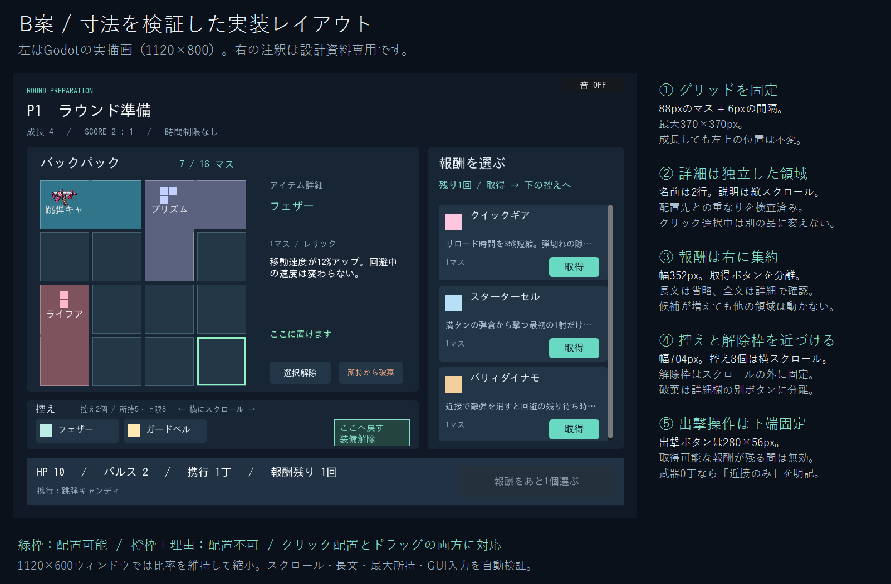

# 2026-09-11 更新前資料の履歴集

区分: 履歴。状態: 参照専用。旧仕様・承認・未実装一覧は現在の指示ではありません。

更新前の全文バックアップを一冊へ統合しました。各節の旧ファイル名と本文を保持し、文書リンクのみ統合先へ更新しています。現行資料は[総合索引](../../README.md)から参照してください。

## 収録資料
- [BEFORE_ARCHITECTURE.md](#snapshot-01)
- [BEFORE_FIELD_RESERVE_GAME_RULES.md](#snapshot-02)
- [BEFORE_FIELD_RESERVE_TESTING.md](#snapshot-03)
- [BEFORE_FINE_GRID_ROADMAP.md](#snapshot-04)
- [BEFORE_GAME_RULES.md](#snapshot-05)
- [BEFORE_HANDOFF_FOR_CLAUDE.md](#snapshot-06)
- [BEFORE_ITEM_EXPANSION_FOOTPRINT.md](#snapshot-07)
- [BEFORE_ITEM_EXPANSION_TESTING.md](#snapshot-08)
- [BEFORE_PURCHASE_FINE_GRID_ROADMAP.md](#snapshot-09)
- [BEFORE_PURCHASE_ROADMAP.md](#snapshot-10)
- [BEFORE_PURCHASE_TESTING.md](#snapshot-11)
- [BEFORE_README.md](#snapshot-12)
- [BEFORE_ROADMAP.md](#snapshot-13)
- [BEFORE_TESTING.md](#snapshot-14)
- [P9_BEFORE_FOOTPRINT_BALANCE_TESTING.md](#snapshot-15)
- [P9_BEFORE_SELECTABLE_EXPANSION_TESTING.md](#snapshot-16)
- [PREPARATION_UI_B_BEFORE_FINE_GRID.md](#snapshot-17)

---

<a id="snapshot-01"></a>

## 旧ファイル: BEFORE_ARCHITECTURE.md

> 履歴資料（2026-09-11に整理）。当時の計画・結果を保存したもので、現在の作業指示ではありません。現行情報は [資料索引](../../README.md) を参照。

# プロジェクト構成

シーンとスクリプトは同じ用途名で分類します。ファイルの移動でノード階層・シグナル・Inspector値・戦闘ルールは変更していません。

|フォルダー|責務|
|---|---|
|`scenes/game/`, `scripts/game/`|試合の開始・停止・ラウンド進行、各機能の接続|
|`scenes/combat/`, `scripts/combat/`|プレイヤー、弾、重力場、パルス|
|`scenes/world/`, `scripts/world/`|アリーナ、壁、補給の配置・取得|
|`scenes/ui/`, `scripts/ui/`|タイトル、キャラクター選択、成長準備、HUD|
|`scenes/visuals/`, `scripts/visuals/`|描画・アニメーション・画像切り出し|
|`scripts/catalog/`|定義の読み込みと種類別アクセス、装備初期値の生成|
|`scripts/ai/`|CPUの行動判断|
|`scripts/audio/`|合成効果音・ミュート制御|
|`data/`|共有定義の原本。現在は `catalog.json`|
|`assets/`|実行用素材と用途別の素材案内|
|`tests/`|独立実行できる回帰テスト。直下の `.gd` を一括実行|
|`legacy-web/`|移植元。比較用に保存し、Godotインポート・配布から除外|
|`web-build/`|再生成するWeb出力。Git管理・Godotインポート対象外|
|`.local/`|ローカルのツール、バックアップ、ログ、検証画像|

`project.godot` と `export_presets.cfg`、`run_tests.ps1` はプロジェクトの入口としてルートに置きます。エディタ用の `export_templates/`、`feature_profiles/`、`script_templates/`、`text_editor_themes/` はそのままです。

## データと共通処理

`game_catalog.gd` がJSONを一度読み込みます。武器・キャラクター・レリックのカタログはこの定義を共有し、別の種類のカタログへ依存しません。定義は読み取り専用として扱います。弾倉・予備弾・変形モードは `new_inventory_entry()` で毎回独立したDictionaryを作り、プレイヤーの在庫だけで変更します。

`atlas_regions.gd` が矩形切り出しと縦横別のグリッド切り出しを共通化します。各カタログと弾描画側は切り出したAtlasTextureをキャッシュし、毎フレーム生成しません。元画像のピクセルやシート配置は変更していません。

## 拡張するとき

- 武器・レリック追加は、JSONへの定義追加、実装、画像対応、回帰テストを揃えてから `SUPPORTED` にIDを追加します。配列番号が既存IDなので、既存要素の並べ替えは避けます。
- 新しい戦闘効果は `combat/`、見た目だけの処理は `visuals/` へ追加します。規模が増えたら `main.gd` の射撃生成や試合状態を独立させます。
- オンライン対戦は今後の計画です。ローカル入力・CPU判断と戦闘状態を分ける設計を先に検討し、現在の辞書共有をそのまま通信仕様にしないでください。
- ファイル移動時は `.gd.uid` / `.import` を一緒に移し、`res://` 参照・テスト・現行資料を更新してGodotを再インポートします。
- 再開時はディスク上の最新ファイルとGit差分を確認します。未コミット変更を古いコピーで上書きせず、広い変更の前に `.local/backups/` へ保存します。

## ラン状態（P0〜P4）

- `match_state.gd`：永続所持庫・装備ID・主力ID・段階・報酬・確定状態を保持。戦闘ノードは保持しない。`previous`は前ラウンド開始時の確定ビルドの独立コピー。
- `reward_generator.gd`：ローカルのRandomNumberGeneratorで候補生成。初期選択も接続し、補給は別の乱数列を使う。同じシードと同じ選択・段階で同じ報酬候補になる。入力・物理・CPU回避乱数の完全再現ではない。
- `main.gd`：`new_match(seed)`と`reset_round()`を分離。決着を一度だけ確定し、引き分けは準備を挟まず確定ビルドを再適用。`launch_round()`だけが消耗と戦闘一時状態を全初期化する。
- `player.gd`：戦闘用の装備コピーと仮レリック1個。`apply_build()`は最大HPを基礎値から再計算し、heal指定時のみ全快と武器再生成。18種の効果を実装。P3の発動条件・派生制限はplayer/main/projectileの各経路で管理。P4の射撃・切替予約はplayerが保持し、mainが入力と破棄を接続する。
- `preparation.gd`：無料報酬・着脱・破棄・主力の3列画面。CPUの簡易評価も同一の状態APIを使う。旧メソッド名`ready_shop()`はテスト/API互換の名前のみで、ショップ処理はない。
- `hud.gd`：武器欄と6枠の装備レリックカード。`relic_card.gd`がカードの折り返し付きツールチップを生成し、カード上の入力は戦闘へ流さない。
- `run_log.gd`：`user://run-logs/`へJSONLで記録。シード、準備と戦闘時間、装備/選択/交換、射撃起点、散弾数、分裂/追射/パルス、実ダメージ、補給、フレーム間隔と最大弾数。外部送信なし。起点IDは計測用で、被弾無敵のvolleyとは別に管理する。

画面は既存の論理1120×800（戦場600＋下部HUD）を維持し、既定ウィンドウ1120×600へアスペクト比を保って縮小する。Webでも同梱の`ipag.ttf`を既定フォントとして使用する。


---

<a id="snapshot-02"></a>

## 旧ファイル: BEFORE_FIELD_RESERVE_GAME_RULES.md

> 過去の検証・仕様の記録。現在のルールや次の作業として採用しない。

# ゲーム仕様

数値の原本は data/catalog.json、実装状況と残課題は [計画](../../planning/ROADMAP.md) を参照。以下は現在の装備・戦闘ルールです。性能・価格・占有マス・バッグ図・初期武器の横断一覧は [アイテム一覧](../../design/ITEM_CATALOG.md) を参照。

## 一試合を一つのランとする成長

更新: 2026-09-11、現在のmatch_state/player/preparationを確認。旧主力継承・個数枠の仕様は
[整理前の資料](DOCUMENT_SNAPSHOTS.md#snapshot-05)へ保存した。

5本先取、戦闘上限90秒、準備は時間制限なし。以下の価格・容量・試合尺は試作値で、対人バランス確定ではない。
勝利目標5・準備番号1〜9・バッグ面積を分離する。引き分けでは準備番号を進めない。

### 資金とショップ

キャラ別初期武器を無料で所持庫へ保証し、初期資金12G。
キャラとCPU設定の確定後に初回準備画面を構築し、表示と所持データを一致させる。第2〜3戦の準備で各8G、第4〜6戦で各10G、
第7〜9戦で各12Gを両者へ同額付与。勝利ボーナス・利息なし。第5戦まで48G、第9戦まで94G。
残金は試合内で持ち越し、試合終了で0Gにリセット。新規試合は12Gから始まる。

無料報酬は廃止。武器2枠・レリック3枠と、配置済み未改造武器がある場合の改造1枠を購入する。
基礎品揃えは両者共通、在庫・購入・更新は各自独立。武器のC/B/Aは3/5/8G、Sは12〜16G。
レリックは2〜9G、改造は6G。個別価格・抽選率・判断理由は [購入経済仕様](../../planning/PURCHASE_ECONOMY_PROPOSAL.md)、
実装原本は scripts/catalog/shop_catalog.gd。初回〜第2戦の武器抽選はC/B/A=35/40/25%、
第3戦以降はC/B/A/S=25/35/25/15%。レア内均等。レリックは全35種を各1/35で3回独立抽選。武器は専用初期8種を除いた22種からレア内均等。

同じ商品カードは1回だけ購入でき、売り切れを保持。重複可能品は別カードから追加購入できる。
同種武器・非stackableレリックの複数所持は不可。控え満杯・資金不足・準備完了後は状態を変えず拒否。
購入品は控えへ入り、自動装備しない。購入上限回数は設けず、資金・在庫・容量で制限する。
毎準備1回2Gで通常商品を更新できる。新しいカードIDを発行し、古いカードは購入不可。
拡張とフィールド持ち帰り候補は更新対象外。改造候補は提示後固定で、着脱による無料再抽選はない。
買わずに準備完了できる。武器未配置での近接のみの出撃も可能。

各個体に取得元（initial/field/purchase）・実支払額・商品カードIDを保存する。
売却額は実支払額の半額切り捨て。初期・フィールド取得品は0Gで破棄。通常の破棄APIは返金しない。
売却・破棄で武器に付属する改造とその支払記録も消去し、改造費は返金しない。再購入へ改造を継承しない。
レリックは relic:<種類ID>:<連番> で個体を識別し、重複可能な18/19の効果は加算する。

### バッグと配置

最大表示6×6、初期4×2の8マス、開放上限24マス。段階別自動拡張・無料拡張は廃止。
毎準備1個まで、正方形4マス4G／L字6マス6G／長方形3×2の6マス6Gから選んで購入する。
全追加セルが未開放・6×6内・既存領域に辺接続し、面積上限を守る位置でのみ確定する。
拡張ボタンで形を「選択」し、プレビューを確認してグリッドの基準マスをクリック。成功時だけ支払い、取消・配置失敗では無課金。
購入不可の拡張は非表示にせず、資金不足・今準備購入済み・上限超過・配置場所なしの理由を表示する。
回転なし、配置後固定。購入は任意で、両者の開放位置を独立して保持する。

武器・レリックは同じ開放セル集合に形状が収まると装備可能。控え8個と携行武器8丁を維持。
解除先の控えが満杯なら位置と装備を変えず拒否する。配置済み武器を読み順で携行し、自動サイドアームはない。
B案のグリッド・詳細・ショップ・控えとクリック/ドラッグ操作を維持する。
継続使用できる武器は最低2マス。現行30武器に使い捨てはなく、P-12とダブルバックも横2マス。
S武器は原則6マス、プラネタリウムは9マス・16G。初期領域には収まらず拡張が必要。
価格と形状はフィールド取得直後の戦闘性能を抑制しない。後続のアイテム追加でP-12の発射間隔を0.29→0.38秒に変更した。
全65種類の性能・形状は [アイテム一覧](../../design/ITEM_CATALOG.md)、占有面積の判断理由は [占有形状比較](../../design/ITEM_FOOTPRINT_BALANCE.md) を参照。

### ラウンド境界とCPU

フィールド武器の取得は無料。次準備に未所持武器を控えの空き分だけ無料で持ち帰る。
仮レリックは次準備で1個を無料で明示確保する。控え満杯なら整理後に確保でき、特殊品の重複制限を守る。
未確保のまま出撃すると失うことを準備画面で表示する。確保時に新しい恒久個体IDを発行する。

引き分けは同じ確定ビルドで再戦し、収入・商品更新・持ち帰りを追加しない。
5勝到達時は次準備処理を実行せず、資金・商品・仮候補・拡張・改造・レリック個体をリセットする。
最終得点と終了戦場を表示し、Enterで新規試合へ進む。キャラ設定は成長とは分離する。
ラウンド開始時には配置した武器を満タンにし、HP・パルス・回避/装填などの一時状態を初期化する。

CPUも同じ収入・購入・確保・容量・配置APIを使う。既存武器を優先して配置し、第2準備以降は
8G以上あると4Gの拡張を優先（装備予算4Gを残す）。配置可能な商品の相性/価格を比較して購入する。
この決定的な簡易方針は最適戦略ではなく、実プレイで拡張時期・高額武器への投資を評価する。

## 武器の実装範囲

|武器ID|射撃処理|入手経路（キャラ別初期武器または補給）|
|---|---|---|
|0 P-12|通常弾、12/60、カタログの連射・弾速・威力|通常補給／ショップ|
|1 跳弾キャンディ|壁で2回反射|対象レアの補給／ショップ|
|2 ファイアワークス|0.68秒または着弾で8方向に分裂、破片は速度280・威力0.65・寿命1.5秒|対象レアの補給／ショップ|
|5 ムーンリーパー|壁を通過。0.65秒後から持ち主へ戻る。0.7秒前後の各区間で1回命中、総寿命1.8秒|対象レアの補給／ショップ|
|7 ヘリックス|逆位相で蛇行する2発、消費1発|対象レアの補給／ショップ|
|14 クローバースプリッター|0.8秒または着弾で十字に4分裂。破片は速度280・威力0.65・寿命0.85秒|対象レアの補給／ショップ|
|3 ハニービー|3発・消費1発。速度270を保ち毎秒最大1.25radで追尾|対象レアの補給／ショップ|
|11 シードマイン|威力1.6、発射間隔0.85秒、総寿命4.8秒。0.6秒後に待機し、遮蔽のない100px以内の敵へ速度440で一度突進。近接・パルスで除去可能|対象レアの補給／ショップ|
|12 ロケットペンシル|速度130から毎秒500加速、上限760|対象レアの補給／ショップ|
|13 バブルクロック|3発・消費1発。速度60から1秒後に480へ。発射方向を保持|対象レアの補給／ショップ|
|4 ダブルバック|5発散弾、消費1発|フィールド武器補給（C）|
|6 アークレール|高速950、威力2、薄い壁の衝突判定|対象レアの補給／ショップ|
|9 コメットランチャー|毎秒最大0.7radで追尾。着弾/1.45秒で半径82の爆風と12方向の星くず。爆風は壁で遮蔽|フィールド補給（S）|
|10 ブラックホール・ティー|直撃1.0、弾速300、3/9発。着弾/1.35秒で3.2秒間の重力場。半径155・速度125で吸引し、中心72pxに0.35秒ごと0.65ダメージ。回避中は吸引・ダメージ無効、パルスで場を消去|特別投下（S）|
|8 プリズムバースト|5色の高速散弾、各0.75ダメージ|フィールド補給（S）|
|15 プラネタリウム|12方向、各0.8ダメージ、発射間隔1.05秒、弾速340、4/12発。各弾の前方±45度にいる敵へ毎秒最大1.8radで追尾、壁で1回反射。逆向きの星まで一斉集中しない|特別投下（S）|
|16 レシートリピーター|2回反射、反射ごと威力+0.25|対象レアの補給／ショップ|
|17 着払いキャノン|最終弾は小包、着弾・寿命終了で5方向へ破片。近接消去時は分裂しない|対象レアの補給／ショップ|
|18 スイッチスパナ|実際に弾を装填した時だけ単発/3発散弾を切替|対象レアの補給／ショップ|
|19 エコードラム|0.24秒後に同じ方向へ追射、消費1発。持替後も発射元の武器を保持|対象レアの補給／ショップ|
|20 サービスピストル|標準型の初期ピストル。扱いやすい直進弾。|専用初期武器（リナ）|
|21 スカウトニードル|高速・低威力の針弾。小弾倉を素早い装填で補う。|専用初期武器（ソラ）|
|22 トリックコイン|壁で1回反射する低威力のコイン弾。|専用初期武器（コハク）|
|23 ガードリベット|重い単発の鋲。連射は遅いが1発1.2ダメージ。|専用初期武器（ボルト）|
|24 ツインタッカー|左右に2発同時射撃。両方当てると1.1ダメージ。|専用初期武器（メイ）|
|25 ルーンペン|前方±35度へ弱く追尾する単発弾。壁で消える。|専用初期武器（ルナ）|
|26 シックスノート|6発入りの高威力リボルバー。装填の隙に注意。|専用初期武器（ラトル）|
|27 ミニガトル|低威力の連射弾。左右へ交互に少し散る。|専用初期武器（クロウ）|
|28 ホチキスバースト|0.08秒間隔の3連射。弾薬消費1、最初の照準を保持。|ショップ／通常補給（B）|
|29 クロスステッチ|左右に2発ずつ発射し、0.25秒後に内向きへ曲がる交差弾。|ショップ／通常補給（A）|

散弾・追射は同一射撃の識別子を持ち、同じ一斉射撃からの複数命中を適用します。別射撃の被弾無敵・回避は維持しています。

全30武器の射撃処理を接続しました。初期武器はID20〜27の専用品を各キャラへ無料で控えに付与します。初期専用品は抽選外・売却0G。フィールド補給は専用品を除く22種が対象です。射撃処理の完了と全装備・演出の移植完了は別です。危険地帯・キャラクター選択/能力値・CPU対戦は実装・自動テストの実機実行まで確認済みです。合成効果音・弾画像アニメーション・戦闘エフェクトは実装済みです。残る演出・配布確認はロードマップで管理します。

## 武器改造（P5）

跳弾キャンディ（1）・ムーンリーパー（5）・シードマイン（11）・バブルクロック（13）の4丁は各2分岐の改造を持ちます（`data/catalog.json`の各武器`mods`配列）。同時適用は1丁につき1分岐までです。

|武器|分岐|効果|
|---|---|---|
|1 跳弾キャンディ|強化跳弾|壁で3回跳ねる。威力-15%|
|1 跳弾キャンディ|会心跳弾|威力+35%、弾速-15%。反射回数は変わらない|
|5 ムーンリーパー|疾風の刃|弾速+20%、威力-20%|
|5 ムーンリーパー|重月の刃|威力+40%、弾速-15%|
|11 シードマイン|広域探知|感知範囲+50%、追跡速度-15%|
|11 シードマイン|瞬発起爆|威力+31%、待機寿命3.1秒に短縮|
|13 バブルクロック|早熟の泡|起動0.6秒に短縮、威力-20%|
|13 バブルクロック|熟成の泡|起動1.5秒に延長、威力+40%|

ショップにはレリックと、配置済みの未改造武器から1分岐の改造候補が並びます。携行する複数武器が対象になり得ます。改造は武器ID別のmods辞書へ保存し、所持庫や配置面積を消費しません。携行をやめても改造は保持されますが、他の武器へ移転しません。

## パルス

P1はQ、P2はOで発動。初期回数はキャラ定義に従い、次ラウンドで初期化します。現在は予備パルスの購入処理はありません。

使用すると全距離の敵弾・敵重力場・敵のエコードラム追射予約を即時消去し、0.65秒の無敵を付与します。自分の弾・重力場・追射予約、補給品は残ります。消去した弾から爆発・分裂・重力場は発生しません。装填中・回避中にも使用でき、装填は中断しません。敵への直接ダメージはありません。

準備中・停止中・決着後・残り0回では使用できません。キーのリピートでは連続消費せず、押し直すと1回ずつ使います。パルスリレーによる6方向の星弾と発動音も実装しています。

## フィールド補給

- 対戦開始時は弾薬箱のみ。通常武器は28秒後、その後40秒間隔で左右へ同一武器を補給。弾薬箱は開始時・12秒後・以後14秒間隔を維持。40秒に予告、45秒に中央上下へ同一Sレアを一度だけ投下。
- 90秒ラウンドでの出現上限は武器6個（通常4＋S2）、レリック2個。既存の補給品が配置場所を塞いでいれば出現数はさらに減る。弾薬箱の上限は従来通り14個。配置した武器を使い続けやすくし、武器交換を頻繁な使い捨てにしない方針。
- 出現直後の取得待ちを経て、武器/レリックはG/Hで宝箱の開封を開始します。範囲内に既定1.5秒留まると取得し、離脱/死亡で中断、他者は開封中の横取り不可。CPUも同じ開封待ちを使います。弾薬箱は接触で補給します。武器の携行上限8丁で交換が必要な場合は現在の武器を置換します。
- 新武器は満タンで追加・自動装備。同武器はその武器の予備弾へ上限の60%（切上げ）を補給。弾薬箱は全所持武器の予備弾へ各上限の40%（切上げ）を補給。弾倉と他武器の残弾・変形状態は維持します。
- 交換は装填を中断し、交換先の変形モードを初期化します。触れるだけでは満杯時に交換しません。補給品は共用で、取得は1人1回限り。満タンで補給不要なら消費しません（同武器の満タン時も消費する元Webからの変更）。
- 未取得品は42秒で消滅。35px未満に別の未取得品がある場合は重ねて出現しません。停止中・準備中・決着後は補給も停止し、次ラウンドで全リセット。
- 通常補給のC/B/A抽選確率は35/40/25%。Sは45秒の特別投下のみ。各レア内では全武器から同レア内で均等抽選。壁内・境界外へ編集した補給位置は出現を拒否し、自動で別位置へ移しません。

## レリック（全35種の定義・処理あり）

準備中のショップ購入または無料のフィールド確保で永続取得します。武器と共通のグリッドに配置し、控えは別に最大8個。フィールド補給はそのラウンド限りの仮装備です。
仮取得はラウンド開始時の武器を含む配置と開放セルに形状が収まる場合だけ。HUDでは仮取得した1個のみを仮表示します。

|レリック|効果|
|---|---|
|フェザー|移動速度+12%。回避（ドッジ）中の速度は変わりません|
|クイックギア|装填時間-35%。装填開始後に取得しても今回の装填には反映されず、次回の装填から適用されます|
|プリズムレンズ|通常弾・散弾・追尾・螺旋・レール弾の壁反射を1回追加。分裂・コメット・重力・往復・種・泡系の特殊弾には付与されません|
|ガードベル|敵の攻撃を1回防ぎ、12秒のクールダウン後に再使用可能。同一volley（一斉射撃）の後続ヒットも防ぎ、危険地帯のダメージ（hazard）には無効|
|ライフアンプ|装備で最大HP+2。戦闘開始時に全快。戦闘中の仮取得時だけHP+2（上限内）|
|ドッジノヴァ|回避（ドッジ）開始時に6方向へ小さな星弾を発射|
|ヘビーコア|発射弾の威力+15%・弾速-20%（発射時点で確定）|
|スターターセル|満タンの弾倉から撃つ最初の1射だけ威力+20%。エコードラムの追射（遅延ショット）にも元射撃の威力が引き継がれます|
|予備マガジン|武器切替時、しまう武器へ予備弾から1発装填（再使用まで1.5秒）|
|パルスリレー|パルス使用時に6方向へ低速弾を追加発射（各0.35ダメージ）。パルスの使用回数は消費するが追加はされません|
|パリィダイナモ|近接攻撃で敵弾を1発以上消すと、回避の残りクールダウンを0.3秒短縮（1振り1回）|
|リバウンドテープ|反射する弾が最初の1回だけ反射後に弾速+20%（2回目以降の反射では再適用されません）|
|反響の種（P3）|直射弾（派生弾を除く）の最初の壁反射で、その場に短命な停止弾を残す。一射撃につき1回、停止弾自体は種を増やしません|
|空薬莢の祝福（P3）|空の弾倉から装填が完了すると、次の初弾（満タンからの1射目）に小さな追加弾。途中装填や切替中断では発動しません|
|帰還バッテリー（P3）|帰還する弾を持ち主が回収すると充電（最大1つ）。武器切替の後、次の1射全体に0.45を加算（散弾では各弾に分配、ヘビーコア倍率はその後）。命中や寿命切れは回収扱いにしません|
|余熱コンデンサ（P3）|近接攻撃で敵弾を1発以上消すと、次の射撃に追加弾。1振りにつき1回、蓄積は1つまで|
|残響ホルスター（P3）|武器を切り替えると、しまう武器の弾を1発消費して弱い追射を予約（再使用まで2.5秒）。弾が空なら不発ですが待ち時間は開始します|
|すり抜け装填（P3）|回避中に敵弾が近く（42px以内）を通過すると、装備中の武器へ予備弾から1発装填。1回の回避につき1回まで、装填完了の効果（空薬莢の祝福）は発動しません|

追加15種（ID20〜34）は同種重複不可。

|レリック|効果|
|---|---|
|ロングバレル|直接発射弾の初速+15%。派生弾は対象外。|
|ワイドマガジン|全武器の弾倉上限+2。戦闘中取得では弾は増えず、予備から装填。|
|ラストスタンプ|最後の1射に合計+0.30ダメージ。直接弾に均等配分。|
|クールグリップ|実弾装填完了で回避待ち-0.25秒。再使用2秒、1発補填は対象外。|
|ステップスプリング|回避クールダウン-10%。回避の速度・無敵時間は不変。|
|セーフティソール|回避終了後0.8秒、通常移動+10%。|
|クイックシース|近接クールダウン-15%。威力・範囲・弾消し時間は不変。|
|パリィシェル|弾消し後2秒以内の次の敵攻撃を0.5軽減。蓄積1、再使用6秒。危険地帯対象外。|
|応急パッチ|敵攻撃でHPが減ると2秒後に0.5回復。ラウンド2回、予約重複・死亡後・危険地帯は対象外。|
|パルスブーツ|パルス使用後2秒、通常移動+15%。回避速度・パルス回数は不変。|
|チェンジサイト|切替後2秒以内の最初の1射は初速+25%。再使用2秒、派生弾対象外。|
|ラバーチップ|直接弾の最初の壁反射で威力+10%。反射回数は増えない。|
|整流コイル|花火・四つ葉・小包の破片の威力+10%。爆風・星くず・追加弾対象外。|
|帰還リール|往復弾回収で発射元武器へ予備から1発装填。再使用1秒。|
|サプライキー|武器・レリック宝箱の開封時間-20%（標準1.5→1.2秒）。|

### 追加効果の境界

ワイドマガジンは装備済みならラウンド開始・新規武器取得時に拡張弾倉を満タンにする。戦闘中のレリック取得そのものでは弾を増やさない。通常装填、切替補填、すり抜け装填、往復弾回収はすべて拡張後の上限を使い、補填は予備弾を消費する。

ラストスタンプは直接射撃全体に合計+0.30を均等配分する。ホチキス3連射も合計+0.30、エコードラムの派生追射は対象外。チェンジサイトは切替後2秒以内の最初の射撃だけを強化し、時間差3連射の全弾へ適用する。ロングバレルとの初速補正は乗算。固定速度へ変化する泡・種などは初速だけ変わる。

ホチキスの予約弾は発射時の威力・初速補正と照準を保持し、持替後も元武器として発射する。切替先の弾薬は消費しない。敵パルス・決着・次ラウンドで残り予約を破棄する。クロスステッチは左右±0.10radへ各2発を出し、0.25秒後に内向きへ0.20radだけ一度曲げる。追尾なし。

パリィシェルは回避・被弾無敵・ガードベルより後に判定する。危険地帯では消費せず、次の有効な1ヒットだけ最大0.5軽減して消費する（ガードベルと異なり同一散弾の残り全弾を防がない）。全軽減なら応急パッチは発動しない。応急パッチは実際のHP減少後に1予約、上限2回。予約中は重複せず、死亡後は回復しない。全タイマー・充電・回復回数はラウンド開始でリセットする。

帰還リールは持替後も発射元の武器へ補填し、命中・寿命終了・除去では発動しない。整流コイルは花火・四つ葉・小包の破片のみ。移動加速は通常移動だけに加算し、回避速度は変えない。隣接配置による追加効果はない。

開始時の固定フェザー配置はありません。35秒後に、SUPPORTED（現在35種）から抽選した同一レリックを両サイドへ補給します。再補給間隔は90秒なので標準ラウンドでは一度のみ。G/Hで宝箱を開封し、1人1ラウンド1個まで仮装備できます。戦闘中の取得はplayerで判定し、ラウンド開始時の武器を含む配置・開放セルと共通形状を使って空きを確認します。非stackableの既存所持、上限、仮装備取得済みは理由を表示して拒否します。戦闘中の交換はなく、未取得品は42秒で消滅します。

HUD下部に各プレイヤーのレリックカードを表示し、表示枚数はその時点のrelic_capacityに合わせます。固定6枠や「未解放」表示は廃止済みです。名前・短い効果・充電状態やガードベルの待ち時間を表示し、各カードにカーソルを重ねると全文を読めます。仮装備は「仮」と紫の枠で区別します。カード上のクリックでは射撃しません。

反響の種・空薬莢の祝福・帰還バッテリー・余熱コンデンサ・残響ホルスター・すり抜け装填（id12〜17）は`run_tests.ps1`のheadlessテスト（`tests/synergies.gd`ほか）で検証済みです。P4では初期レリックの追射予約が戦闘テストに残る問題も修正しました。詳細は[TESTING.md](../../development/TESTING.md)を参照してください。

### 操作の先行入力・危険弾表示（P4）

回避終了前100msに押した射撃と武器切替を、最大100ms保持します。短い射撃入力は離しても期限内に一度実行し、長押しは通常の連射を続けます。切替は最後の指定だけを実行します。射撃と切替が重なった場合は切替が先で、既存の150ms射撃待ちを維持します（短い射撃予約は期限切れ、長押しなら待ち終了後に射撃）。回避前半の切替は実行しません。装填などで発動できない予約は期限切れで破棄します。停止・フォーカス離脱・決着・次ラウンドで予約と長押し状態を解除し、再度押す必要があります。CPUも実際の回避クールダウンを守ります。

弾の外周はP1が橙、P2が青。高威力（1.5以上）・重力・設置・分裂・派生弾は黄色の二重輪です。仮装備を持つプレイヤーの派生弾には紫の破線を追加します（その仮装備が発動原因だと断定する印ではありません）。プレイヤー名に[仮]、HUDに仮レリック名を表示し、レリック欄のツールチップで両者の効果を確認できます。

仮装備を永続化するには、次の準備で「無料確保」を選びます。購入予算を消費しません。未確保のまま出撃すると失われます。

## キャラクター（全8種実装済み）

対戦前のキャラクター選択画面（CPU戦ではP1を選び、P2は別キャラからランダム。LocalではP1→P2、`scenes/ui/character_select.tscn`）で選択します。Localでは重複選択も可能。選択結果はPlayer.set_character()が既存のstate辞書をその場で書き換える形で適用され、HP・移動速度・装填時間倍率・回避クールダウン・初期パルス回数・立ち絵（fighters.pngのFrame）がキャラごとに変わります。能力値以外の固有アクション・専用エフェクトはありません。専用初期武器8種はキャラ別に異なります。

各カードはfighters.pngから`character_catalog.gd`のart()が切り出した立ち絵（cellに対応する384×512のコマ）をボタン右側に表示し、左側に名前・役割・HP・速度を表示します。装填時間倍率・回避クールダウン・初期パルス回数を含む全文はカードのツールチップ（マウスホバー）で確認できます。カードはclip_text+省略記号で幅245pxに固定しており、長い説明文でボタン自体が広がって画面外へはみ出すことはありません（4列合計1004px、画面幅1120px以内）。

|キャラ|役割|HP|速度|装填時間倍率|回避クールダウン|初期パルス|
|---|---|---|---|---|---|---|
|リナ|ガンナー|8|205|×1.1|1.65秒|3|
|ソラ|スカウト|8|215|×0.85|1.8秒|2|
|コハク|トリックスター|7|235|×1.0|1.4秒|2|
|ボルト|ガードロボット|10|190|×1.0|2.0秒|2|
|メイ|メカニック|8|210|×0.8|2.0秒|2|
|ルナ|アルカニスト|7|205|×0.9|1.65秒|3|
|ラトル|ガンスリンガー|8|220|×1.15|1.5秒|2|
|クロウ|ヘビーガンナー|9|200|×0.9|1.9秒|2|

装填時間は基本値1.15秒×上記倍率（クイックギア等のレリック効果はこれとは別に重ねて適用）。数値・cell（立ち絵フレーム）はdata/catalog.jsonのcharacters配列を参照します。

## 危険地帯

ラウンド開始から60秒経過すると安全地帯の縮小が始まります。以後、経過時間に応じて壁からの内側マージンが毎秒7px広がり、最大195pxで止まります（元WebのarenaInset()と同一）。マージンの外側にいるプレイヤーは1フレームごとに固定0.16ダメージを受けます。このダメージはhazard扱いのためガードベルでは防げませんが、既存の無敵時間（回避中・被弾直後のinv）やvolley単位の重複防止は通常どおり適用されます。安全地帯は移動そのものを妨げるものではなく、既存のFighter Bounds（移動可能範囲）はそのままです。HUDに縮小中は「危険地帯：外周◯pxが継続ダメージ」と表示します。

## CPU対戦

タイトル経由ではCPU対戦を有効化します。キャラクター選択シーンの単体実行ではLocal/CPU切替を使用できます。CPUは常にP2（インデックス1）を担当し、常にP1を狙います。元WebのaiInput()/updatePlayer()のCPU分岐（legacy-web/dist/game.js）を移植したscripts/ai/cpu_ai.gdが、毎物理フレームPlayer.step()へ渡す移動方向(dx,dy)・照準ジッター・射撃可否を決定します。CPUはキー入力を一切参照しないため、P2用の移動・戦闘キーは無視されます（HUDの武器枠クリックもCPU側は無効）。

CPUの主な挙動：距離340px超で接近・200px未満で後退・その間は時間ベースで横移動（キーティング）。所持弾薬・レリック取得条件・携行武器8丁上限の空き・S武器かどうかで欲しい補給品を判定し、最寄り（S武器は距離を0.65倍して優先度を上げる）へ寄って取得。危険地帯は実際のダメージ判定（+25px）より広い余裕（+65/+60px）で検知し、アリーナ中心へ退避。自機に90px以内へ接近した敵弾は垂直方向へ避けつつ、ランダム化された0.35〜0.75秒のクールダウンごとに実際の回避ロールを発動。120px以内に敵弾が6発を超えて集中した場合はパルスを自動使用。移動先が壁にぶつかる場合は±90度/180度の候補角度で回避。武器が完全に空なら弾薬のある武器へ自動切替、リロードも自動、64px以内なら近接攻撃、射線が壁で遮られていない（または跳弾・ブーメラン武器で遮られていても構わない）場合のみ射撃。

CPUも同じ試合状態の取得・グリッド配置・準備完了APIを使い、報酬回数・所持上限・配置条件を守ります。P1が準備完了するとCPUが所持品と報酬を評価して配置します。最適解探索や対人バランス検証の代用ではありません。

## 小型レリックと個体管理

ID18「ミニフェザー」、ID19「パワーチップ」はstackable指定の小型レリック。
ミニフェザーは移動速度+2%を個数分加算し、回避速度は変えません。
パワーチップは直接発射する各弾に+2%を個数分加算し、派生弾・爆発・近接は対象外です。
最新数値はdata/catalog.json、計算はrelic_catalog.gd、player.gd、projectile.gdを参照。
取得・個体管理・加算のコードとテストが存在することを確認しましたが、この資料整理では最新実装の通しテストを実行していません。


---

<a id="snapshot-03"></a>

## 旧ファイル: BEFORE_FIELD_RESERVE_TESTING.md

> 過去の検証・仕様の記録。現在のルールや次の作業として採用しない。

# 検証手順

更新: 2026-09-11。実行方法と残る受入を管理する。過去の件数・失敗修正・ログは
[検証履歴](DOCUMENT_SNAPSHOTS.md#snapshot-14) を参照する。

## 実行

プロジェクトルートのPowerShellから実行する。Godotは.local/tools/を優先して探索する。

```powershell
& .local/tools/Godot_v4.7.2-stable_win64_console.exe --headless --path . --editor --import
powershell -ExecutionPolicy Bypass -File run_tests.ps1
powershell -ExecutionPolicy Bypass -File run_tests.ps1 -IncludeRender
```

別の実行ファイルは -GodotPath で指定する。tests直下の.gdを自動検出し、通常はrender.gdを除く。
件数は増減するため固定の「全34本」等を現在の合格条件にしない。
ログは.local/logs/。終了コード、エラー行、PASS表示を確認する。
PASS数はアサーション数ではない。Godotのユーザーデータ/キャッシュ権限エラーも無視しない。
音響素材がない場合のaudio_assets.gdはSKIPを返す。単独実行は終了コード0だが、現行の一括ランナーはPASS表示なしを失敗扱いにする。未生成を認識成功と扱わない。

## 描画と入力

```powershell
$env:CHAMBER_SCREENSHOT = "$PWD/.local/logs/render.png"
powershell -ExecutionPolicy Bypass -File run_tests.ps1 -IncludeRender
```

render.gdは画面描画可能な環境で実行する。準備・所持品・HUD・戦闘・補給・演出を確認する。
B案の座標/操作基準は [準備UI仕様](../../design/PREPARATION_UI_B.md)。
スクリプトによるGUI入力や静止画確認と、人間による操作感評価を区別する。

## 重点回帰

- match_state/準備: 商品二重購入・資金収支、配置衝突、控え容量/解除先満杯、確定、丸腰出撃、引き分け/試合終了、CPU。
- fine_grid/item_instances/relic_stacking: 個体ID、同種の位置/破棄、重複可否、能力加算、取得経路。
- 戦闘: 全武器、改造、レリック、派生制限、回避/被弾、入力予約、危険地帯、補給/宝箱。
- added_weapons/added_relics/added_item_acquisition: 初期専用8種の抽選除外、追加全品の購入・売却・無料持ち帰り、3連射の補正/予約取消、交差弾、15レリックの条件/上限/対象外、CPU初期装備。
- sound: ミュート、戦闘シグナル、合成PCM、16ボイス、停止/キャッシュ/バス解放。
- 描画: 長文、所持品増加、縮小画面、選択固定、配置プレビュー、ドラッグの掴み位置。

武器が必要なテストは明示的に装備を作る。自動サイドアームや旧4枠制限を仮定しない。
tests/helpers/battle.gdを活用し、レリックの追射予約・一時フラグなど状態リークを防ぐ。

## 素材生成ツール

```powershell
.local/audio-venv/Scripts/python.exe -m unittest discover -s tools/asset_generator/tests -v
& .local/tools/Godot_v4.7.2-stable_win64_console.exe --headless --path . --script res://tests/audio_assets.gd
```

Pythonテストは通信mockで課金なし。環境と無料確認は [素材生成設定](../../development/ASSET_GENERATION_SETUP.md)。
直近の音響検証ではPython19件とBGM/SEのGodot Resource認識が成功。全ゲームテストの再実行とは別。

## 最新の記録と未完了の受入

武器10種（専用初期8＋通常2）・レリック15種追加、P-12発射間隔0.38秒への変更後、
**48本（headless47＋描画1）PASS、終了コード0**。ERROR/WARNING/FAILなし。
実行: `powershell -ExecutionPolicy Bypass -File run_tests.ps1 -IncludeRender`。
ログ: `.local/logs/run_tests-20260911-233716.log`。

- added_weapons: 全10種の射撃、1反射上限、弱追尾の角度制限、交互散布、3連射の弾薬/初射補正保持/持替/パルス/停止/決着、交差弾の曲がる時刻。
- added_relics: 全15種の効果、派生弾対象外、拡張弾倉と補填経路、装填短縮の再使用待ち、防御順・全軽減、回復2回上限/予約重複/死亡、発射元への回収補填、宝箱開封時間とUI、ラウンドリセット。
- added_item_acquisition: 100シード×9準備で35レリックの抽選到達、非売品の購入拒否、追加全品の購入/配置/詳細/売却/無料持ち帰り、全キャラ初期配布とCPU配置。
- initial_preparation: 全8キャラ×Local/CPUで初回表示と所持品が一致し、2マスへの実GUIクリック配置が成功。
- 既存の戦闘・改造・音響Resource読込・ショップ・経済・CPU・入力・描画テストも成功。連射間隔・件数・無効IDを旧値で固定していたテストを現行値に更新した。

描画の保存先は `.local/logs/item-expansion-*.png`。
`item-expansion-new-starter.png` と `item-expansion-new-relic.png` を目視確認し、ルーンペンの初期控え、
ワイドマガジンとの縦2マス配置、詳細説明、残金と価格、ショップの収まりを確認した。
専用画像は既存素材の仮利用。実プレイでの対戦バランスや操作感を確認済みとはしない。

アイテム一覧の更新は `python tools/export_item_catalog.py`。全30武器・35レリック・8キャラの表をカタログ・価格・形状から出力する。
バッグ範囲の説明は手動管理。提案と追加前の検証は [提案履歴](ITEM_EXPANSION_PROPOSAL.md)、
[前回検証記録](DOCUMENT_SNAPSHOTS.md#snapshot-08) を参照。

### 人間の実プレイ未確認

購入・売却・配置操作の使いやすさ、5本先取の総時間、価格/初期8/上限24/控え8のバランス、
CPUの投資判断、プラネタリウム取得直後の強さは未評価。20シードのCPU自動検証は対人試合の実測ではない。
20〜30試合の比較と、必要なら4本先取との比較を行う。自動テスト成功だけで数値を確定しない。
拡張のドラッグ・回転・配置後移動、P9隣接効果、オンライン対応は未実装。
Web/Windows配布版、一試合完走、最大負荷、先行入力・音の実プレイ確認も残る。
音響生成は行っていない。audio_assetsは保存済み素材の読み込みのみ。

旧40本の詳しい記録は [移行前の検証記録](DOCUMENT_SNAPSHOTS.md#snapshot-11)、
購入移行の経緯は [検証日誌](PURCHASE_ECONOMY_VALIDATION.md) を参照。


---

<a id="snapshot-04"></a>

## 旧ファイル: BEFORE_FINE_GRID_ROADMAP.md

> 履歴資料（2026-09-11に整理）。当時の計画・結果を保存したもので、現在の作業指示ではありません。現行情報は [資料索引](../../README.md) を参照。

# P9前：グリッド細分化と重複レリック

## 方針

B案の画面構成を維持し、最大6×6の領域、小型能力補正レリックの重複、形状を持つバッグ拡張を段階的に実装する。36マスの全面開放・全レリックの無制限重複は前提としない。

## 実装順と完了条件

1. **個体管理基盤（今回）**：種類IDと個体IDを分離。既存ビルドを移行しても位置・装備・試合開始時のコピーが保たれる。UIと戦闘への変換境界を設ける。
2. **小型レリック試作**：速度+2%と弾丸ダメージ補正を候補に、加算ルールと説明を実装する。特殊発動系は個別ルール確定まで重複不可。全取得経路を個体IDに切り替える。
3. **6×6とバッグ領域**：使用可能セル集合で容量・配置を判定し、未開放セルを表示する。既存武器の形状も再配分する。現在の4×4用描画寸法を見直す。
4. **所持・報酬・CPU**：8個制限を改め、装備容量と控え容量を分離。解除先満杯・報酬消費・同候補の連続取得・フィールド仮取得を定義する。CPUにも同じ制約を適用する。
5. **UIと通し検証**：効果合計、同種装備数、拡張領域、細かいマスへのドラッグを確認。全テストと画面検証後、実プレイで数値を調整する。

## 今回の境界

個体は `relic:<種類ID>:<連番>` として扱う。旧整数IDは移行用に読める。明示的な移行後は新規取得も個体IDになる。通常の新規試合への自動移行は段階2で行うため、今回のプレイ上の容量・重複取得・効果量は従来どおり。

戦闘側へは種類IDの配列を渡し、同種の個数を保持する。現行効果の多くは存在判定なので、個体が複数あるだけでは効果は加算されない。段階2で個数に基づく効果計算を明示的に追加する。

武器の重複と個体別改造、合成、回転、隣接効果は別の追加仕様とし、今回の試作に混ぜない。


---

<a id="snapshot-05"></a>

## 旧ファイル: BEFORE_GAME_RULES.md

> 履歴資料（2026-09-11に整理）。当時の計画・結果を保存したもので、現在の作業指示ではありません。現行情報は [資料索引](../../README.md) を参照。

# ゲーム仕様

数値の原本は data/catalog.json、実装状況と残課題は [計画](../../planning/ROADMAP.md) を参照。以下は現在の装備・戦闘ルールです。

## 一試合を一つのランとする成長

3本先取、90秒上限と危険地帯を継続します。勝敗が付いたラウンドの後、試合が続く場合だけ成長段階が進みます。段階1〜5のレリック装備枠は3/4/5/6/6。装備中を含む所持庫は8個、同一IDの重複は不可です。

初回は共通のB/B/A武器3候補から主力1丁、共通レリック3候補から2個を無料で取得します。サイドアームは常備。次ラウンドの準備では、勝者・敗者ともレリック報酬を1個取得し、所持庫の着脱・破棄、終了時の所持武器から主力1丁の指定ができます。S武器も継承できます。通貨・購入・毎回の武器ドラフトはありません。

報酬は共通の基礎3候補から各自の所持品を除き、同じ抽選規則で補充します。両者が同じ品を独立取得できます。候補不足は少数表示、取得可能な候補がなければ報酬なしで準備完了できます。所持庫が満杯なら先に不要品を破棄します。装備満杯の場合は所持庫の控えへ入り、準備中に外して入れ替えられます。準備完了後の変更・報酬の二重取得はできません。

準備画面は相手の前ラウンド開始時に確定した主力と装備レリックを表示し、相手の選択途中の変更は反映しません。初回の相手表示は「未確定」です。双方確定後、戦闘HUDへ新構成を反映します。制限時間はなく、準備時間をローカルに記録します。ローカル2人用の同一画面では選択内容を完全には秘匿できません。

ラウンド開始時に主力＋サイドアームだけを満タンで再生成し、HP・パルス・装填・回避・無敵・ガードベル・ホルスター等のタイマーと変形モードをリセットします。装備から最大HPを再計算して全快します。準備中のHPレリック着脱で回復は増えません。キャラクターと音声ON/OFFは試合成長と分離して維持します。

引き分けでは段階・報酬を増やさず、Enterで直前の確定ビルドを使って再戦します。仮レリックとフィールドで拾った未確定武器は破棄します。試合終了時は永続ビルドと報酬状態を消去し、最終得点と終了時の戦場を結果表示として残します。Enterで新しい試合を開始すると得点・成長段階も初期化します。

## 武器の実装範囲

|武器ID|射撃処理|通常の入手経路|
|---|---|---|
|0 P-12|通常弾、12/60、カタログの連射・弾速・威力|初期所持|
|1 跳弾キャンディ|壁で2回反射|初期選択B|
|2 ファイアワークス|0.68秒または着弾で8方向に分裂、破片は速度280・威力0.65・寿命1.5秒|初期選択A / フィールド補給|
|5 ムーンリーパー|壁を通過。0.65秒後から持ち主へ戻る。0.7秒前後の各区間で1回命中、総寿命1.8秒|初期選択B / フィールド補給|
|7 ヘリックス|逆位相で蛇行する2発、消費1発|初期選択B / フィールド補給|
|14 クローバースプリッター|0.8秒または着弾で十字に4分裂。破片は速度280・威力0.65・寿命0.85秒|初期選択B / フィールド補給|
|3 ハニービー|3発・消費1発。速度270を保ち毎秒最大1.25radで追尾|初期選択B / フィールド補給|
|11 シードマイン|威力1.6、発射間隔0.85秒、総寿命4.8秒。0.6秒後に待機し、遮蔽のない100px以内の敵へ速度440で一度突進。近接・パルスで除去可能|初期選択B / フィールド補給|
|12 ロケットペンシル|速度130から毎秒500加速、上限760|初期選択B / フィールド補給|
|13 バブルクロック|3発・消費1発。速度60から1秒後に480へ。発射方向を保持|初期選択A / フィールド補給|
|4 ダブルバック|5発散弾、消費1発|フィールド武器補給（C）|
|6 アークレール|高速950、威力2、薄い壁の衝突判定|初期選択A|
|9 コメットランチャー|毎秒最大0.7radで追尾。着弾/1.45秒で半径82の爆風と12方向の星くず。爆風は壁で遮蔽|フィールド補給（S）|
|10 ブラックホール・ティー|直撃1.0、弾速300、3/9発。着弾/1.35秒で3.2秒間の重力場。半径155・速度125で吸引し、中心72pxに0.35秒ごと0.65ダメージ。回避中は吸引・ダメージ無効、パルスで場を消去|特別投下（S）|
|8 プリズムバースト|5色の高速散弾、各0.75ダメージ|フィールド補給（S）|
|15 プラネタリウム|12方向、各0.8ダメージ、発射間隔1.05秒、弾速340、4/12発。各弾の前方±45度にいる敵へ毎秒最大1.8radで追尾、壁で1回反射。逆向きの星まで一斉集中しない|特別投下（S）|
|16 レシートリピーター|2回反射、反射ごと威力+0.25|初期選択B / フィールド補給|
|17 着払いキャノン|最終弾は小包、着弾・寿命終了で5方向へ破片。近接消去時は分裂しない|初期選択A / フィールド補給|
|18 スイッチスパナ|実際に弾を装填した時だけ単発/3発散弾を切替|初期選択B / フィールド補給|
|19 エコードラム|0.24秒後に同じ方向へ追射、消費1発。持替後も発射元の武器を保持|初期選択A / フィールド補給|

散弾・追射は同一射撃の識別子を持ち、同じ一斉射撃からの複数命中を適用します。別射撃の被弾無敵・回避は維持しています。

全20武器の射撃処理を接続しました。初期選択は全Bから2候補・全Aから1候補、フィールド補給は全20武器が対象です。射撃処理の完了と全装備・演出の移植完了は別です。危険地帯・キャラクター選択/能力値・CPU対戦は実装・自動テストの実機実行まで確認済みです。合成効果音・弾画像アニメーション・戦闘エフェクトは実装済みです。残る演出・配布確認はロードマップで管理します。

## 武器改造（P5）

跳弾キャンディ（1）・ムーンリーパー（5）・シードマイン（11）・バブルクロック（13）の4丁は各2分岐の改造を持ちます（`data/catalog.json`の各武器`mods`配列）。同時適用は1丁につき1分岐までです。

|武器|分岐|効果|
|---|---|---|
|1 跳弾キャンディ|強化跳弾|壁で3回跳ねる。威力-15%|
|1 跳弾キャンディ|会心跳弾|威力+35%、弾速-15%。反射回数は変わらない|
|5 ムーンリーパー|疾風の刃|弾速+20%、威力-20%|
|5 ムーンリーパー|重月の刃|威力+40%、弾速-15%|
|11 シードマイン|広域探知|感知範囲+50%、追跡速度-15%|
|11 シードマイン|瞬発起爆|威力+31%、待機寿命3.1秒に短縮|
|13 バブルクロック|早熟の泡|起動0.6秒に短縮、威力-20%|
|13 バブルクロック|熟成の泡|起動1.5秒に延長、威力+40%|

ラウンド報酬（無料成長報酬）に「レリック取得／主力改造」の選択肢が加わり、主力が対応武器かつ未改造のときだけ、その武器の2分岐がレリック候補へ追加されます。改造は武器インスタンス（武器ID）に紐づき、所持庫・装備枠は消費しません。主力を切り替えても改造自体は消えませんが、その武器を主力にしている間だけ有効です（「旧武器の改造は移転しない」）。改造は共有カタログを書き換えず、武器ごとの`mods`辞書として各プレイヤーのビルドに保存されます。

## パルス

P1はQ、P2はOで発動（2026-09-08の見比べ作業でP2武器切替との重複回避のためIへ変えていたことが判明し、元Web通りのOへ戻した。詳細は本計画のCHANGELOG参照）。両者ともキャラクター選択で決まる初期回数（リナ・ルナは3回、他は2回。PlayerのInitial Pulsesは未選択時の既定値）、予備パルス購入で+1。次ラウンドはキャラの初期回数へ戻ります。

使用すると全距離の敵弾・敵重力場・敵のエコードラム追射予約を即時消去し、0.65秒の無敵を付与します。自分の弾・重力場・追射予約、補給品は残ります。消去した弾から爆発・分裂・重力場は発生しません。装填中・回避中にも使用でき、装填は中断しません。敵への直接ダメージはありません。

準備中・停止中・決着後・残り0回では使用できません。キーのリピートでは連続消費せず、押し直すと1回ずつ使います。パルスリレーによる6方向の星弾と発動音も実装しています。

## フィールド補給

- 対戦開始時は弾薬箱のみ。通常武器は28秒後、その後40秒間隔で左右へ同一武器を補給。弾薬箱は開始時・12秒後・以後14秒間隔を維持。40秒に予告、45秒に中央上下へ同一Sレアを一度だけ投下。
- 90秒ラウンドでの出現上限は武器6個（通常4＋S2）、レリック2個。既存の補給品が配置場所を塞いでいれば出現数はさらに減る。弾薬箱の上限は従来通り14個。報酬で選んだ主力を使い続けやすくし、武器交換を頻繁な使い捨てにしない方針。
- 出現0.6秒後から取得可能。武器・弾薬は中心距離31px未満で自動取得。レリックはG/Hの明示操作のみで取得。G/Hは65px未満の最寄りの補給を取得し、武器4枠が満杯なら装備中の1丁を交換します。古い武器は地面へ戻りません。
- 新武器は満タンで追加・自動装備。同武器はその武器の予備弾へ上限の60%（切上げ）を補給。弾薬箱は全所持武器の予備弾へ各上限の40%（切上げ）を補給。弾倉と他武器の残弾・変形状態は維持します。
- 交換は装填を中断し、交換先の変形モードを初期化します。触れるだけでは満杯時に交換しません。補給品は共用で、取得は1人1回限り。満タンで補給不要なら消費しません（同武器の満タン時も消費する元Webからの変更）。
- 未取得品は42秒で消滅。35px未満に別の未取得品がある場合は重ねて出現しません。停止中・準備中・決着後は補給も停止し、次ラウンドで全リセット。
- 通常補給のC/B/A抽選確率は35/40/25%。Sは45秒の特別投下のみ。各レア内では全武器から同レア内で均等抽選。壁内・境界外へ編集した補給位置は出現を拒否し、自動で別位置へ移しません。

## レリック（全18種実装済み）

初期無料報酬・ラウンド間の成長報酬で永続取得します。装備枠は最大6、所持庫は最大8。フィールド補給はそのラウンド限りの仮装備です。

|レリック|効果|
|---|---|
|フェザー|移動速度+12%。回避（ドッジ）中の速度は変わりません|
|クイックギア|装填時間-35%。装填開始後に取得しても今回の装填には反映されず、次回の装填から適用されます|
|プリズムレンズ|通常弾・散弾・追尾・螺旋・レール弾の壁反射を1回追加。分裂・コメット・重力・往復・種・泡系の特殊弾には付与されません|
|ガードベル|敵の攻撃を1回防ぎ、12秒のクールダウン後に再使用可能。同一volley（一斉射撃）の重複ヒットは追加で防がず、危険地帯のダメージ（hazard）には無効|
|ライフアンプ|装備で最大HP+2。戦闘開始時に全快。戦闘中の仮取得時だけHP+2（上限内）|
|ドッジノヴァ|回避（ドッジ）開始時に6方向へ小さな星弾を発射|
|ヘビーコア|発射弾の威力+15%・弾速-20%（発射時点で確定）|
|スターターセル|満タンの弾倉から撃つ最初の1射だけ威力+20%。エコードラムの追射（遅延ショット）にも元射撃の威力が引き継がれます|
|予備マガジン|武器切替時、しまう武器へ予備弾から1発装填（再使用まで1.5秒）|
|パルスリレー|パルス使用時に6方向へ低速弾を追加発射（各0.35ダメージ）。パルスの使用回数は消費するが追加はされません|
|パリィダイナモ|近接攻撃で敵弾を1発以上消すと、回避の残りクールダウンを0.3秒短縮（1振り1回）|
|リバウンドテープ|反射する弾が最初の1回だけ反射後に弾速+20%（2回目以降の反射では再適用されません）|
|反響の種（P3）|直射弾（派生弾を除く）の最初の壁反射で、その場に短命な停止弾を残す。一射撃につき1回、停止弾自体は種を増やしません|
|空薬莢の祝福（P3）|空の弾倉から装填が完了すると、次の初弾（満タンからの1射目）に小さな追加弾。途中装填や切替中断では発動しません|
|帰還バッテリー（P3）|帰還する弾を持ち主が回収すると充電（最大1つ）。武器切替の後、次の1射全体に0.45を加算（散弾では各弾に分配、ヘビーコア倍率はその後）。命中や寿命切れは回収扱いにしません|
|余熱コンデンサ（P3）|近接攻撃で敵弾を1発以上消すと、次の射撃に追加弾。1振りにつき1回、蓄積は1つまで|
|残響ホルスター（P3）|武器を切り替えると、しまう武器の弾を1発消費して弱い追射を予約（再使用まで2.5秒）。弾が空なら不発ですが待ち時間は開始します|
|すり抜け装填（P3）|回避中に敵弾が近く（42px以内）を通過すると、装備中の武器へ予備弾から1発装填。1回の回避につき1回まで、装填完了の効果（空薬莢の祝福）は発動しません|

開始時の固定フェザー配置はありません。35秒後に、全18種から抽選した同一レリックを両サイドへ補給します。再補給間隔は90秒なので標準ラウンドでは一度のみ。G/Hで1人1ラウンド1個まで仮装備でき、装備上限にも算入します。装備満杯・既存所持・仮装備取得済みの場合は理由を表示し、取得しません。戦闘中の交換はありません。未取得品は42秒で消滅します。

HUD下部に各プレイヤーのレリック6枠を3列×2段のカードで表示。名前・短い効果・充電状態やガードベルの待ち時間を表示し、各カードにカーソルを重ねると全文を読めます。仮装備は「仮」と紫の枠、空き枠・未解放は薄い表示で区別します。カード上のクリックでは射撃しません。

反響の種・空薬莢の祝福・帰還バッテリー・余熱コンデンサ・残響ホルスター・すり抜け装填（id12〜17）は`run_tests.ps1`のheadlessテスト（`tests/synergies.gd`ほか）で検証済みです。P4では初期レリックの追射予約が戦闘テストに残る問題も修正しました。詳細は[TESTING.md](../../development/TESTING.md)を参照してください。

### 操作の先行入力・危険弾表示（P4）

回避終了前100msに押した射撃と武器切替を、最大100ms保持します。短い射撃入力は離しても期限内に一度実行し、長押しは通常の連射を続けます。切替は最後の指定だけを実行します。射撃と切替が重なった場合は切替が先で、既存の150ms射撃待ちを維持します（短い射撃予約は期限切れ、長押しなら待ち終了後に射撃）。回避前半の切替は実行しません。装填などで発動できない予約は期限切れで破棄します。停止・フォーカス離脱・決着・次ラウンドで予約と長押し状態を解除し、再度押す必要があります。CPUも実際の回避クールダウンを守ります。

弾の外周はP1が橙、P2が青。高威力（1.5以上）・重力・設置・分裂・派生弾は黄色の二重輪です。仮装備を持つプレイヤーの派生弾には紫の破線を追加します（その仮装備が発動原因だと断定する印ではありません）。プレイヤー名に[仮]、HUDに仮レリック名を表示し、レリック欄のツールチップで両者の効果を確認できます。

仮装備を永続化するには、次の準備で通常の成長報酬1回を消費して通常3候補の代わりに確保します。選ばなかった仮装備は失われ、追加の永続報酬にはなりません。

## キャラクター（全8種実装済み）

対戦前のキャラクター選択画面（P1→P2の順、`scenes/ui/character_select.tscn`）で選択します。重複選択可（同キャラ同士の対戦も可）。選択結果はPlayer.set_character()が既存のstate辞書をその場で書き換える形で適用され、HP・移動速度・装填時間倍率・回避クールダウン・初期パルス回数・立ち絵（fighters.pngのFrame）がキャラごとに変わります。能力値以外の固有アクション・専用エフェクトはありません（元Webと同様、キャラ差は数値のみ）。

各カードはfighters.pngから`character_catalog.gd`のart()が切り出した立ち絵（cellに対応する384×512のコマ）をボタン右側に表示し、左側に名前・役割・HP・速度を表示します。装填時間倍率・回避クールダウン・初期パルス回数を含む全文はカードのツールチップ（マウスホバー）で確認できます。カードはclip_text+省略記号で幅245pxに固定しており、長い説明文でボタン自体が広がって画面外へはみ出すことはありません（4列合計1004px、画面幅1120px以内）。

|キャラ|役割|HP|速度|装填時間倍率|回避クールダウン|初期パルス|
|---|---|---|---|---|---|---|
|リナ|ガンナー|8|205|×1.1|1.65秒|3|
|ソラ|スカウト|8|215|×0.85|1.8秒|2|
|コハク|トリックスター|7|235|×1.0|1.4秒|2|
|ボルト|ガードロボット|10|190|×1.0|2.0秒|2|
|メイ|メカニック|8|210|×0.8|2.0秒|2|
|ルナ|アルカニスト|7|205|×0.9|1.65秒|3|
|ラトル|ガンスリンガー|8|220|×1.15|1.5秒|2|
|クロウ|ヘビーガンナー|9|200|×0.9|1.9秒|2|

装填時間は基本値1.15秒×上記倍率（クイックギア等のレリック効果はこれとは別に重ねて適用）。数値・cell（立ち絵フレーム）はdata/catalog.jsonのcharacters配列を参照します。

## 危険地帯

ラウンド開始から60秒経過すると安全地帯の縮小が始まります。以後、経過時間に応じて壁からの内側マージンが毎秒7px広がり、最大195pxで止まります（元WebのarenaInset()と同一）。マージンの外側にいるプレイヤーは1フレームごとに固定0.16ダメージを受けます。このダメージはhazard扱いのためガードベルでは防げませんが、既存の無敵時間（回避中・被弾直後のinv）やvolley単位の重複防止は通常どおり適用されます。安全地帯は移動そのものを妨げるものではなく、既存のFighter Bounds（移動可能範囲）はそのままです。HUDに縮小中は「危険地帯：外周◯pxが継続ダメージ」と表示します。

## CPU対戦

タイトル経由ではCPU対戦を有効化します。キャラクター選択シーンの単体実行ではLocal/CPU切替を使用できます。CPUは常にP2（インデックス1）を担当し、常にP1を狙います。元WebのaiInput()/updatePlayer()のCPU分岐（legacy-web/dist/game.js）を移植したscripts/ai/cpu_ai.gdが、毎物理フレームPlayer.step()へ渡す移動方向(dx,dy)・照準ジッター・射撃可否を決定します。CPUはキー入力を一切参照しないため、P2用の移動・戦闘キーは無視されます（HUDの武器枠クリックもCPU側は無効）。

CPUの主な挙動：距離340px超で接近・200px未満で後退・その間は時間ベースで横移動（キーティング）。所持弾薬・レリック枠・武器4枠の空き・S武器かどうかで欲しい補給品を判定し、最寄り（S武器は距離を0.65倍して優先度を上げる）へ寄って取得。危険地帯は実際のダメージ判定（+25px）より広い余裕（+65/+60px）で検知し、アリーナ中心へ退避。自機に90px以内へ接近した敵弾は垂直方向へ避けつつ、ランダム化された0.35〜0.75秒のクールダウンごとに実際の回避ロールを発動。120px以内に敵弾が6発を超えて集中した場合はパルスを自動使用。移動先が壁にぶつかる場合は±90度/180度の候補角度で回避。武器が完全に空なら弾薬のある武器へ自動切替、リロードも自動、64px以内なら近接攻撃、射線が壁で遮られていない（または跳弾・ブーメラン武器で遮られていても構わない）場合のみ射撃。

CPUも同じ試合状態の取得・装備・主力指定・準備完了APIを使います。P1が準備完了するとCPUが自動で主力とレリックを選んで開始します。既存武器の反射・特殊弾・弾倉サイズ・弾数などを見た簡易評価を使い、同じ報酬回数、装備枠、所持上限を守ります。満杯・重複・仮装備取得済みのレリックは追いません。最適解探索や人間同士のバランス検証の代用ではありません。


---

<a id="snapshot-06"></a>

## 旧ファイル: BEFORE_HANDOFF_FOR_CLAUDE.md

> 履歴資料（2026-09-11に整理）。当時の計画・結果を保存したもので、現在の作業指示ではありません。現行情報は [資料索引](../../README.md) を参照。

# 開発引き継ぎ

更新（2026-09-10）：現在はP9前のP8x〜P8z改修後です。以下のP4/P5時点の説明より、ROADMAP.md冒頭とTESTING.mdの「P9前改修」を優先してください。武器・レリックの所持とグリッド配置を統合し、自動サイドアームと主力選択は廃止済みです。未配置なら丸腰になるため、戦闘テストでは必要な武器を明示的に用意します。今回、混在IDの型比較と旧仕様に依存する5本のテストを修正しました。

`C:\GameCreate\chamber-clash` のGodotゲーム開発を引き継いでください。適用されるAGENTS.md / CLAUDE.md、実装計画、現行仕様、構成ガイド、検証記録、ロードマップ、最新Git差分を確認してください。P0〜P4はコード実装済みです。次はP4の実プレイ受入評価です。P5の武器改造は未着手です。

## 現在地

P4後のプレイ評価反映：ブラックホール・シードマイン・プラネタリウムを強化し、フィールド武器／レリックを削減、装備レリックHUDを個別カードに変更。数値はGAME_RULES.md、検証はTESTING.md末尾を優先してください。この評価反映分はローカル変更で、まだコミット・公開していません。

20武器・18レリック・8キャラクター。P0〜P2ではシード付き報酬抽選・試合状態・3〜6装備枠・8個所持庫・同数無料報酬・主力継承・仮装備・CPU準備を実装。P3では6種のレリックと発動条件、派生深さ・適用済み効果を追加しました。

P4では回避終了前100msの射撃・切替を保持します。単発と長押しを区別し、切替は最後の指定1件。停止・フォーカス離脱・決着・リセットで破棄。CPUは実回避クールダウン中に判断待ちを再抽選せず、ドッジノヴァの派生深さを1にします。

プリズムの各弾は0.75、帰還バッテリーの0.45は一射撃全体に分配。ヘビーコア＋スターターセル＋帰還バッテリーのプリズム全弾命中は8.4525から5.6925へ低下。全員HP増加・共通ダメージ上限・回避2ストックは導入していません。

所有者色の弾外周、危険弾の黄色二重輪、仮装備プレイヤーの[仮]、仮装備所持者の派生弾の紫破線、レリック効果ツールチップを追加しています。

## 実装の入口と維持するルール

- `scripts/game/match_state.gd` / `reward_generator.gd`：試合の永続状態と候補生成。
- `scripts/game/main.gd`：入力、予約破棄、射撃生成、試合進行。
- `scripts/combat/player.gd`：先行入力、ビルド適用、発動条件。`request_switch()`は操作用、`equip_slot()`は実際の装備更新用です。
- `scripts/combat/projectile.gd`：派生制限、衝突、危険弾描画。
- `scripts/ai/cpu_ai.gd`、`scripts/ui/hud.gd`、`scripts/ui/preparation.gd`。
- `scripts/ui/relic_card.gd`：折り返し付きの個別レリック説明。`tests/play_feedback.gd`：武器強化・90秒補給総数・レリック表示の回帰。
- `data/catalog.json`：定義。既存IDを並べ替えない。
- `tests/helpers/battle.gd`：ランダムな初期レリックを持たない戦闘テストを作る。ID除去だけでは追射予約・フラグが残るため、プレイヤー状態も初期化する。

起点IDのrootは計測用、volleyは被弾無敵用、depthは派生制限用として区別してください。近接・パルスによる弾消去から爆発・分裂を生まないこと。キャラクターと音声設定は試合内成長と分離します。

論理画面1120×800（戦場600＋HUD）を維持し、1120×600ウィンドウへ比率を保って縮小します。日本語フォントは`assets/fonts/ipag.ttf`。原本はこのGodotプロジェクト、`legacy-web/`は比較資料です。

## 検証と残る受入

`powershell -ExecutionPolicy Bypass -File run_tests.ps1`で全headlessテストを実行します。`tests/action_buffer.gd`と`tests/endgame_balance.gd`がP4用。描画は`tests/render.gd`で確認し、`CHAMBER_SCREENSHOT`で画像の保存先を指定できます。具体的な成功ログはTESTING.mdのP4節を参照。

既存テストのランダム失敗について、P3時点ではシード未指定と判断されていましたが、P4で初期の残響ホルスターが予約した追射の残留を再現・修正しました。シード固定だけで解決したとは扱わないでください。

残る確認：人間による100ms先行入力の操作感、20〜30試合と対人公平性、最大弾幕の長時間負荷、効果音の聴取、Web/Windows配布版。自動テストと静止画の成功を実プレイ評価の完了とは扱わないでください。

## Git・公開

2026-09-09のP4開始時HEADは`3ca14d1`。現在の本体remoteは`https://github.com/gyap41/chamber-clash-web.git`です。古い「本体remoteなし」「web-buildだけを別リポジトリへpush」の手順は現状に合いません。

`.github/workflows/deploy-pages.yml`等、実際のワークフローファイルを確認してください。現在はmainへのpushを起点にGodotでWebを書き出してGitHub Pagesへ配置する設定があります。今回のP4はローカルコミットとして保存し、push・公開は行っていません。今後の作業でも、コード変更・ビルド生成・公開の完了を分けて報告してください。`.local/`、`.godot/`、`web-build/`は生成物として扱います。


---

<a id="snapshot-07"></a>

## 旧ファイル: BEFORE_ITEM_EXPANSION_FOOTPRINT.md

# 全アイテム占有形状の評価・現行試作値

更新: 2026-09-11。全20武器・20レリックのカタログと戦闘実装を確認した。
原本: data/catalog.json、scripts/game/main.gd、scripts/combat/projectile.gd、scripts/combat/player.gd。
形状調整時は占有形状だけを変更した。その後、購入経済試作を採用し、ショップ・有料拡張・5本先取へ移行。発射性能・特殊効果は維持する。
以下は実測勝率による最終バランスではなく、性能と操作条件から判断した試作値。

## 継続使用武器の最低面積

ユーザー方針により、使い捨て等の明示的な例外を除き武器は最低2マスとする。現行20武器に使い捨てはない。
P-12とダブルバックを1→横2マスへ変更。他の武器は既に2マス以上。価格・射撃性能は維持する。
1マスの隙間埋めは小型レリックの役割とし、武器追加には最低2マスの配置投資を要求する。

## プラネタリウムの判断

1回の弾薬消費で12発、各0.8、間隔1.05秒、弾倉4＋予備12。
直射弾の総和は1射9.6で、プリズムバーストの3.75より大きい。
これは全弾命中した場合の総量であり、実効DPSや通常の命中ダメージではない。
星は12方向へ分散し、各弾の前方±45度にいる敵へ最大1.8rad/秒で曲がる。
標準寿命2.8秒と壁1反射があり、同じ一斉射撃内の複数弾命中は被弾無敵で遮断されない。
反射追加・初反射加速・反響の種・直接弾補正との組合せも成立する。

ユーザーの「非常に強い」という実プレイ所感とこの実装を踏まえ、6→9マス（3×3）へ変更する。
初期8マスには入らず、有料拡張が必要。最大24マスでも37.5%を占有する。価格は16Gの試作値。
9マスでも併用不能にはせず、主軸として使う代わりに他装備を減らす選択にする。
同じSでも高速5発のプリズムと重力場のティーは6マスを維持し、プラネタリウムの負担を明確に分ける。

**限界**：フィールド取得した武器は戦闘中の携行上限で扱うため、そのラウンドの強さは占有形状で抑えられない。
今回の変更で戦闘バランスが解決したとは扱わない。拾った直後の勝率・弾幕密度が依然偏るなら、
次段階で弾数・追尾・反射・投下ルールのどれを調整するか比較する。

## 武器一覧

1射総和は直接弾のみのカタログ値。分裂・爆風・追射・往復・継続ダメージは含めない。
スイッチスパナは単発時。各武器の制約は判断欄とカタログ説明を併読する。
C/B/Aは通常補給、Sは45秒の特別投下。ショップでは第3戦からSも抽選する。初期武器はキャラ別。

|ID|武器|レア|間隔秒|直接弾数×威力|弾倉/予備|旧→新マス・形状|判断|
|---|---|---|---:|---|---|---|---|
|0|P-12 サイドアーム|C|0.29|1×1|12/60|1→2・横2|継続使用できる予備武器にも最低2マスを要求|
|1|跳弾キャンディ|B|0.34|1×1|12/48|2→2・横2|2反射と改造の余地。2マス維持|
|2|ファイアワークス|A|0.95|1×1|4/16|3→3・L字3|8方向分裂は距離依存。L字3維持|
|3|ハニービー|B|0.64|3×0.55|8/32|2→2・横2|3発追尾だが低速・各0.55。2マス維持|
|4|ダブルバック|C|0.78|5×0.55|6/30|1→2・横2|継続使用できる近距離散弾銃。最低2マスに統一|
|5|ムーンリーパー|B|0.75|1×1|7/28|2→2・横2|障害物通過と往復命中に回収条件。2マス維持|
|6|アークレール|A|1.1|1×2|4/16|3→3・横3|2ダメージ・弾速950だが間隔1.1秒。横3を維持|
|7|ヘリックス|B|0.42|2×0.65|12/36|2→2・横2|双発で退路を塞ぐが各0.65。2マス維持|
|8|プリズムバースト|S|1.05|5×0.75|3/9|6→6・3×2|高速5発・各0.75。既存6マス維持|
|9|コメットランチャー|S|1.45|1×1.5|2/6|4→6・3×2|直撃に加え爆風と12破片。4マスから他S相当の6へ|
|10|ブラックホール・ティー|S|1.5|1×1.0|3/9|6→6・3×2|3.2秒の吸引・継続ダメージ。直接弾火力だけで小さくしない|
|11|シードマイン|B|0.85|1×1.6|4/16|2→2・横2|1.6ダメージの罠だが待機・感知・除去の対処あり。2維持|
|12|ロケットペンシル|B|0.65|1×1.1|6/24|2→2・縦2|最高760への加速に時間が必要。縦2維持|
|13|バブルクロック|A|1.15|3×0.55|4/16|3→3・L字3|遅延3発・改造あり。初動の遅さを考慮し3維持|
|14|クローバースプリッター|B|0.9|1×0.6|5/20|2→2・横2|十字分裂は短射程。2マス維持|
|15|プラネタリウム|S|1.05|12×0.8|4/12|6→9・3×3|12方向・追尾・反射を併用。唯一9マスの主軸装備にする|
|16|レシートリピーター|B|0.45|1×0.65|8/32|2→2・横2|2反射で0.65→最大1.15。跳弾位置に依存し2維持|
|17|着払いキャノン|A|0.6|1×0.85|5/20|3→3・L字3|最終弾だけ5破片。3マス維持|
|18|スイッチスパナ|B|0.65|1×1.1|6/30|2→2・縦2|単発/3散弾を実装填で切替。縦2維持|
|19|エコードラム|A|0.85|1×0.65|6/24|3→3・L字3|0.24秒の追射で弾薬効率がよい。3マス維持|

## レリック一覧

全種類が通常ショップ候補。フィールド取得は1ラウンド1個の仮装備。重複可は18/19のみ。
フェザーは2マスでもミニフェザー6個より効率的だが、単品1個限定の上位品として扱う。

|ID|レリック|効果・発動条件|旧→新マス・形状|判断|
|---|---|---|---|---|
|0|フェザー|移動速度が12%アップ。回避中の速度は変わらない。|1→2・横2|無条件+12%が小型版6個分。2マスでも上位品の効率は残す|
|1|クイックギア|リロード時間を35%短縮。弾切れの隙を小さく。|1→2・横2|全武器の装填時間-35%。短弾倉Sにも有効で2へ|
|2|プリズムレンズ|通常・散弾・追尾・螺旋・レール弾の壁反射を1回追加。|3→3・L字3|反射追加は適用外武器あり。形状負担L字3を維持|
|3|ガードベル|敵の攻撃を1回防ぐ。12秒で再び使える。危険地帯には無効。|1→2・横2|12秒ごとに一斉射撃を防ぐ。無条件防御のため2へ|
|4|ライフアンプ|装備で最大HP+2。戦闘開始時に全快。戦闘中の仮取得時のみHP+2。|2→2・縦2|HP+2の縦2を維持|
|5|ドッジノヴァ|ドッジ開始時、6方向へ小さな星弾を放つ。|1→1・1×1|回避を攻撃に変えるが低威力・方向制限。1を維持|
|6|ヘビーコア|発射弾の威力+15%、弾速-20%。遅い弾を当てる工夫が必要。|2→2・横2|威力+15%に弾速-20%の代償。2維持|
|7|スターターセル|満タンの弾倉から撃つ最初の1射だけ、発射弾の威力+20%。|2→2・横2|満タン初射のみ+20%。2維持|
|8|予備マガジン|武器切替時、しまう武器へ予備弾から1発装填。再使用1.5秒。|1→1・1×1|切替・予備弾・再使用待ちが必要。1維持|
|9|パルスリレー|パルス使用時に6方向へ低速弾。各0.35ダメージ、追加パルスなし。|1→1・1×1|パルス回数有限、各0.35。1維持|
|10|パリィダイナモ|近接で敵弾を消すと回避の残り待ち時間を0.3秒短縮。1振り1回。|1→1・1×1|弾消し成功条件、1振り1回。1維持|
|11|リバウンドテープ|反射する弾の最初の反射後に弾速+20%。反射回数は増えない。|1→1・1×1|反射が必要、初反射だけ。1維持|
|12|反響の種|弾が壁に最初に当たって跳ね返ると、その場に短命な停止弾を残す。一射撃につき1回、停止弾自体は新たな種を残さない。|1→1・1×1|壁反射と生成制限が必要。1維持し星弾との組合せを重点観察|
|13|空薬莢の祝福|空の弾倉から装填が完了すると、次の初弾（満タンからの1射目）に小さな追加弾が加わる。途中装填や切替時の1発装填では発動しない。|1→1・1×1|空からの装填完了が必要。追加0.5を1マス維持|
|14|帰還バッテリー|帰還する弾を持ち主が回収すると充電される（最大1つ）。武器切替の後、次の1射に追加ダメージを付与する。命中や寿命切れは回収扱いにしない。|1→1・1×1|回収→切替が必要、+0.45を弾数で分配。1維持|
|15|余熱コンデンサ|近接攻撃で敵弾を1発以上消すと、次の射撃に追加弾が加わる。1振りにつき1回、蓄積は1つまで。|1→1・1×1|近接で弾を消す必要、追加0.4。1維持|
|16|残響ホルスター|武器を切り替えると、しまう武器の弾を1発消費して弱い追射を予約する。再使用には待ち時間があり、弾が空なら不発。|1→1・1×1|切替と弾薬消費・2.5秒待ち。1維持|
|17|すり抜け装填|回避中に敵弾が近くを通過すると、装備中の武器へ予備弾から1発装填する。1回の回避につき1回まで。装填完了の効果は発動しない。|1→1・1×1|回避中の近接通過と予備弾が必要。1維持|
|18|ミニフェザー|移動速度+2%。同種は加算（3個で+6%）。回避速度は変わらない。|1→1・1×1|+2%加算の隙間埋め。1維持|
|19|パワーチップ|直接発射する各弾のダメージ+2%。同種は加算（3個で+6%）。追加弾・爆発・近接は対象外。|1→1・1×1|直接弾のみ+2%加算。1維持|


## 初期配置・CPU・受入

各キャラの初期武器は最大2マス。初期8マスに武器＋小型レリック2個を配置できることを自動検証する。
購入は任意で、形状が競合すれば控えに残す。価格と抽選率の理由は購入経済仕様を参照。
CPUは武器を先に配置し、大きいプラネタリウムが入らない段階では入る別武器を携行する。
9マス品の非基準セルからのドラッグ、移動・未開放セルでの拒否、全形状の連結と重複なしも回帰対象。

人間による操作感・20〜30試合の比較は未実施。準備時間、S取得直後の勝率、
プラネタリウム＋反射系の命中数、装備採用率、控え滞留、CPUの武器選択を次に評価する。

形状調整時の記録：40本PASS（.local/logs/run_tests-20260911-212322.log）。購入経済導入後の最新結果は [TESTING](../../development/TESTING.md)。
9マス配置の実画像は .local/logs/p9-shapes-planet-nine-cells.png。画像目視と自動GUI操作まで確認した。


---

<a id="snapshot-08"></a>

## 旧ファイル: BEFORE_ITEM_EXPANSION_TESTING.md

# アイテム追加前の検証記録

以下は当時の検証履歴。最新結果は [TESTING](../../development/TESTING.md)。

## 最新の記録と未完了の受入

拡張の選択→配置の操作案内・購入不可理由表示を改善後、45本（headless44＋描画1）PASS、終了0。
ログ：`.local/logs/run_tests-20260911-230826.log`。ERROR/WARNING/FAILなし。
新規expansion_availabilityで第3準備の20→24マス購入、各準備1回の解除、資金不足、上限、取消無課金を検証。
配置場所なしのfixtureは正規の購入/ラウンド遷移で到達できる形に整え、同テストの単独再実行も成功した。
描画 `.local/logs/expansion-guidance-expansion-valid.png` と `expansion-guidance-planet-nine-cells.png` を目視し、
選択ボタン・配置プレビュー・購入済み理由の収まりを確認。人間の改善後の操作感は未確認。
ユーザーから配置先クリックで購入できたとの回答があり、今回の報告は操作案内の問題として扱う。価格・容量・購入回数制限は変更していない。

### 初回準備表示修正の記録

初回準備の仮P-12表示不整合を修正後、44本（headless43＋描画1）PASS、終了0。
ログ：`.local/logs/run_tests-20260911-230106.log`。ERROR/WARNING/FAILなし。
新規 `initial_preparation.gd` は全8キャラ×Local/CPUの16通りで、キャラ選択から初回準備へ実際に遷移し、
手動refresh前の表示品と所持品の一致、実GUIクリックでの2マス配置、未配置の初期武器がレリック購入前後で不変であることを確認する。
修正前は表示品一致のアサーションで失敗することを確認済み。CPU確定後の準備完了ボタン表示も検証する。
描画テストは実行済み。今回の修正後の人間による実プレイ確認は未実施。

### 武器最低2マス化の記録

後続依頼の武器最低2マス化（P-12/ダブルバックを横2マス）後も、43本（headless42＋描画1）PASS、終了0。
ログ：`.local/logs/run_tests-20260911-224659.log`。ERROR/WARNING/FAILなし。
全20武器が2マス以上であること、全キャラの初期武器＋小型2品、CPU予算/配置、購入・売却・ドラッグを回帰確認。
新しい形状に合わせて混在占有テストとドラッグの空き配置先を更新し、衝突拒否の検証を維持した。
今回は描画テスト実行まで。以下の保存画像の目視は最低2マス化前の記録であり、変更後の人間の実操作は未確認。

### 購入経済導入時の記録

購入制・有料バッグ拡張・5本先取を実装した状態で、2026-09-11に **43本（headless42＋描画1）PASS、終了コード0**。
実行：`powershell -ExecutionPolicy Bypass -File run_tests.ps1 -IncludeRender`。
Godot：`.local/tools/Godot_v4.7.2-stable_win64_console.exe`。
ログ：`.local/logs/run_tests-20260911-223954.log`。ERROR/WARNING/FAILなし。
基準014f55fも40本成功を再確認（`.local/logs/run_tests-20260911-222101.log`）。

- purchase_economy（新規）：資金不足・控え満杯・二重購入の非破壊拒否、重複個体と売却、無料品0G、武器売却時の改造消去と再購入、更新・古いカード拒否・無料確保。
- economy_rounds（新規）：24マス上限、フィールド武器持ち帰り、満杯時の無料確保候補保持、引き分け・最終戦の境界、20シード×9戦×2人のCPUで資金収支・購入品配置・携行/控え上限。
- shop_ui（新規）：Godotへマウス入力を送り購入・売り切れ・二重入力・クリック配置・売却・更新・無料候補保持/確保を検証。
- bag_expansion：有料拡張の無効配置/取消無課金、実GUIクリック確定、独立した領域、previous深いコピー、CPU、リセット。
- match_progression：5-0/5-4、引き分けで資金/商品/購入数不変、両者同額収入、5勝で次準備を走らせない、タイトル→キャラ→CPU戦完走。
- 既存の個体/効果加算、全武器・改造・戦闘・ドラッグ・控え末尾・GUI境界・音響Resource認識の回帰も成功。

旧無料報酬の取得回数や段階別面積の期待値は、新しい資金・購入・独立面積の検証へ置換した。
幾何配置テストは `tests/helpers/preparation.gd` で4×4の明示的な拡張済みfixtureを作る。
経済・ラウンドテストは実際の購入APIと収入で検証する。戦闘テストの性能アサーションは維持。

### 描画確認済みの範囲

`CHAMBER_SCREENSHOT` を `.local/logs/purchase-economy.png` に指定し、render.gdの各場面を保存。
次の画像を目視確認：

- `.local/logs/purchase-economy-preparation.png`：初期8マス、12G、価格付きショップ、拡張3種、任意の準備完了。
- `.local/logs/purchase-economy-expansion-valid.png`：6マス6G、詳細の接続/課金条件、緑の配置プレビュー。
- `.local/logs/purchase-economy-planet-nine-cells.png`：9マスのプラネタリウム、詳細、控え、ショップの収まり。

既存の縮小/原寸画面、控え末尾、装備ドラッグ、HUD・戦闘・補給・演出の描画も自動実行した。
描画テストは無料報酬前提を拡張済みfixtureに更新し、既存の配置/境界アサーションを維持。


---

<a id="snapshot-09"></a>

## 旧ファイル: BEFORE_PURCHASE_FINE_GRID_ROADMAP.md

# P9前：グリッド細分化と重複レリック

更新: 2026-09-11。B案のパネル構成を維持して段階実装した。実装・自動検証と、人間の実プレイ評価を区別する。

## 実装済み

- 新規レリックは個体ID relic:<種類ID>:<連番>。移行時も位置と装備を保持し、戦闘境界で種類ID配列へ変換する。
- ミニフェザー18は1マス・移動+2%、パワーチップ19は1マス・直接発射する各弾+2%。同種は加算し3個で+6%。派生弾・爆発・近接へパワーチップを適用しない。
- 特殊発動系は重複取得不可。同じ報酬候補は準備中1回、次の準備で同種を再取得可能。
- 詳細とHUDに同種数・効果合計。仮装備は取得時の配列位置を記録し、その1個だけを区別。HUDは既存の下端領域内で縦スクロール。
- 最大6×6の表示領域と、使用可能セル集合を分離。配置・自動配置は未開放セルや穴をまたげない。
- 段階5で両者へ無料拡張を1回ずつ配布。L字6マス／長方形6マスを選び、未開放セルへクリック配置する。通常報酬と控えは消費しない。
- 装備は開放領域内に収まる形状、控えは8個の別容量。総所持8個制限を撤廃。携行武器は操作系の上限8丁を維持。
- 控え満杯時の解除は変更せず拒否。配置・破棄で控えを空けられる。CPUの再配置で控え超過になる場合は配置を巻き戻す。
- 報酬とフィールド武器の持ち帰りは同じ控え容量判定。フィールドレリックはラウンド開始時の武器・レリック配置を含む空き形状を確認し、1個だけ仮取得する。
- B案を58pxセル＋4px間隔へ変更。6×6は368px角で詳細欄と分離。クリック・ドラッグの掴み位置も6列に対応。

## 試作値と判断理由

|項目|試作値|理由・未確定範囲|
|---|---|---|
|開放面積|6 / 8 / 12 / 16 / 22|段階1〜4の戦力成長を保持して領域管理を切り替え、最終段階で非矩形拡張を検証する。36マス全面開放はしない|
|段階5の追加セル|L字6マスまたは横3×縦2の6マス、配置先を選択|面積を同じにして形状と配置先の差を比較する。段階1〜4を維持し、この試作では段階5のみ配布|
|控え容量|8個|従来UIの控え8個を保ち、装備数増加を控え枠から切り離す。最終値ではない|
|S武器の既定形状|3×2の6マス|コメットも6マス。プラネタリウムは12方向・追尾・反射を考慮して3×3の9マス|
|スターターセル7|横2マス|初射+20%を1マスの小型補正より大きい投資にする。戦闘性能自体は変更しない|
|フェザー・クイックギア・ガードベル|横2マス|無条件の移動/装填補正と再使用可能な防御の汎用性を考慮|
|その他の形状|比較のうえ維持|全40種類の判断は[占有形状比較](../../design/ITEM_FOOTPRINT_BALANCE.md)。発射性能は変更しない|

仮レリックの装備形状は準備と共通。フィールドで増えた武器は戦闘中の携行上限8丁を使い、恒久所持は次の準備へ進む際の控えの空き分だけ。控え満杯時は持ち帰らない。仮レリックは次の準備で報酬1回を使って別の恒久個体として取得する。

## 拡張の操作と状態管理

- 段階5の準備画面の報酬欄に、通常報酬とは別の無料拡張を表示する。2候補のどちらか1つを選び、基準マスをクリックする。Escで選択解除。
- 全6セルが未開放かつ6×6内にあり、既存バッグに少なくとも1辺で接することが条件。無効配置で装備・控え・取得回数を変えない。
- 配置後は固定。再配置で装備が領域外になったり接続が切れたりする仕様を持ち込まないため。配置前のプレビューで確認する。
- 配置が済むまで準備完了不可。常に1つ以上の有効配置が存在する段階4の4×4領域を土台にする。
- 両者の候補と配布数は同じ。CPUは同じplace_expansion判定で候補順・読み順の最初の有効位置を選ぶ。現時点ではL字を優先する決定的な試作方針。
- 選択形状と基準座標は各buildのbag_expansionへ保存し、ラウンド開始時のpreviousにも深いコピーを残す。引き分け・次ラウンドで維持し、マッチ終了・新規試合で消去する。
- 装備UI・CPU・戦闘開始時の仮取得領域はプレイヤー別の使用可能セルを使う。面積が同じでも開放位置を共有しない。

## 検証と残課題

形状調整・選択式拡張を含む40本（headless39＋描画1）の成功と実画像の目視を確認。人間の実プレイ受入は未実施。
検証結果とログは [TESTING](../../development/TESTING.md) に記録する。個体の取得・解除・破棄、CPU、ラウンドコピー、仮装備、セル判定、GUI入力の自動テストを実施する。
実プレイでの操作感・58pxセルの読みやすさ、控え8個、成長面積、全武器/レリックの形状バランスは未確定。
全種類の形状比較と5種類の面積変更を実装した。次は20〜30試合で評価する。必要なら段階1からの面積と拡張配布段階も再配分する。拡張のドラッグ・回転・再配置は未実装。
合成・回転・隣接効果・武器個体別改造はこの改修に含めない。


---

<a id="snapshot-10"></a>

## 旧ファイル: BEFORE_PURCHASE_ROADMAP.md

# 現在地と残課題

更新: 2026-09-11。現行コードの確認に基づく。終了した実装日誌は [アーカイブ](README.md) に分離した。

## 実装の現在地

|領域|状態|
|---|---|
|基本対戦|20武器・20レリック・8キャラ、CPU、90秒・3本先取、補給/危険地帯|
|成長・装備|無料報酬、装備領域と控え8個を分離、武器/レリック共通グリッド、配置した武器の携行。主力/自動サイドアームは廃止|
|準備画面|配置中心のB案。クリック/ドラッグ、詳細、報酬、控え、解除/破棄、出撃確認|
|武器改造|4武器各2分岐。携行対象の未改造武器を報酬候補へ追加|
|レリック細分化|個体ID、小型2種の重複加算、HUD仮取得個体の識別。最大6×6表示と使用可能セル、段階5の無料拡張選択・配置を実装|
|演出・音|既存合成SE/視覚演出。画像・SE・BGMの生成環境を構築。音響サンプルは未組み込み|
|配布|Web出力設定あり。最新変更を含む配布版の受入は未完了|

## 次の実装と評価

購入制への移行と試合尺は [購入経済の検討案](../../planning/PURCHASE_ECONOMY_PROPOSAL.md) で検討中。
5本先取、無料報酬の購入化、有料バッグ拡張は未承認の試作提案であり、現行実装には含まれない。
採用する場合はP9隣接効果に先行し、以下の面積・成長速度の評価条件も更新する。

1. [グリッド細分化計画](../2026-09-22/planning-cleanup/FINE_GRID_ROADMAP.md) の試作値（開放6〜22マス、控え8個、形状）を実プレイで評価する。個体・容量・GUI入力の自動回帰は実装済み。
2. [全40種類の形状比較](../../design/ITEM_FOOTPRINT_BALANCE.md)と5種類の面積調整を実装。プラネタリウム9マスの採用率と、フィールド取得直後の強さを実プレイで評価する。無料拡張は段階5でL字／長方形を選んでクリック配置する試作まで実装。配布段階・CPUの形状選択方針も実プレイ後に評価する。回転/合成/隣接効果は別仕様。
3. 人間の配置操作・100ms先行入力・音を確認し、20〜30試合で準備時間、終盤ダメージ、改造武器とS武器、重複能力補正の偏りを評価する。
4. 最大弾幕/エフェクトの長時間負荷、Web/Windows配布版でタイトルから試合終了まで、入力・音・画面サイズを確認する。
5. win/lose音のラウンド/マッチ単位と視点を決めて接続する。生成BGM/SEは試聴・音量合わせ・必要なループ確認後に採用する。
6. 連続コマ、UIテーマ、素材の出所/利用条件を整理する。オンライン対戦は状態所有・同期・切断復帰の別企画として扱う。

## 判断基準

低レア武器にも終盤の役割があり、S武器への一律置換だけが最適にならないこと。
CPUに同じ報酬・容量・回避・宝箱開封ルールを適用し、自動テストだけで公平性を保証しない。
コード実装、テスト成功、実操作/聴感評価、公開を別々に報告する。
現行ルールは [GAME_RULES](../../design/GAME_RULES.md)、実行方法は [TESTING](../../development/TESTING.md)。


---

<a id="snapshot-11"></a>

## 旧ファイル: BEFORE_PURCHASE_TESTING.md

# 検証手順

更新: 2026-09-11。実行方法と残る受入を管理する。過去の件数・失敗修正・ログは
[検証履歴](DOCUMENT_SNAPSHOTS.md#snapshot-14) を参照する。

## 実行

プロジェクトルートのPowerShellから実行する。Godotは.local/tools/を優先して探索する。

```powershell
& .local/tools/Godot_v4.7.2-stable_win64_console.exe --headless --path . --editor --import
powershell -ExecutionPolicy Bypass -File run_tests.ps1
powershell -ExecutionPolicy Bypass -File run_tests.ps1 -IncludeRender
```

別の実行ファイルは -GodotPath で指定する。tests直下の.gdを自動検出し、通常はrender.gdを除く。
件数は増減するため固定の「全34本」等を現在の合格条件にしない。
ログは.local/logs/。終了コード、エラー行、PASS表示を確認する。
PASS数はアサーション数ではない。Godotのユーザーデータ/キャッシュ権限エラーも無視しない。
音響素材がない場合のaudio_assets.gdはSKIPを返す。単独実行は終了コード0だが、現行の一括ランナーはPASS表示なしを失敗扱いにする。未生成を認識成功と扱わない。

## 描画と入力

```powershell
$env:CHAMBER_SCREENSHOT = "$PWD/.local/logs/render.png"
powershell -ExecutionPolicy Bypass -File run_tests.ps1 -IncludeRender
```

render.gdは画面描画可能な環境で実行する。準備・所持品・HUD・戦闘・補給・演出を確認する。
B案の座標/操作基準は [準備UI仕様](../../design/PREPARATION_UI_B.md)。
スクリプトによるGUI入力や静止画確認と、人間による操作感評価を区別する。

## 重点回帰

- match_state/準備: 報酬二重取得、配置衝突、控え容量/解除先満杯、確定、丸腰出撃、引き分け/試合終了、CPU。
- fine_grid/item_instances/relic_stacking: 個体ID、同種の位置/破棄、重複可否、能力加算、取得経路。
- 戦闘: 全武器、改造、レリック、派生制限、回避/被弾、入力予約、危険地帯、補給/宝箱。
- sound: ミュート、戦闘シグナル、合成PCM、16ボイス、停止/キャッシュ/バス解放。
- 描画: 長文、所持品増加、縮小画面、選択固定、配置プレビュー、ドラッグの掴み位置。

武器が必要なテストは明示的に装備を作る。自動サイドアームや旧4枠制限を仮定しない。
tests/helpers/battle.gdを活用し、レリックの追射予約・一時フラグなど状態リークを防ぐ。

## 素材生成ツール

```powershell
.local/audio-venv/Scripts/python.exe -m unittest discover -s tools/asset_generator/tests -v
& .local/tools/Godot_v4.7.2-stable_win64_console.exe --headless --path . --script res://tests/audio_assets.gd
```

Pythonテストは通信mockで課金なし。環境と無料確認は [素材生成設定](../../development/ASSET_GENERATION_SETUP.md)。
直近の音響検証ではPython19件とBGM/SEのGodot Resource認識が成功。全ゲームテストの再実行とは別。

## 記録と未完了の受入

2026-09-11、全40種類の形状評価と5種類の面積変更を含む最終状態で40本（headless39本＋描画1本）PASS、終了コード0。
実行：run_tests.ps1 -IncludeRender。ログ .local/logs/run_tests-20260911-212322.log。ERROR/WARNING/FAILなし。
以前の選択式拡張39本の結果は [形状調整前の記録](DOCUMENT_SNAPSHOTS.md#snapshot-15)。
以前の段階検証は [拡張選択前の記録](DOCUMENT_SNAPSHOTS.md#snapshot-16) と
[細分化の検証履歴](P9_FINE_GRID_VALIDATION.md) に保存した。

- footprint_balance：全40形状の連結・重複なし・範囲、全8キャラの初期武器＋小型報酬2個、CPUが9マス武器を置けない時の別武器携行、3×3の右下を掴んだ実GUIドラッグ、未開放への非破壊拒否、拡張領域への移動。
- 描画 .local/logs/p9-shapes-planet-nine-cells.png を目視し、9マスの武器・2マス化した3レリック・詳細欄の収まりを確認。戦闘性能のカタログ値は変更していない。
- bag_expansion：段階5で両者へ同じ2候補、通常報酬と独立した無料1回、未配置時の完了防止、重複/範囲外/無効形状の非破壊拒否。
- 実GUI入力で候補を選択し、下側のグリッドへクリック配置。別プレイヤーに領域が漏れないこと、CPUが同じAPIで右側へ配置することを確認。
- 拡張済みセルへの装備、戦闘開始時の各プレイヤーの仮取得領域、previousへの深いコピー、引き分け/勝敗後の保持、マッチ終了/新規試合リセット。
- fine_grid、relic_stacking、preparation_ui等の既存回帰も成功。固定L字を前提にする形状テストは、明示的にL字を配置してから検証する。
- 描画 .local/logs/p9-expansion-expansion-valid.png と expansion-blocked.png を目視確認。無料拡張の候補・詳細・緑/橙プレビューがB案パネル内に収まる。
- 既存のクリック/アイテムドラッグ、控え末尾、HUD、戦闘、縮小画面の描画も実行した。拡張自体の操作はクリック方式。

人間の操作感、20〜30試合の対戦バランス、今回の形状試作値の最終調整、拡張配布段階とCPU選択方針は未評価。
回転・拡張のドラッグ・配置後の再配置は未実装。コード実装、自動GUI入力、実画像の目視確認と、人間の実プレイ受入を区別する。
最大弾幕の長時間負荷、Web/Windows配布版の一試合完走、先行入力と音の実プレイ評価も継続課題。
音響生成は行わず、audio_assetsは保存済み素材の読み込みのみ。


---

<a id="snapshot-12"></a>

## 旧ファイル: BEFORE_README.md

> 履歴資料（2026-09-11に整理）。当時の計画・結果を保存したもので、現在の作業指示ではありません。現行情報は [資料索引](../../README.md) を参照。

# CHAMBER CLASH

Godot / GDScript / Compatibilityで開発中の2D対戦ゲームです。タイトルからCPU対戦を開始できます。20武器・18レリック・8キャラクター、試合内成長と装備整理、フィールド補給、危険地帯、視覚演出・合成効果音を実装しています。P4の100ms先行入力・終盤火力調整・危険弾表示を反映済みです。

## 起動

Godotで `project.godot` をインポートし、F5で起動します。起動シーンは `scenes/ui/title.tscn` です。開発用のGodotは `.local/tools/` に配置します。プロジェクト設定は4.7系で、検証手順と互換確認は [検証ガイド](../../development/TESTING.md) を参照してください。

「CPU対戦をはじめる」→キャラクター選択→主力1丁・レリック2個の無料選択→対戦と進みます。ラウンド間は同数の無料報酬を取得し、所持庫の着脱と主力指定を行います。CPU側の準備は自動です。準備が終わるまで戦闘とタイマーは進みません。3本先取でマッチ勝利です。

## 操作

|操作|P1|
|---|---|
|移動|WASD|
|照準・射撃|マウス移動・左クリック長押し|
|近接・回避|右クリック・Space|
|リロード|R|
|武器切替|E、1〜4、HUDの武器枠クリック|
|近くの補給取得・交換|G|
|パルス|Q|
|一時停止|Esc|
|決着後に次のラウンド/マッチへ|Enter|

準備画面では武器・レリックの説明をカード下に表示します。効果音は画面右上でON/OFFを切り替えます（初期はOFF、ラウンド間で設定を維持）。準備中・停止中・決着後は射撃できません。UI上のクリックは射撃にならず、停止・準備完了後は押し直してください。

装備中のレリックは画面下部の個別カードで名前と効果を確認できます。カーソルを重ねると詳しい説明、仮装備には「仮」と紫の枠を表示します。武器補給は28秒・68秒、レジェンダリーは45秒の特別投下、フィールドレリックは35秒に一度。弾薬箱で主力の弾を補給しながら戦います。

開発用にキャラクター選択画面のLocal/CPU切替も残しています。P2を手動操作する場合は矢印移動、L射撃、Shift回避、N近接、Pリロード、K武器切替、H補給取得、Oパルスです。任意のシーンを単体実行するキーはF6です。

## 開発の入口

- [Claude向け引き継ぎプロンプト](../../development/HANDOFF_FOR_CLAUDE.md)：現在地・検証・次の受入確認。
- [資料索引](../../README.md)：仕様・エディタ調整・検証・今後の課題。
- [構成ガイド](../../development/ARCHITECTURE.md)：コードとシーンの責務、共通処理、拡張時の配置。
- [アセット一覧](../../../assets/README.md)：採用素材・比較用素材・追加ルール。
- [ロードマップ](../../planning/ROADMAP.md)：配布・勝敗音・素材・オンライン対戦の残課題。

```powershell
powershell -ExecutionPolicy Bypass -File run_tests.ps1
```

ファイルを移動した後や初回起動時は、先にGodotエディタでインポートしてください。詳しい一括実行・描画検証は [検証手順](../../development/TESTING.md) にまとめています。

移植元は `legacy-web/`、再生成するWeb出力は `web-build/`、ツール・ログ・バックアップは `.local/` に保存します。過去の長い開発日誌・旧手順は [アーカイブ](../README.md) に分離しました。Web/Windowsの配布受入確認と操作感の実機評価は引き続き必要です。


---

<a id="snapshot-13"></a>

## 旧ファイル: BEFORE_ROADMAP.md

> 履歴資料（2026-09-11に整理）。当時の計画・結果を保存したもので、現在の作業指示ではありません。現行情報は [資料索引](../../README.md) を参照。

# 現在地と今後の開発

2026-09-11 グリッド細分化改修を開始：まずレリックの種類と個体を分離する移行基盤を追加。配置・破棄・UI・戦闘への変換に対応しました。通常試合での重複取得と6×6への切替は後続段階です。実装順と完了条件は [細分化ロードマップ](../2026-09-22/planning-cleanup/FINE_GRID_ROADMAP.md) を参照してください。

2026-09-11最新：ユーザーがB案（配置中心型）を選択。準備画面をグリッド＋詳細・右側報酬・下側控えへ再配置しました。88pxマス、クリック配置と形状プレビュー、控え8個の横スクロール、固定の解除枠と出撃ボタンを実装。全34本と実GUI入力の自動検証が成功。寸法・画像・残る受入は [B案仕様](../../design/PREPARATION_UI_B.md) を参照してください。

2026-09-10時点。移植元は `legacy-web/`、実装の原本はこのGodotプロジェクトです。旧移行計画の時系列記録は [アーカイブ](../README.md) に保存しています。

2026-09-11追記：音声停止・終了処理とテストの非同期解放待ちを修正し、終了時警告を解消。準備画面の説明のはみ出し・装備欄の幅・グリッドの境界表示を改善しました。headless33本＋描画1本が成功。実操作と音の聴取は未確認です（詳細はTESTING.md冒頭）。

最新状況：P9前のP8x〜P8z改修で、装備容量をグリッド面積へ統合し、報酬取得を所持庫への追加のみとし、武器とレリックの配置を共通化しました。主力・自動サイドアームは廃止し、グリッドに置いた武器を携行します。未配置なら丸腰です。以下の旧段階の個数上限・主力継承の記述は各段階の実装履歴です。今回の回帰修正と検証は [TESTING.md](../../development/TESTING.md) のP9前改修節を参照してください。P9と実操作による受入確認は未完了です。

|領域|状態・受入条件|
|---|---|
|基本対戦・装備|20武器、18レリック、8キャラ、補給、パルス、危険地帯、CPUを実装。既存回帰テストあり|
|画面遷移|タイトルからCPU戦へ進み、キャラ選択→成長準備→戦闘。3本先取。既存回帰テストあり|
|演出・音声|簡易歩行/回避、反動、弾画像アニメ、HP表示、危険地帯、画面揺れ、合成SEを実装。完成版の連続コマ素材とは区別する|
|配布|Webの出力設定とローカル出力あり。Web/Windowsの一試合完走・入力・音声・負荷の受入確認は残る|

## 次に進める項目

P4後のプレイ評価を受け、ブラックホール・シードマイン・プラネタリウムを強化。開始時の武器配置を撤去し、通常武器は28/68秒、S武器は45秒のみ、レリックは35秒の一度に削減しました。弾薬補給は維持。HUDは装備レリック6枠の個別カードに変更しました。次の評価では、強化したS武器の強さと対処可能性、補給の希少性、レリックの識別しやすさを確認します。

ゲーム性の拡張は [ローグライク×対人 実装計画](ROGUELIKE_PVP_PLAN.md) で管理します。P0〜P5の持ち越し・装備交換・成長報酬・CPU対応を実装しました。P3シナジー、P4先行入力・終盤火力・危険弾表示、P5武器改造分岐も実装済みです。次はP4・P5の実プレイ評価を行います。以下の既存項目と区別し、未実装のルールは現行仕様へ混在させません。

1. ローカルWebでタイトルから0対3の一試合完走を確認済み。次は移動・射撃・回避を組み合わせた操作感と効果音を確認する。音声ON/OFFはラウンドをまたいで維持する。実際の音の聴取と操作感を評価する。
2. `win` / `lose` の音は定義のみ。ラウンド/マッチ単位とプレイヤー視点を決めてから接続・検証する。`equip` / `gravity` の呼び出しは実装済みだが専用テストの補強余地がある。
3. Web/Windowsの配布確認、弾数・エフェクト増加時の負荷測定、公開版切替条件を整理する。
4. 素材の追加に合わせてキャラクター別の連続コマ、UIテーマ、音声素材を計画する。素材の権利・入手元を台帳へ記録する。
5. オンライン対戦は別企画として入力同期・状態所有・切断復帰を設計する。既存ローカル2人用の処理は検証・将来検討用に残す。

実装済みの項目と体験確認済みの項目は分けて管理します。ゲーム性・バランスを変更する場合は仕様書と該当テストを一緒に更新します。

## ローグライク対戦 P0〜P4

実装済み：独立した試合状態、シード付き抽選とローカル計測、3〜6装備枠・8個所持庫、同数の無料成長報酬、主力継承、仮装備の明示取得、引き分け再戦、CPU成長、統合準備画面。既存の20武器・18レリックの効果を継続。P5では跳弾キャンディ・ムーンリーパー・シードマイン・バブルクロックの武器改造分岐（各2種、同時1分岐）と、ラウンド報酬への「レリック取得／主力改造」選択を追加。

検証状況とログは [TESTING.md](../../development/TESTING.md)。headless全30本成功で検証済み（P5分のコミットは未実施）。人間同士の比較試合、20〜30試合の観察、準備時間・終盤ダメージ・負荷の評価、P5改造の実プレイ評価は引き続き必要。

## P6：マウスホイールでの武器切替（2026-09-10実装）

P1（マウス操作側）の武器切替に、マウスホイールの上下スクロールを追加の入力経路として実装しました。既存のEキー巡回切替・1〜4キー直接選択は変更していません。`scripts/game/main.gd`の`_unhandled_input()`で、ホイールアップ／ダウンをそれぞれ`request_switch((gun+1) % inventory.size())`／`request_switch((gun-1+inventory.size()) % inventory.size())`に割り当て、ガード条件（`phase=="play"`かつ非ポーズ・非決着・非CPU）はEキーの巡回切替と同一にしています。P2（完全キーボード操作）はこの入力を一切参照しません。

`tests/mouse_input.gd`に、ホイールアップ／ダウンでの前後巡回（4丁装備で一周・逆一周）、P2への非影響、ポーズ中・決着後は無視されることを検証するケースを追加し、headless全30本成功で確認済みです。

## P7：宝箱演出（2026-09-10実装）

フィールドの武器・レリック補給を「宝箱」化しました。対象は武器とレリックのみで、弾薬箱は対象外（従来どおり触れるだけで即時補給）です。触れただけでは入手できず、G（P1）／H（P2）で開封を開始したプレイヤーが`interact_radius`内に留まり続けた場合のみ、`chest_open_duration`（`scripts/world/supplies.gd`の`@export`、初期値1.5秒・playtest前提の仮値）が経過すると入手が確定します。開封中は無敵化せず、通常どおり被弾します。開封中に範囲外へ出る・倒れると進捗はリセットされ、他プレイヤーは進行中の開封を横取りできません（`opening_player`が自分か未着手（-1）の場合のみ開封開始可）。画像素材は今回追加せず、`scenes/world/pickup.tscn`に将来の宝箱画像（レア度別）差し込み用のプレースホルダー`ChestArt`（非表示のSprite2D）のみ用意しています。武器の色分けレア度（C/B/A/S）は`scripts/catalog/weapon_catalog.gd`の`rarity_color()`に一本化し、フィールドの枠色と入手時のバーストエフェクト色の両方から参照します（レリックは従来どおり個別色）。

CPU対戦相手（`scripts/ai/cpu_ai.gd`）も同じ開封待ちに従うよう対称化しました。CPUが武器・レリックの宝箱に45px以内で到達すると、即時`acquire()`する代わりに`opening_player`を自分（index 1）に設定し、以後は`supplies.step()`の共通ロジックが人間と同じタイミング・同じ横取り禁止ルールで進捗を進めます（CPUは対象を毎フレーム再選定するため、追加の「待機」ロジックなしでその場に留まります）。スポーン直後の`pickup_delay`猶予中は`interact()`と同条件で開封を開始しません。弾薬箱の即時取得ロジックは変更していません。

新規`tests/chest_pickups.gd`で、宝箱化による触れるだけでは入手不可・開封中の無敵なし・範囲離脱での中断・横取り不可・レリックも同じフロー・弾薬箱は非対象（回帰）、およびCPUの開封待ち対称化（横取り不可を人間→CPU・CPU→人間の両方向で検証、スポーン直後は開封しない）を検証しています。既存`tests/supplies.gd`のG/H即時入手前提だった2ブロックは新しい開封待ちフローに合わせて書き換えました。headless全テストで確認済みです。

追記（同日）：ユーザーから「仮の宝箱アートがあった方が分かりやすい」との要望を受け、`scenes/world/pickup.tscn`に`ChestFrame`（Polygon2D/Line2Dのみで構成した仮の宝箱シルエット：フタ付きの箱＋留め金）を追加し、武器・レリックのフィールド補給は従来の四角い色枠から宝箱シルエット表示に変更しました（色分けレア度・レリック個別色はそのまま流用）。弾薬箱は従来の四角枠のまま。ロジックには触れていません。将来の本番アート差し込み時は`$ChestArt`にテクスチャを設定し`$ChestFrame`を非表示にする想定です。

## P8：バックパックグリッド配置・配置基盤（2026-09-10実装）

[アイデアメモ](../2026-09-22/planning-cleanup/FINE_GRID_ROADMAP.md)（Claudeプロジェクトに保存）に基づき、レリック装備をグリッド配置できるようにする最初の段階として、配置基盤（グリッド・形状・ドラッグ配置）のみを実装しました。隣接シナジー効果と武器のマス占有は次段階（P8b/P8c）に分離しています。

レリックの占有マスは固定enumではなく相対オフセット座標のリスト（`scripts/catalog/relic_shapes.gd`）として持たせました。ほとんどのレリックは1×1のままで、ライフアンプ（縦2マスのドミノ）・ヘビーコア（横2マスのドミノ）・プリズムレンズ（L字トロミノ、非対称形状を最低1種類という方針に対応）だけ複数マス化しています（仮の割り当て、要playtest調整）。隣接判定は将来「実際に上下左右で接しているマスをチェックする」一般化した形で実装できるよう、占有マス計算（`match_state.gd`の`occupied_cells()`）を形状非依存で用意していますが、隣接シナジー自体は今回未実装です。

段階別グリッドサイズは3×2（段階1）〜4×4（段階4・5）の仮の値（`match_state.gd`の`GRID_SIZES`）。既存の個数上限（段階3/4/5/6/6、`capacity()`）は変更していません——多数の既存テスト・CPU準備ロジック（`auto_prepare`）がこの個数上限に依存しているため、着脱の可否は従来どおり個数で決まります。グリッドは「どこに置くか」を管理する上乗せの見た目レイヤーで、面積そのものを制約にするのは次段階で検討します。

準備画面（`scripts/ui/preparation.gd`）のレリック欄を、縦並びの着脱ボタンリストからドラッグ＆ドロップ方式に変更しました。所持レリックをグリッドのマスへドラッグして配置、控えエリアへドラッグして解除します（`scripts/ui/relic_chip.gd`・`relic_grid_cell.gd`・`relic_tray.gd`を新規追加、ドロップ判定は`match_state.gd`の`fits()`/`place()`に委譲）。

新規`tests/relic_grid.gd`で、段階別グリッドサイズ・形状の当たり判定（範囲外・重なり）・移動の成功／失敗・自動配置の読み順・個数上限が維持されていること・`toggle()`/`claim()`/`discard()`での位置の自動記録／解除・グリッドマス／控えのドロップ判定委譲を検証しています。既存の`tests/build_inventory.gd`等は変更していません（個数上限を変えていないため無改修で成立）。headless全31本成功で確認済みです。

実際のマウスドラッグ操作の見た目・触感（プレビュー追従など）はheadlessテストでは検証できておらず、Godotエディタでの実プレイ確認が必要です。

追記（同日）：ユーザーから「準備画面が文字だらけで読みづらい」との指摘を受け、可読性を改善しました。画面を「①主力武器／②報酬／③レリック配置」の3タブに分割して常に1つだけ表示するようにし（`Root/Panel/Content/Tabs`を新設）、武器・報酬候補の常設だった説明文Labelを撤去してボタンのツールチップへ移しました（報酬候補のボタン文言には「（良好）」等の相性タグだけ短く残し、比較のしやすさは維持）。レリック配置タブ下部にあった「所持レリック全部の説明＋破棄ボタン」の重複リストも撤去し、未装備分だけを控えエリアに「チップ＋×（所持庫から完全放棄）」の1行としてまとめました（装備中のものはグリッド側のチップのみで表現）。新規`tests/preparation_ui.gd`でタブの表示切替・ターン交代時のリセット・説明文のtooltip化・控えの重複排除と破棄ボタンの配線を検証し、headless全32本成功で確認済みです。タブの押しやすさ・ツールチップの表示タイミングなど実際の操作感はGodotエディタでの確認が必要です。


---

<a id="snapshot-14"></a>

## 旧ファイル: BEFORE_TESTING.md

> 履歴資料（2026-09-11に整理）。当時の計画・結果を保存したもので、現在の作業指示ではありません。現行情報は [資料索引](../../README.md) を参照。

# 検証手順

## B案の準備UI（2026-09-11）

準備画面を配置中心のB案へ更新しました。全体の最終実行は `run_tests.ps1 -IncludeRender`、全34本PASS、終了コード0（`.local/logs/run_tests-20260911-112030.log`、警告・エラーなし）。最後の控えスクロール保持と交代時リセットの調整は、UIテストを再実行してPASS（`.local/logs/preparation-b-ui-final.log`）。資料用のネイティブ描画も成功しています。

領域の重なり・長文・所持8個・クリック配置・選択固定・配置プレビュー・掴み位置を維持するドラッグ・控え解除・破棄・丸腰準備完了を検証。GodotのGUIへマウス入力を送り、実際のヒット判定とドラッグ開始／ドロップも確認しています。人間の操作感評価と区別してください。寸法表、画像、再生成方法は [PREPARATION_UI_B.md](../../design/PREPARATION_UI_B.md) に記録しました。

## P9前の音声・描画確認（2026-09-11）

- `sound` の詳細ログで、終了時警告の対象が AudioStreamWAV / AudioStreamPlaybackWAV であることを確認。停止時に各voiceのstream参照を解除し、ツリー退出時にも停止とキャッシュ解放を実施しました。
- テストではAudioServerの非同期解放を弱参照で確認し、最大1秒の範囲で解放完了を待ってから終了します。固定0.1秒では警告が残ることを確認しました。ミュート後の参照解除・バス削除・再生オブジェクトの解放をassertしています。
- 描画で準備画面の長文の右端切れ、旧3列レイアウトによる狭い装備欄、グリッド境界の低視認性を確認し、折り返し・1列全幅・マス枠と占有色を修正。マス内の名称は短縮し、完全な名前と説明は既存tooltipに保持します。
- 描画テストに報酬タブを追加。弾薬取得演出も丸腰ではなく武器を明示付与した状態で成功をassertするよう修正しました。
- `run_tests.ps1 -IncludeRender`：headless33本＋描画1本の全34本PASS、終了コード0。ログ `.local/logs/run_tests-20260911-001427.log` にWARNING・ERROR・FAILなし。
- 最終文字サイズ調整後の描画再実行で既存tooltipホバーassertが一度失敗。待機中も合成マウス入力を維持するよう修正し、全描画ケースを再実行してPASS（`.local/logs/render-final-20260911.log`、終了コード0）。音声の最終詳細ログ `.local/logs/sound-final-20260911.log` もPASS、解放漏れ警告なし。
- 準備・報酬・成長4の装備画面を画像で確認。成果物は `.local/logs/review-20260911-final-*.png`。これはスクリプトで状態を作ったネイティブ描画確認であり、人間のドラッグ操作・操作感・音の聴取を完了したものではありません。CPU戦進行・宝箱・持ち越しは既存自動テストの成功を確認しています。

残る受入：人間による配置操作と音の確認、改修後のバランス評価、配布版確認。P9仕様確定・実装は未着手。コミット・pushは未実施です。

## P9前改修：P8x〜P8z回帰修正（2026-09-10）

ユーザー実行ログ `run_tests-20260910-221834.log` の33本中8本失敗を修正しました。

- `match_state.gd` の `occupied_cells()` は武器トークン（String）とレリックID（int）の型が一致する場合だけ除外IDを比較します。`build_inventory`・`character_select`・`match_progression` の実行時型エラーを解消しました。
- `action_buffer`・`player_animation`・`sound`・`rings_shake` は、初期化・リセット後に必要な武器を明示的に追加します。丸腰の射撃では音が出ないこと、丸腰では弾薬を取得できないことも確認します。
- `supplies` の満杯時交換ケースは携行上限8丁まで埋めてから検証します。4丁上限の旧前提を撤去し、開封待ち・交換・装填解除の検証は維持しました。
- `relic_grid` に武器と同じ数値のレリックIDを同時配置し、型別の自己除外・再配置・相互の重なり拒否を検証する回帰ケースを追加しました。

最終実行：`powershell -ExecutionPolicy Bypass -File run_tests.ps1`、Godot 4.7.2、headless全33本PASS、終了コード0。ログ：`.local/logs/run_tests-20260910-222732.log`。最初のサンドボックス実行はユーザーログ保存・証明書ストアのアクセス制限で失敗したため、通常環境で再実行しました。テストランナーのエラー判定は変更していません。

ログ本文にSCRIPT ERROR・Assertion failed・ERROR・FAILはありません。ただし `sound` の終了時に `22 ObjectDB instances were leaked at exit` 警告が残っています（テストはPASS）。解放処理の調査は残作業です。

実操作・描画・音の聴取・配布版は今回未検証です。コミット・pushは未実施です。

プロジェクトのルートで実行します。Godotの移動先参照と画像インポートを更新してからテストを開始してください。

```powershell
& ./.local/tools/Godot_v4.7.2-stable_win64_console.exe --headless --path . --editor --quit
powershell -ExecutionPolicy Bypass -File run_tests.ps1
```

実行ファイルは `.local/tools/` を優先して探索します。別の場所・バージョンは `-GodotPath` で指定できます。結果は `.local/logs/` に保存されます。`tests/` 直下の `.gd` が自動検出され、`render.gd` だけは通常の実行から除外します。

終了コード、エラー出力、`PASS:` の存在を併せて判定します。PASSの数はアサーション数ではなく、テストが出力する完了メッセージ数です。

## 描画確認

```powershell
$env:CHAMBER_SCREENSHOT = "$PWD/.local/logs/render.png"
powershell -ExecutionPolicy Bypass -File run_tests.ps1 -IncludeRender
```

`render.gd` は画面を描画できる環境が必要です。初期準備・8個所持庫・6個装備HUD・戦闘・補給・危険地帯・エフェクト・HP・アニメーションを撮影します。自動テストの成功と、画像・操作感・音声の実機確認は別に記録します。

## 確認範囲

既存テストは移動・衝突・勝敗・停止、購入と装備、全武器系統、レリック、CPU、マウス入力、選択UI、演出・効果音を検証します。共通カタログのテストは在庫の独立性と長方形グリッドの切り出しを確認します。

配布前はWeb/Windowsで起動から一試合完走、マウス・キー・音声、画面サイズ、負荷を確認します。Web出力設定は `export_presets.cfg` にあり、JSONを明示的に含め、資料・比較用素材・旧Web・テストを除外しています。出力物があるだけでは配布検証完了としません。

## 2026-09-09 整理後の確認

- Godot 4.7.2でエディタの再インポート成功。
- 全21ファイルのheadlessテスト成功。エラー出力なし。ログ：`.local/logs/run_tests-20260909-095951.log`。
- Compatibility描画テスト成功。ドラフトと弾アニメ・HP表示の保存画像を目視確認。ログ：`.local/logs/refactor-render.log`、画像：`.local/screenshots/refactor-*.png`。
- 実行リソースの参照切れ・現行資料のリンク切れは0件。移動した画像本体と既存UIDは変更前とハッシュ一致。
- 今回はGodot 4.5.1互換、Web/Windows書き出し・配布先での一試合完走、実際の音の聴取は未確認。

制限環境で実行した最初の検証では、ユーザーログ保存先と証明書ストアへのアクセスエラーが発生しました。上記成功結果は通常の権限で再実行した結果です。テストランナーはこの種のエンジンエラーも失敗として扱います。

## 2026-09-09 P0〜P2の確認

### 自動テスト

- 変更前：21本のheadlessテスト全件成功。`.local/logs/run_tests-20260909-114226.log`。制限環境での最初の失敗はログ保存先・証明書ストアへのアクセスエラーであり、成功扱いにしていない。
- 変更後：25本のheadlessテスト全件成功、描画テスト1本も成功。`.local/logs/run_tests-20260909-153133.log`。新規4本は`match_progression.gd`、`build_inventory.gd`、`reward_generation.gd`、`run_logging.gd`。
- 3対0・3対2・各段階の引き分け再戦、二重確定、同数報酬、新規試合、8個所持庫・6枠装備、重複・満杯・交換・破棄、HP着脱による回復禁止、S武器と消耗状態の継承/初期化、候補不足、仮レリック確保、計測ログを検証。
- 戦闘テストは`tests/helpers/battle.gd`で新しい準備を完了してからランダム初期レリックを外し、既存の武器/効果の期待値を隔離する。旧購入/通貨の期待値は無料報酬のテストへ置換した。既存20武器・12レリックの戦闘検証は維持。
- タイトル→キャラ→CPU準備→3本先取の統合テストは、APIによる操作と短縮した決着条件を使用する。実操作テストとは区別する。

### 描画確認

Godot 4.7.2、Windows、Compatibility / NVIDIA GeForce RTX 3070 Ti。論理1120×800を1120×600ウィンドウ内へ縮小（ゲーム部分840×600、左右余白）。最終HUDの配置調整後、描画とマウス入力テストを再実行して成功。ログは`.local/logs/p0-p2-final-render.log`、`p0-p2-final-mouse.log`。最終Web書き出しも成功し、`p0-p2-final-export.log`にエラーなし。

画像：`.local/logs/p0-p2-final-preparation.png`、`p0-p2-final-inventory.png`、`p0-p2-final-six-relics.png`ほか。初期準備、スクロール付き8個所持庫、6レリック＋[仮]表示を目視確認。各列は長文を折り返し、所持庫下部はスクロールして読む。

Webではシステムフォントに依存した日本語が文字化けしたため、既存の`assets/fonts/ipag.ttf`を既定フォントへ指定。再書き出し後、ブラウザーのタイトル・準備・戦闘・結果画面で日本語表示を確認した。結果表示の絵文字は同梱フォントにないため文字へ置換。

### 実際の操作確認

- Windowsネイティブ：タイトル→CPU対戦→キャラ→主力＋2報酬→戦闘→第2ラウンド準備を実際のクリックとEnterで確認。
- ローカルWeb版（Codex内ブラウザー、1280×720）：タイトルから通常速度で0対3の一試合を完走。準備のクリック、報酬、所持庫の着脱、パルスキー、CPUによる仮レリック取得、3→4→5枠、主力・装備の継承、開始時HP/パルス回復、終了後Enterによる新規試合（所持0、段階1）を確認。
- P1は主に静止状態で進行を確認した。勝率・操作感・成長の面白さの評価には使わない。射撃長押し、移動/回避/近接の網羅的実操作、音の聴取、人間同士の対戦、Windows書き出し配布、Webの最大6装備状態の直接操作、20〜30試合の比較と負荷評価は未確認。

### ローカル計測

`Godot --path . -- --seed=42`、または`game.new_match(42)`で候補抽選を固定できる。報酬と補給の乱数列を分け、補給抽選回数で後の報酬候補が変わらないようにした。入力や物理まで完全再現する機能ではない。

JSONLはGodotの`user://run-logs/`へ保存する（Windowsではプロジェクトのユーザーデータ、Webではブラウザー内のユーザー領域）。外部送信なし。`fire/projectile/damage/pulse/pickup/preparation/cpu_prepare/round_start/round_end/performance`を記録し、起点`root`と被弾用`volley`を区別する。`performance.frame_ms`は描画フレームの平均間隔、`max_projectiles`は観測した最大弾数。20〜30試合の集計・基準との比較はまだ実施していない。

## 2026-09-09 P3の実装・検証

この節はP3時点の記録です。非決定性の原因については、末尾のP4で再調査・修正しています。

コードエージェントのセッションはユーザー機のシェルに直接アクセスできず（`device_bash`相当のツールなし）、GUI操作による代替（PowerShell／エクスプローラーへのクリック限定アクセス）もユーザーが明示的に拒否したため、実装・ドキュメント更新・`device_commit_files`によるコミット（各回バイト照合済み）まではコードエージェントが行い、`run_tests.ps1`の実際の実行はユーザー自身がPowerShellで行って出力を貼り付ける形で検証した。

### テストで見つかった不具合と修正

初回実行（`run_tests-20260909-190104.log`）で`relics`・`reward_generation`・`smoke`・`synergies`の4本がFAILし、ログを取得して原因を特定・修正した。いずれもP3のロジック自体のバグではなく、レリックを12種→18種に増やしたことに既存の数値前提が追従していなかったもの（テスト側の陳腐化）と、新規`tests/synergies.gd`内の2件のテストコードのバグだった。

- `tests/relics.gd`：id 12を「未対応レリックの代役」として使っていたが、id 12が本物のレリック（反響の種）になったため代役をid 18へ変更。
- `tests/reward_generation.gd`：候補プールのサイズ境界（レリック12種前提の11／12）を18種前提の17／18へ変更。
- `tests/smoke.gd`：`game.catalog.relics.size() == 12`のハードコードを18へ変更。
- `tests/synergies.gd`：`equip_slot()`（0.15秒の切替クールダウン）・`try_melee()`（0.3秒のショットクールダウン）が`state.shot`に副作用を持つ既存仕様を見落とし、それぞれの直後に`game.fire(0)`を呼んで黙って発射がスキップされていた2箇所を、他の箇所と同じ「クールダウンを明示的に0へリセットしてから撃つ」パターンで修正。

修正後、`relics`・`relics2`・`reward_generation`・`smoke`・`synergies`はその後の全ての再実行（計3回、`run_tests-20260909-192345.log`以降）で安定して成功している。

### 既存テストスイートの非決定性（P3とは無関係・未修正）

上記の修正後、`equipment`→`pattern_weapons`→`mouse_input`と、3回の再実行それぞれで**別々の、レリックを一切使わない既存テストが1本ずつランダムに失敗**する現象を確認した（`run_tests-20260909-192727.log`、`-193233.log`、`-193935.log`）。原因を`run_tests.ps1`側で確認したところ、`--seed=`を渡していないため（`main.gd`の`_ready()`は未指定時`Time.get_ticks_usec()`でシードする）、かつ多くのテストが`game.reset_round()`を既定の`check_new=true`のまま直接呼んでおり（`result`が空文字のままだと呼ぶたびに内部で`new_match()`が再実行されシードが再抽選される）、テスト実行のたびに初期報酬候補の乱数列が変わる作りになっている。これはP3以前から存在する、テストスイート側の未修正の既知問題であり、今回のP3変更（レリック発動条件・派生弾処理）が触れていないコード経路でのみ再現しているため、P3の実装によって生じた回帰ではないと判断した。原因の切り分け・恒久修正（`run_tests.ps1`に固定`--seed=`を渡す、または各テストが`reset_round(false)`を使うよう統一するなど）はP3の対象外として次セッションへ引き継ぐ。

### 最終結果

`run_tests-20260909-193935.log`時点で、26本中25本が成功、`mouse_input`のみ上記の非決定性で失敗（同ログでP3関連の`relics`・`relics2`・`reward_generation`・`smoke`・`synergies`は全て成功）。P3が変更したコード経路に限れば、複数回の再実行を通じて安定して全件成功しており、検証済みとみなす。

## 2026-09-09 P4の実装・検証

- 変更前のサンドボックス実行はGodotのログ保存・証明書ストアアクセスエラーで失敗（`run_tests-20260909-212151.log`）。成功扱いにしていない。
- 通常権限での変更前確認（`run_tests-20260909-212219.log`）ではequipmentとsynergiesの追射数のassertが失敗。初期レリックの残響ホルスターが`launch_round()`で予約した追射が、戦闘ヘルパーでレリックIDを除去した後も残ることを確認。シード未指定だけが原因という以前の判断を訂正する。
- `tests/helpers/battle.gd`を修正し、ランダム初期効果のないプレイヤー状態を再構築、追射予約も消去。報酬抽選そのものは変更せず、`reward_generation.gd`等の対象テストで引き続き検証。
- 最終headless検証：**28本全件成功、エラーなし**。ログ：`.local/logs/run_tests-20260909-213158.log`。途中確認も26本全件成功（`-212505.log`）、P4テスト追加後28本全件成功（`-212649.log`）。
- `action_buffer.gd`：回避直前の単発射撃、長押し、早い入力の破棄、装填中の期限切れ、切替一度だけ、キーリピート無視、同時射撃・切替、HUD切替・最終指定優先、停止・フォーカス離脱・決着・リセット、P2のL入力を検証。
- `endgame_balance.gd`：プリズム＋ヘビーコア＋スターターセル＋帰還バッテリーは5.6925（旧式の計算値8.4525）。分裂密着0.65、強化2反射1.397、追射を含む2発1.794、設置＋重力1tickで2.056を実コードで測定。後者の数値はテスト条件下の値であり、全ての時間・組合せでの上限ではない。
- 分裂・プリズム・重力・設置・反射・追射の6武器に対する回避無敵、近接消去（派生なし）、パルスによる敵弾・重力場・追射予約消去を検証。CPU実回避クールダウン・ノヴァ派生深さも確認。
- Windows Compatibility描画テスト成功（GeForce RTX 3070 Ti）。`.local/logs/p4-render-p4-danger-temporary.png`を目視確認し、所有者色の輪・危険弾二重輪・仮装備名・紫破線を確認。その他の描画は同じ`p4-render-*.png`。

残る受入：100msの実際の操作感、長時間の最大弾幕負荷、20〜30試合と人間同士の対策・公平性、効果音の聴取、P4のWeb/Windows配布版。今回は配布・公開していない。自動テストと静止画確認をもってP4の実プレイ評価が完了したとは扱わない。

## 2026-09-09 プレイ評価の反映

- 弱いと報告されたブラックホール、シードマイン、全方位のプラネタリウムを強化。通常武器・レリック補給を減らし、弾薬補給は維持。HUDを個別レリックカードへ変更。
- `play_feedback.gd`を追加。マインの100px感知・突進命中・遮蔽・近接消去、星弾の前方限定追尾・反射・パルス消去、重力場の拡大と回避・パルスでの対処を確認。
- 90秒ラウンドで毎回補給を回収した条件の上限を測定：武器6個（S2個を含む）、レリック2個、弾薬箱14個。通常抽選にSが混入しないこと、同じ品の対称配置、既存の取得・交換ルールも確認。
- 既存テストは新しい武器性能・出現時刻に更新。シードマイン＋ヘビーコア＋スターターセル＋重力1tickのテスト値は2.056→2.858。これは特定条件での値で、全構成の上限ではない。
- 最終：`powershell -ExecutionPolicy Bypass -File run_tests.ps1 -IncludeRender`で **headless 29本＋描画1本、全30本成功、エラーなし**。ログ：`.local/logs/run_tests-20260909-221204.log`。
- 描画画像：`.local/logs/feedback-render-relic-cards-six.png`と`feedback-render-relic-tooltip.png`。Windows Compatibilityの縮小表示で両者6枠の名前・効果・仮装備を目視確認し、ビューポートへ入力したホバーイベントでカードの選択と折り返し説明を確認。ネイティブウィンドウの余白に依存しないビューポート座標を使用。
- ホバー待ち時間を含む描画テストは従来の120フレームでは終了前に打ち切られるため、ランナーでは描画のみ最低300フレームとした。PASSのない実行は成功扱いにしていない。

強化後の実操作感・S武器の満足感・補給の少なさは再プレイ評価が必要。このプレイ評価反映分のコミット・公開は未実施。

## 2026-09-10 P5の実装・検証

P5（武器改造分岐）の実装と検証記録。変更内容の詳細は[実装計画のP5節](ROGUELIKE_PVP_PLAN.md#p5-実装記録2026-09-10検証済み)、数値はGAME_RULES.mdを参照。

### `device_commit_files`の書き込み反映遅延（新規に確認した運用上の注意）

今回のセッションで、`device_commit_files`が`written`（成功）を返した直後に同じファイルを`device_stage_files`で読み返すと、実際にはユーザー機側の書き込みがまだ反映されておらず、書き換え前の内容が返ってくる事例を複数回確認した（`player.gd`・`projectile.gd`・`hud.gd`・`preparation.gd`でそれぞれ発生。`tests/weapon_mods.gd`でも初回に発生）。応答の`written`はコミット要求が受理されたことを示すだけで、ユーザー機側での反映完了を保証しない模様。この遅延に気づかず「ローカルの編集済みコピーを読めた＝ユーザー機にも反映済み」と誤認したまま次の作業に進んだ結果、修正前のコードのままユーザーにテスト実行を依頼してしまい、同じ失敗を1回余分に再現させた。

教訓：`device_commit_files`のあと、同じファイルをその場で`device_stage_files`し直し、コミット元（`/mnt/user-data/outputs/...`）とのバイト数・ハッシュ一致を確認するまでは「反映済み」と扱わない。一致しない場合は`force:true`で再コミットし、再度ハッシュが一致するまで読み直す。複数ファイルを1回の`device_commit_files`に含めた場合、一部のファイルだけ反映が遅れることがあるため、全ファイルを個別にハッシュ照合する。P3・P4で確立した「バイト照合してからユーザーにテスト依頼する」運用自体は今回も踏襲したが、照合のタイミング（コミット直後の1回の`device_stage_files`だけで済ませていた）が不十分だったことが判明したため、今後は上記の再照合まで行う。

### テストで見つかった不具合と修正

1. **型推論エラーによる連鎖的なスクリプト読み込み失敗**：`player.gd`・`projectile.gd`・`hud.gd`内で、未加型の変数（`player`／`source_player`など）越しに`resolved_definition()`（戻り値`-> Dictionary`）を`var g := ...`のように型推論（`:=`）で受けていた4箇所が、「Cannot infer the type of ... variable」で該当スクリプトごとパースに失敗。読み込みに失敗したスクリプトを使うシーンがある全テスト（`projectile.gd`・`hud.gd`を使うほぼ全テスト）へ連鎖し、初回実行（`run_tests-20260910-005553.log`）は30本中28本FAILした。`catalog`・`reward_generation`の2本のみ、これらのスクリプトを経由しないため成功していた。該当4箇所を`var g: Dictionary = ...`のように明示的な型注釈へ変更して修正（`Weapons.resolved_definition(...)`のように型付き定数`const`経由の呼び出しは元々型推論が通るため対象外）。
2. **上記修正の書き込み反映遅延**：前述の運用不備により、修正が実際には反映されないままユーザーに再実行を依頼してしまい、再実行（`run_tests-20260910-011054.log`）でも同じ28本FAILを確認。ハッシュ照合を徹底して実際の反映を確認したのち、3度目の実行を依頼した。
3. **改造トークンとレリックIDの型混在による比較エラー**：`preparation.gd`の`refresh()`内、報酬候補一覧のボタン表示で`id == state.temporary[turn]`を直接比較していたが、`id`が改造トークン（String）の場合にGDScriptがString/int間の`==`演算子を許さずSCRIPT ERROR（`Invalid operands 'String' and 'int' in operator '=='`）になる。3度目の実行（`run_tests-20260910-011054.log`）で`smoke`のみFAILし、`smoke.gd`のキー入力経由で`reset_round()`→`preparation.begin()`→`refresh()`が呼ばれた際に踏んでいたことをバックトレースから特定した。`not is_mod and id == state.temporary[turn]`へガードして修正（`is_mod`は同関数内で`typeof(id)==TYPE_STRING`として既に算出済み）。
4. **テスト自身の状態リーク**：`tests/weapon_mods.gd`内、「主力を切り替えた改造トークンが`現在の主力ではない`と判定される」ことを確認するassertが、直前の別チェック（`remaining[1] = 0`のまま）を引きずったため、`MatchState.mod_reason()`の判定順（残り報酬回数のチェックが主力一致チェックより先）により`報酬取得済み`を返してFAIL。テスト側で`remaining[1] = 1`を当該assertの直前に入れ直して修正。実装側（`match_state.gd`）の判定順自体は意図通りとして変更していない。

### 最終結果

`powershell -ExecutionPolicy Bypass -File run_tests.ps1`で**headless 30本全件成功、エラーなし**。ログ：`.local/logs/run_tests-20260910-011437.log`。ログ本文を実際に取得し、FAIL・SCRIPT ERROR・ERRORの行が存在しないことを確認済み（サマリー行のみを信頼していない）。

残る受入：改造＋レリックの実プレイでの手触り（低レア主力の終盤性能、S武器への一律置換にならないか、CPUの改造選択の妥当性）、20〜30試合の観察は未実施。このセッションでのコミット・プッシュも未実施。
# 2026-09-11 個体管理基盤

`run_tests.ps1` のheadless全34本成功（新規 `item_instances` を含む）。ログ：`.local/logs/run_tests-20260911-115637.log`。最後のCPU重複判定修正後にも `item_instances` を再実行し成功。移行の冪等性、位置維持、同種個体の衝突・移動・破棄、取得後のUI選択、戦闘への種類ID変換、試合開始時コピー、移行後CPU準備を確認。今回、描画テストは再実行していない。通常試合への移行・重複効果・6×6は後続段階。


---

<a id="snapshot-15"></a>

## 旧ファイル: P9_BEFORE_FOOTPRINT_BALANCE_TESTING.md

# 形状評価前の検証記録

## 記録と未完了の受入

2026-09-11、選択式の無料バッグ拡張を含む最終状態で39本（headless38本＋描画1本）PASS、終了コード0。
実行：run_tests.ps1 -IncludeRender。ログ .local/logs/run_tests-20260911-210340.log。ERROR/WARNING/FAILなし。
以前の段階検証は [拡張選択前の記録](DOCUMENT_SNAPSHOTS.md#snapshot-16) と
[細分化の検証履歴](P9_FINE_GRID_VALIDATION.md) に保存した。

- bag_expansion：段階5で両者へ同じ2候補、通常報酬と独立した無料1回、未配置時の完了防止、重複/範囲外/無効形状の非破壊拒否。
- 実GUI入力で候補を選択し、下側のグリッドへクリック配置。別プレイヤーに領域が漏れないこと、CPUが同じAPIで右側へ配置することを確認。
- 拡張済みセルへの装備、戦闘開始時の各プレイヤーの仮取得領域、previousへの深いコピー、引き分け/勝敗後の保持、マッチ終了/新規試合リセット。
- fine_grid、relic_stacking、preparation_ui等の既存回帰も成功。固定L字を前提にする形状テストは、明示的にL字を配置してから検証する。
- 描画 .local/logs/p9-expansion-expansion-valid.png と expansion-blocked.png を目視確認。無料拡張の候補・詳細・緑/橙プレビューがB案パネル内に収まる。
- 既存のクリック/アイテムドラッグ、控え末尾、HUD、戦闘、縮小画面の描画も実行した。拡張自体の操作はクリック方式。

人間の操作感、20〜30試合の対戦バランス、全アイテム形状の最終調整、拡張配布段階とCPU選択方針は未評価。
回転・拡張のドラッグ・配置後の再配置は未実装。コード実装、自動GUI入力、実画像の目視確認と、人間の実プレイ受入を区別する。
最大弾幕の長時間負荷、Web/Windows配布版の一試合完走、先行入力と音の実プレイ評価も継続課題。
音響生成は行わず、audio_assetsは保存済み素材の読み込みのみ。


---

<a id="snapshot-16"></a>

## 旧ファイル: P9_BEFORE_SELECTABLE_EXPANSION_TESTING.md

# 選択式バッグ拡張前の検証記録

## 記録と未完了の受入

2026-09-11、P9前改修の全件を再実行。現行38本はheadless37本＋描画1本。
引継ぎ時の想定より多いのはaudio_assetsと追加fine_gridを検出するため。audio_assetsは保存済み素材の読み込みだけで、素材生成は行わない。

最終：run_tests.ps1 -IncludeRender、38本PASS、終了コード0。
ログ .local/logs/run_tests-20260911-205027.log。ERROR/WARNING/FAILなし。
各段階の全件成功は [検証履歴](P9_FINE_GRID_VALIDATION.md) に保存した。

fine_gridは非矩形領域の穴、単調拡張、満杯、無効移動の非破壊性、控え満杯時の解除、
CPU再配置の巻き戻しと取得、携行8丁と配置プレビューの整合、持ち帰り容量、武器で埋まったバッグへの仮取得拒否を検証する。
relic_stackingは同種個体・解除・破棄・仮表示1個・CPU複数ラウンドと、直接弾/派生弾/爆発/近接の効果境界を検証する。
preparation_uiは58px・6列でGUI入力のクリック/ドラッグと掴み位置を確認する。

描画PNGは .local/logs/p9-fine-grid-*.png。
fine-grid-expanded（L字領域・12個装備＋控え8個）、b-native-size（1120×800）、
stacked-hud-scroll（12個の末尾と仮表示）、従来の準備/戦闘/縮小画面を保存した。
画像を目視し、パネル内の収まりと未開放表示を確認した。HUDでは既存tooltipを表示した画像も含む。
描画テストのスクロールはレイアウト確定後に末尾へ移し、末尾カードへの到達と画面下端をassertする。

初回のサンドボックス実行はGodotユーザーログ保存と証明書ストア参照に失敗したため、成功扱いにせず通常権限で再実行した。
追加検証で見つかったテスト手順の問題（物理更新後のマウス照準、スクロール範囲の確定待ち）を修正し、再実行した。
コード実装・自動GUI入力・静止画像確認は済み。人間の実プレイ受入とは区別する。

人間による配置/先行入力/聴感、20〜30試合の対戦バランス、小型レリック重複のバランス、最大弾幕の長時間負荷、
Web/Windows配布版の一試合完走を継続評価する。出力ファイルがあるだけで配布完了とは扱わない。


---

<a id="snapshot-17"></a>

## 旧ファイル: PREPARATION_UI_B_BEFORE_FINE_GRID.md

# B案：準備画面のレイアウト確定と検証

2026-09-11。ユーザーが選択したB案を基準に、実装可能な寸法と操作状態を検討し、Godotへ反映しました。



## 設計上の修正

元のイメージは配置の方向性を示すもので、最大所持・長文・画面縮小時の余裕が未確定でした。以下を具体化しています。

1. 4×4を基準に88pxのマスと6pxの間隔を確保し、成長段階でマスの大きさや左上位置を変えません。
2. グリッドと詳細を同じ作業パネル内の別領域に置き、互いの幅を侵食させません。
3. 控えはグリッドの直下。最大8個を横スクロールで扱い、装備解除枠はスクロールの外に固定します。
4. 報酬カードは「効果の確認」と「取得」を区別し、明示的な取得ボタンを使います。候補増加は報酬欄だけの縦スクロールで吸収します。
5. 長い名前は2行・省略表示、効果の抜粋は1行・省略表示。全文は詳細欄の縦スクロールとtooltipで確認できます。
6. 出撃情報と準備完了ボタンは下端に固定。控えや報酬の増減で動きません。
7. レリックの仮アイコンは占有形状のサムネイルにしました。武器は既存アートを使用し、同一アイテムの複数マスはつなげて表示します。名前と形状を併用し、色だけで判断させません。

## 寸法表

すべて1120×800の**論理座標**。原点は画面左上。画像の外側にある解説欄はゲーム画面に含みません。

|領域|x|y|幅|高さ|
|---|---:|---:|---:|---:|
|配置パネル|24|132|704|440|
|最大グリッド|48|192|370|370|
|詳細欄|448|188|264|376|
|報酬パネル|744|132|352|544|
|控えパネル|24|588|704|88|
|控えスクロール|40|622|520|50|
|固定の装備解除枠|576|622|136|48|
|出撃情報の帯|24|692|1072|84|
|準備完了ボタン|800|706|280|56|

- グリッドの寸法：4×88 + 3×6 = 370px。3×2の段階でも同じ88pxを使います。
- グリッド右端418pxと詳細左端448pxの間に30px確保。
- 配置パネル右端728pxと報酬左端744pxの間に16px確保。
- 配置パネル下端572pxと控え上端588pxの間に16px確保。
- 控え・報酬下端676pxと出撃帯上端692pxの間に16px確保。
- 控えの各チップは150px幅・42px以上の高さ。520pxの表示域で3個と次の一部が見え、残りはスクロールできます。
- 1120×600ウィンドウでは既存の比率維持で75%に縮小されます。マスの実表示は66px。ネイティブ1120×800と縮小時の描画を確認しました。
- 全ウィンドウサイズでの可読性を保証するものではありません。任意の極小ウィンドウ向けのレスポンシブ再配置は今回の範囲外です。

## 操作状態

|状態|挙動|
|---|---|
|未選択|品にカーソルを合わせると詳細を表示|
|クリック選択中|選んだ品を固定。他の品へのホバーでは選択と詳細を変えない|
|配置先が有効|全占有マスに緑の枠と「ここに置けます」|
|配置先が無効|橙の枠と、グリッド外／他の装備と重複という理由。状態は変えない|
|ドラッグ開始|つかんだ品を選択。複数マスのどの部分をつかんだかを保存|
|配置成功|装備状態を更新し、クリック選択とプレビューを解除|
|選択解除|Escまたは詳細欄の選択解除ボタン|
|控えへ戻す|ドロップ、または選択した装備で解除枠をクリック|
|完全な破棄|詳細欄の「所持から破棄」。装備解除とは位置・名称・色を分ける|
|報酬取得|所持へ追加し、新しい品を配置用に選択。控えの末尾を一度だけ表示|
|プレイヤー交代|選択とスクロール位置を初期化|

準備完了の可否、丸腰出撃、所持上限、形状判定、報酬の確定ルールは既存のMatchStateに従います。取得可能な報酬が残る間はボタンを無効にし、残り回数をボタンに表示します。候補がすべて取得不可の場合は、既存ルールに従って準備完了を許可します。

## 検証

- `run_tests.ps1 -IncludeRender`：全34本PASS、終了コード0。最終全体ログは `.local/logs/run_tests-20260911-112030.log`。WARNING・ERROR・FAILなし。
- `preparation_ui.gd`：報酬取得、選択の固定、有効／無効プレビュー、無効配置の非破壊性、マス途中からのドラッグ、控え解除、破棄、丸腰準備完了、交代時リセット。
- GUIへ合成マウス入力を送り、クリック選択→クリック配置と、実際のドラッグ開始しきい値→ドロップの両方を検証しています。コールバックの直接呼び出しだけで成功扱いにはしていません。
- 最大8個の控えを最後まで表示できること、パネル同士・グリッドと詳細・解除枠と控えが重ならないこと、カード内の文字とボタンが領域に収まることをassert。
- 最終のスクロール保持／プレイヤー交代時のリセット修正後も、関連UIテストがPASS（`.local/logs/preparation-b-ui-final.log`）。資料用の描画も成功（`.local/logs/preparation-b-capture.log`）。
- 描画資料：通常、配置可能、配置不可、控え8個、控え末尾、長い改造名と説明、1120×800実寸。
- 人間による操作感と音の聴取は未評価。P9の隣接効果など新しいゲームルールは追加していません。

## 再生成

- `docs/archive/2026-09-11/preparation-ui-work/capture_preparation_b.gd` を非headlessで実行し、Godotの実画面PNGを生成。
- `docs/archive/2026-09-11/preparation-ui-work/draw_preparation_b_review.ps1` で注釈付き資料を生成。
- 元の比較案は [比較案アーカイブ](PREPARATION_UI_OPTIONS.md) に保存しています。
