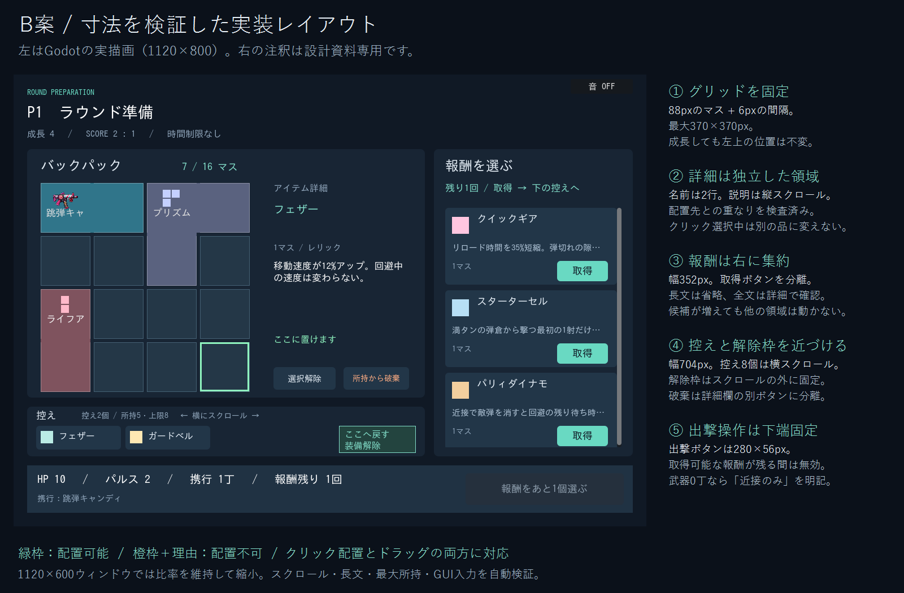

# B案：準備画面のレイアウト確定と検証

2026-09-11。ユーザーが選択したB案を基準に、実装可能な寸法と操作状態を検討し、Godotへ反映しました。

## 設計上の修正

元のイメージは配置の方向性を示すもので、最大所持・長文・画面縮小時の余裕が未確定でした。以下を具体化しています。

1. 4×4を基準に88pxのマスと6pxの間隔を確保し、成長段階でマスの大きさや左上位置を変えません。
2. グリッドと詳細を同じ作業パネル内の別領域に置き、互いの幅を侵食させません。
3. 控えはグリッドの直下。最大8個を横スクロールで扱い、装備解除枠はスクロールの外に固定します。
4. 報酬カードは「効果の確認」と「取得」を区別し、明示的な取得ボタンを使います。候補増加は報酬欄だけの縦スクロールで吸収します。
5. 長い名前は2行・省略表示、効果の抜粋は1行・省略表示。全文は詳細欄の縦スクロールとtooltipで確認できます。
6. 出撃情報と準備完了ボタンは下端に固定。控えや報酬の増減で動きません。
7. レリックの仮アイコンは占有形状のサムネイルにしました。武器は既存アートを使用し、同一アイテムの複数マスはつなげて表示します。名前と形状を併用し、色だけで判断させません。

## 寸法表

すべて1120×800の**論理座標**。原点は画面左上。画像の外側にある解説欄はゲーム画面に含みません。

|領域|x|y|幅|高さ|
|---|---:|---:|---:|---:|
|配置パネル|24|132|704|440|
|最大グリッド|48|192|370|370|
|詳細欄|448|188|264|376|
|報酬パネル|744|132|352|544|
|控えパネル|24|588|704|88|
|控えスクロール|40|622|520|50|
|固定の装備解除枠|576|622|136|48|
|出撃情報の帯|24|692|1072|84|
|準備完了ボタン|800|706|280|56|

- グリッドの寸法：4×88 + 3×6 = 370px。3×2の段階でも同じ88pxを使います。
- グリッド右端418pxと詳細左端448pxの間に30px確保。
- 配置パネル右端728pxと報酬左端744pxの間に16px確保。
- 配置パネル下端572pxと控え上端588pxの間に16px確保。
- 控え・報酬下端676pxと出撃帯上端692pxの間に16px確保。
- 控えの各チップは150px幅・42px以上の高さ。520pxの表示域で3個と次の一部が見え、残りはスクロールできます。
- 1120×600ウィンドウでは既存の比率維持で75%に縮小されます。マスの実表示は66px。ネイティブ1120×800と縮小時の描画を確認しました。
- 全ウィンドウサイズでの可読性を保証するものではありません。任意の極小ウィンドウ向けのレスポンシブ再配置は今回の範囲外です。

## 操作状態

|状態|挙動|
|---|---|
|未選択|品にカーソルを合わせると詳細を表示|
|クリック選択中|選んだ品を固定。他の品へのホバーでは選択と詳細を変えない|
|配置先が有効|全占有マスに緑の枠と「ここに置けます」|
|配置先が無効|橙の枠と、グリッド外／他の装備と重複という理由。状態は変えない|
|ドラッグ開始|つかんだ品を選択。複数マスのどの部分をつかんだかを保存|
|配置成功|装備状態を更新し、クリック選択とプレビューを解除|
|選択解除|Escまたは詳細欄の選択解除ボタン|
|控えへ戻す|ドロップ、または選択した装備で解除枠をクリック|
|完全な破棄|詳細欄の「所持から破棄」。装備解除とは位置・名称・色を分ける|
|報酬取得|所持へ追加し、新しい品を配置用に選択。控えの末尾を一度だけ表示|
|プレイヤー交代|選択とスクロール位置を初期化|

準備完了の可否、丸腰出撃、所持上限、形状判定、報酬の確定ルールは既存のMatchStateに従います。取得可能な報酬が残る間はボタンを無効にし、残り回数をボタンに表示します。候補がすべて取得不可の場合は、既存ルールに従って準備完了を許可します。

## 検証

- `run_tests.ps1 -IncludeRender`：全34本PASS、終了コード0。最終全体ログは `.local/logs/run_tests-20260911-112030.log`。WARNING・ERROR・FAILなし。
- `preparation_ui.gd`：報酬取得、選択の固定、有効／無効プレビュー、無効配置の非破壊性、マス途中からのドラッグ、控え解除、破棄、丸腰準備完了、交代時リセット。
- GUIへ合成マウス入力を送り、クリック選択→クリック配置と、実際のドラッグ開始しきい値→ドロップの両方を検証しています。コールバックの直接呼び出しだけで成功扱いにはしていません。
- 最大8個の控えを最後まで表示できること、パネル同士・グリッドと詳細・解除枠と控えが重ならないこと、カード内の文字とボタンが領域に収まることをassert。
- 最終のスクロール保持／プレイヤー交代時のリセット修正後も、関連UIテストがPASS（`.local/logs/preparation-b-ui-final.log`）。資料用の描画も成功（`.local/logs/preparation-b-capture.log`）。
- 描画資料：通常、配置可能、配置不可、控え8個、控え末尾、長い改造名と説明、1120×800実寸。
- 人間による操作感と音の聴取は未評価。P9の隣接効果など新しいゲームルールは追加していません。

## 再生成

- `docs/design/capture_preparation_b.gd` を非headlessで実行し、Godotの実画面PNGを生成。
- `docs/design/draw_preparation_b_review.ps1` で注釈付き資料を生成。
- 元の比較案は [比較案アーカイブ](../archive/2026-09-11/PREPARATION_UI_OPTIONS.md) に保存しています。
