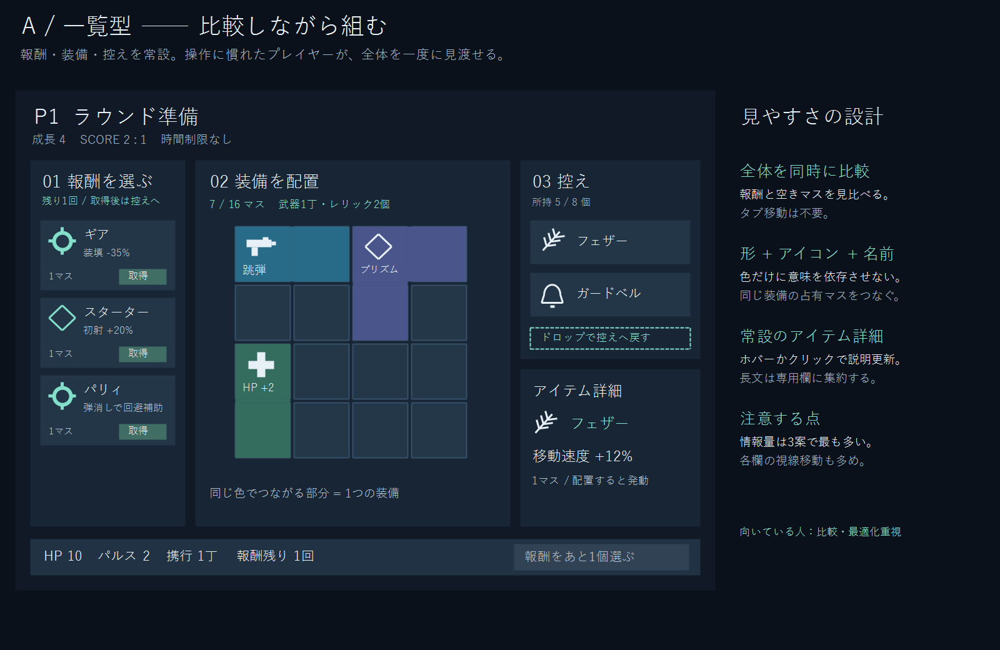
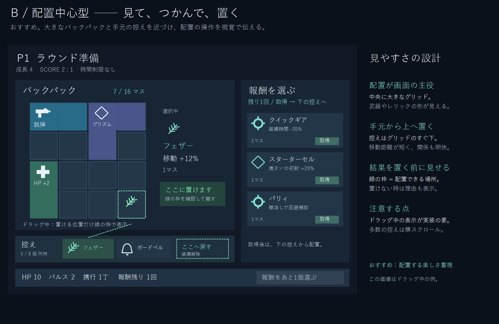
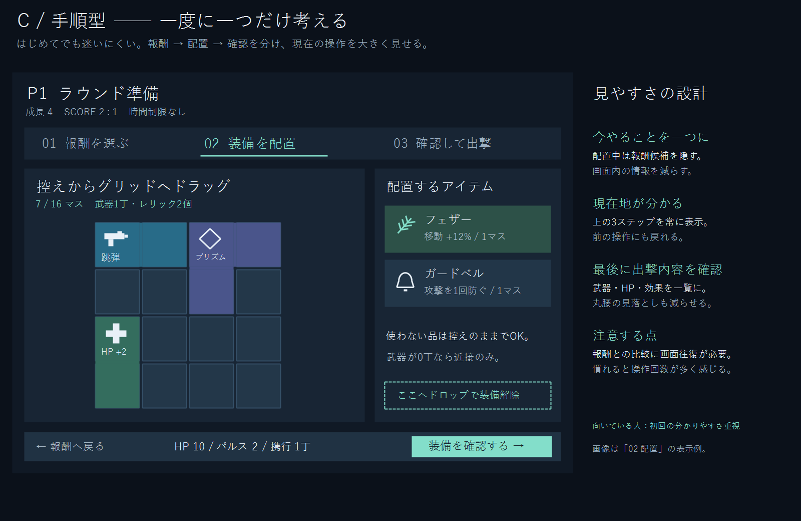

> 履歴資料（2026-09-11に整理）。当時の計画・結果を保存したもので、現在の作業指示ではありません。現行情報は [資料索引](../../README.md) を参照。

# 準備画面：3案の比較（2026-09-11）

更新：ユーザーがB案を選択しました。寸法・操作状態を検討して実装した最終仕様は [PREPARATION_UI_B.md](../../design/PREPARATION_UI_B.md) を参照してください。以下は比較時点の資料です。

以下は設計用モックアップです。右側の注釈はゲーム画面には表示しません。色・形・アイコンを組み合わせ、色だけで装備や配置可否を判断させない方針です。画像のアイコンは仮のピクトグラムで、本番素材とは区別します。

|案|優先すること|利点|注意点|
|---|---|---|---|
|A 一覧型|比較と最適化|報酬・装備・控え・詳細が同時に見える|情報量と視線移動が多い|
|B 配置中心型（推奨）|直感的な配置|控えがグリッドのすぐ下にあり、ドラッグ先の表示で操作を理解しやすい|配置プレビューと不成立理由の実装が必要|
|C 手順型|初回の分かりやすさ|現在の作業に集中でき、最後に出撃内容を確認できる|比較のために前のステップへ戻る操作が増える|

## A：一覧型

左で報酬取得、中央で配置、右で控えと詳細確認。情報を常設し、既存のタブ往復をなくします。

## B：配置中心型

中央から左を配置作業に使い、下の控えから上へドラッグします。ドラッグ中だけ候補位置と形状を表示し、成功時は装備がグリッドへ収まる変化を見せます。不成立時は「他の装備と重なる」「グリッドの外」など理由を表示します。

推奨する追加仕様：クリックで品を選び、マスをクリックして置く代替操作も用意する。これにより、ドラッグが苦手な人も同じ配置ルールで操作できます。まだ未実装です。

## C：手順型

報酬、配置、確認の3ステップ。取得の取り消しや無料交換など新しいゲームルールを追加する案ではありません。戻る操作は画面移動だけで、既に取得した報酬はそのままです。

## 共通仕様

- 同じ装備の複数マスはつながった形で表現し、形・アイコン・名称を併用する。
- 取得ボタンと配置用のアイテムを視覚的に区別する。
- 報酬未取得の間は準備完了を無効化し、残り回数を表示する。
- 丸腰での出撃は既存どおり許可し、武器0丁・近接のみを明記する。
- 装備の詳細はクリック／フォーカスでも読めるようにし、短時間のホバーだけに頼らない。
- 破棄と控えへの移動を区別する。破棄操作は装備移動の中心から離す。
- P9の隣接シナジーなど、未実装の効果は表示しない。

## 作業状態

最初の設計イメージを基にA型の全画面レイアウトをコードで試作済み。ユーザーから複数案の希望があったため、最終案の確定とB/Cへの実装は保留です。A型試作のheadless33本は成功（`.local/logs/run_tests-20260911-015755.log`）。描画も成功（`.local/logs/preparation-redesign-draft.log`）。これは最終デザインの承認や実際のドラッグ操作の受入完了を意味しません。

画像は `draw_preparation_options.ps1` で再生成できます。
