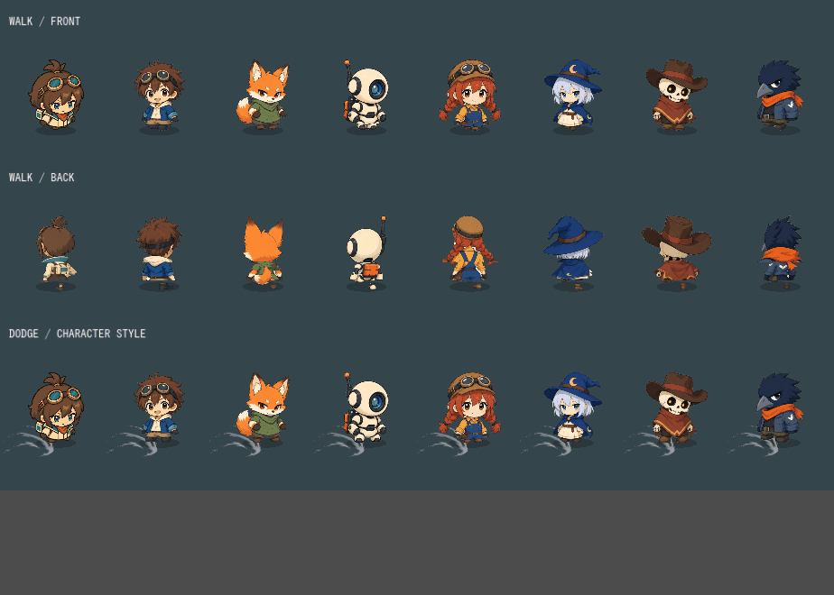
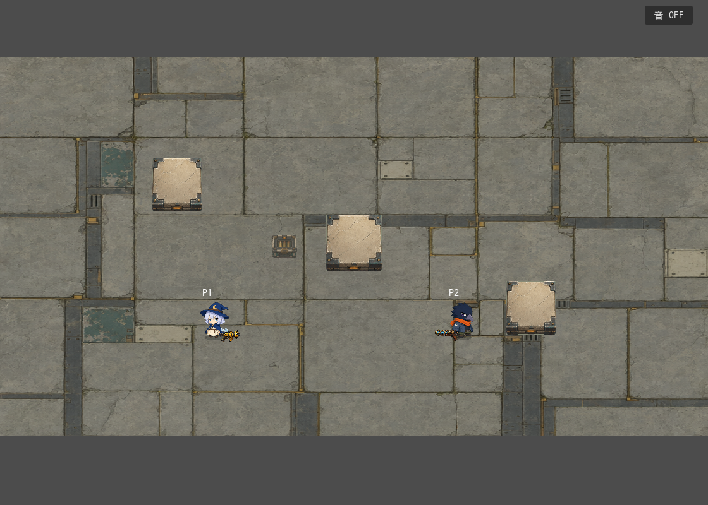

# 8キャラのゲーム画像・固定パーツアニメーション

2026-09-12。ユーザーの差し替え・アニメ実装依頼を実施。追加API生成なし。

## 実装

- 他7人の選択画像・戦闘画像を修正設定画へ差し替え。リナの採用済み正面絵は維持。
- 胴体・左右の靴を固定パーツ化。逆位相の歩行、待機時の小さな上下動を実装。
- ソラ・メイ・クロウのズボン部分は高さ45%へ短縮。頭と靴の元の形を保持。
- 全8人に背面を追加。通常等身背面を頭・胴体・靴に分けて低頭身へ配置した加工版。専用の低頭身背面原画ではなく、体格や接続部の美術的な磨き込みには余地がある。
- 照準または回避方向で前後を切替。横方向近辺はヒステリシスで安定させる。逆向き移動は照準を保ち歩行位相を反転。
- 回避：リナは既存の飛び込み、ソラは低い飛び込み、コハクは跳躍、ボルト・メイは低い滑走、ルナは浮遊ステップ、ラトルはひねるステップ、クロウは重い飛び込み。
- 回避中は武器非表示。背面時は武器を体の後ろへ配置。
- 回避性能は維持：リナ0.38秒、他7人0.26秒、無敵0.31秒。HP・速度・武器・回避CD・衝突形状の変更なし。

## 再現

`tools/build_character_rigs.py` をPillow導入済みPythonで実行。紙の外周に連結した領域を透過して固定パーツを出力。元画像は保存する。`docs/archive/2026-09-12/art-organization/unused-candidates/superseded-assets/characters/manifest.json` に入力・ハッシュ・原点・比率を記録。描画は `scripts/visuals/character_rig.gd`。

## 検証

- Godot 4.7.2でインポート成功。
- 全体61件の初回は58件合格。旧肖像シートを期待するcatalog/charactersを新仕様へ更新。未選択キャラの旧回転を落としていたplayer_animationはフォールバックを復元。
- 修正後のcatalog、characters、player_animation、character_animation、rina_dive、workshop_visualsの6件はすべて合格。初回ログ：`.local/logs/run_tests-20260912-190318.log`。
- 新テストは8人の前後・靴パーツ、左右交代、照準切替、回避方向優先、武器の前後関係、既存の回避時間と無敵を確認。
- 実レンダラで60フレームを撮影。[モーション比較](motion.gif)は正面歩行・背面歩行・回避。回避行は比較のため1回を0.75秒にしたスロー表示で、ゲーム時間とは異なる。
- [対戦画面](battle.png)でルナ・クロウと初期武器を確認。人間による操作感の評価は未実施。

