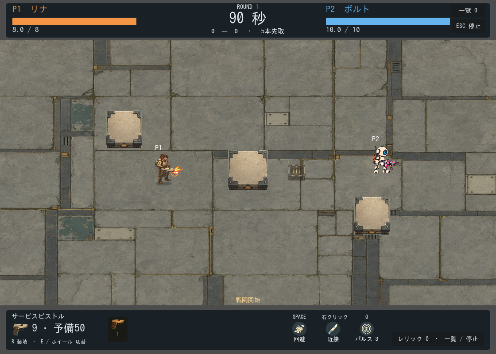
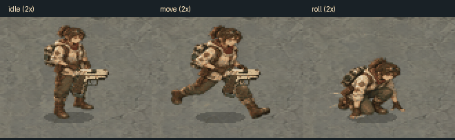

# First Workshop 最小素材制作・導入記録

2026-09-12。探検職人と携帯工房を軸に、象牙色・鋼・青緑・琥珀色の素材を既存ゲームへ導入した。

## 導入結果

- 対戦床、既存3壁の外観、リナ（character 0）、別パーツのサービスピストル（weapon 20）。
- 待機4コマ、移動6コマ、ロール6コマ。初回移動シートは不採用として保存し、ユーザーが追加承認した修正版を採用した。
- 弾、マズルフラッシュ、着弾、ロール残像、弾薬箱、回避・近接・パルスのHUDアイコン。
- カメラ、壁の位置・当たり判定、上下HUDの配置、ロール0.26秒・無敵0.31秒・速度590は維持。旧素材は削除していない。
- 音響素材の生成・再生成は0件。

## 原画・加工・使用量

原画とAPI usageは `assets/generated/fw-*.png` と同名JSON、共通履歴は `assets/generated/first-workshop-usage.json` に保存。加工素材・プロンプト・加工条件・SHA256・使用先・採否は [素材manifest](../../../../assets/first-workshop/manifest.json) と [素材README](../../../../assets/first-workshop/README.md) に記録した。

画像APIは計14回、各1枚、すべて成功。承認された移動の追加生成1回を含む。APIエラー、自動再送、追加候補の無断生成はない。usageを公式料金表で換算した合計は **$1.537681**、保守予約は$14で、上限$15・50回以内。これはusageに基づく推計であり、請求書との照合は未実施。[各回の明細](USAGE.md)

## 検証

- Pythonの予算・重複・usage・通信失敗時停止に関する5テストが合格。
- Godotの素材インポートとゲーム内描画が成功。
- 回帰テスト59件を実行し、初回は58件合格。旧アトラスのみを想定していたcatalogテストを、新素材と既存アトラスを区別して検証する内容に修正し、対象テストの再実行が合格。59件の合格を確認したが、修正後の全件一括再実行は行っていない。
- workshop_visualsテストで移動、射撃、壁着弾、装填、ロール6コマ、左右方向、無敵残時間、補給、既存の速度・半径・カメラ・3壁を確認。
- 最終HUDとキャプチャ処理を再実行。共有弾薬箱1個による補給前後を保存した。

画面はGodot上で決定的な状態を設定して撮影した。手動操作による長時間のプレイ評価は未実施。GIFは各ポーズの確認用で、移動軌跡を記録したプレイ動画ではない。

## ゲーム内画像

[環境](01-environment.png) / [装填](03-reload.png) / [補給前](04-resupply-before.png) / [補給後](05-resupply-after.png)

[アニメーション一覧](animation-contact-sheet.png) / [小物の実寸確認](props-actual-size.png)

## 残課題

今回の最小範囲以外のキャラクター・武器・遺物の正式素材、人による操作感・視認性の最終確認、請求額照合は残る。現行の残課題は [ROADMAP](../../../planning/ROADMAP.md) に集約する。追加の有料生成は実施していない。
