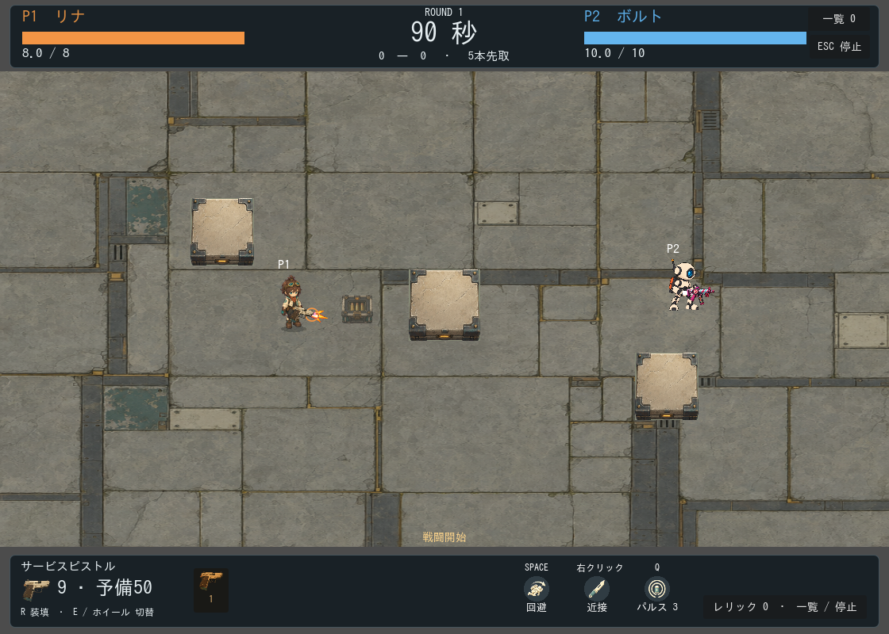
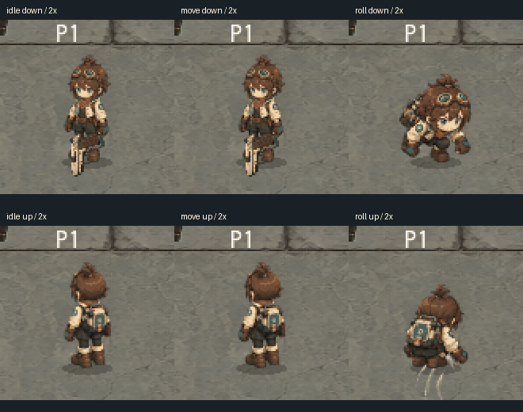

# 低頭身リナのゲーム導入

採用デザインを参照した3シートを各1回生成し、低頭身リナをゲームへ反映した。待機は4コマ、回避は6コマを前後2方向で使用。表示は84×84の等方縮小、128セル内の足元原点は(64,112)。キャラクター選択画像は待機から派生した。

**生成移動シートは不採用。** 左右の脚の交代が不十分で、セル境界にも余裕がなかった。追加生成は行わず、ゲーム内で待機画像の脚を分けて交互に動かす6段階の歩行を実装した。専用の手描き走行アニメーションと同等の完成度とは扱わない。

待機/歩行は照準に合わせて前後を切り替え、後退は歩行位相を逆順にする。回避は実際の回避方向に向く。水平付近の前後切替にはしきい値を設けた。独立武器の手元を調整し、背面時は武器を体の後ろへ描く。カメラ、壁、衝突半径、回避0.26秒・無敵0.31秒・速度590、戦闘計算は維持した。

## 使用量と保存

|原画|usage換算USD|採否|
|---|---:|---|
|fw-chibi-idle|0.110273|採用|
|fw-chibi-move|0.110451|不採用・保存|
|fw-chibi-roll|0.110379|採用|

追加3回 **$0.331103**、累計18回 **$1.979527**。保守予約$18、ユーザー承認上限$19。請求額未照合。APIエラー・自動retry・音響生成なし。

原画・同名usage JSONは `assets/generated/fw-chibi-*`、共通履歴は `assets/generated/first-workshop-usage.json`。プロンプトは `docs/art/production/first-workshop-prompts/chibi-*.txt`。加工条件・採否・原画ハッシュ・使用先は [manifest](../art-organization/unused-candidates/superseded-assets/chibi/manifest.json)。旧素材は保持。

## 検証

- Pythonの予算等5テスト合格、各回送信前check合格。
- Godotインポート成功。全59テストが一括実行で合格。ログ：`.local/logs/run_tests-20260912-150858.log`。
- workshop_visualsで前後切替のしきい値、武器描画順、繰り返し更新時の位置安定、後退位相、回避方向・性能維持を検証。
- Godotで上下左右の待機・歩行6段階・回避6コマ、上移動/右照準、射撃・装填を撮影し、代表画面を目視確認。

GIFは実際のGodot描画から切り出した2倍表示のポーズ比較。連続した移動軌跡の録画ではない。[生成素材一覧](contact-sheet.png)は不採用移動シートも明示して含む。長時間の手動プレイによる自然さの最終評価は未実施。
