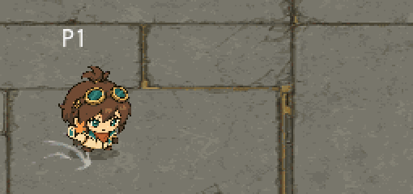

# リナの飛び込み回避

回避を0.26秒の回転から、0.38秒の踏み切り・飛び込み・着地へ変更した。採用した2頭身の固定パーツを傾けて浮かせ、着地で縮ませて立ち姿へ戻す。追加画像生成なし。背面専用絵や手を突く専用描き下ろしポーズは今回追加していない。

時間配分は踏み切り0.04秒、飛び込み0.22秒、着地0.12秒。無敵時間は0.31秒を維持し、最後の0.07秒は被弾する。射撃/近接等の回避中制限は0.38秒まで継続するため、リナには短い復帰の隙がある。他キャラは従来の回避時間と表示を維持し、キャラクター変更時にも時間を再設定する。

移動は累積曲線 F(t)=2t−t² の差分で計算。総距離は旧設定の590×0.26=153.4pxを維持し、前半を速く、着地で減速させる。最終フレームに余剰時間があれば通常移動へ配分する。衝突処理は既存のarena.move_fighterを使用する。

専用テスト `tests/rina_dive.gd` で30/60fps相当、0.1秒刻み、一括0.38秒更新の距離一致を検証。0.30秒時点の無敵と0.32秒時点の被弾、他キャラへ変更した時の0.26秒復元が合格。

連続画面は `tools/capture_rina_dive.gd` で実際のplayer.stepを0.01秒ずつ進めて撮影。入力は固定であり手動プレイではない。自然さと対戦バランスの最終評価は未実施。

全体60テストを実行し、59件が初回合格。extension_boundariesの右端/下端判定が失敗したため、既存move_fighterの両端を含むclamp仕様に合わせ、Rect2.has_pointの排他的な判定を座標比較へ修正。実行ログは `.local/logs/run_tests-20260912-165808.log`。修正後の対象テストも合格し、60件の合格を確認した（全件一括の再実行は未実施）。
