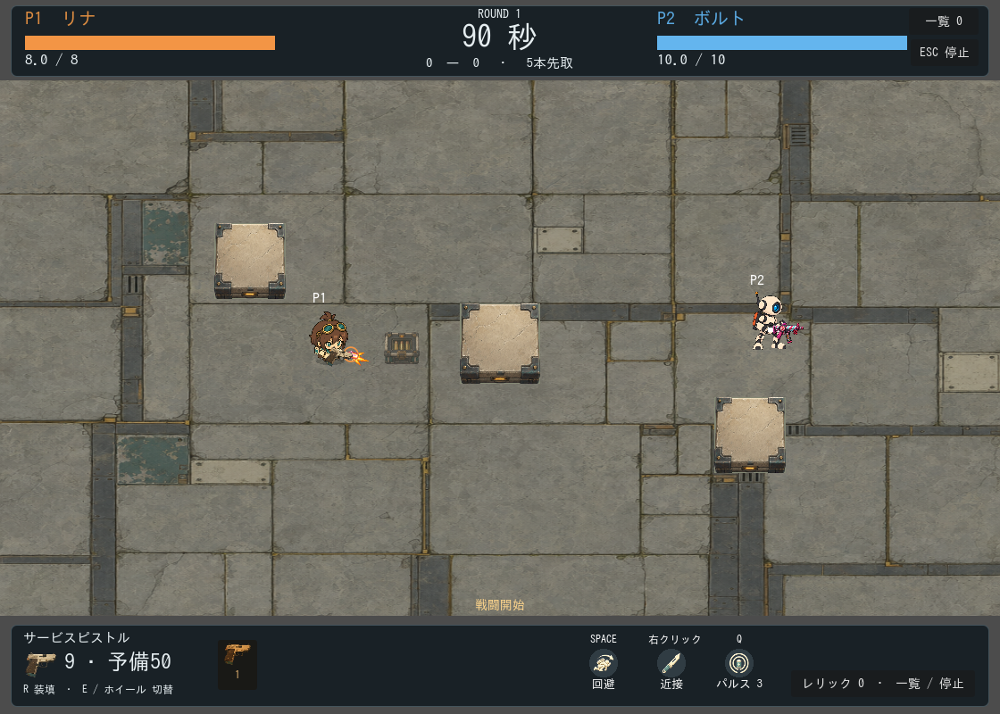

# 2頭身リナの差し替えと歩行の安定化

ユーザーの差し替え依頼を受け、2頭身デザインをゲームとキャラクター選択へ導入。追加の画像API生成は0回、累計20回・usage換算$2.208438のまま。

## 課題への対応

生成した歩行4枚を使う代わりに、採用した1枚から体・左右の靴を固定UVのパーツとして描く方式へ変更した。左右の靴には必ず半周期の差を与え、交互に前後移動・持ち上げを行う。頭や髪を描き直すフレームを切り替えないため、生成絵の輪郭の揺れを取り除いた。体の上下動は意図した小さな揺れのみ。

前回の「長い脚を画像の中央で分割」する処理から、短い靴だけを輪郭に沿って切り出す処理へ変更。別々の固定領域なので、同じ靴を両脚に使ったり頭の形が交互に変わったりしない。高さ56px、等方縮小、線形フィルターを使用。顔に銃が重ならないよう足元と武器位置を調整した。

回避も同じ2頭身素材を縮小・回転する表現へ変更し、旧頭身へ戻らなくした。これは専用の肩回り受け身アニメーションではなく、マスコット風の回転表現。回避0.26秒、無敵0.31秒、速度590、当たり判定、カメラと壁は維持した。

**残る制限:** 今回の採用絵は前斜めのみ。上方向でも顔が見え、武器の描画順だけが変わる。背面専用絵は未制作。靴の交代と輪郭の安定は仕組みとテストで確認したが、人間による操作感・自然さの最終評価は別途必要。

## 検証

- Godotインポート成功。
- 全59件の回帰テスト合格：`.local/logs/run_tests-20260912-163851.log`。
- その後の足元・武器位置・フィルター調整では定数名エラーを修正し、workshop_visualsの再実行とゲーム画面の撮り直しが成功。
- 靴の前後関係が半周期で入れ替わること、武器位置の更新安定、照準と移動の独立、回避性能維持を検証。
- 上下左右の歩行・回避、射撃と装填を撮影し、代表画面を目視確認。
- `capture_twohead_motion.gd` で実際のplayer.stepを64回、各0.025秒進めて上下移動を撮影し、開始位置への帰還を確認。[上下歩行GIF](walking-game.gif)はその連続画像を2倍表示したもの（固定入力、手動プレイではない）。

[ポーズ比較](game-pose-preview.gif)。原画は `assets/generated/fw-twohead-design.png`、透過・切り抜き元はデザイン試作の `design.png`。ゲーム素材は [manifest](../../../../tests/fixtures/art/legacy-rina-twohead/manifest.json)、描画は `scripts/visuals/twohead_rina.gd` と `player_animation.gd`。
