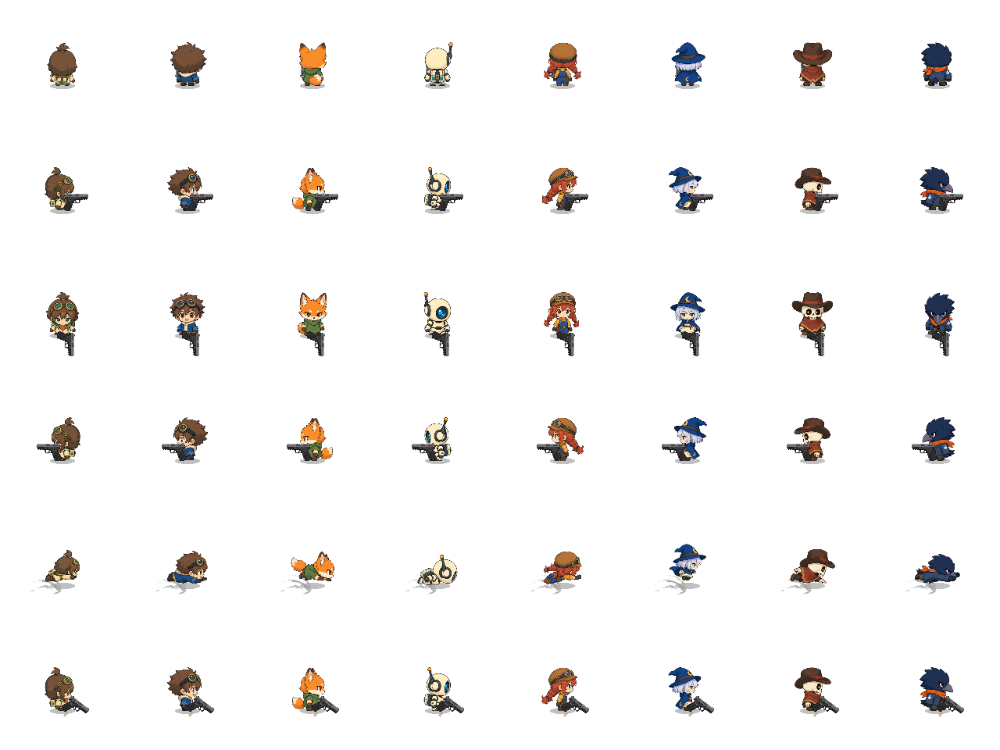

# キャラクター表示状態の分離・検証記録

2026-09-21。変更前コミット: `041e81670024690d7c697d88a17678c147d3ef75`。
現行の追加手順は[ACTOR_ANIMATION](../../development/ACTOR_ANIMATION.md)を参照。

## 変更

- Playerから値のスナップショットを渡し、描画のPlayer/戦闘辞書/所持品への依存を撤去。
- BodyTreeとWeaponTreeを標準AnimationNodeStateMachineとしてシーンへ保存。
- 表示の優先順位、回避と装填/射撃の並行、死亡の即時通知、ラウンド初期化を明示。
- AnimationPlayerの離散トラックで既存の数式描画を選択。実モーション・素材は維持。
- グラフは手動更新とし、停止・結果・Hub停止中の独走、再描画による時間の二重加算を防止。
- 撮影ツール・既存テスト・Visual Hubを新しい入力境界へ移行。

## 自動検証

以下の21スクリプトでPASS出力を確認し、最終ログにSCRIPT ERROR / Assertion failedがないことを確認。

`actor_animation_state`, `player_animation`, `character_animation`, `character_directions`,
`rina_directions`, `rina_dive`, `rina_dodge_poses`, `dodge_flow`, `action_buffer`,
`weapon_visual_events`, `equipment_art`, `workshop_visuals`, `extension_boundaries`,
`visual_hub_live`, `synergies`, `added_relics`, `rally_recovery`, `projectile_hp`,
`combat_visuals`, `characters`, `visual_hub`。

新規テストではPlayerなしの2個体のグラフ独立、身体/武器の並行、同状態の時間継続、
連射イベント再始動、フレーム停止、8人の装填/回避/射撃/死亡/初期化、戦闘データ非変更を検証。
既存テストでは人間/CPU・1対3、回避距離/無敵/着地射撃、反撃回復、装填中断、
24枠のHub表示、38武器の6秒間プレビューまで含む。

初回のrina_directions / workshop_visualsは旧`Animation.moving`を直接設定していたため失敗。
入力境界の`Player.visual_moving`へ更新し、期待値を変えずに再実行でPASS。
初回の新規テストはtravel直後のプロパティが遷移元の値だったため失敗。
遷移時に0秒評価を挟み、同tickで遷移先を反映するよう修正した。

ログ: `.local/logs/animation-<test>.log`。

## 実描画比較

Godot 4.7.2、Compatibility / OpenGL 3.3、NVIDIA RTX 3070 Tiで実描画。
変更前コミットのPlayer/描画スクリプトを`.local/animation-state-review/`へ取り出し、
旧/新のActorを別々の160×160 SubViewportへ配置。同じ素材・パラメーターで描画した。

8キャラそれぞれで待機、横・正面・反対側の歩行、回避中間、装填中間の6条件を比較し、
48組すべてのRGBAデータが完全一致。武器画像も設定して比較した。
比較処理の終了コードは0。確認画像は[comparison.png](actor-animation/comparison.png)。
ログ: `.local/logs/animation-render-compare.log`。

## 制限

実行環境で証明書ストアの読込エラー、実描画時のuser://シェーダーキャッシュ作成エラーが発生。
一部テスト終了時にObjectDB/Resource解放エラーも発生し、変更前のplayer_animationでも再現した。
詳細ログの一例ではAudioStreamWAV/AudioStreamPlaybackWAVが残留。全残留の原因を特定したものではない。
動作アサーションと画像比較の成功を、エラーなしの一括検証と混同しない。

48条件は静的な描画一致の確認で、全フレーム・全装備・死亡絵の一致を保証しない。
死亡専用の絵、姿勢のクロスフェード、頭/髪のパーツ化、新しい敵、AI状態マシンは追加していない。
有料素材生成なし。実プレイの操作感、Web配布、低性能端末の性能は未確認。
