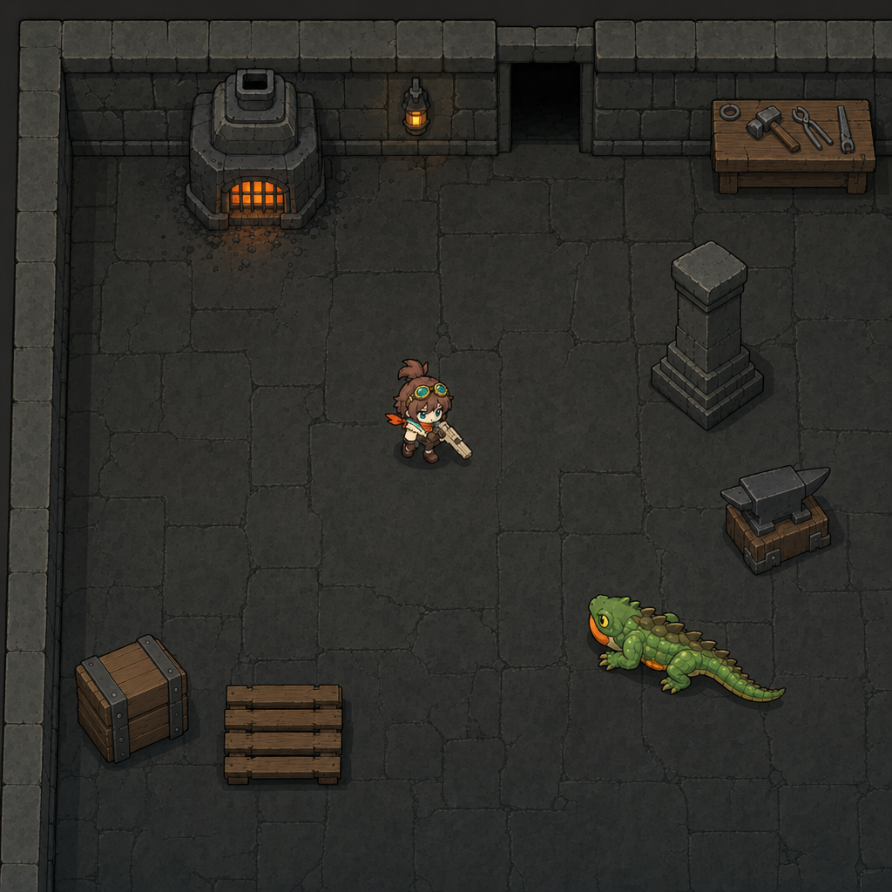
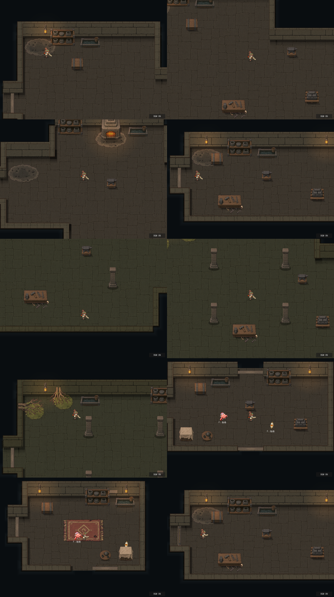

# 旧鋳造区 v2：採用画風での描き直し

区分: 制作記録。状態: 段階1（部屋の見本）を開始。本編・既存テーマは未変更。
依頼: 2026-09-27、ユーザー「ステージデザイン刷新の続き」。画像CLIの上限を8件引き上げ（91→99）、床は「大きな石板と濃い目地の平らな床、明暗差は控えめ」（Claudeのおすすめ案）で進める。
関連: [画風の共通規格](../../VISUAL_STYLE_GUIDE.md) / [ステージ制作テンプレート](../../STAGE_CREATION_TEMPLATE.md) / [ステージ素材ガイド](../../STAGE_ASSET_GUIDE.md) / [旧鋳造区 v1の記録](../ashen-foundry/README.md) / [基準画像](../style-reference-2026-09-26/README.md)

[制作指示の索引](../README.md)

## 1. 仕様票

|項目|内容|
|---|---|
|ステージID・名称・用途|ashen_foundry（灰積もる旧鋳造区）。探索の通常室・宝箱部屋・入口。ボス部屋は後続|
|対象モード・部屋の役割|探索のみ。対戦のテーマは変更しない|
|世界観・基調色・材質|煤けた褐色〜灰の石、鈍い鉄、真鍮の差し色、炉の橙。v1の方向を維持し、描き方だけを変える|
|画風|8方向版リナと同じ濃い茶色の輪郭線・2〜3段の平塗り・左上からの光。背景は線をなくさず、彩度と明暗差を下げ、形を大きく単純にして奥に下げる（規格3.2・3.5）|
|明暗の目標|床18〜24、背景物25〜32（キャラ・敵より暗く、輪郭も弱く）、キャラ・敵35以上（規格3.5、暫定値）|
|基準キャラ・通常表示寸法|リナ全高約63px（カメラ1.2倍）。家具に合わせてキャラを拡縮しない|
|カメラ・部屋の寸法|見下ろしの正投影、画面1120×800、カメラ1.2倍。部屋の形は既存の生成版4の14種を変更しない|
|壁の厚み・描画高さ|壁の衝突と接続は現行のまま。描画上の高さ（`wall_rise`）36px|
|扉|現行の四方向扉・開口幅・到着位置を変更しない|
|素材セット|新しいテーマ `data/stage_themes/ashen_foundry_v2.tres`（予定）を追加し、v1のテーマは戻せるように残す|
|生成範囲|最大8件（段階1: 1〜2、段階2: 2〜3、段階3: 1〜2）。段階1の結果をユーザーに確認してから段階2へ進む|
|完了条件|標準1室が新しい画風で組み上がり、比較シートの明暗・輪郭の目標を満たし、壁接続・扉・到達性のテストが通ること。見た目のユーザー採用は別に記録|

## 2. 必要素材の一覧（段階1の時点の方針）

|部品|方針|
|---|---|
|床|新規。大きな石板＋濃い目地、明暗差は控えめ。320px周期で敷き詰め可能にする（生成後に継ぎ目を加工）|
|壁上面|新規。床と同じ石の材質・尺度で、縁なしの地模様|
|壁正面|新規。石積み、縦横320px周期。両端に柱を焼き込まない|
|外周の縁|新規または現行の形状に合わせて再着色|
|露出した壁端|壁正面と同じ素材（現行の方式を維持）|
|扉・敷居|現行を流用し、色味だけ合わせるか、段階2で判断|
|低い遮蔽物|新規（資材箱・金床・パレット）|
|机・作業台|新規（天板主体、強い見下ろし）|
|棚・壁付き設備、炉|新規（段階3）|
|壁灯・照明|新規（段階3）。発光はゲーム側で追加|
|柱|新規（段階3）|
|根・苔・煤・敷物などの床装飾|後続（今回の8件の範囲外）|

## 3. 段階1：部屋の見本

目的: ステージの見た目（床・壁・家具の描き方と明暗）を、リナ・敵と並べた1枚で決める。ゲーム素材としては使わない。

- 参照画像: 8方向版リナ（描き方の基準）、基準画像v2（描き方の基準。床の見本・家具の描き方）、トカゲv3（新しい画風の敵の例）。
- v1（基準画像）の教訓により、現行の旧鋳造区の画面は参照に渡さない（古い描き方に引っ張られるため）。部屋の構成は文章で指示する。

### 生成結果（2026-09-27）

- 生成: 91件目（上限99、残り7件）、推定0.114ドル。gpt-image-2、high、1024×1024、参照3枚（[リナ](../style-reference-2026-09-26/ref-rina.png)・[基準画像v2](../../../../assets/generated/style-reference-v2.png)・[トカゲv3](ref-lizard-v3.png)。トカゲの参照はゲーム用アトラスの待機コマを灰色の背景に並べたもの）。指示 [prompt-room-mock.txt](prompt-room-mock.txt)。
- 原本: [assets/generated/stage-room-mock-v1.png](../../../../assets/generated/stage-room-mock-v1.png)

計測（見本画像上の矩形の平均。家具・キャラの矩形は周りの床を含むため参考値）:

|領域|平均明度|明度のばらつき|彩度|
|---|---|---|---|
|床|19.4|1.5|7.1|
|北壁の上面|24.1|4.5|12.0|
|北壁の正面|16.8|7.0|21.5|
|西壁の上面|25.6|5.3|10.1|
|柱・資材箱・金床・作業台・炉|18.1〜21.4|7.1〜8.8|9〜42|
|リナ／トカゲ|30.8／27.6|20.4／13.9|35.5／32.0|

Claudeの評価（目視）:

- **良い点**: 床・壁・家具がリナと同じ濃い輪郭線と平塗りで描かれ、画面全体が1つの絵柄にまとまった。床は大きな石板と濃い目地で落ち着いており（明度19.4・ばらつき1.5、目標18〜24）、リナとトカゲが最も目立つ。北壁の正面・扉の開口・左上の角（上面が途切れず連続）・炉の灯り・壁灯・作業台・柱・金床・資材箱・パレットが指示どおりに入った。リナの大きさは画像の高さの約11%で、指示の9%に近い。
- **課題1（角度）**: 資材箱・パレット・金床の台が斜めから見た立体で描かれ、「横の辺は水平」に合わない。作業台は脚が見える。段階3（家具）で、正面が画面に平行な見下ろしを明示して描き直す。
- **課題2（色味）**: 全体がほぼ無彩色の灰（床の彩度7）で、v1の「煤けた褐色」より冷たい。石にわずかに暖かい茶を足すかどうかはユーザー判断。
- **課題3（壁の正面）**: 北壁の正面が床より暗い帯（16.8）になり、奥行きは出るが重い印象もある。
- 柱は床とほぼ同じ明るさで、輪郭線だけで読める。背景物としては目標どおり控えめ。
- トカゲは、参照とは顔の色などが違って描かれた（見本の用途には影響なし）。

### ユーザー決定（2026-09-27）と階層案との照合

ユーザー「おすすめで進めてください。先ほど考えた階層案にそって確認してください」。

- 見本v1の方向（絵柄・明るさの順・大きな石板と濃い目地の床）で進める。
- 色味: 石にわずかに暖かい茶色を足す（無彩色の灰から、煤けた褐色・土色寄りへ）。
- 北壁の正面: 見本より少し明るくする（床より暗い帯にしない）。
- 階層案（[世界観と階層案 10章](../../../planning/WORLD_AND_DUNGEON_CONCEPT.md#10-検討中のアイデア2026-09-27claude提案未採用)、検討中）との照合: 第1層「根絡みの遺跡」（根に割られた石造回廊、木漏れ日、野営跡、緑と土色）の中に、旧鋳造区を「鋳造区の区画」として置く案A。したがって段階2の床・壁は、**遺跡の回廊と鋳造区の両方で使える共通の石**として作る。暖かい土色の石は第1層の「土色」と合う。炉・鋳造の家具（段階3）は鋳造区専用、根・苔・木漏れ日・野営跡は遺跡側の装飾として後続にする。ストーリーは検討中のため、固有の紋章・文字・特定の建築様式は石に焼き込まない。

## 4. 段階2：壁と床の素材

現行の描画方式（`workshop_floor.gd`・`connected_wall_surface.gd`）に合わせる。

|素材|描画での扱い|生成の指定|
|---|---|---|
|床|ワールド320px周期で敷き詰め|1024角の継ぎ目なし地模様。石板は1辺あたり5〜6枚（1枚がリナの背丈程度）。明暗差は控えめ|
|壁の正面・露出した端|320px周期。ただし画面に見えるのは壁の高さ36pxの帯だけ|1024角の石積み。1段の高さが約115px（ワールド約36px）で、段ごとに目地が横に揃う|
|壁の上面|128px周期|1024角。床と同じ石を大きめのブロックで。縁取りなし|
|外周の縁|幅2pxの線|生成しない。濃い茶色の単色画像をコードで作る（規格の「背景にも輪郭線」）|

継ぎ目は生成後に、反対側の端と重ねてなじませる加工で消す（原本は加工しない）。

### 段階2の結果（2026-09-27）

- 生成: 92〜94件目、各推定0.108ドル（計約0.32ドル）。gpt-image-2、high、1024×1024。参照は見本v1の床と北壁の部分（[ref-mock-stone.png](ref-mock-stone.png)、(380,20,380,380)を切り出し、キャラ・家具なし）。指示 [床](prompt-floor.txt)・[壁の正面](prompt-wall-face.txt)・[壁の上面](prompt-wall-top.txt)。原本 `assets/generated/stage-v2-{floor,wall-face,wall-top}.png`。月間予算の残りは約9.2ドル。
- 継ぎ目: 端どうしの明度差（0〜100）は、床1.4／1.0、上面0.8／0.9（左右／上下）で、画像内部の隣接列の差（0.5〜0.6）に近く、加工なしで敷き詰めた。壁の正面は上下の差が9.5あったため、目地の線 y=6 から y=978 までのちょうど8段を切り出して1024へ戻し、上下に繰り返せるようにした。
- 派生: [tools/build_stage_v2_materials.gd](../../../../tools/build_stage_v2_materials.gd) で `assets/stages/ashen-foundry-v2/` に `floor.png`・`wall-top.png`・`wall-face.png`・`edge.png`（外周の縁、濃い茶色 #2a1e16 の単色、生成なし）を作成。
- テーマ: `data/stage_themes/ashen_foundry_v2.tres`（v1を複製し、床・上面・正面・端・縁を差し替え）。床の明るさ0.78倍、壁は1.15倍、床と上面にかけていた暗い上塗りは外した。壁の正面は縦304px周期（1段が約38px）。`ashen_foundry_dressing.gd` をv2へ切り替え。v1のテーマは残し、崩落工房のデモは引き続きv1を使う。家具・装飾・扉枠は未変更（段階3で描き直す）。

撮影: [tools/capture_stage_views.gd](../../../../tools/capture_stage_views.gd)（L字工房の外角・内角、交差作業室の段状の角、標準工房の西扉、西張出し工房の南壁、列柱作業室）。等倍は `views/01〜06`。

計測（本編の描画、L字工房の画面上の矩形）:

|領域|平均明度|ばらつき|彩度|目標|
|---|---|---|---|---|
|床|21.0|2.1|25.6|18〜24 ✓|
|北壁の正面|22.5|3.8|25.9|床より少し明るい ✓|
|北壁・西壁の上面|25.6〜26.1|2.7〜3.3|27前後|背景物25〜32 ✓|

比較シート（列柱作業室）でも床は20.8（ばらつき2.0）。キャラ・敵の値は変わらない。

- 目視（Claude）: 床・壁がリナと同じ濃い輪郭線と平塗りの石になり、画面が1つの絵柄にまとまった。左上の外角は上面が途切れず連続し、内角・段状の角・扉の開口も既存の組み立てどおり。石の尺度は床（石板がリナの背丈程度）、上面、正面（1段約38px）で揃っている。
- 残る違和感: 棚・水槽・資材箱・金床・作業台・柱・炉・根などの**家具と装飾は旧画風のまま**で、新しい床の上で絵画的な描き方が目立つ（特に炉の明るいアイボリー）。段階3で描き直す。壁の正面と上面の明るさが近く、正面の段差がやや弱い。
- 自動テスト: `ashen_foundry`・`connected_wall_surface`・`wall_junctions`・`four_way_rooms`・`stage_templates`・`field_layout`・`exploration_floor` はPASS。`stage_depth` は45行目（別フィールドへ切り替えた後の並び順の確認）で失敗するが、変更前のコードでも同じ箇所で失敗することを確認した（今回の変更とは無関係）。
- 未確認: ユーザーの目視確認と採用、長時間の移動での床の繰り返し感、照明なしの比較。

## 5. 段階3：家具（2026-09-27、ユーザー「家具も進めてください」）

### 必要素材の一覧（現行の表示寸法。画面上はカメラ1.2倍）

|ID|現行の素材|表示寸法 w×h（ワールドpx）|置き方|新しい絵の条件|
|---|---|---|---|---|
|furnace|showcase/furnace.png|112×132|北壁に付ける。灯り170|石と鉄の炉。正面の口が橙に光る。煙突は上へ（壁につながる）|
|bench|showcase/workbench-overhead.png|134×61|床|天板主体の作業台。脚は隠れる。工具数点|
|cabinet|showcase/cabinet.png|82×100|北壁に付ける|工具棚。正面向き|
|lamp_*|showcase/lamp.png|27×44|北壁の正面|鉄の壁灯。発光はゲーム側|
|material-crate|showcase/material-crate.png|72×57|床|鉄帯の木箱。上面主体|
|metal-pallet|showcase/metal-pallet.png|88×58|床|鉄材を載せたパレット。上面主体|
|anvil|showcase/anvil.png|68×40|床|木の台に載った金床|
|structural_pillar_*|collapse-v1/pillars.png|48×98.5|床（部屋の形で配置）|四角い石柱。床・壁と同じ石|
|mold_rack|furnishings-v2.png セル0|140×109|北壁沿い|鋳型の棚|
|quench_trough|同セル1|112×64|北壁沿い|水を張った冷却槽|
|covered_crates|同セル2|96×64|部屋の隅（入口・宝箱部屋）|布を掛けた保管物|
|tea_table|同セル3|72×54|部屋の隅（入口・宝箱部屋）|小さな卓と茶器|

方針:

- 画風: 床・壁と同じ濃い茶色の輪郭線と平塗り。背景物なので、キャラ・敵より彩度と明暗差を抑える（目標の平均明度25〜32、規格3.5）。炉の口と灯りだけは暖色で光ってよい。
- 視点: 見下ろしの正投影、横の辺は水平。床置きの物は上面主体で正面は短く、脚を見せない（[ステージ素材ガイド](../../STAGE_ASSET_GUIDE.md) 2章）。壁付きの物（炉・棚・鋳型棚・灯り）は正面が見えてよい。
- 置き換え方: 位置・当たり判定・影の設定は変えず、画像だけ差し替える。新しい絵の縦横比が違う場合は、幅を保ち、足元（表示矩形の下端）を同じ位置に合わせて高さを決める。
- 生成: 6点ずつ2枚（マゼンタ背景の3列×2行）。つながった形ごとに切り出す（トカゲv3の組立と同じ方式）。
- 対象外（後続）: 根・苔・巣・灰・敷物などの床装飾、扉枠、ボス部屋の設備。

### 段階3の結果（2026-09-27）

- 生成: 95・96件目、各推定0.117ドル（計約0.23ドル）。gpt-image-2、high、1024×1024。
  - シートA（炉・作業台・工具棚・金床・資材箱・パレット）: 参照は[リナ](../style-reference-2026-09-26/ref-rina.png)・[部屋の見本v1](../../../../assets/generated/stage-room-mock-v1.png)・v2の床。指示 [prompt-props-a.txt](prompt-props-a.txt)。
  - シートB（壁灯・石柱・鋳型棚・冷却槽・布掛けの保管物・茶の卓）: 参照はシートA・リナ・v2の床。指示 [prompt-props-b.txt](prompt-props-b.txt)。
  - 原本 `assets/generated/stage-v2-props-{a,b}.png`。月間予算の残りは約9.0ドル。
- 切り出し: [tools/build_stage_v2_props.gd](../../../../tools/build_stage_v2_props.gd) で `assets/stages/ashen-foundry-v2/props/<ID>.png` の12点を作成（マゼンタを透明化、つながった形ごとに検出、各マスにちょうど1点を確認）。
- 本編接続: `ashen_foundry_dressing.gd` で、既存の配置（炉・作業台・工具棚・壁灯・資材箱・パレット・金床・石柱）の画像をv2へ差し替え、追加家具（鋳型棚・冷却槽・保管物・茶の卓）もv2で作る。位置・当たり判定・影・灯りは変えていない。表示の幅は `PROP_WIDTHS`（炉112、作業台134、工具棚64、壁灯18、資材箱66、パレット80、金床60、石柱46、鋳型棚140、冷却槽112、保管物84、茶の卓64）で、足元（表示矩形の下端）は元の位置のまま。以前の暗い色付け（tint）は外した。

計測（比較シート、列柱作業室）:

|家具|平均明度|輪郭の対背景差|遠目の目立ち度|変更前|
|---|---|---|---|---|
|作業台|28.1|10.1|6.6|32.6 / 9.9 / 9.3|
|パレット|25.6|9.5|5.0|29.9 / 15.7 / 8.1|
|石柱（4本）|26.8〜28.8|9.0〜9.2|3.5〜4.5|33.6〜34.9 / 13.6〜14.2 / 9.5〜11.9|
|金床|24.8|8.4|3.5|27.8 / 13.6 / 5.1|
|（参考）番機／トカゲ／リナ|28.2／40.7／44.4|11.2／16.2／25.6|6.1／9.8／11.1|—|

- 家具は、規格3.5の背景物の目標（明度25〜32、輪郭12以下）にほぼ収まった（金床の明度24.8はわずかに下）。遠目の目立ち度は、すべての敵より低くなった。以前は柱が敵より目立っていた問題は解消した。
- 目視（Claude）: 床・壁・家具・リナ・トカゲが同じ描き方になり、画面が1つの絵柄にまとまった。すべての家具で横の辺が水平。炉は自身の灯りで明るく見える。
- 残る旧画風: 床の装飾（灰・煤の散らばり、根・苔・巣・敷物・削り屑）、扉枠、番機・ヤマアラシ・独楽の鋳造機。灰の装飾は、新しい床の上で細かいざらつきとして目立つ。
- 自動テスト: `ashen_foundry`・`stage_templates`・`field_layout`・`exploration_floor`・`four_way_rooms` はPASS。`exploration_rooms` は106行目（探索カメラ倍率の確認）で失敗するが、リナの制作記録（2026-09-26）で作業前からの失敗として記録済みのもの。
- 未確認: ユーザーの目視確認と採用、宝箱部屋・入口（保管物・茶の卓が出る部屋）の撮影、侵食室（色付けを変える部屋）の見え方。

## 6. 段階4：床の装飾と扉（2026-09-27、ユーザー「床の装飾と扉枠を進めてください」）

### 現状の調査

- 床の装飾は旧画風の3枚から取っている: `decals.png`（灰・煤、敷物、削り屑と工具。セル0の根は未使用）、`root-entries-v3.png`（セル0: 北壁から床へ降りる根、セル1: 西壁の上面から床へ伸びる根）、`root-junctions-v2.png`（セル2: 苔、セル3: 巣）。
- 扉: テーマの `door_jamb`（扉枠の画像）は、どのコードからも描かれていない。開口は壁の石の折り返しで表現され、`exploration_door.gd` が半透明の敷居（幅6px）と、封鎖中の真鍮色の横棒（コード描画）、通れるときの小さな点を描くだけ。[ステージ制作テンプレート](../../STAGE_CREATION_TEMPLATE.md)でも「正式な開閉・封鎖素材は別途必要」とされている。

### 必要素材の一覧

|ID|用途・置き方|表示寸法（ワールドpx、現行）|新しい絵の条件|
|---|---|---|---|
|ash|炉の前・部屋の端の灰と煤（床）|180×105〜240×180|大きな形の灰だまりと少数の燃えかす。細かい粒のざらつきにしない|
|rug|入口・宝箱部屋の中央の敷物（床）|230×180|色あせた赤茶の古い敷物。単純な柄|
|offcuts|作業台の足元の削り屑と小工具（床）|95×75|木の削り屑数個と小さな鉄片|
|moss|根の根元の苔（床）|幅110|くすんだ緑の苔の広がり|
|nest|部屋の隅の小動物の巣（床）|幅64|小枝を編んだ巣と拾われた金属片|
|root_down|北壁の正面から床へ降りる根（壁の上に重ねる）|幅120|上端が細く、下へ広がって床へ這う根。石積みを描き込まない|
|root_side|西壁の上面から床へ伸びる根|幅150|左端から右へ広がる根。石積みを描き込まない|
|threshold|扉の開口の敷居（新規、床）|開口の幅×24前後|床と同じ石の、少し明るい一枚石の敷居。回転して四方向に使う|
|barrier|封鎖中の扉（新規、敷居の上）|開口の幅×16前後|ボルト留めの太い鉄の横木。回転して四方向に使う|

方針: 床の装飾は床より少しだけ目立つ程度（彩度・明暗差を控えめ）。濃い茶色の輪郭線と平塗り。根と苔は第1層「根絡みの遺跡」の緑と土色。敷居と鉄の横木は床面に置く平らな物なので、回転して使ってよい（壁・家具のような立体ではない）。生成は2枚（3列×2行と2列×2行）。

### 段階4の結果（2026-09-27）

- 生成: 97・98件目、推定0.117・0.119ドル（計約0.24ドル）。gpt-image-2、high、1024×1024。
  - シートA（灰・敷物・削り屑・苔・巣・北壁から降りる根）: 参照は家具シートB・v2の床・リナ。指示 [prompt-decals-a.txt](prompt-decals-a.txt)。
  - シートB（西壁から伸びる根・敷居・封鎖の鉄の横木・大きい灰）: 参照は装飾シートA・v2の床・家具シートA。指示 [prompt-decals-b.txt](prompt-decals-b.txt)。
  - 原本 `assets/generated/stage-v2-decals-{a,b}.png`。月間予算の残りは約8.75ドル。
- 切り出し: `build_stage_v2_props.gd` を4枚・列数の違うシートに対応させ、つながった形をマスの中心で割り当てる方式に変更（削り屑のような散らばりを1点として扱う）。家具12点は変更前と同じ寸法で再出力。装飾・扉の10点を `props/` に追加。
- 本編接続:
  - `ashen_foundry_dressing.gd`: 床の装飾（灰・敷物・削り屑）を v2 の絵に差し替え。指定の幅と中心を保ち、高さは絵の縦横比に合わせる。灰は幅200px以上で大きい灰を使い、不透明度0.72で床の目地を透かす。根（北壁・西壁）・苔・巣も v2 に差し替え、旧の暗い色付けを外した。崩落工房のデモ室は比較用のため v1 のまま（`decal(..., true)`）。
  - 根の侵食室の色付けを v2 の値に対する相対値に直した（床0.72/0.8/0.72、壁0.98/1.02/0.9）。旧の値（壁0.75）が v2 の壁の明るさ（1.15）を打ち消していたため。
  - `exploration_door.gd`: 半透明の敷居線を、開口の幅×20pxの石の敷居に置き換え、封鎖中はコード描画の真鍮の横棒の代わりに鉄の横木（開口の幅−6px×14px）を重ねる。床に置く平らな物なので、扉の向きに合わせて回転する。通れるときの小さな点は従来どおり。

撮影: `capture_stage_views.gd` に、根の侵食室の北壁付近、生成階層（seed 22）の入口と宝箱部屋、封鎖状態の扉を追加（`views/07〜10`）。

- 目視（Claude）: 灰は床の目地が透ける薄い灰だまりになり、以前の細かいざらつきは消えた。北壁の根は壁の正面から床へ降りて苔と広がり、西壁の根は壁の上面から床へ伸びる（第1層「根絡みの遺跡」の手がかり）。敷物・保管物・茶の卓は入口と宝箱部屋で読める。扉の開口には石の敷居が見え、封鎖中は鉄の横木が横切る。
- 気になる点: 苔の緑がやや鮮やかで、床より目立つ。敷居は開口の壁の線上にあり、南北の扉では壁の厚みの中に一部隠れる。
- 自動テスト: `ashen_foundry`・`stage_templates`・`field_layout`・`exploration_floor`・`four_way_rooms`・`collapsed_workshop`・`connected_wall_surface`・`exploration_encounter` はPASS。`boss_approach` は38行目（前室の扉から戻る確認）で失敗するが、最後のコミットの状態でも同じ箇所で失敗することを確認した（今回の変更とは無関係、未調査）。
- 未確認: ユーザーの目視確認と採用、ボス部屋（鋳造床・煤の配置）の見え方、扉を実際に通ったときの見え方。

## 7. 鉄格子の門と開閉（2026-10-06、制作中）

ユーザー指定：戦闘開始で下り、全滅させると上がる鉄格子。状態：制作中・未採用。

- 読了：art/README、VISUAL_STYLE_GUIDE、STAGE_CREATION_TEMPLATE、STAGE_ASSET_GUIDE、development/STAGE_TEMPLATES、ASSET_GENERATION_SETUP、tools/README、imagegenスキル、対象exploration_door.gdとexploration.gd。
- 方式：固定した小さい鉄の支持具と可動格子を分離。四方向の開口中心を接地原点とし、上下動は画面の鉛直方向。門幅は部屋データのwidth、高さ48ワールドpxを仮基準。既存の壁端を支持部に使い、石柱を追加しない。
- 必要素材：北・南の横幅の門、東・西の奥行方向の門の可動格子。リナを画風参照、既存敷居を流用。新規格子は不足。左右は光を回転させず各向きで作成する。
- 今回の生成範囲：内蔵imagegenで四方向の格子を1枚の透過シートに生成。原本を保存し候補へ配置。SE生成は今回含めない。
- 動き：閉鎖は約0.35秒の加速落下と短い着地反動、開放は約0.65秒の巻き上げ。支持具は固定。停止中は進めず、離室で破棄、攻略済み再訪は開放状態。
- 確認：四方向の実部屋・通常倍率、閉／途中／開の連続表示、戦闘・全滅・ボス報酬封鎖・停止・再訪。自動確認と美術受入を区別する。現時点は全項目未確認。

### 実装・生成記録

- 内蔵imagegen、1枚生成。原本：`assets/generated/dungeon-gate-v1.png`（1536×1024、RGBA）。基準画像：`docs/art/production/style-reference-2026-09-26/ref-rina.png`。キー・API設定変更なし。
- 派生は画像を変更せずAtlasTextureで切り出す。候補：`assets/retired/dungeon-gate/v1/`。北(71,83,647,345)、南(830,82,635,346)、西(361,499,86,442)、東(1090,498,86,443)。alpha>128の可視範囲に4pxの余白を追加。参照原点は下端中央。表示は北南が開口幅×56、東西が28×(開口幅+40)。光源は各方向とも左上。
- 固定した巻上げケースと可動格子を分離。開閉途中の状態反転は現在位置から継続。閉鎖.35秒、開放.65秒、着地反動.16秒／最大3px。候補モードは開き切るまで部屋移動を待つ。通常起動では採用済み横木に伸縮を適用し、新規格子は候補プレビューだけで表示する。
- 機械チェック：原本シート1×1、display-scale .2でPASS（hard failure 0 / warning 0）。透過・シート外へのはみ出しを対象とし、四方向個別の接地や実時間アニメの品質保証ではない。
- 実部屋の描画確認：`tools/preview_dungeon_gate.gd`。四方向開口、旧鋳造区テーマ、リナを配置。画像は候補の`views/closed.png`・`opening.png`・`open.png`。全景は0.85倍の検査用、北南は現行倍率の初回撮影でも確認。東西は細い側面となるため、通常倍率での手動受入は未確認。
- 未確認：ユーザーの連続再生・手動通行確認、美術採用、専用SE（未制作）。候補のまま保存し、採用素材へは昇格していない。

最終検証：全テスト PASS 161 / FAIL 0 / NO-PASS 4 / 合計165（`.local/logs/run_tests-20261006-212215.log`）。NO-PASSはenemy_animation_review、enemy_art_preview、enemy_death_review、quillback_art（エラーなしの撮影用）。追加したポーズ・開放待ち・移動後の状態の単体テストも再実行PASS。初回サンドボックス実行はログ保存とWindows証明書ストアへのアクセス制限でFAILとなり中止、通常権限で全件再実行した。画像チェック、資料索引、エージェント設定同期も確認済み。最終の表示矩形修正後に四方向の実描画を再撮影（エラーなし）。

### ユーザー指摘を受けた再レビュー（2026-10-06）

総合は**要修正**。格子を受ける溝・収納部・壁との前後関係がなく、開放時の横棒が浮いて見える。東西の素材は棒状で、開口の奥行きを門の高さ・昇降距離へ混用している。明暗調整だけでは解決しない。北側1か所で門と壁の接続構造を先に設計し、成立後に四方向へ展開する案を提案。詳細は[候補レビュー](../../../../assets/retired/dungeon-gate/v1/review.md)。このレビューでは再生成・コード修正なし。

## 8. 壁に組み込む門 v2（2026-10-06、制作開始）

- 読了：素材必読入口、VISUAL_STYLE_GUIDE、STAGE_CREATION_TEMPLATE、STAGE_ASSET_GUIDE、STAGE_TEMPLATES、v1レビュー、exploration_door・ConnectedWallSurface・FieldBuilderの現行実装。
- 方式：既存壁材と鉄素材を流用して、奥側の溝→可動格子→手前の案内金具・上部ケースの順に組み立てる。北側を先に実画面で確認し、同じ立体寸法で四方向へ展開。新規の石柱で接合を隠さない。格子の高さ54px、収納までの昇降60pxを共通とし、開口幅112/144pxから独立。
- 必要素材：既存壁上面・壁正面・敷居・鉄横木を流用。南北の可動格子はv1の原本を流用して描画時の明度を抑える。東西はv1の一本棒を使わず、同じ門の厚み・棒・横桟を立体形状で描画する。固定部の不足は既存材質を貼った構造部品で補う。
- 今回の生成範囲：新しいAPI画像・SE生成なし。既存材質と描画構造の修正。候補v2に設定と確認画像を保存し、v1の原本・レビューを保持する。
- 確認：北の通常倍率で閉／途中／開、次に四方向の同倍率、接続と昇降量、停止・再開・再訪。連続確認用プレビューを更新する。実装確認とユーザー採用は別。

### v2の制作結果

最終寸法は格子高64px・昇降70px・収納梁の高さ64〜80px。北の基準点は開口中心から室内へ24px移し、既存壁の内側の面へ合わせた。東西は床上の手前端をYソート原点とし、描画原点を戻して実位置を維持する。敷居は既存threshold.png、格子の南北はv1画像を描画時に減光して流用。収納梁と低い足元は既存壁材の同じ周期で組み、案内金具は鉄色の面を組んだ。東西の格子は棒と横桟の投影形状を使用。新規の画像・音響API送信は0件。

- 北側の通常倍率で、閉鎖時の接地・収納中の遮蔽・開放時に支えが残る形を確認した後、四方向へ展開。
- 四方向の通常倍率で各3状態、北は5秒20fpsの連続フレームを保存。詳細と未確認事項は[v2確認記録](../../../../assets/retired/dungeon-gate/v2/review.md)。
- `preview_dungeon_gate.ps1`で北の自動開閉を確認できる。`-View`で四方向・全景、`-Version`でv1との比較。起動上限120秒。
- 単体テストとv2候補有効時の20回往復はPASS。全体テストの結果は完了後に記録する。

v2最終検証：PASS 161 / FAIL 0 / NO-PASS 4 / 合計165。ログ：`.local/logs/run_tests-20261006-215846.log`。NO-PASSはenemy_animation_review、enemy_art_preview、enemy_death_review、quillback_art（撮影用、エラーなし）。追加のv2候補有効時exploration_roomsもPASS（20回往復）。資料索引・リンク・エージェント設定同期も確認済み。素材原本と派生条件のSHA-256は候補v2のrecipe.jsonに記録。自動検証と描画画像の確認は、ユーザーの美術採用・手動操作の受入を代替しない。

## 9. 通路と一体化する門 v3（2026-10-06）

- 読了：docs/README、DOCUMENTATION_GUIDE、art/README、VISUAL_STYLE_GUIDE、STAGE_CREATION_TEMPLATE、STAGE_ASSET_GUIDE、development/STAGE_TEMPLATES、v2レビュー、WorkshopRoomShell・ConnectedWallSurface・FieldBuilder・ExplorationDoor。
- 方式：北の開口の奥へ暗い通路床を描き、壁厚と内側の陰影で入口を示す。南・東西は既存の手前壁と同じ切断表示を採用し、上部の梁を省略して床と可動格子を見せる。南は手前壁に合わせた低い断面、東西は格子の厚みを見せる。新しい柱で接合を隠さない。
- 必要素材：既存のテーマ床・壁材・敷居とv1南北格子を流用。追加原画なし。不足は開口の奥行きと部材の遮蔽設計であり、描画コードで変更する。
- 今回の範囲：候補v3の設定、開口背景・方向別の構造描画、通常倍率の四方向の確認。画像・SEのAPI生成0件。移動・衝突・接続先は既存を保ち、通路の奥は部屋遷移先を示す描画とする。
- 確認方法：閉／途中／開、実部屋と確認室、開放待ち・停止・再訪の回帰テスト。ユーザー採用と連続再生の受入は別に記録する。

### v3の結果

四方向の通常倍率で閉／途中／開を撮影。本編seed 1の北・東で各100コマ、20fpsの開閉を記録。[v3確認記録と画像](../../../../assets/retired/dungeon-gate/v3/review.md)。北は86pxの暗い通路、南は32pxの格子断面と60pxの通路、東西は上部梁を省略した厚み18pxの格子。前回壁に見えた開口奥は実装上は床材だったため、壁の衝突を削除する変更はしていない。

全体テスト：PASS 161 / FAIL 0 / NO-PASS 4 / 合計165（`.local/logs/run_tests-20261006-223328.log`）。NO-PASSはenemy_animation_review、enemy_art_preview、enemy_death_review、quillback_art。候補有効の20回往復もPASS。既存production_doorsを候補有効で追加実行すると即時通行のassertがFAILしたため、原テストを変更せず、開放時間を進める別検証で29回の通行・宝箱・ボス報酬・帰還を確認しPASS。失敗と追加検証の条件は候補記録に保存。未採用・手動受入待ち。

## 10. 開閉SEの制作（2026-10-06）

### 本編採用（2026-10-07）

ユーザーの「OKです。適用お願いします」により門v3・開閉SE v2・専用ショップを採用。読了済みの素材入口、共通画風、ステージ制作テンプレート・素材ガイド・接続定義、音響基準、manifest、現行Door/Soundに従い、既存候補を正式パスへコピーする。画像・音源の追加生成なし、不足素材なし。四方向の材質・寸法・開閉時間とSEゲインは承認候補を維持する。原本・旧候補・加工レシピはretiredへ保存。通常起動の四方向、開放待ち、複数門のSE集約、ポーズ・再訪・ボス帰還を検証する。

候補引数なし・本編seed 1で四方向の閉／途中／開を撮影。[北・閉](gate-adopted/production/north/closed.png)、[東・閉](gate-adopted/production/east/closed.png)、[南・開](gate-adopted/production/south/open.png)、[西・開](gate-adopted/production/west/open.png)の通常倍率を目視確認。29回の通行・宝箱・ボス報酬・帰還の個別検査PASS。採用WAVは候補と同一SHA256、非圧縮PCM・トリム/正規化/ループなし。

採用後の初回全体検査はPASS 162 / FAIL 1 / NO-PASS 4 / 合計167（`.local/logs/run_tests-20261007-001007.log`）。exploration_encounterの159行が戦闘直後の即時横断を要求し、開放途中で失敗。そこから巡回数の174行も失敗した。採用した開放待ちに合わせ、往路・復路の操作前にOPEN_SECONDS分の門更新と非封鎖・通行可能のassertを追加した。既存の移動先・在庫・遭遇状態のassertは維持。単独再検査PASS（`.local/adopt-encounter.log`）。初回インポート時の未生成リソースの読込エラーはインポート完了後の再読込で解消。通常起動の実SE発火・部屋再構築での停止もPASS（`.local/gate-adopt-runtime.log`）。

採用後の最終全体検査：PASS 163 / FAIL 0 / NO-PASS 4 / 合計167（`.local/logs/run_tests-20261007-002032.log`）。NO-PASSはenemy_animation_review、enemy_art_preview、enemy_death_review、quillback_art（エラーのない撮影用）。修正した探索戦闘・正式門の開閉と音響・専用ショップ・本編巡回を含む。資料リンク、画像台帳、エージェント設定同期も検査済み。ユーザーの採用を反映済みで、機器別の最大混戦の聴感は別途評価の範囲。

### 採用前の音響制作履歴

後続のユーザー指定「重厚感＝開閉SEの重さ」に対応した最新候補は[音響v2](../../../../assets/retired/dungeon-gate-audio/v2/review.md)。開閉各1音を追加生成し、閉鎖の高域を抑えて低域の胴鳴りを合成。v3の門画像・動作時間を維持し、音響だけ改訂。通常起動には未採用・試聴未確認。以下は初版の記録。

追加依頼により閉鎖・開放を各1候補生成、v3プレビューへ接続した。閉鎖の打音を0.35秒の着地へ合わせるPCM派生を作成し、同時に動く門は1音へまとめた。ポーズ保持・反転・部屋移動での停止を接続。API2送信・再試行0。[音源・数値検査・再現レシピ](../../../../assets/retired/dungeon-gate-audio/v1/review.md)。試聴未確認・ユーザー未採用。

音響追加後の全体テスト：PASS 162 / FAIL 0 / NO-PASS 4 / 合計166（`.local/logs/run_tests-20261006-230813.log`）。NO-PASS：enemy_animation_review、enemy_art_preview、enemy_death_review、quillback_art。候補音源124件のResource検査と、門の実イベント発火・停止の追加確認もPASS。音色は試聴未確認。
