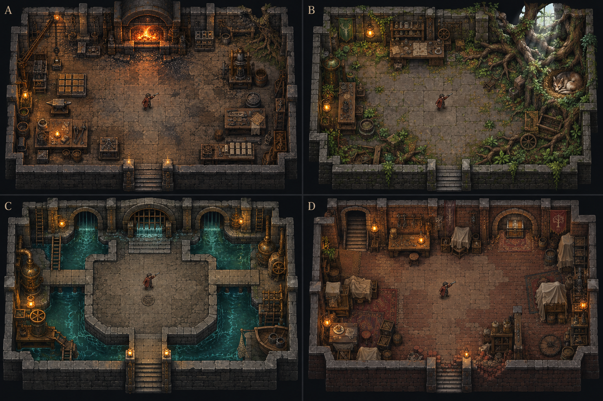
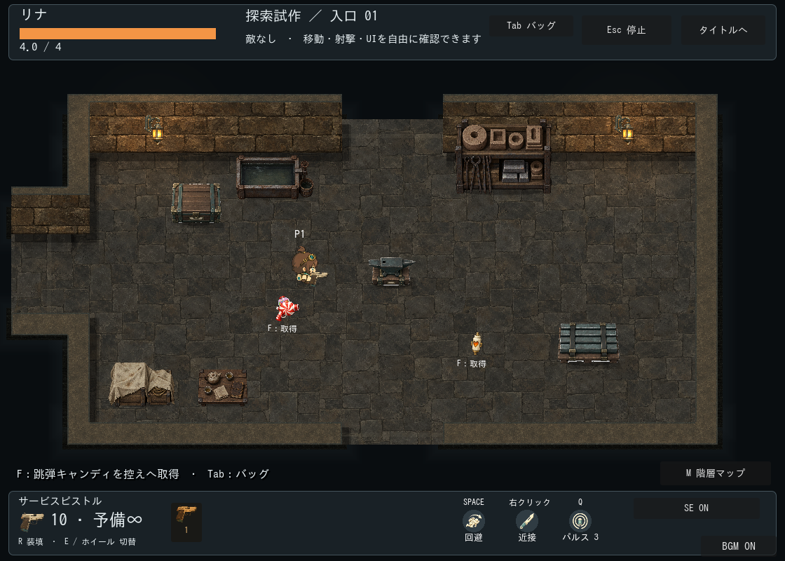
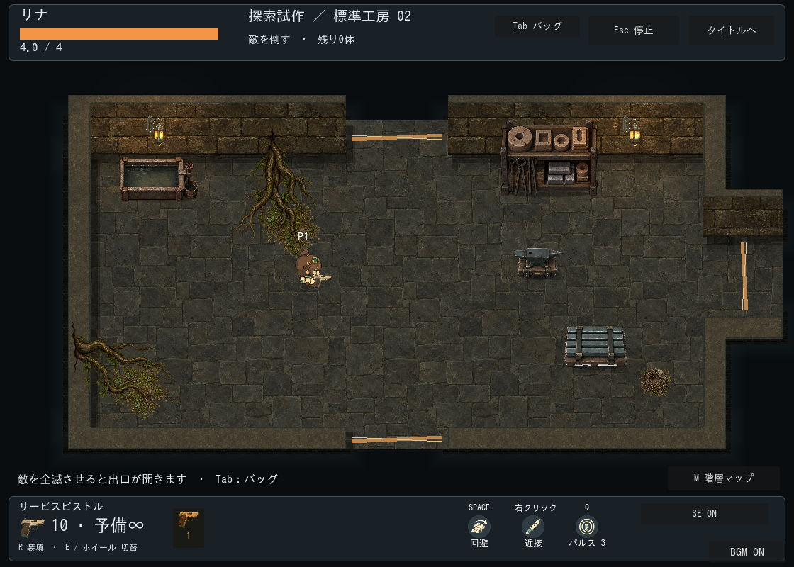
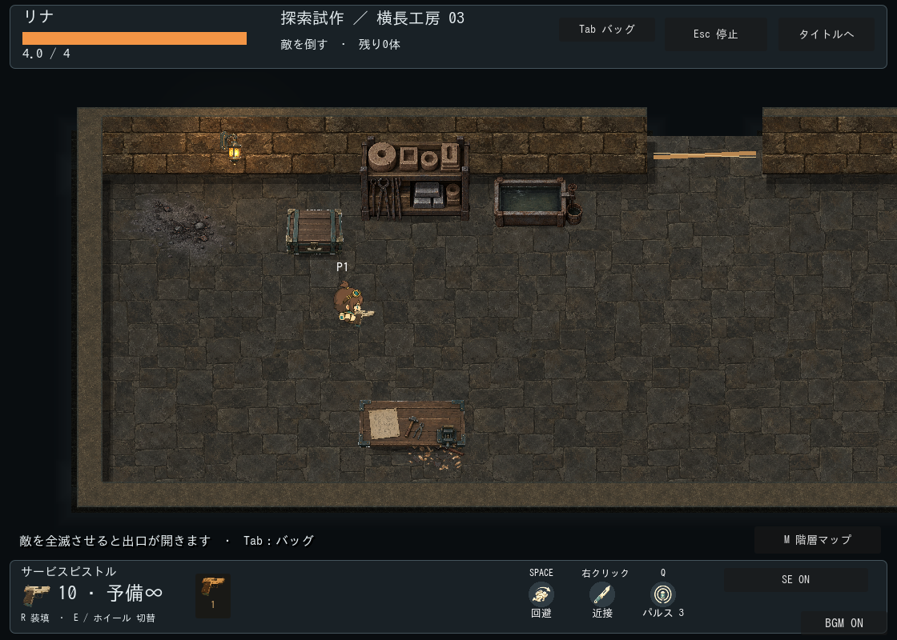
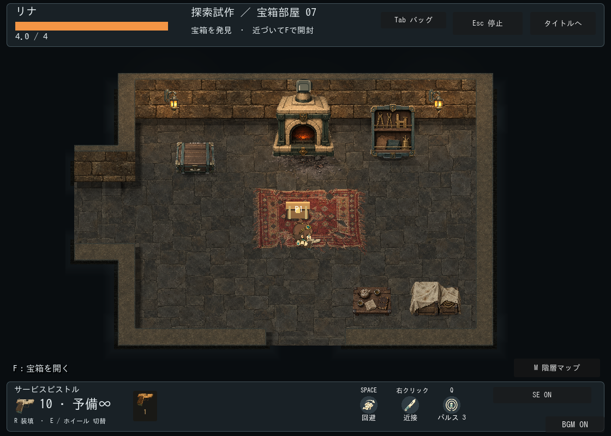
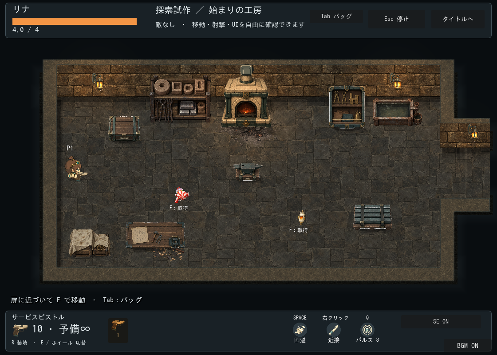
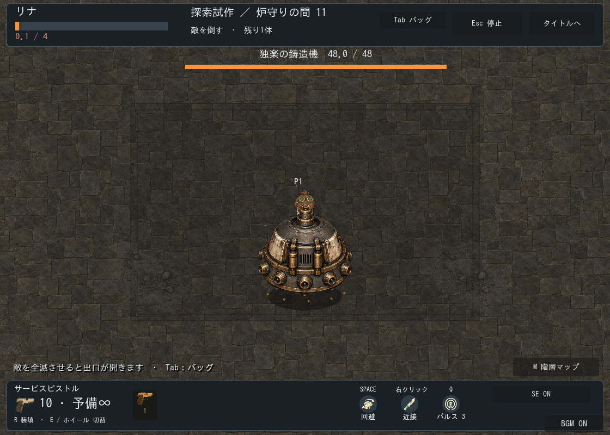

# 1面：灰積もる旧鋳造区

区分：制作記録。状態：美術方向はユーザー採用、床・壁正面・上面・追加家具・壁付き侵食の本編接続済み。カンプ全体の設備密度・建築形状の再現完了ではない。

## 採用方向と仕様票

- Aの旧鋳造区を基本に、Bの根・苔の侵食を一部の通常室へ、Dの生活の名残を宝箱・ショップ予定室へ使用。Cの水路は今回対象外。
- 対象は探索の固定2部屋とランダム1面。既存の対戦テーマは維持。ルートや部屋の形状、壁衝突、扉接続、戦闘性能は変更しない。追加家具のみ足元の衝突を持つ。
- 色は煤けた褐色の石・鈍い鉄・炉の橙、侵食室のみ控えめな苔色。正投影、既存キャラの通常表示寸法を維持。
- 壁高36px、上角/通路終端/四方向扉は既存の連結面構築を流用。装飾柱で接合線を隠さない。
- 配置はashen_foundry_dressing.gd、テーマはdata/stage_themes/ashen_foundry.tres。部屋生成の乱数を消費せず、役割と部屋番号から装飾を選ぶ。

## 素材と派生レシピ

原本・実行用ファイル・送信プロンプト・SHA-256は[素材manifest](../../../../assets/stages/ashen-foundry/manifest.json)。built-in image_genで床1枚、装飾シート1枚、壁正面1枚を生成。画像の加工はなく、元のPNGをコピーして使用。要求1024角に対して実出力は1254角だったため実寸に合わせて参照する。

|素材|実ファイルと使用方法|状態|
|---|---|---|
|補修された不揃いの石床|floor.png、1254角、ゲーム上320px周期|接続済み|
|煤けた石積み正面/露出端|wall-face.png、1254角、縦横320px周期|接続済み|
|根と苔|decals.pngの左上627角、主に240×230px、床専用|接続済み|
|灰と煤|同右上、炉の足元180×105px、周辺の薄い灰180×110px等|接続済み|
|古い敷物|同左下、宝箱等の中央230×180px|接続済み|
|削り屑・小さな工具|同右下、作業台の足元95×75px|接続済み|
|壁上面・縁・炉・棚・作業台・照明・低い遮蔽物|既存工房素材。テーマの色調と既存の接地影を使用|流用|

透過シートはRGBAのままAtlasTextureで四分割。floor_decal指定は床描画内で床領域へクリップし、人物より下に表示。衝突・光源を持たせない。通常の家具Yソートには混ぜない。大きな根や幹の遮蔽物を置く場合は別素材・別衝突が必要。

## 通常サイズでの確認

ashen_foundryテストで共有資源の非変更、再適用時の装飾重複防止、衝突なし、床レイヤーを確認。exploration_floorは100シード・267テンプレート/開口組合せの到達性を確認。exploration_roomsは20往復の状態保持、connected_wall_surfaceは面接続と旧方式への切替、stage_templatesはテーマ/配置の回帰を確認。古い部屋往復テストの有限弾薬・反撃回復の期待値は現行の探索仕様へ修正した。

静止画で透過縁、床尺度、壁正面/通路終端、人物と宝箱の視認性を確認。床/壁の端の完全なピクセル一致、長時間移動での反復感、弾幕中の実プレイ視認性、ユーザーによる最終美術採用、Web/低性能端末は未確認。終了時ObjectDB警告は既存課題。

## 次の素材候補

### 採用カンプとの比較レビュー

追加素材適用前のコードでseed22の入口・侵食・鋳造・宝箱部屋を再描画して比較。結論は「古びた材質の方向は合うが、カンプの工房としての設備密度・建築の厚み・環境の物語性には未到達」。前回のテスト通過は見た目の完成を意味しない。

- 優先度高：北扉がある部屋ではwall_shadow付きの炉/棚をすべて省くため、周辺設備が極端に少なくなる。扉を避けた壁沿い配置が必要。中央の回避空間は維持する。
- 優先度高：暗い石積み正面に対して、既存の明るく平坦な壁上面が太い枠に見える。上面・外縁も同じ材質/経年状態へ揃える（第2便で上面を交換）。連結面の形状を壊して柱で隠さない。
- 優先度高：根は床専用画像2枚で、壁の割れ目・根元・周囲の苔との接続がない。同じ左端配置が繰り返される。壁際から侵入する取付構造と複数の配置候補が必要。
- 優先度中：床の細部と320px周期の反復がまだ目立つ。背景の明暗差を抑え、壁際の密度と通行部の静けさを分ける。
- 優先度中：宝箱部屋の違いは主に敷物で、布掛け保管物や生活小物、光の配置が不足。カンプDの生活の名残は未達。
- ボス室はコード上で全既存家具を省いているため、主炉や背景設備がない。戦闘床外の演出用設備を別に設計する必要がある。今回の再描画4室にボス室は含めていない。

確認範囲は静止画と配置コード。敵を退役させた比較画面であり、弾幕下の視認性や移動中の反復感は未確認。次の推奨工程は素材の一括追加ではなく、壁沿い設備・壁上面・根の取り付き・照明を含む標準1室の完成見本を作り、その配置規則を各部屋へ展開すること。

カンプへ近づける追加候補は鋳型棚、冷却槽、壁沿いの小型巻上機、布掛け保管物、茶器、巣、壁に食い込む根。部屋の入口や回避路を避ける配置を先に決め、方向/視点/尺度と衝突を定義してから制作する。下記の追加素材を生成済み。小型巻上機は未生成。追加素材は第2便として配置済み。根の侵食は部屋番号で選んでおり、深さに伴う環境変化や生物の出現種類との連動は未実装。

## 追加素材（第2便）

[追加素材manifest](../../../../assets/stages/ashen-foundry/additions-manifest.json)に原本、プロンプト、実寸、SHA-256、Atlas領域を記録。原本を無加工でコピー。全3枚は1254×1254px、透過シートは各セル627×627px。以下の寸法は表示時の初期候補で、人物との比較で調整する。下表は生成時の候補値で、適用値は後述。

|画像|内容（左上・右上・左下・右下）|表示寸法候補|
|---|---|---|
|wall-top-v2.png|煤けた石の上面用材質（不透明）|連結面の共通座標で128px周期から検討|
|root-junctions-v2.png|北壁の割れ目と根／西壁の根／苔の移行部／小さな巣|150×150／150×150／140×100／72×56px|
|furnishings-v2.png|鋳型棚／冷却槽／布掛け保管箱／茶器の低い台|140×110／112×72／96×80／72×52px|

壁上面は縦横・角の同一材質として使い、柱や画像の縁で接続を隠さない。根の素材に石積みが含まれるため、既存壁との石の大きさ・高さ・厚みを合わせる必要がある。根全体を床デカールとして貼るだけでは壁への取り付きは解決しない。壁に重なる部分と床の根の描画順、必要なら分割参照を決める。苔は床レイヤー、家具は足元を基準とするYソートと別定義の衝突形状を使用。通路・扉・回避領域を避けて配置する。

生成画像の目視確認とGodot 4.7.2での3枚のインポートを確認。現在は本編接続済み。以下に配置後の確認範囲を記す。棚と保管箱は正面の割合が大きいため、壁際で使い、低い中央遮蔽物への転用はしない。

### 第2便の初期適用結果（下記レビュー修正前）

- 壁上面はwall-top-v2.pngへ交換。128px共通座標を維持し、wall_top_wash（褐灰色・不透明度0.7）で細かな模様を抑える。外縁は既存の暗い金属材を維持して面境界を読めるようにする。
- アトラスは各627角を参照し、Image.get_used_rect()で透明余白を除いたAtlasTextureをキャッシュする。画像加工はなし。幅を定義し高さは縦横比から計算するため、家具の視点を縦圧縮で変えない。
- 鋳型棚140px、冷却槽112pxを北向きの壁正面の候補位置へ配置。開始・宝箱・ショップ予定室には保管箱96pxと茶器台72pxも候補として加える。各素材は1室最大1個。配置できる隙間がない場合は省くため、すべての部屋に全家具が出るわけではない。ボス室には追加家具を置かない。
- 候補は壁の実区間から56px間隔で探索し、既存家具/灯具との表示重複、扉から到着位置までの56px余白、開始点40px余白を避ける。足元衝突は幅86%・画像高38%で表示と独立し、床内に収まる場合だけ追加。中央の広い床は維持する。
- 北壁の根は幅140px、西壁の根は150px。壁終端に取り付け、surface_overlayで壁より前・人物より後ろに描く。壁部分を床クリップで消さず、低い根で人物を覆わない。既存石積みに合わせた色調を適用。苔110px、巣64pxは床専用・衝突なし。壁の破壊や生物の出現機能は持たない。
- 確認画像は上記4室を更新。固定の始まりの工房は下記。画像は通常表示の1120×800で、敵を除いた配置確認。戦闘中の視認性、連続移動の印象、ユーザー最終採用、Web負荷は未確認。

ashen_foundryで追加8種の配置、共有元非変更、再適用時の重複なし、衝突/描画層を確認。exploration_floorは配置差も含め100シード・528組合せの到達性、exploration_roomsは20往復、stage_templatesとconnected_wall_surfaceも通過。壁/床/扉の形状は維持。headless検証環境ではOS証明書参照エラー、一部テスト終了時のObjectDB警告が出るが、各検証のPASSを確認した。

### 第2便適用後のレビュー（2026-09-23）

対象：固定工房・入口・侵食・横長・宝箱の通常表示画像と採用カンプ、現行の配置/影/壁描画コード。追加でseed22の通常戦闘とボス室を各約3秒進めたフレームを描画。自動進行であり、手動プレイや弾幕中の視認性の合格判定ではない。今回の通常室は近接敵3体。敵弾の比較は未確認。レビュー用実行の終了時にObjectDB/Resource警告あり。実装の修正は行っていない。

結論：材質・用途の方向は採用案へ近づいたが、カンプの立体感と空間としてのまとまりには未到達。素材の接続完了と美術上の完成は区別する。

|優先度|所見と根拠|改善方針|
|---|---|---|
|高|棚・布掛け箱・茶器台の黒い影が本体から離れ、浮いて見える。接地位置/影寸法を画像の矩形から共通計算している|素材別の接地点・影幅を設定し、脚直下の接地影と投影を分ける|
|高|床と壁正面が同系色・同程度の細かさで、壁上面も平坦な帯として見える|床の局所コントラストを下げ、壁の足元と外周の明暗で面を分ける。上面の70%色重ねも再調整|
|高|北側の根元の小さな石積みが壁の途中に貼り付いた飾りに見える。西側も既存の滑らかな上面から石列へ唐突に変わる|既存壁側に割れ目を設けるか、根側の石積みを分離して石目/厚みを一致させる|
|中|新しい棚は大きめだが設備として許容範囲。炉と布だけが明るく、家具ごとの経年表現に差がある|キャラ寸法は維持し、炉/布の明度・煤・接地の統一を先に行う|
|中|北壁へ設備が集中し、下側/横側や大部屋が単調。宝箱室の生活感は小さな茶器台だけでは弱い|回避空間を守りながら、作業・保管・休憩のまとまりで壁際を構成する|
|中|大きなボス室中央は画面全体が同じ石床になり、場所の特徴が見えない|衝突を増やさず床の大きな煤/補修跡/鋳造場の輪郭等で識別点を作る。大型背景設備は別工程|

通常戦闘の静止画ではキャラ/敵を識別できたが、褐色の敵と床の色は近い。小さな遠距離弾や高速移動中の判断は未評価。中央の空間確保、壁上面の連続性、机の見下ろし視点は維持したい。次の推奨順は接地影→根と壁の接続→床/壁/家具の明暗→部屋別の構成。まず既存素材と描画設定で一室を仕上げ、素材追加は接続用の割れ目など不足が確定したものに限定する。

### レビュー修正の適用（現行）

- 根の石積みが既存壁と食い違うため、built-in image_genで1枚を修正生成。北/西の根だけをroot-entries-v3.pngへ交換し、苔と巣はv2を流用。[生成条件・原本・参照領域](../../../../assets/stages/ashen-foundry/root-v3-manifest.json)。北120px・西150px、石積みを重ねず既存壁へ根の細い始点を接続する。壁の当たり判定は維持。
- 家具が浮く原因は、透過画像のほぼ見えないalphaがセル端まで残り、get_used_rectが本体より大きくなることだった。鋳型棚では非ゼロalphaの範囲553×606に対し、alpha>0.05の見える範囲は519×403。確認した領域へ2px余白を加え、AtlasTextureの参照領域を固定した。PNGの画素は加工していない。
- 家具の幅140/112/96/72pxと縦横比は維持。正しい画像端から足元ソート・衝突を再計算。shadow_rectで本体下端に幅80%・高さ7pxの薄い接地影を設け、画像高依存の長い影を追加家具には使わない。既存工房素材の影は維持。
- 床色をやや冷たい灰色へ寄せ、floor_washを0.34として石目の主張を抑制。壁上面の色重ねは0.52に緩めて素材感を残す。炉の明度を抑え、白布・家具にも控えめな色調補正を設定。
- 保管箱と茶器は床領域の端の共通候補へ配置し、北壁だけへの集中を緩和。扉・開始点・既存家具に重なる場合は反対側、空きがなければ従来の壁沿い候補を試す。
- ボス室中央に640×400pxの鋳造設備撤去跡を床専用描画で追加。低コントラストの固定跡と薄い煤で識別点を設ける。立体設備・段差・衝突・発光は追加していない。

固定工房、入口、侵食、横長、宝箱の上記確認画像を最終状態へ更新。次はボス室中央の通常カメラ画像。

検証：ashen_foundry（素材参照・ボス床の床内配置・不正な影矩形の拒否・再適用・共有元非変更）、exploration_floor（100シード/554配置組合せの到達性）、exploration_rooms（20往復）、stage_templates、connected_wall_surfaceはPASS。通常室/ボス室を短時間進めた画像も確認。完全な弾幕下の手動プレイ・Web負荷・全素材のアニメーション中の見え方・ユーザー美術採用は未確認。カンプの大型背景設備まで完成したものではない。
