# 作り込んだ20部屋の試作（2026-09-27）

## 水面・日差し・火元の環境演出（2026-09-30）

読了資料: art/README、VISUAL_STYLE_GUIDE、STAGE_CREATION_TEMPLATE、STAGE_ASSET_GUIDE、development/STAGE_TEMPLATES、既存配置と原画。方式: 既存PNG/AtlasTextureを流用するshaderと固定数の手動粒子。新規画像・音声生成なし。必要素材は既存のcistern、quench_trough、lamp、campfire、furnace。炎の独立コマ素材は作らず、炎色マスクで内部の揺らぎと明滅を表現する。

中央貯水槽は幅290px。architecture.pngの(125,205)から430×195px相当の水域を端で減衰し、石枠・衝突・経路を固定。旧overlayが元画像の背面に隠れていた描画順を修正。2種類の波、流れる反射、3点の水滴の光と対応する波紋を描く。小型quench_troughは原画の正規化矩形(.13,.36,.57,.27)で桶・縁を避け、日差しは付けない。

中央貯水槽の日差しは上方へ延長し、両端をsin減衰、側辺を薄い5帯で減衰。埃は固定18点。天井開口の新規素材や物理的な遮蔽は未実装。焚き火・炉・壁灯は炎色部分にのみUV変位と明滅を重ね、火元ごとに異なる位相でPointLight2Dを最大約9%変化。焚き火は火の粉6点・薄煙5点、炉は火の粉2点、密閉ランプは粒子なし。煙突のある炉の室内へ煙は出さない。

検証: cistern_ambienceの描画ありテストで水域の実ピクセル変化、石枠固定、小型槽、火元の光量変化、停止・再開、離室破棄・再構築PASS。authored_roomsの20室の配置・到達性PASS。貯水槽1.0倍、焚き火1.45倍、炉1.0倍の静止画を確認。連続動作のユーザー受入、混戦視認性、GPU負荷測定は未確認。ログ/キャッシュ/証明書の環境エラーあり。

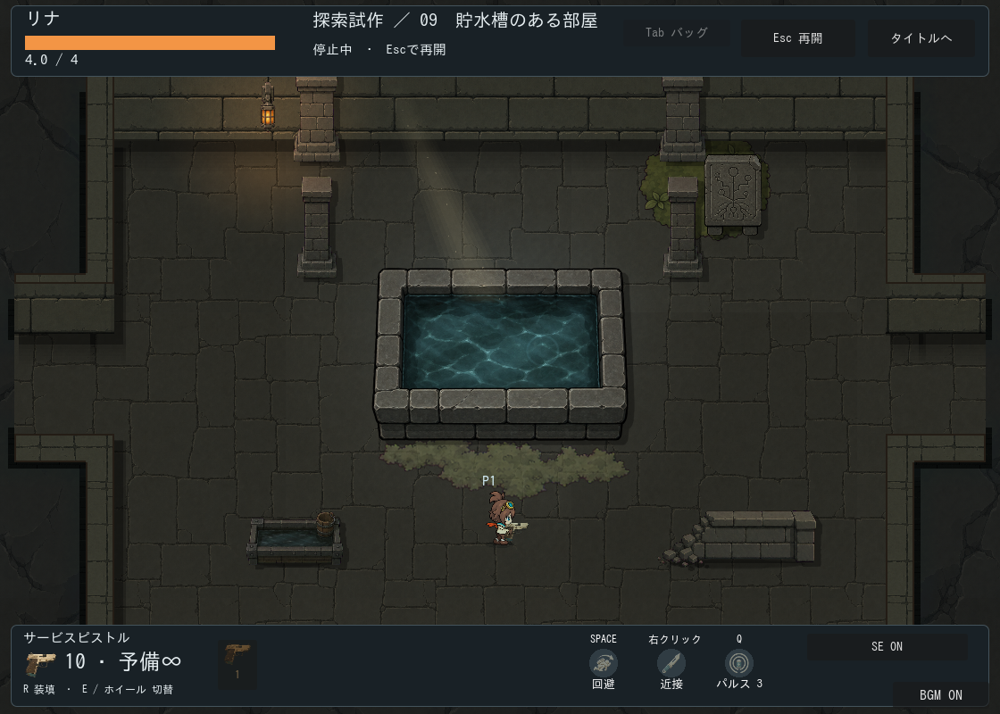

## 本編接続（2026-09-29）

状態: 20種類の候補をストーリーのランダム抽選へ接続済み。既存素材・視点・縮尺・壁・家具配置は再利用。production_floor が見学マップを本編へ変換し、寄り道2室を宝箱部屋、終端を既存ボス専用広間へ置換する。装飾箱 back_relic / last_coffer / cell_hidden_coffer / secret_coffer は本編だけ除外し、実報酬箱との重複を防ぐ。新規素材・派生画像生成なし。

自動確認: 10 seed・76戦の生成/敵配置/全滅、seed 27の25扉遷移・再訪・宝箱開封・ボス報酬取得・踏破PASS。通常倍率の制作画像は従来のものを継続使用し、今回の接続後画像は未撮影。本編全室の戦闘難度・射線・回避・探索テンポの手動確認は未完了。下の制作過程にある「本編未接続」は当時の状態。

区分: 制作記録（試作）。状態: 既存4室に16室を加えた20室の巡回プレビューを実装。回廊はユーザーが実機で確認し「いい感じ」と評価。追加室の採用と敵入り実戦は未確認。本編戦闘階層の抽選には未接続。最新仕様は直下のランダムマップ節と20室節、以前の再設計・生成の経緯は後半。[当初の部屋構成案](../../../planning/EXPLORATION_DESIGN.md#手作りの部屋構成を増やす案2026-09-27)。
依頼: ユーザー「作り込んだ部屋を3〜4つ試作してください」。経緯: Enter the Gungeon のような「あらかじめ作り込んだ部屋を並べる」方式の検討。今の部屋は「形が四角の組み合わせだけ」「家具は北壁沿いと隅だけ」「部屋ごとの見せ場がない」「中央が平らに空いている」ため殺風景に見える（Claudeの分析）。
関連: [旧鋳造区 v2](../ashen-foundry-v2/README.md)（素材）、[世界観と階層案 10章](../../../planning/WORLD_AND_DUNGEON_CONCEPT.md#10-検討中のアイデア2026-09-27claude提案未採用)（第1層「根絡みの遺跡」、検討中）、[ステージ制作テンプレート](../../STAGE_CREATION_TEMPLATE.md)

[制作指示の索引](../README.md)

## 部屋を使うランダムマップ（2026-09-28、独立見学モードへ適用）

状態：実装・自動歩行・画像確認済み。ユーザー「検討し、適用してください」を受け、20室の部品を役割に応じて選び、分岐・曲がり・行き止まりを持つ9〜14室の敵なしマップを生成する。本編の戦闘階層を置き換えるものではない。

|仕様|実装|
|---|---|
|生成|[authored_floor.gd](../../../../scripts/game/authored_floor.gd)。生成版4（2026-09-30、下の節）、専用seed RNG。入口から任意の方向へ出る主経路6〜8室が2〜3回曲がり、前室と最奥へ続く。寄り道は主経路と既存の寄り道の両方から1〜3室ずつ伸び、途中で曲がる。総数15〜18室、分岐点4〜6。半数の階層は主経路への距離を縮めない合流路を1本持つ。既に占有されたセルへ配置しない|
|入口・分岐|入口は野営跡。開口は各壁の中央で、部屋の絵を回転しない。部屋ごとの許可開口は下の「開口の追加」表。実際の接続確定後、適合する候補の使用数が少ないものを優先し、隣接同種を禁止する。列柱は北口がある場合のみ中央の壁際控え柱を省く|
|通常室|戦闘用13種（野営跡を除く12種を抽選）から、接続に合うものを選ぶ。通過・曲がり・分岐・行き止まりの区別は形からは決めない|
|寄り道終点|行き止まりのうち2室。収蔵庫・記録室・保管区画・脇室・礼拝室・展望室から、入口の向きに合うものを選ぶ。他の行き止まりは通常室。箱等は美術見本|
|前室・最奥|前室は主経路の最後。西・東・南のいずれかから入り、北口が必ず最奥の南口へつながる。開口用の前室では閉鎖門の絵・衝突を置かず、支持柱を残した開いた門口を使う。最奥は根の広間を仮使用。ボスは配置せず往復可能|
|縮尺・素材|通常1.2倍・人物固定。画像回転なし、既存の壁・柱・敷居を流用。追加生成なし。扉葉の開閉演出には開いた扉の素材が別途必要|
|保管区画・脇室|現行は1440×800、左右入口はy560。南側の空き床を削減。保管区画は箱の足元1190,210。低壁は移動を誘導するもので、視界を遮断する仕組みではない。左右の到着位置から全画面外、1190,300へ寄ると箱を確認できる|
|表示と操作|20室一覧の「ランダムマップ」、または `authored_map_preview.tscn`。WASD/Space、扉に近づいてF、Mで訪問済み＋隣接室の地図。「別のマップ」でseed+1、進行はリセット。20室一覧へ戻れる|

既存の20室一覧は閉鎖門を含む比較用の西東巡回として維持。ランダム見学用の役割データは戦闘用の役割と分離し、最奥から出ても踏破終了させない。固定拾得物・戦闘報酬は出さない。

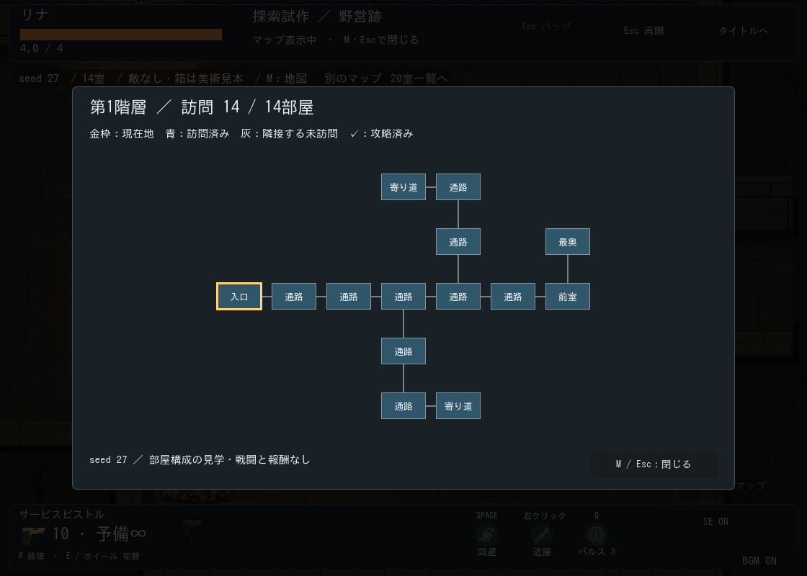

確認画像：[分岐の列柱](views/random-colonnade.png)、[曲がりの中庭](views/random-courtyard.png)、[北へ進める前室](views/random-antechamber.png)、[保管区画の西入口](views/storage-entry-west.png)、[東入口](views/storage-entry-east.png)、[小室での発見](views/storage-discovery.png)。[撮影ツール](../../../../tools/capture_authored_map.gd)。原本は既存素材のまま、派生は配置・開口定義のみ。

検証：124開口構成の到達性、40seedの分岐マップ（相互扉・方角・非重複・役割・再現性）、3seedの全接続を両方向へ歩く62遷移、地図開閉と最奥からの帰路、保管区画の入口／発見時の画面範囲。部屋の孤立領域・旧2室の移動も確認。詳細コマンドはTESTING。既知のuser://ログ・証明書・shader cacheの環境警告あり。

未確認／後続：ユーザー試遊、敵入りの戦闘・報酬、ボス専用室の制作、本編抽選への採用、ループ経路。現時点の生成は木構造であり、全ての間取りが任意方向へ接続できるわけではない。

## 20室への展開（2026-09-27、生成・実装・自動巡回確認済み）

ユーザー「生成をお願いします。そして、部屋の作成をお願いします」により、提案20種類を独立した敵なし巡回シーンへ制作する。本編抽選・戦闘編成・宝箱報酬・隠し壁破壊は今回の制作範囲に含めない。隠された脇室は曲がった接近路の奥に見つける空間として制作し、壁破壊機能は持たない。

仕様：既存と同じ強い見下ろし正投影、人物縮尺固定、通常1.2倍。石造遺跡を基調に、光庭・水・生活痕・遠景を追加。20室は西東の扉で往復、既存4室は維持。追加室は西東の開口だけを受入対象とする。北南の開口対応を無条件に保証しない。新規の内壁も接合隠しの柱を足さず、独立した低壁はYソートする置物で構成する。

|生成するシート／画像|内容・用途|ゲーム内寸法・原点・接続|
|---|---|---|
|ruin-architecture-v1（透過2×2）|貯水槽・祭壇・倒れた大門・展示台|幅220〜290／110／240／52px、足元中央。低い石材は床の占有部分を判定。壁への焼き込みなし|
|ruin-discovery-v1（透過2×2）|生物の巣・記録石板・木の補修支柱・脱皮殻と擦過痕|幅150／130／70／160px。巣と痕跡は床、石板と支柱は足元中央|
|ruin-nature-v1（透過2×2）|土と根の床境界・床から出る根・散った紙と道具・小さな遺物入り箱|幅220／200／100／65px。土と生活痕は床デカール、根と箱には独立判定|
|ruin-depth-v1（遠景）|地底の巨大な根と遠い遺跡|展望室北側の非歩行領域、低コントラスト。歩行床・手すり・室外の前後を分離|

原本はassets/generated、実行用コピーとAtlasTextureはassets/stages/ashen-foundry-v2/exploration-kitへ保存する。原本の画素は加工せず、実画像を見て抽出領域を決める。内蔵image_gen、4画像を初回の生成範囲とする。プロンプト・実寸・ハッシュ・抽出レシピを台帳へ残す。費用・モデルが返らない場合は不明とする。

受入：20室の接続・到達性・孤立領域・出入口と家具の干渉、通常倍率と全体画像、前後関係を確認。各室の敵との実戦・ユーザー採用は別扱い。

### 生成結果・原本と派生

- 内蔵image_genを4回実行。透過シート3枚は各1254×1254（指定1536×1536）、遠景は1774×887（指定1536×768）。透過はGodotのalpha検出で確認。生成モデル・費用・usageは返却されず不明。CLI/APIの台帳や設定は変更していない。
- 原本とプロンプト・SHA-256：[建築PNG](../../../../assets/generated/ruin-architecture-v1.png)／[JSON](../../../../assets/generated/ruin-architecture-v1.json)、[発見PNG](../../../../assets/generated/ruin-discovery-v1.png)／[JSON](../../../../assets/generated/ruin-discovery-v1.json)、[自然PNG](../../../../assets/generated/ruin-nature-v1.png)／[JSON](../../../../assets/generated/ruin-nature-v1.json)、[遠景PNG](../../../../assets/generated/ruin-depth-v1.png)／[JSON](../../../../assets/generated/ruin-depth-v1.json)。建築・発見・自然は既存pillar.pngを画風の参照に使用。
- 実行用コピーは `assets/stages/ashen-foundry-v2/exploration-kit/`。原本とのSHA-256一致を4枚とも確認。画像画素は変更しない。
- [再構築ツール](../../../../tools/build_exploration_kit.gd)で12個の透過AtlasTextureと遠景1個を作る。均等な区画ではなく目視した分離範囲からalpha≥0.1の輪郭を取り、2px余白。内側の抽出境界に絵が触れていないことも検査。[実寸と抽出領域](../../../../assets/stages/ashen-foundry-v2/exploration-kit/regions.json)。
- 配置レシピは[既存4室](../../../../scripts/world/authored_rooms.gd)と[追加16室](../../../../scripts/world/authored_rooms_expansion.gd)。足元中央・画像比率維持。低い新素材は表示高94%と幅92%を基本判定にし、柱・石板・支柱は足元帯、根は段違いの矩形、薄い紙・土・脱皮殻は踏める床装飾。巣は障害物。
- 現行の展望室v3の下層画像は800×400pxで比率を維持し、非歩行領域(320,128,800,400)に表示。北壁から続く左右の石積みと、手前の連続欄干で縁を覆う。旧遠景は保存のみ。貯水槽は水中へ入れない置物。落下・水泳・水の減速などの新ルールはなし。

### 20室の仕様と確認画像

西東の扉で表の順に巡回し、20→1へつながる。左上の部屋選択でも直接移動できる。新規16室の単位は室ごとの構成であり、全てが本編戦闘へ接続された部屋ではない。箱・石板・痕跡は美術見本で、調査や開封の操作は持たない。

|番号・ID／名称|寸法|元用途・主役・歩く経路|通常倍率|
|---|---|---|---|
|01 collapsed_gallery／崩れた回廊|1120×800|柱列を支えた中央梁の崩落、北南の迂回|[画像](views/01-collapsed_gallery-detail.png)|
|02 casting_line／鋳造の作業列|1440×960|鋳込み→冷却→仕上げの設備区画、作業列の間を移動|[画像](views/02-casting_line-detail.png)|
|03 camp_remains／野営跡|1120×800|壁陰の生活区画と外側の通り道|[画像](views/03-camp_remains-detail.png)|
|04 root_hall／根の広間|1440×960|西から進む根の帯、広い南側の迂回|[画像](views/04-root_hall-detail.png)|
|05 colonnade／列柱の広間|1120×800|二列の支柱と欠損した南中央柱、中央射線と横断|[画像](views/05-colonnade-detail.png)|
|06 courtyard／天井の抜けた中庭|1120×800|周縁の土・根と採光、中央は開放|[画像](views/06-courtyard-detail.png)|
|07 twin_halls／食い違う双広間|1440×960|二つの石造区画、二か所の開口で乗り換える|[画像](views/07-twin_halls-detail.png)|
|08 loading_bay／荷捌き場|1440×960|受入荷物→仮置き→出荷、ずれた荷物列と横断路|[画像](views/08-loading_bay-detail.png)|
|09 cistern／貯水槽のある部屋|1120×800|中央の水槽、四辺を周回|[画像](views/09-cistern-detail.png)|
|10 guard_post／見張り詰所|1120×800|食い違う胸壁と奥の控え区画、南北から回り込む|[画像](views/10-guard_post-detail.png)|
|11 fallen_gate／崩れた大門の間|1120×800|大門の支持点と倒れた二枚の扉、側方の通路|[画像](views/11-fallen_gate-detail.png)|
|12 vault／収蔵庫|1120×800|空の台座列と残った小箱、列の間を探す|[画像](views/12-vault-detail.png)|
|13 chapel／礼拝室|1120×800|北の祭壇・石碑、左右の祈りの石台と中央の接近路|[画像](views/13-chapel-detail.png)|
|14 storage_cells／小室が並ぶ保管区画|1440×800|石壁で分けた北の三小室、広い点検通路|[画像](views/14-storage_cells-detail.png)|
|15 beast_nest／生き物の巣|1120×800|持ち去られた寝具・道具から、根に囲まれた巣へ|[画像](views/15-beast_nest-detail.png)|
|16 archive／埋もれた記録室|1120×800|記録石板・読書台・崩落区画、残る記録へ近づく|[画像](views/16-archive-detail.png)|
|17 repair_room／補修された小部屋|1120×800|石壁の木製補強、道具と寝床の二つの区画|[画像](views/17-repair_room-detail.png)|
|18 secret_room／隠された脇室|1440×800|入口の画面外にある小箱、痕跡を追って低い壁を回り込む脇区画|[画像](views/18-secret_room-detail.png)|
|19 overlook／地底を望む展望室|1440×960|非歩行の遠景と手前の腰壁、南の観測作業スペース|[画像](views/19-overlook-detail.png)|
|20 antechamber／主の痕跡が残る前室|1120×800|北の塞がれた入口へ続く脱皮殻、手前に準備余白|[画像](views/20-antechamber-detail.png)|

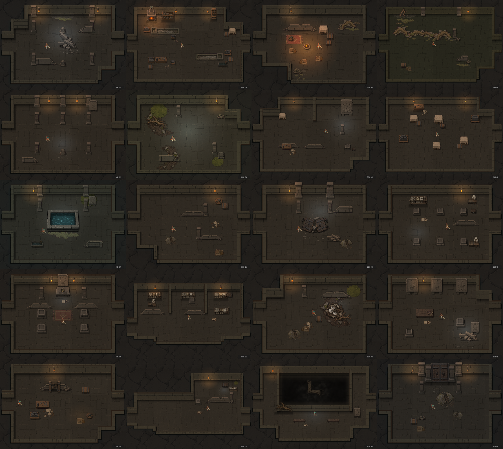

### 確認済み・未確認

- `tests/authored_rooms.gd`：20室の部屋・相互扉、入口、全域到達性、16px格子の孤立領域、家具の足元と壁の干渉、回廊の64px通行帯と直進不可、貯水槽・遠景への進入不可、展望側の通路。PASS。
- `tests/authored_rooms_tour.gd`：探索した経路を実際の `Arena.move_fighter` で4px刻みに歩行。東回り・西回りの全室、40回の実際の扉遷移、20件の部屋選択。PASS。これは自動操作であり人の試遊ではない。
- 全室の全体・通常倍率の画像、当たり判定画像を保存。全体比較と新規素材の主要室を目視確認。台座の後ろに隠れた箱、部屋選択の既存HUDとの重なり、水槽の画像と判定のずれを修正。
- 画像再構築と最終の部屋検証・巡回にスクリプトエラー／assert失敗なし。環境の証明書・userディレクトリ・shader/editor cache書込の警告は残る。巡回の終了時にObjectDB 2件の解放警告が出た実行もあり、無警告の終了は保証しない。
- 回帰検証 `stage_templates` / `exploration_rooms` もPASS。後者の古いカメラ等倍の期待値を現行の `ExplorationCamera.zoom()` に合わせ、通常2室の20回往復・資源維持・入力解除・再開を確認。ゲームのカメラ挙動は変更していない。
- 原画の床目地が混ざる `worn_path` は新規室で使わず、荷捌き場の擦れは既存の床描画で付加。全室撮影後の局所更新は `capture_authored_rooms.gd -- --only=loading_bay` のように指定できる（一覧は保存済みの全室画像から再構築）。
- 未確認：追加16室のユーザー採用、敵入りの射線・回避・追跡、全家具の奥／横／手前を手動で歩く確認。本編のランダム抽選への接続、報酬・調査・隠し壁発見の機能は未実装。

## 崩落の配置・接地の仕上げ（2026-09-27、実装・自動移動・静止画確認済み）

レビューの「縦に分かれた瓦礫」「落下地点の弱さ」「新素材の明るい縁」を修正。対象は回廊一室。柱列・部屋寸法・二つの迂回路は維持する。

- 柱身を(584,376)、梁を(600,440)へ配置し、北柱脚から南東へ崩れ、柱片と梁が重なる構成に変更。当たり判定の矩形も各素材に追従する。
- 接地影は柱身のローカル矩形(-34,-53,68,40)、梁(-70,-48,139,40)。画像最下端の細い影から、石材が床を占める範囲へ合わせた。専用素材のRGB tintは柱脚(.90,.93,.96)、柱身・梁・小破片(.88,.92,.96)。照明は維持。
- 床模様を含まない既存 `floor_crack.png` を柱身下(582,321)、梁下(612,420)へ集中。幅104/184px、alpha .72/.78。広い `pebbles_b` の帯を除き、小破片64pxを(643,462)、小石72pxを(590,457)へ配置。南柱脚は74pxの亀裂だけを残す。
- 原本・アトラスのピクセルと抽出領域は変更せず、追加生成なし。派生レシピは `scripts/world/authored_rooms.gd` の位置・影・色・床装飾。現状の浅い亀裂は既存素材で表現できる。床の陥没や下地の露出を描く場合には専用素材が必要で、今回は未制作。
- `authored_rooms` PASS。北の確認経路をx=640から650へ10px移し、人物半径14px・中心線と左右18pxの線分検査を維持。北南の通行帯、直進不可、入口・全域到達性・孤立地点を再確認。
- 描画ありの撮影で本編移動判定による両経路の往復・直線射線遮断がPASS。通常倍率と当たり判定画像を更新し、柱片と梁の重なり、接地と破片の広がりを目視確認。証明書・キャッシュ・userディレクトリの環境エラーは残るが、最終検証にスクリプトエラー・assert失敗なし。
- 未確認：手動操作、敵入りの戦闘、ユーザー採用。下の専用素材生成時・建築再設計時の検証履歴とは区別する。

## 崩落専用素材（2026-09-27、生成・組み込み・静止画確認済み）

ユーザー「生成してよいです」により、不足する崩落素材を制作する。内蔵画像生成を使用し、既存CLIの設定・API台帳は変更しない。1枚の透過2×2アトラスとして柱基部・倒れた柱身・梁と屋根石の崩落・小破片を発注。[生成指示](prompt-collapse-kit.txt)。参照は既存の `pillar.png`・`wall_segment_mid.png`・回廊全体画像。

|セル|用途・不足理由|表示幅の目安・基準|
|---|---|---|
|左上|折れた角柱の基部。中央柱があった証拠が必要|48px、足元中央、低い石の上面まで判定|
|右上|倒れた同じ角柱の柱身。既存の小石では柱の残骸に見えない|112px、足元中央、実際のシルエットに沿う判定|
|左下|大きな梁と屋根石の崩落。同じ瓦礫山3個の反復を置換|172px、足元中央、通路を遮り北南の迂回幅を保持|
|右下|主役の破断から外へ散る小破片|85px、床装飾、踏める細かい破片のみ|

原本を `assets/generated/gallery-collapse-kit-v1.png` に保存し、セルの透過境界からAtlasTextureを作る。原本のピクセルは変更しない。生成済み・Godot認識・本編移動判定・通常倍率の目視・ユーザー採用を分けて記録する。

### 生成結果と実装

- 内蔵 `image_gen` を1回実行。追加候補・再生成なし。原画は1254×1254のRGBA透過PNG（指定は1024×1024、出力実寸は異なる）。費用・モデル名・usageはツールから提供されないため推測せず、[原画と同名JSON](../../../../assets/generated/gallery-collapse-kit-v1.json) に不明と記録。既存CLIの使用量台帳とは別扱い。
- [原画](../../../../assets/generated/gallery-collapse-kit-v1.png) とゲーム用 `assets/stages/ashen-foundry-v2/gallery-collapse/atlas.png` はSHA-256一致。`7856dfdd9345d40e288f2166fa3f52e0353cd320b94c69ae8e54a772d9d86a8c`。
- 実画像のセル位置が均等2×2ではなかったため、固定グリッドで切らず、alpha≥0.1の輪郭に2px余白を加えた範囲を使用。[再構築ツール](../../../../tools/build_gallery_collapse_atlas.gd) は4つの `.tres`（AtlasTexture、filter_clip=true）だけを作る。画像ピクセルや透過色は加工しない。
- 表示: 基部64px×2（周辺の欠片を除く基壇本体は既存柱の幅に合わせる）、柱身112px、梁・屋根石172px。北基部(560,296)、南基部(560,590)。両基部の軸を残存する左右の柱列と合わせる。柱身・梁の最新位置と小破片の幅は上の仕上げ節を参照。
- 同じ瓦礫山3個を撤去して、倒れた柱身と梁の塊に置換。低い物として段違いの矩形3個ずつで主要な石の占有範囲を止め、透明な四隅は塞がない。小破片は踏める床装飾。
- Godotの画像インポートとAtlasTexture読込、`authored_rooms` の部屋検証・孤立地点・64px迂回路・直進不可がPASS。描画ありの撮影でも本編移動判定で北/南の両経路を往復、直線射線の遮断がPASS。通常倍率で基部・柱身・梁の尺度、原画の背景が残っていないこと、以前の瓦礫山の反復がなくなったことを目視確認。
- 最新画像は `views/01-collapsed_gallery-{overview,detail}.png` と `collisions/01-collapsed_gallery.png`。手動操作、敵入りの戦闘、ユーザー採用は未確認。環境由来の証明書/キャッシュ書込警告は残る。
- 関連3本 `stage_templates` / `ashen_foundry` / `four_way_rooms` もPASS。最後の2本では終了時のObjectDB/Resource警告あり。動作アサーション成功と無警告での終了は区別する。素材読込・描画・経路検証に `SCRIPT ERROR` / `Assertion failed` はなし。

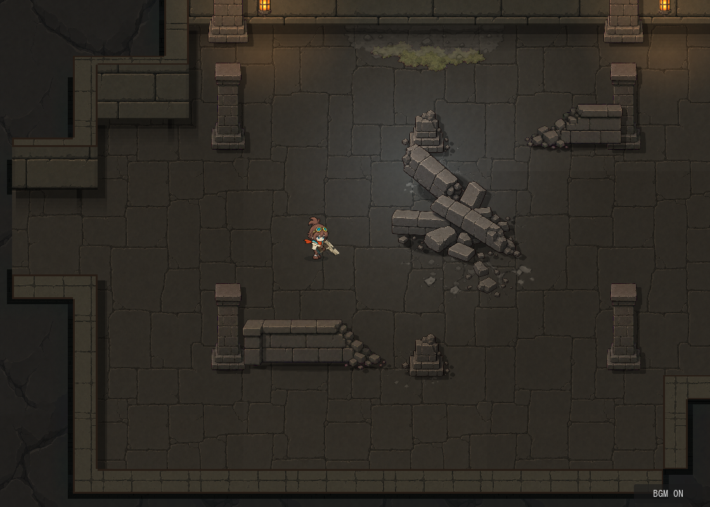

## 回廊の建築・経路の再設計（2026-09-27、実装・自動移動・描画確認済み）

直前のレビューを受け、今回は崩れた回廊一室を対象にする。下の「現在の刷新仕様」の回廊部分を本節で置換する。

|項目|制作仕様|
|---|---|
|元の建築|三つの柱軸（x=300/560/820）、北・南二列の支柱に沿う東西の石造回廊。中央の支柱と天井の一部が崩壊。北側は大きな落石、南側は支柱の残骸だけが残る|
|寸法・入口|1120×800。東西は既存の幅112px、部屋中央y=400。四方向の入口余白を確保。カメラ1.2倍、人物の縮尺は維持|
|歩く体験|西入口→中央の崩壊を見る→北側の明るい通路か南側の壁沿いに迂回→東出口。東西直進は落石で止まるが、二経路を残す|
|崩壊|欠けた北中央の柱位置から大きな落石が通路へ広がり、小石と床のひびが外へ続く。孤立した壁の穴と根は撤去|
|素材|既存の柱46px、壁断片、小石・ひび・煤・壁灯を流用。中央の崩落は上の専用素材節が最新|
|照明|北中央は崩れた天井からの淡い寒色光、東側の壁灯は暖色。床・壁・家具に同じ環境光を適用|
|描画・衝突|支柱・壁断片は足元でYソート、低い瓦礫は上面まで判定。壁厚と上角・通路終端の面割当は共通のまま|
|受入|入口全域、孤立地点、直進不可、北/南両経路の有効幅、実描画の主役・継ぎ目・前後関係を確認。実戦とユーザー採用は別途|

### 実装と検証

- 横幅を1440→1120pxへ変更。北西と南東を切り欠いた輪郭にし、北の控え壁と室内の支柱を同じx軸に合わせた。北側y=292、南側y=582に支柱と腰壁が残り、中央x=560の柱間が損壊している。
- 北東の短い壁は130px、南西の壁は190px。崩れた端を中央へ、残っている端を柱へ向ける。柱は接合隠しの自動配置ではなく、元の建築の支持位置として配置。
- 中央は専用の倒れた柱身と梁・屋根石で障害物群を作る。東西の到着点（170,400）→（950,400）の直線を遮る。北側と南側に回り道を確保。既存の瓦礫山3個を組む案は置換済み。
- 北中央の光は崩れた天井からの明かりを想定した `PointLight2D`（半径245、強度0.48、寒色）。光源用の透明な2px表示と床の弱い光だまりはコードで定義し、原画は追加・変更していない。壁・床・物体への光の当たり方を同じ場面で確認。
- `tests/authored_rooms.gd`: 部屋検証・四方向の入口余白・全域到達性・孤立地点・壁との重なりに加え、直進不可と北/南の64px通行帯を確認。人物半径14px、経路中心と左右18pxの線分を検査する。PASS。
- `capture_authored_rooms.gd`: `Arena.move_fighter` で北/南の両経路をそれぞれ往復し、移動が妨げられないことと、直線の射線が遮られることを検証。手入力によるプレイ録画ではない。
- 通常倍率で壁の奥・手前、柱の奥を撮影。壁の奥では身体と武器が壁に隠れ、手前では人物が前に描かれることを目視確認。柱の奥では柱の幅の部分が隠れる（横へはみ出した武器は見える）。
- 関連検証: `stage_templates` / `connected_wall_surface` / `wall_junctions` / `four_way_rooms` / `exploration_floor` はすべてPASS。`authored_rooms` と合わせて6本。証明書ストア読込、shader cache書込、終了時ObjectDBの環境警告は残るが、最終実行の `SCRIPT ERROR` / `Assertion failed` はなし。
- 未確認: 手動操作での回避の感触、敵入りの戦闘、ユーザー採用。見えない天井の形や高さを描き起こしたものではなく、柱列・損壊・光から空間を示す試作。

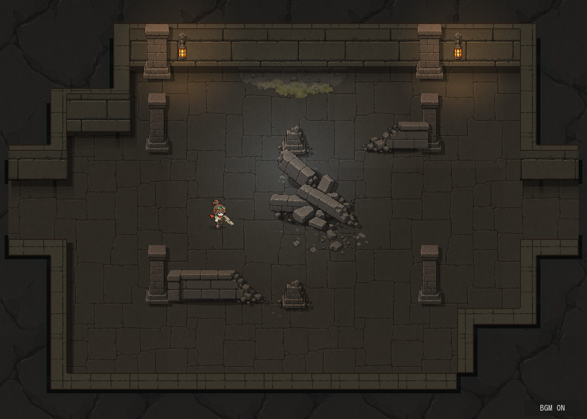

|通常倍率での確認|画像|
|---|---|
|入口側から崩落を見る|[通常倍率](views/01-collapsed_gallery-detail.png)|
|壁の奥に立つ|[壁の奥](views/01-gallery-wall-behind.png)|
|壁の手前に立つ|[壁の手前](views/01-gallery-wall-front.png)|
|柱の奥に立つ|[柱の奥](views/01-gallery-column-behind.png)|

## 現在の刷新仕様（2026-09-27、実装・静止画確認済み）

依頼: 「ステージとして見てて楽しい」「構造的にデザイン的に整合性のある部屋」。以下が今回の制作仕様。下の再レビュー1〜4は過去の修正記録であり、現在の配置は本節と確認画像を参照する。

|仕様|今回の範囲|
|---|---|
|対象|独立試作4部屋。四方向の入口余白・西東の接続を維持。回廊の最新寸法と配置は上の再設計節を参照|
|視点・縮尺|既存の正投影、通常カメラ1.2倍、リナの寸法固定。壁厚・正面高さ・面割当は既存方式|
|崩れた回廊|最新の建築・二経路の再設計は上の節を参照|
|鋳造の作業列|炉と鋳型棚のある鋳込み区画、独立した鋳造床、仕上げ台と材料置場。閉じた溝を連結水路として扱わない|
|野営跡|火・寝具・茶卓を近づけた生活区画、片側にまとめた物資、使われていない暗い遺跡部分|
|根の広間|西北側から中央へ伸びる侵食帯と、その南側を回り込む道。根・床割れ・苔・柱の損傷を同じ帯に集約|
|素材・原本|既存の `assets/stages/ashen-foundry-v2/props/` と床・壁を流用。原本は下記生成記録のまま。新規生成・画像の加工なし|
|派生レシピ|`scripts/world/authored_rooms.gd` の位置・幅・反転・色・照明。家具は足元基準、床の装飾は中心基準。画像比率を維持|
|使用素材|壁断片・瓦礫・小石・ひび、炉・鋳型棚・鋳造床・作業台・金床・冷却槽・木箱・パレット、火・寝具・絨毯・茶卓、埋まった根・苔・巣・柱、壁灯|
|受入|通常倍率で主役と物の関係が読めること。入口・移動・孤立地点・壁への重なりを検証。敵を入れた実戦とユーザー採用は別途|

### 配置と表示寸法

- 崩れた回廊: 上の「回廊の建築・経路の再設計」が最新。旧y=355の独立した壁断片と南側広場の案は置換済み。
- 鋳造の作業列: 北西の炉・鋳型棚・鋳造床、南東の鋳造床・冷却槽・製品、南西の作業台・金床・材料を区画としてまとめる。鋳造床は330/310pxの独立した砂型床として配置し、閉じた端同士を接続しない。炉には既存の壁接続煙道を表示。
- 野営跡: 壁断片を背に、絨毯・茶卓・焚き火・寝具を左寄りにまとめる。物資は右手前へ段違いに置く。東側に通り抜ける余白、北東は使われていない根と巣の区画。火の光源半径295px、環境光0.76/0.75/0.74。
- 根の広間: 北西の壁根→苔→西側の床根→中央の幹→柱の足元という侵食帯。根の表示幅220/350/220pxで、端の石と枝を重ねた段差状の連続。南側を回り込める。南東に切り欠きを追加し、その近くに旧壁断片。南西の荷物は探索者の痕跡。
- 壁断片は長300/中230/短145px、作業台134px、炉112px、柱46px、金床60pxを基準にした。キャラの大きさは変更していない。根・鋳造床は画像比率を維持し、既存の分割した当たり判定を位置に追従させる。
- 床全体の目地はテーマの `floor_wash`（0.24/0.225/0.19、不透明度0.12）で少し抑える。破片・煤は発生源の周囲だけに置く。`moss_cracks` は独自の床目地を含み、下の床と一致しないため今回使わない。

### 確認結果と未確認事項

- 自動検証: `authored_rooms`（部屋データ、画像読込、入口、到達性、16px格子の孤立地点、床置き物の足元と壁の重なり）PASS。関連7本 `stage_templates` / `connected_wall_surface` / `wall_junctions` / `four_way_rooms` / `exploration_floor` / `exploration_encounter` / `ashen_foundry` もPASS。
- 描画: `capture_authored_rooms.gd` で4部屋の全体と通常倍率を再撮影。`views/` は今回の配置。`capture_authored_collisions.gd` で `collisions/` も更新。以下の古いレビュー内の `views/`・`collisions/` リンクも最新画像を指す。`structure/` は再レビュー3〜4当時の局所確認画像。
- 目視（Codex）: 鋳造床の閉じた端の突き合わせを解消。作業台と材料・道具、火と寝具、根と苔の位置関係を確認。根の継ぎ目と壁断片の縮尺を撮影後に調整。物資の左右対称配置と床模様を含む苔を修正。
- 実行環境: 証明書ストアの読込エラー、描画時のshader cache書込エラー、`ashen_foundry` 終了時のObjectDB警告あり。テストのPASS・撮影成功と、環境ログが無警告であることは区別する。
- 未確認: 手動での歩行・回避の感触、敵と弾を入れた実戦、ユーザー採用。素材由来の根の縁の赤紫色、北壁の穴の断面・欠けの弱さは残る。外周は直交矩形であり、自然な崩落輪郭そのものの実装ではない。

## 初回試作の方針（履歴）

- 形・見せ場・遮蔽物・装飾を1部屋ずつ手で配置する。旧鋳造区 v2 の床・壁・家具・装飾を使い、足りない物だけ生成する。
- 現行の部屋の仕組み（`RoomTemplate`・`FieldDefinition`・配置データ）をそのまま使う。壁は格子に沿った矩形で、北向きの壁は正面が見える。
- **四方向の扉の通路は空けておく**（部屋の各辺の中央）。将来ランダム階層の抽選に入れても、どの向きの扉にも対応できるようにするため。
- 各部屋に「見せ場」を1つ、中央付近に戦闘の遮蔽物、壁の輪郭に不規則な変化（崩れ・くぼみ・根の割れ目）、灯りの明暗を入れる。
- 確認は専用の試作シーン（起動引数 `--stage-authored`）で、敵なしで歩き回れる形にする。

## 初回の4部屋の設計（履歴）

|部屋（仮称）|大きさ|見せ場|輪郭の変化|中央の遮蔽物|階層案との関係|
|---|---|---|---|---|---|
|崩れた回廊|1440×800|北壁の崩れた箇所から根が入り込む|北壁の一部が崩れて奥へ下がる。左右に崩れ残った壁の断片|瓦礫の山、崩れた壁の断片|第1層：根に割られた石造回廊|
|鋳造の作業列|1440×960|炉と鋳型棚の前に並ぶ鋳造の溝|北東の角を切り欠き|金床・資材箱・パレットの列（溝に沿った2列）|第1層の鋳造区の区画|
|野営跡|1120×800|焚き火を囲む寝具と荷物|南西の角を切り欠き|積み上げた木箱、布掛けの保管物|第1層：探索者の野営跡|
|根の広間|1440×960|床を這う太い根の幹が部屋を横切る|北壁・西壁から根が入り込む|根の幹、崩れた柱、瓦礫|第1層の根の侵食が最も強い部屋|

## 新しく必要な素材（生成1回、3列×2行）

|ID|用途|表示寸法の目安（ワールドpx）|
|---|---|---|
|rubble_large|瓦礫の山（遮蔽物、当たり判定あり）|幅110|
|rubble_small|崩れた石材の小山（輪郭の崩れ、壁際）|幅64|
|root_trunk|床を這う太い根の幹（遮蔽物）|幅220|
|campfire|石で囲んだ焚き火（灯り付き）|幅60|
|bedroll|丸めた寝具と背負い袋|幅72|
|casting_channel|床に彫られた鋳造の溝（床の装飾）|幅240|

## 結果（2026-09-27）

- 生成: 99件目、推定0.119ドル（gpt-image-2、high、1024×1024、1回）。参照は旧鋳造区 v2 の家具シートA・装飾シートA・床。指示 [prompt-setpieces.txt](prompt-setpieces.txt)。原本 `assets/generated/authored-setpieces-v1.png`。月間予算の残りは約8.6ドル。
- 切り出し: `tools/build_stage_v2_props.gd` にシートを追加し、`assets/stages/ashen-foundry-v2/props/` に瓦礫の山・小さな瓦礫・根の幹・焚き火・寝具・鋳造の溝を追加（既存22点は変更なし）。
- 部屋: [scripts/world/authored_rooms.gd](../../../../scripts/world/authored_rooms.gd)。部屋ごとの関数で、壁の断片（`wall_stub`）・角の切り欠き・床置き（`put`、足元と当たり判定の帯）・床の装飾（`flat`）・壁の根（`root`）・壁灯（`lamp`）を手で配置する。テーマは旧鋳造区 v2。根の広間だけ侵食の色付け。
- 遊び方: PowerShellで `& ".\.local\tools\Godot_v4.7.2-stable_win64.exe" --path . res://scenes/game/authored_rooms_preview.tscn`、またはエディターで `scenes/game/authored_rooms_preview.tscn` を開いてF6。敵なし、4部屋が西⇔東の扉で輪につながる（扉に近づいてF）。本編の探索画面へ入る経路では、起動コマンドの末尾に `-- --stage-authored` を付けても同じ部屋になる（引数単体では実行できない）。
- テスト: [tests/authored_rooms.gd](../../../../tests/authored_rooms.gd) — 生成された部屋と同じ検証（扉の対応・到着点）、全域への到達、配置データの検証、全画像の読み込み、**四方向の扉の通路（各辺の中央から100px内側まで）に当たり判定と壁の断片がないこと**。PASS。既存の `exploration_floor`・`four_way_rooms`・`stage_templates`・`collapsed_workshop`・`exploration_encounter`・`ashen_foundry` もPASS。

撮影: [tools/capture_authored_rooms.gd](../../../../tools/capture_authored_rooms.gd)。部屋ごとに全体（`views/NN-<ID>-overview.png`）と通常倍率（`-detail.png`）。

|部屋|全体|通常倍率|
|---|---|---|
|崩れた回廊|||
|鋳造の作業列|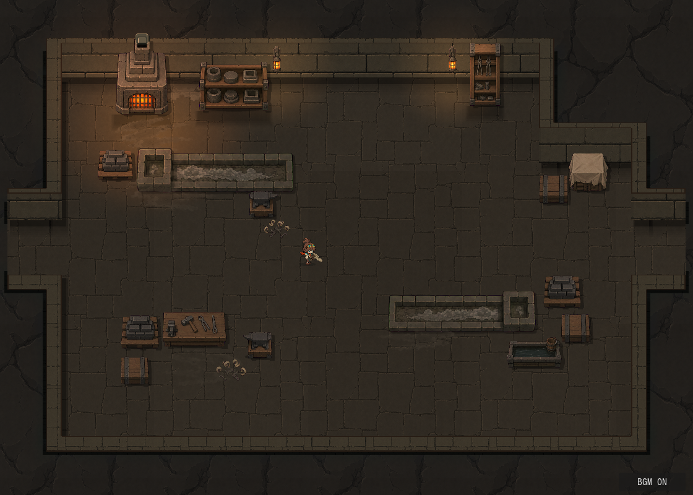|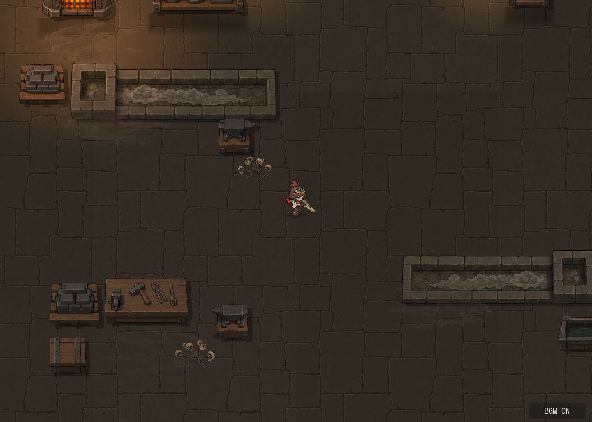|
|野営跡|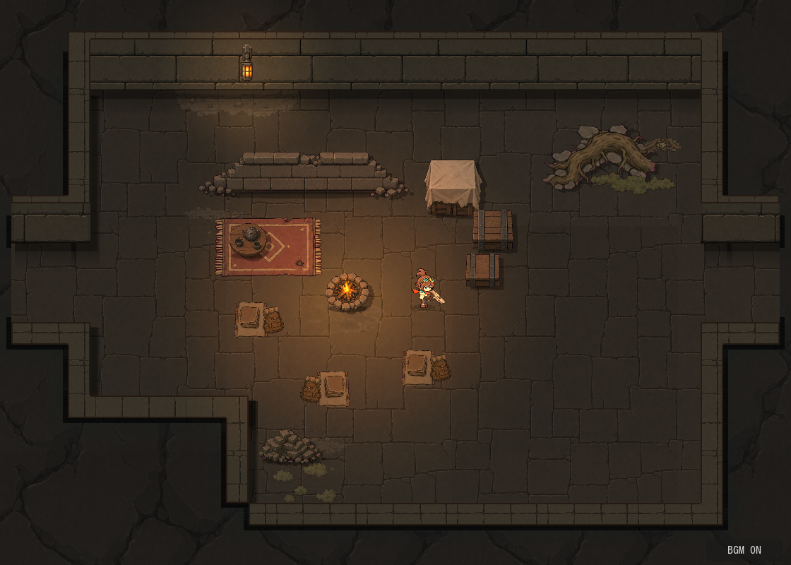|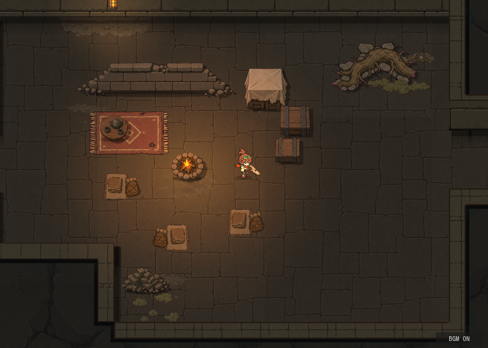|
|根の広間|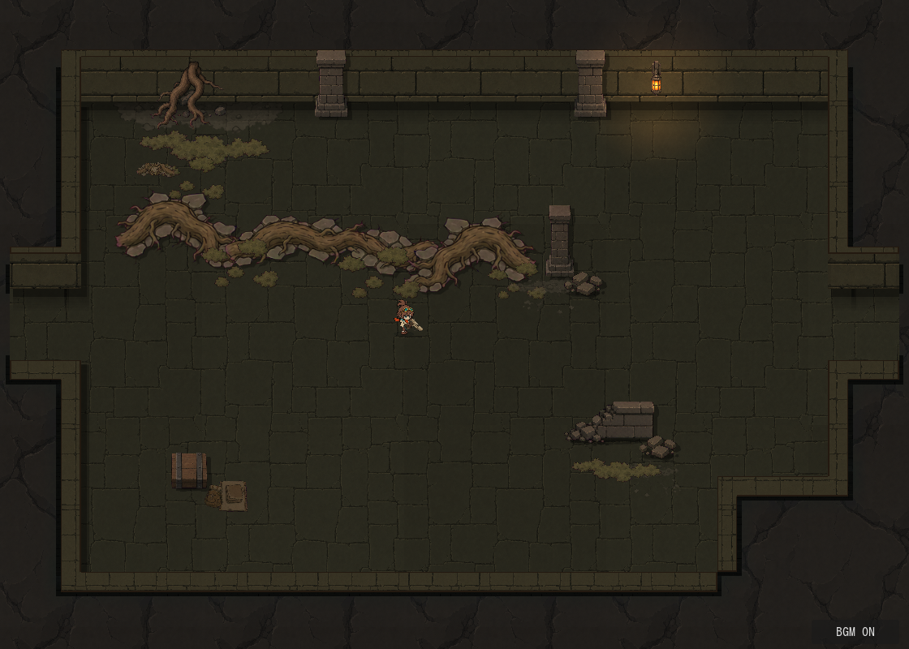|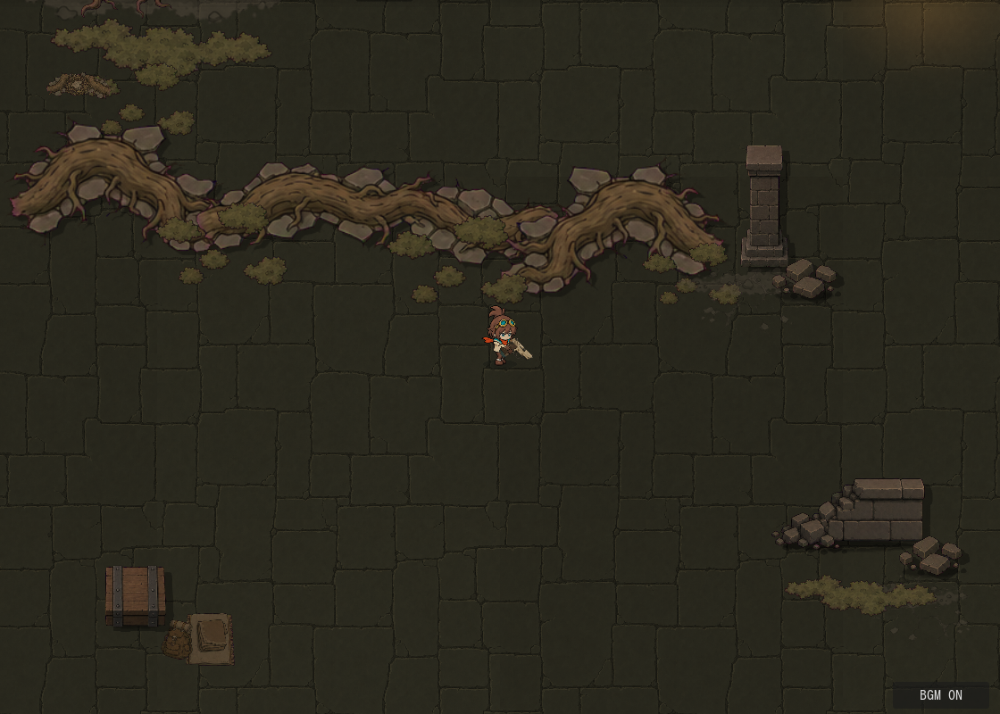|

### Claudeの評価（目視。ユーザー採用ではない）

- 4部屋とも、入った瞬間に「何の部屋か」が分かる見せ場がある（根が割り込んだ回廊、炉と鋳造の溝、焚き火と寝具、根の幹）。自動生成の部屋と比べて殺風景さは大きく減った。
- 中央付近に遮蔽物（瓦礫・壁の断片・金床と資材箱の列・根の幹）があり、戦い方が部屋ごとに変わりそう。
- 野営跡は焚き火の灯りで明暗の緩急が出た。
- 残る課題:
  - 外周はまだ直線と直角だけ（角の切り欠きで少し崩した程度）。壁そのものが崩れた形・根が壁を割る形は、壁の組み立てが矩形のため表現できていない。
  - 壁の断片は切り口がきれいすぎて、崩れた壁に見えにくい。
  - 根の幹は、脇の根が脚のように見え、這う生き物に見える可能性がある（通常倍率では丸太と読める）。
  - 鋳造の作業列は、溝の間の中央がやや空いている。
- 未確認: 敵を入れた実戦での遮蔽物の効き方、ユーザーの評価、ランダム階層に混ぜたときの見え方。

### 次の判断

- 手作りの部屋を主役にするか（今回の4部屋を実際に歩いて比較する）。
- 採用する場合: 部屋をGodotのエディター上で配置できる形（シーンやリソース）にするか、今回のようなスクリプトで書くか。ランダム階層の抽選に混ぜる仕組み。第1層の必要部屋数（通常の戦闘部屋8〜12を目安）。

## Claudeのデザインレビュー（2026-09-27、ユーザー依頼「不自然な部分・不十分な部分、ステージのデザイン美も加味して」）

通常倍率で14か所を撮影して確認（`.local/authored-review/`、Git管理外。撮影スクリプトは使い捨て）。

### 画面全体の美観

1. **物が床に置かれた「シール」に見える**: 家具・瓦礫・根・苔が、何もない床に等間隔の島として置かれている。物の根元に土や小石の散らばり、ひび、汚れがなく、床とつながっていない。物どうしが重ならず、まとまり（群れ）がない。
2. **同じ素材の繰り返しが目立つ**: 苔（同じ丸い形）・巣・瓦礫・鋳造の溝（左端に水槽がある向きがすべて同じ）が、反転も大きさの差もなく並ぶ。
3. **壁が単調で、部屋が黒い虚空に浮いている**: 北壁は同じ石積みの帯が端まで続き、柱・くぼみ・傷みがない。部屋の外は真っ黒で、切り欠いた角がそのまま「図形を切り取った形」に見える（機械的な印象の主因）。
4. **明暗の緩急が弱い**: 全体が均一に明るく、灯りのまわりだけが少し明るい。暗い隅や光だまりがないため、奥行きと雰囲気が出ない。焚き火のある野営跡だけ、明暗が効いている。
5. **床に区画がない**: 全面が同じ敷石で、通り道のすり減り、扉の前の敷石の違い、壁際の汚れなどの「使われ方」が見えない。

### 部屋ごとの不自然さ

- **崩れた回廊**: 室内の壁の断片が、端のきれいな完全な壁に見える（崩れた切り口・落ちた石材がない）。瓦礫が断片の横に離れて置かれている。「崩れた角」も、外周がまっすぐな段差の壁で、崩れて見えない。
- **鋳造の作業列**: 鋳造の溝が炉とつながっておらず、部屋の中央に理由なく並ぶ。炉の前の灰が、薄い縁取りのある「しみ」に見える。削り屑が何もない床に浮いている。
- **野営跡**: 寝具3つが焚き火を中心にきっちり等間隔で、機械的。敷物が野営から離れた場所に単独で敷かれている。崩れた角の瓦礫が、まっすぐな壁の前に置かれているだけ。
- **根の広間**: 根の幹の脇の根が脚に見え、這う生き物に見える。影が幹の下で離れた楕円になり、浮いて見える。巣が部屋の中央の開けた床に置かれている（巣は隅や根の陰にあるのが自然）。苔の緑が鮮やかで、床から浮く。
- **扉（全部屋）**: 開口は壁の切れ目と縦長の敷居だけで、出口としての格（枠・柱・段差）がない。

### 必要な素材（生成、目安4回・約0.5ドル）

|シート|内容|直す問題|
|---|---|---|
|壁の変化|崩れた壁の穴（石材がこぼれる）、壁から張り出す柱（控え壁）、壁のくぼみ、根が壁を割って出る部分（石材の割れ付き）、崩れた壁の端（切り口）|3、崩れた回廊|
|床のなじませ|壁際の土と汚れの帯、小石と砂の散らばり（複数）、放射状のひび、すり減った通り道、煤の筋（しみではない形）|1、5、鋳造の作業列|
|根と苔の作り直し|床に半分埋まった根の幹（脚に見えない形、周りの床のひび付き）、形の違う苔3種（彩度控えめ）、隅に置く巣|2、根の広間|
|扉と部屋の外|石の扉枠（両脇の柱と敷石）、部屋の外に見える暗い岩盤の地模様|3、扉|

### 生成なしで直せるもの（コード・配置）

- 配置に左右反転と大きさの差を入れる（`StagePlacement` に反転の設定を追加）。同じ素材の繰り返しを減らす。
- 部屋全体を少し暗くし（環境光）、灯りと焚き火の光だまりを強める。壁の根元に暗い帯（接地の陰）を描く。
- 配置の見直し: 鋳造の溝を炉から伸びる流れにする、野営を非対称にして敷物を野営の下へ、巣を隅と根の陰へ、瓦礫を壁の断片の端に重ねる、根の幹の影を幹の真下に密着させる。
- 苔の色付けを落ち着かせる。

## レビュー後の作り直し（2026-09-27、ユーザー「その順番で進めてください」）

### 1. 生成なしの直し（実施済み）

- `StagePlacement.flip_h`（左右反転）を追加し、`stage_prop.gd`（床置き・壁の根）と `workshop_floor.gd`（床の装飾。床の範囲で切り取った部分も正しく反転）で描画する。
- 試作の部屋は床だけ暗くし（明るさ0.68倍）、灯り・炉・焚き火の下に暖色の光だまり（放射状のグラデーション、床の装飾として描く）を置く。キャラ・敵は暗くならない。
- 配置の見直し: 鋳造の溝を炉の脇の水槽から東へ続く1本の流れに、野営は非対称にして敷物を茶の卓の下へ、巣を隅へ、瓦礫を壁の断片の端に重ねる、根の幹の接地影を幹の下へ上げる（`shadow_lift`）、同じ素材に反転と大きさの差、苔の色付けを落ち着かせる。

### 2. 素材の生成（4回）

|シート|内容|
|---|---|
|壁の変化（3列×2行）|壁の崩れた穴、控え壁（張り出した柱）、壁のくぼみ、根が壁を割って出る部分、崩れた壁の端、扉の脇の石柱|
|床のなじませ（3列×2行）|壁際の土と汚れの帯、小石の散らばり2種、床のひび、すり減った通り道、煤の筋|
|根と苔（3列×2行）|床に半分埋まった根2種（脚に見えない形）、形の違う苔3種、根元の巣|
|部屋の外の岩盤（1枚）|部屋の外（今は黒一色）に敷く、暗い岩盤の継ぎ目なしの地模様|

### 2. 素材の生成と組み込みの結果（2026-09-27）

- 生成: 100〜103件目、計約0.47ドル（各1回、gpt-image-2、high、1024×1024）。月間予算の残りは約8.2ドル。
  - 壁の変化 `authored-walls-v1`（崩れた穴・控え壁・くぼみ・壁を割る根・崩れた壁の端・扉の脇の石柱）。指示 [prompt-walls.txt](prompt-walls.txt)。参照は v2 の壁の正面・家具シートB・本編の北壁の撮影。
  - 床のなじませ `authored-floor-blend-v1`（壁際の土・小石2種・ひび・すり減った通り道・煤の筋）。指示 [prompt-floor-blend.txt](prompt-floor-blend.txt)。
  - 根と苔 `authored-roots-moss-v1`（床に半分埋まった根2種・苔3種・根元の巣）。指示 [prompt-roots-moss.txt](prompt-roots-moss.txt)。
  - 部屋の外の岩盤 `authored-exterior-rock-v1`（継ぎ目なし）。指示 [prompt-exterior-rock.txt](prompt-exterior-rock.txt)。
- 切り出し（`build_stage_v2_props.gd`）: 小さな破片（こぼれた石材・小石）は、40px以内の最も近い大きな形に付ける方式に変更（控え壁の破片が隣のマスに入った問題の修正）。床のなじませのシートは縁がぼけているため、マゼンタを透明度として分離し、縁の色を内側の色で置き換え、最後に明るさだけを残して暖かい茶色に塗り直す（ピンクの縁の除去）。既存28点は変更前と同じ出力。
- 岩盤は `build_stage_v2_materials.gd` で `exterior-rock.png` に。テーマに `exterior_texture`・`exterior_repeat`・`exterior_tint` を追加し、`workshop_floor.gd` で部屋の外を岩盤で埋める（未設定のテーマは従来どおり単色）。
- 部屋（`authored_rooms.gd`）: 北壁に崩れた穴・壁を割る根・くぼみ（ろうそくの壁龕）・控え壁、壁の断片の両端に崩れた切り口、壁際の土、小石とひびで家具・瓦礫・根を床になじませ、根の広間は床に半分埋まった根と形の違う苔に置き換え、巣は根の根元へ、両脇の扉に石柱（北側の1本。南側は開口を隠すため置かない）、部屋の外は岩盤。すり減った通り道は、大きなぼやけた楕円に見えたため使わない。

|部屋|全体|通常倍率|
|---|---|---|
|崩れた回廊|||
|鋳造の作業列|||
|野営跡|||
|根の広間|||

- 自動テスト: `authored_rooms`（検証・到達性・扉の通路）と、`ashen_foundry`・`stage_templates`・`field_layout`・`exploration_floor`・`four_way_rooms`・`collapsed_workshop`・`connected_wall_surface`・`exploration_encounter` はPASS。

### 再レビュー（Claudeの目視）

- 直った点: 部屋が暗い岩盤の洞窟の中にあり、黒い虚空に浮かなくなった。北壁に崩れた穴・根・くぼみ・控え壁が入り、単調な帯ではなくなった。壁の断片の端が崩れて見える。小石とひびで瓦礫・金床・根が床になじむ。根の広間の根は床に埋まった形になり、生き物に見えなくなった。明暗の緩急（灯りと焚き火の光だまり、暗い床）が出た。
- 残る点:
  - 外周はまだ直線と直角（壁の組み立てが矩形のため）。崩れた角も、崩れた外周の形そのものではない。
  - 控え壁が北壁の上に等間隔に並ぶと、やや規則的に見える。
  - 西側の壁から伸びる根（旧素材の `root_side`）は、新しい埋まった根より細く、見た目の系統がやや違う。
  - 野営跡の寝具3つは、まだ焚き火を囲む配置が整いすぎている。
- 未確認: ユーザーの評価、敵を入れた実戦での遮蔽物の効き方。

## 再レビュー2：当たり判定と貼り付け感（2026-09-27、ユーザー指摘「当たり判定がところどころない」「貼り付け感が強い」）

確認方法: [tools/capture_authored_collisions.gd](../../../../tools/capture_authored_collisions.gd) で、部屋ごとに当たり判定を重ねて撮影（赤=置物の当たり判定、青=壁、黄枠=当たり判定のない立体物）。`collisions/` に4枚。全配置の一覧も出力。

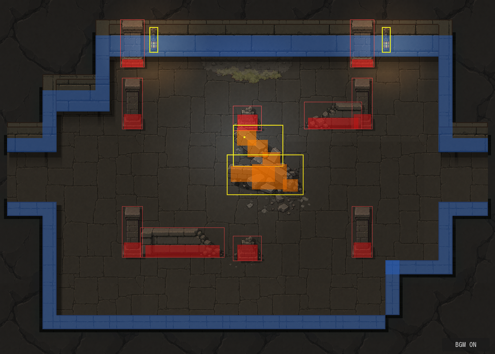
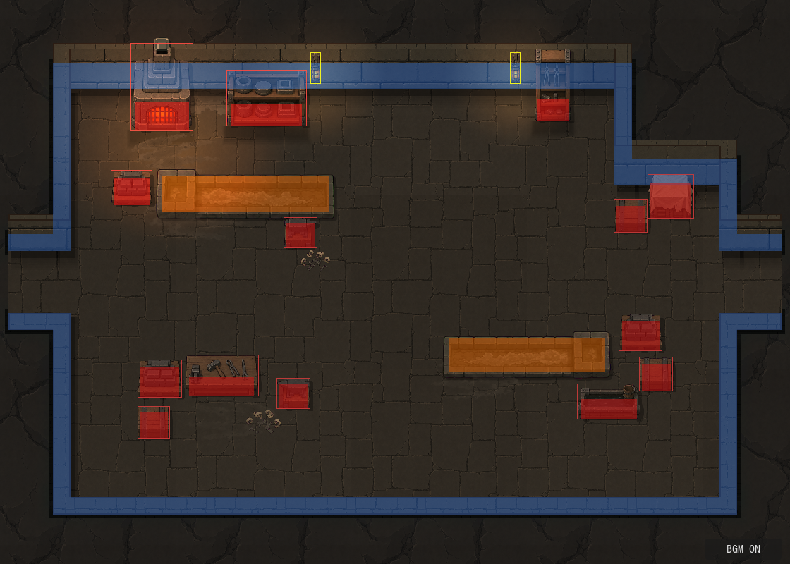
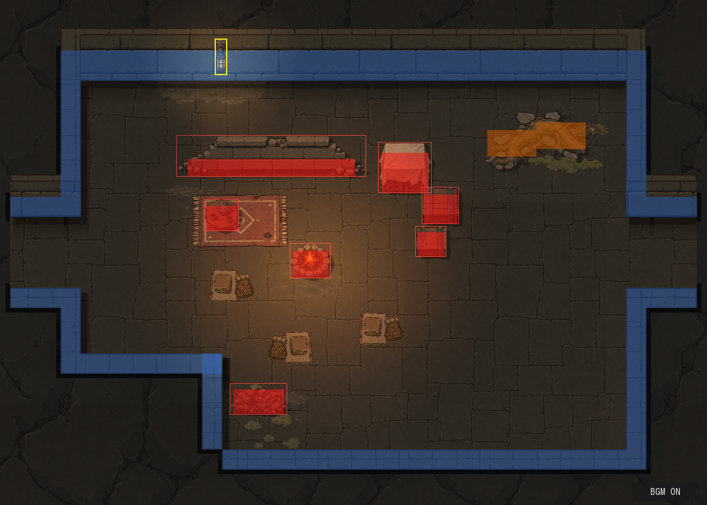
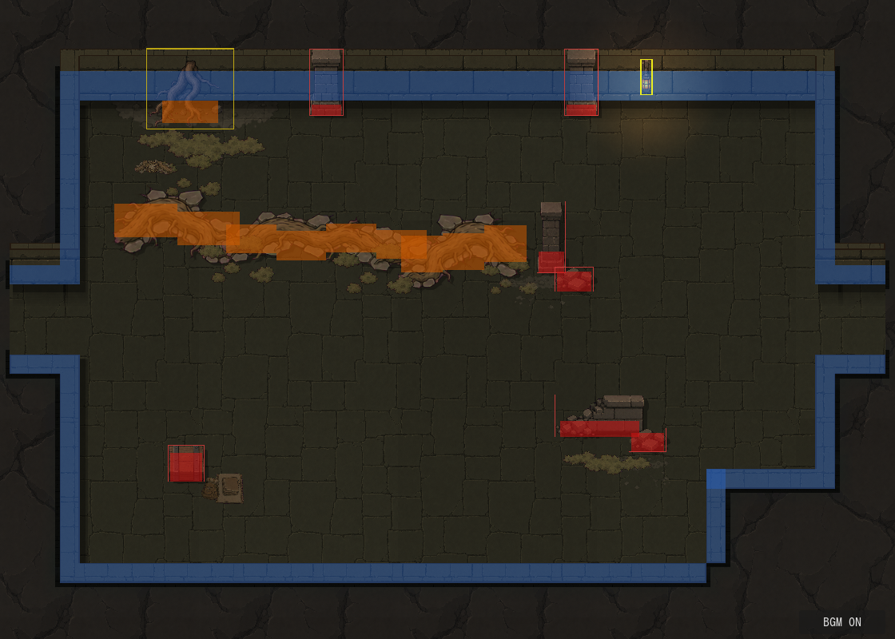

### A. 当たり判定がない（見た目は障害物なのに通り抜けられる）

|物|部屋|理由|
|---|---|---|
|鋳造の溝（石の縁が盛り上がった形）|鋳造の作業列|床の装飾として置いた|
|床に半分埋まった根（幹と浮いた石）|根の広間|床の装飾として置いた|
|壁の崩れた穴からこぼれた石材|崩れた回廊|壁の上に重ねる素材で、床まで描かれている|
|壁の断片の崩れた切り口と、こぼれた石|崩れた回廊|同上。壁の当たり判定より外側まで描かれている|
|壁から床へ伸びる根（西の壁、北の壁を割る根）|全部屋|同上|

### B. 当たり判定が絵より小さい（絵の上に重なって歩ける）

- 床置きの物は、当たり判定を「足元の帯」（幅0.86倍×奥行き14〜34px）だけにしている。背の高い物（炉・棚・柱）は、奥側を歩いて後ろに回り込む表現として正しいが、**低い物**（瓦礫・資材箱・パレット・金床・茶の卓・焚き火）は上面がほぼ床の広さなので、上半分にキャラが重なって「絵の上を歩いている」ように見える。
- 焚き火の当たり判定は石の輪の下半分だけ。瓦礫の山も上半分が空いている。

### C. 貼り付け感の原因

1. **床だけを暗くした**: 前回の明暗の調整で床を0.68倍にしたが、置物・壁の素材は暗くしていない。床（明度17）に対して置物が相対的に明るくなり、切り抜いて貼った写真のように浮く（旧鋳造区 v2 の標準の床は明度21）。
2. **置物に影がない・弱い**: 床の装飾として置いた物（鋳造の溝・根・寝具・巣）は影がなく、床置きの物も足元の小さな楕円の影だけ。左上からの光に合わせた、右下へ落ちる影がない。
3. **床の装飾の輪郭が強い**: 小石・ひび・土の帯にも濃い輪郭線があり、床の目地の線と重なって「上に乗ったシール」に見える。
4. **灯りが置物に当たらない**: 光だまりは床に描いた模様なので、灯りの近くの置物も明るくならない。

### 直す案

|区分|直し方|生成|
|---|---|---|
|A|鋳造の溝・埋まった根に当たり判定を付ける（形に合わせて矩形を2〜3個）。壁の崩れからこぼれた石材・断片の端の石には、小さな当たり判定か、こぼれ部分を床の装飾に分ける。壁から床へ伸びる根は、細い根は通れるままにし、太い根元にだけ当たり判定|なし|
|B|低い物は、当たり判定を絵の上面まで広げる（見下ろしで上面が見える物は、上面全体が障害物）。背の高い物は今のまま|なし|
|C-1|床を暗くするのをやめ、代わりに部屋全体（床・壁・置物）を同じだけ暗くする（Godotの環境光 `CanvasModulate`）。灯りは本物の光源（今ある `PointLight2D`）で置物にも当たるようにする。キャラが暗くなりすぎる場合は、キャラだけ明るさを保つ|なし|
|C-2|置物の右下へ落ちる影を、置物の絵の形から自動で作る（絵を暗くしてずらし、床に描く）。床の装飾にもごく薄い影|なし|
|C-3|床の装飾（小石・ひび・土）の輪郭線を弱め、半透明にして床になじませる|なし|

すべて生成なしで直せる見込み。壁の外周の形（直線と直角）は前回の回答どおり別の作業。

### 再レビュー2の直し（2026-09-27、ユーザー「まとめて直してください」、生成なし）

|区分|実装|
|---|---|
|A 当たり判定がない|`authored_rooms.gd` に見えない当たり判定 `block`（`authored_block_*`）を追加。鋳造の溝と埋まった根は `raised`（床に描き、長さに沿って2〜4個の判定。根は曲線に合わせて上下にずらす）。壁の崩れ・壁を割る根は、壁の線より下に描かれた部分を判定に（`on_north_wall`、くぼみは除く）。壁の断片の崩れた端は、端の外側に判定（`broken_end`）。西の壁から伸びる根は太い根元だけ判定（`side_root`）、細い先は通れる|
|B 判定が絵より小さい|低い物（瓦礫・資材箱・パレット・金床・茶の卓・焚き火・布掛けの保管物）は、当たり判定を絵の高さの8割まで広げた。背の高い物（炉・棚・柱・控え壁）は足元の帯のまま（奥に回り込めるように）|
|C-1 床だけ暗い|床だけを暗くする設定をやめ、テーマに `ambient`（部屋全体の明るさ）を追加。`field_builder.gd` が `CanvasModulate`（Godotの全体の色の掛け算）で、床・壁・置物・キャラをまとめて暗くする（試作の部屋は 0.8/0.78/0.76）。灯り・炉・焚き火の光源が置物とキャラにも当たる。床に描く光だまりは弱めた。ほかのテーマは `ambient` が白なので変化なし|
|C-2 影|`StagePlacement.drop_shadow` を追加。床置きの物は、絵と同じ形を暗くして右下（7,5px）にずらした影を描く（`stage_prop.gd`）。床に描く盛り上がった物（溝・根）にも薄い影（`workshop_floor.gd`）|
|C-3 床の飾りが浮く|小石・ひび・煤は不透明度0.6、壁際の土は0.48|

- テスト: `tests/authored_rooms.gd` に「当たり判定で閉じ込められた歩ける場所がないこと」（16px間隔で、出発点から歩いて行けない空き地点が0）を追加。見えない判定は画像なしを許可。PASS。回帰: `ashen_foundry`・`stage_templates`・`field_layout`・`exploration_floor`・`four_way_rooms`・`collapsed_workshop`・`connected_wall_surface`・`exploration_encounter`・`enemy_motion`・`fire_pouch_lizard`・`workshop_visuals` はPASS。`stage_depth` は既知の45行目の失敗（今回と無関係）。
- 当たり判定の撮影（`collisions/`、橙=見えない判定）と部屋の撮影（`views/`）を更新。

- 目視（Claude）: 溝と根は通り抜けられなくなり、瓦礫・木箱の上に重なって歩けなくなった。置物が床と同じ暗さになり、右下の影で床に立って見える。部屋全体が落ち着いた暗さで、焚き火と炉の光が周りの置物まで照らす。
- 残る点: キャラも部屋の明るさ（0.8倍）で少し暗くなる（灯りのそばでは戻る）。壁を割る根の判定は矩形なので、根の形とは完全には一致しない。

## 再レビュー3：構造とつながり（2026-09-27、ユーザー指摘の3画面）

ユーザー指摘: 「オブジェクトのデザインのつながりが変」「当たり判定が変（プレイヤーが上にのっている）」「ステージのつながりが途切れている」「壁上部と側面のつながりが変」。指摘箇所を2倍に拡大して撮影（`structure/`、撮影は使い捨てスクリプト）。

|画像|内容|
|---|---|
|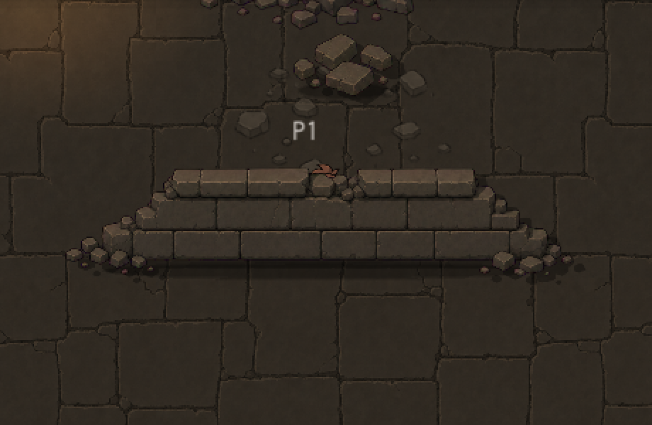|崩れた回廊の室内の壁の断片。後ろに立つとリナが壁の上に乗って見える|
|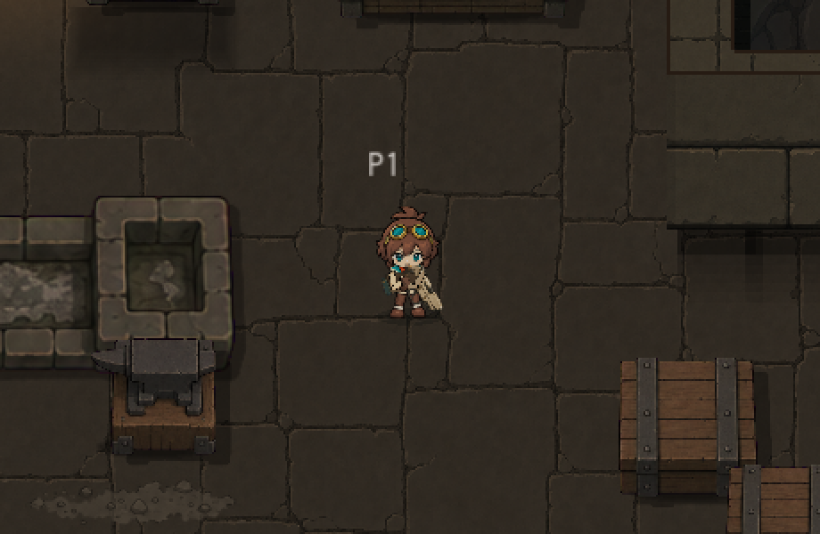|鋳造の作業列の北東の切り欠き（撮影はリナの位置を中心）|
|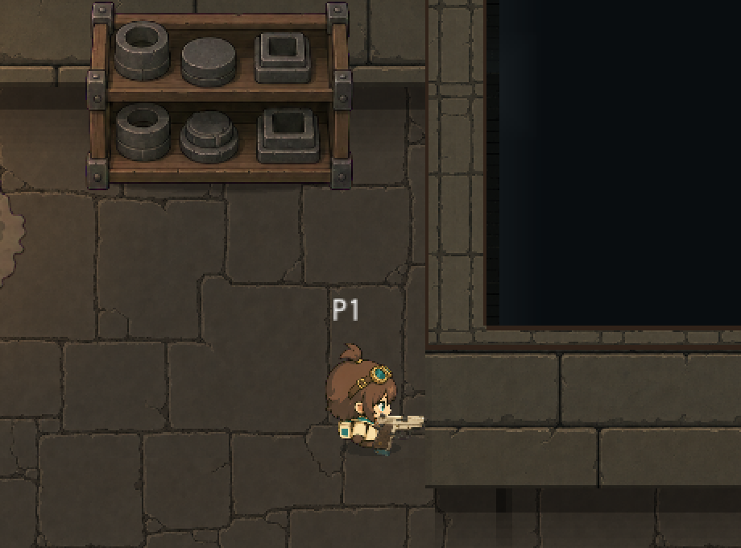|生成版の交差作業室の北東の切り欠き（同じ組み立て関数）|
|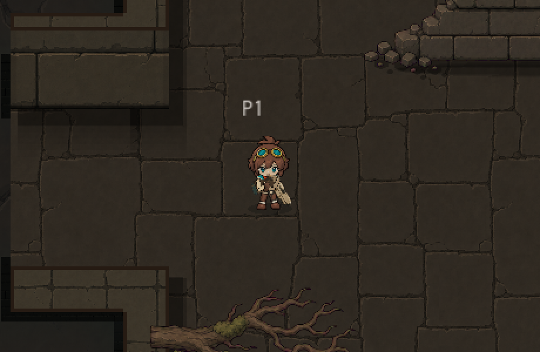|西の扉と石柱|
|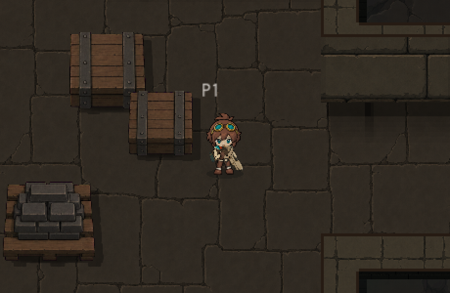|東の扉と石柱|

### D. 室内の壁の断片（オブジェクトのつながり・当たり判定）

- **プレイヤーが壁の上に乗って見える**: 壁は、キャラとの前後を比べずに常にキャラより下に描く設計（`field_builder.gd` で壁の層は z=-10）。外周の壁は部屋の端にあるので問題にならないが、室内に置いた壁の断片は、その後ろ（北側）に立つとキャラが壁の絵の上に重なる。当たり判定（厚さ32px）は壁の足元だけなので、壁の絵（高さ約68px）の上半分に入れる。
- **崩れた端の絵がつながらない**: 断片の本体は壁の素材（1段約38px の石）で描き、端だけ別の生成画像（小さい石、笠石の厚みも違う）を重ねているため、石の大きさと段の高さが合わない。本体は端から端まできれいで、崩れた壁に見えない。
- 原因は構造（壁の仕組みを、室内に立つ物に流用したこと）。

### E. 切り欠いた角（ステージのつながり・壁の上面と側面）

- **上の角で壁が途切れる**: 角の切り欠き（`workshop_room_variants.gd` の `cut_corner`）は、北の壁を切り欠きの位置で切り、折り返しの縦の壁を床の線（y=128）から始める。北の壁の厚み（y 80〜128）の角の1マスに壁がなく、北の壁の端が途切れ、縦の壁の上面が北の壁の笠石までつながらない（[ステージ制作テンプレート](../../STAGE_CREATION_TEMPLATE.md)の「上側の角は縦壁上面を笠石まで連続」に反する）。
- **内側の角で上面が正面を横切る**: 折り返しの縦の壁（上面の素材）が、張り出した壁（正面の素材）の厚みの分まで下に伸びて重なるため、縦の壁の上面の帯が正面の石積みの上を横切って床まで届く（「通路の終端は側壁の厚みまで石積み正面を連続」に反する）。
- **生成版の部屋にも同じ問題がある**: `cut_corner` は生成版4の通常室（交差作業室・西/東張出し工房など）と共通。試作の部屋だけの問題ではない。

### F. 扉の石柱と敷居（オブジェクトのつながり）

- 石柱は、通路の壁の上面と正面の境目の上に立っていて、壁の上に積んだように見える。北側に1本だけなので左右非対称。
- 敷居（床に置く平らな一枚石）は、縦向きの扉では細長い棒に見える。

### 直す案

|区分|直し方|生成|
|---|---|---|
|D|室内の壁の断片を、壁の仕組みではなく**キャラと前後を比べて描く置物**にする。崩れた両端まで1枚で描いた「崩れた壁の断片」を2〜3種生成し、足元に当たり判定、上半分は後ろに回り込める（リナが後ろに立つと壁に隠れる）|1回|
|E|`cut_corner` の折り返しの壁を、北の壁の厚みから始めて（角のマスを埋める）張り出した壁の上端で止める。生成版の部屋も同時に直る。当たり判定の合計範囲は変わらない。壁の接続のテスト（`connected_wall_surface`・`wall_junctions`）と生成版の到達性テストで確認|なし|
|F|石柱は、扉の開口の両脇の床（通路の口）に、足元を床に置いて左右対称に立てる。北向きの扉だけ、または扉の種類ごとに決める。敷居は縦向きの扉では幅を短く（奥行き方向に厚く）して棒に見えないようにする|なし|

### 再レビュー3の直し（2026-09-27、ユーザー「まとめて直してください」）

|区分|実装|
|---|---|
|D 室内の壁の断片|壁の仕組み（常にキャラの下に描く）をやめ、崩れた両端まで1枚で描いた「崩れた壁の断片」3種を生成（105件目、推定0.116ドル、指示 [prompt-wall-segments.txt](prompt-wall-segments.txt)、参照は壁の正面・壁の変化シート・本編の断片の撮影 [ref-stub-in-game.png](ref-stub-in-game.png)）。キャラと前後を比べて描く置物として置き、足元だけ当たり判定。後ろに立つとリナは壁に隠れる。旧来の `wall_stub`・`broken_end` は削除|
|E 切り欠いた角|`workshop_room_variants.gd` の `cut_corner`（北側の切り欠き）: 北の壁を折り返しの壁の厚みまで残し（切り欠きを32px内側から）、折り返しの縦の壁の上面が北の壁の笠石まで連続する。張り出した壁は折り返しの壁の隣から始め、両者の床の線を揃えたので、`ConnectedWallSurface` が張り出した壁の石積み正面を折り返しの厚みまで通す。当たり判定の合計範囲は変わらない。**生成版の通常室（交差作業室・張出し工房など）も同時に直る**|
|F 扉|左右の扉の石柱（通路の壁の上に積んだように見えた）を外した。左右の扉では敷居を描かない（縦向きで棒に見えたため）。封鎖中の鉄の横木は従来どおり|

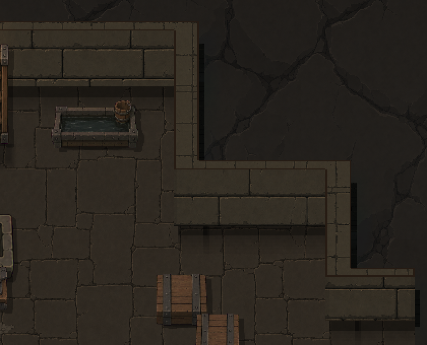

- テスト: `authored_rooms`・`connected_wall_surface`・`wall_junctions`・`four_way_rooms`・`exploration_floor`・`stage_templates`・`exploration_encounter`・`exploration_enemy_spawns` はPASS。
- 生成版の部屋では、壁の組み方が変わったため、北の壁沿いの家具（鋳型棚など）の置かれる位置がずれる場合がある（置き場所の探索は壁の一覧の順で行うため）。
- 未確認: ユーザーの目視確認。

## 再レビュー4：壁への重ね方と配置（2026-09-27、ユーザー指摘の5画面）

ユーザー指摘: 「オブジェクトと壁の模様が一致していない（重ねている感）」「オブジェクトが一部壁にめり込んでいる」「樹が上壁から生えているような見た目」。

|指摘|原因|
|---|---|
|崩れた穴・壁を割る根・くぼみの石の模様が壁と合わない|3つとも、周りの石積みまで描き込んだ1枚の絵を、本物の壁の上に重ねている。絵の石は壁の素材より小さく（1段約25px、壁は約38px）、目地の位置も明るさも違うため、四角いパッチを貼ったように見える|
|瓦礫が壁にめり込む|ランダム配置ではなく、手で置いた位置の誤り。崩れた回廊の角の瓦礫（右下の切り欠きの折り返しの壁に約10px重なる）、野営跡の小さな瓦礫（南西の切り欠きの張り出しに重なる）。配置のテストは当たり判定どうししか見ておらず、絵が壁に重なることを検出できなかった|
|樹が上壁から生える|西の壁は、この視点では上面しか見えない（正面がない）。そこに根の絵を重ねたので、壁の上面の上に木が寝ているように見える。根が壁から出てくる表現は、正面が見える北向きの壁でしか成り立たない|

### 直す案

|区分|直し方|生成|
|---|---|---|
|壁の模様の不一致|重ねる絵から周りの石積みを取り除き、**本物の壁が見えるようにする**。崩れた穴は「穴の暗い部分」と「床へこぼれた石材」だけ、壁を割る根は「根」と「押し出された石の破片」だけを残す（色で分離: 石は灰褐色、根は茶色、穴は暗色）。くぼみは石積みごと描かれているため外し、ろうそく等は床の置物にする|なし|
|めり込み|2か所の瓦礫を壁から離す。テストに「床置きの物の足元（絵の下側）が壁に重ならないこと」を追加して再発を防ぐ|なし|
|西の壁の樹|西の壁（上面だけ見える壁）から出る根をやめる。代わりに、壁際の床の割れ目から出る埋まった根（`sunken_root`）を置く。根が壁から出る表現は北の壁（正面）だけにする|なし|

### 再レビュー4の直し（2026-09-27、生成なし）

- **壁の模様の不一致**: [tools/build_wall_feature_cores.gd](../../../../tools/build_wall_feature_cores.gd) で、崩れた穴と壁を割る根の絵から周りの石積みを取り除いた `wall_breach_core.png`・`wall_roots_core.png` を作成（元の絵は変更しない）。壁の床の線（絵の左右端近くで不透明な最下行）より上は、穴（暗い部分。細い目地は収縮→膨張で除去）または根（茶色の大きな形）だけ、下は床へこぼれた石と根の先だけを残す。部屋では `on_north_wall` がこの `_core` を使い、本物の壁の石積みが周りに見える。石積みごと描かれた壁のくぼみ（ろうそくの壁龕）は外した。
- **めり込み**: 崩れた回廊の角の瓦礫と、野営跡の角の瓦礫・小さな瓦礫を、切り欠いた角の壁から離した（野営跡の瓦礫は南の扉の通路にもかからない位置へ）。`tests/authored_rooms.gd` に「床置きの物の絵の下3割（床の足元）が壁に重ならないこと」を追加（壁灯・控え壁・壁付きの家具は対象外）。
- **西の壁の樹**: 上面しか見えない西の壁から出る根（`root_side`）をやめ、壁際の床を割って出る根（`sunken_root_fork`、当たり判定付き）に置き換えた（`side_root`）。根が壁から出る表現は北の壁だけにする。

|直し後|画像|
|---|---|
|崩れた穴（本物の壁の石積みの中に穴）|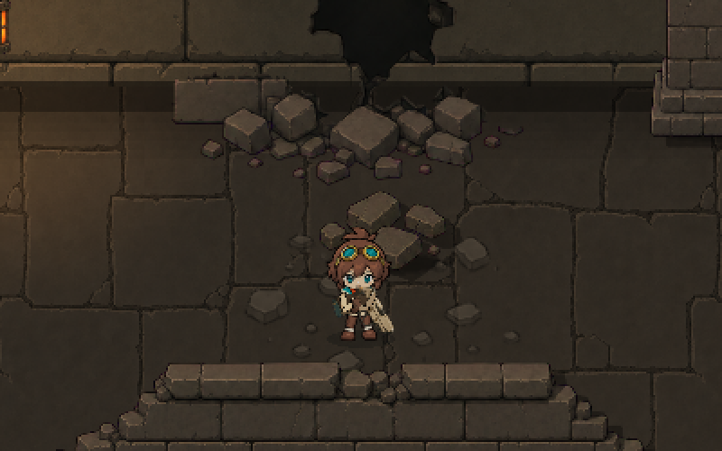|
|壁を割る根|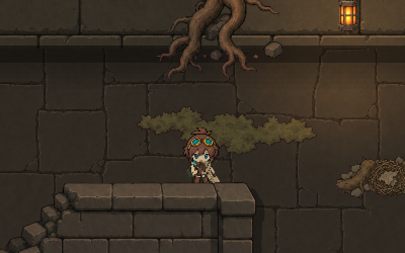|
|西の壁際の根（床を割る）|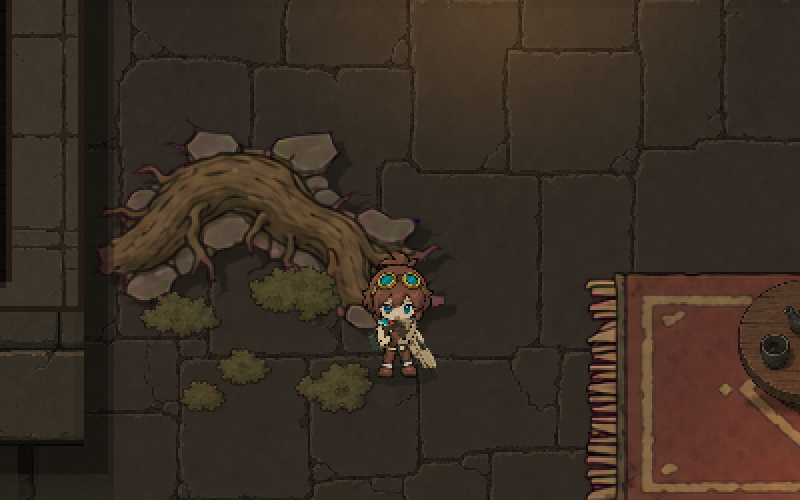|
|崩れた角の瓦礫（壁から離した）|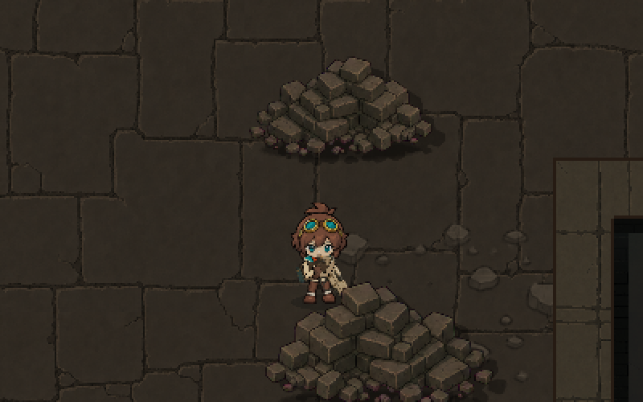|

- テスト: `authored_rooms`（壁への重なりの確認を追加）・`connected_wall_surface`・`wall_junctions`・`four_way_rooms`・`exploration_floor`・`stage_templates`・`exploration_encounter`・`ashen_foundry` はPASS。
- 残る点: 崩れた穴の左下に、壁の最下段の輪郭の細い線（1〜2px）が残る。穴の周りの石に崩れた欠けがなく、穴が壁にきれいに開いている。

## 追加レビューの改善（2026-09-27、実装・自動検証・画像確認）
ランダムマップ用の部屋部品として、西東どちらから入っても通過可能な主経路と任意の寄り道を分離する。保管区画の小室入口を絞り、収蔵庫・礼拝室の接近経路を改善。前室は北壁に接続する閉鎖門、記録室・展望室は用途に合う家具へ置換する。
不足素材は閉鎖大門・読書机・工具なし長椅子・書物と巻物。内蔵image_genで透過2×2シート1枚を生成。足元中央、幅220/160/132/70pxを目安とし画像比率を維持。接続用の開口とは別の封鎖された美術上の門として扱う。

- 6室を改善：収蔵庫の展示奥・礼拝室の祭壇手前・保管区画の小室入口に低壁を配置し、横断と寄り道を分離。記録室は読書机と書物、展望室は工具なし長椅子に変更。前室は北壁に付く門と専用の支持柱を設置。
- 原本：[ruin-refinement-v1.png](../../../../assets/generated/ruin-refinement-v1.png)、[プロンプト・SHA-256](../../../../assets/generated/ruin-refinement-v1.json)。内蔵image_genを1回使用、実寸1254×1254、alphaあり、model/費用/usage不明。原本と実行用refinement.pngは同一。抽出は既存build_exploration_kit.gdの4区画・alpha>=0.1・余白2px。全16スプライト＋遠景に拡張。
- 実寸幅：門160px（足元560,205、衝突は北壁から足元まで）、読書机160px、長椅子132px、書物48〜64px。門は閉鎖美術であり、接続データ上の出口ではない。門脇柱は門の支持材として明示配置。
- ランダムマップ準備：Authored.make_room(id,sides)を巡回順序から分離。connection_sets(id)は西のみ／東のみ／西東を宣言。片側を閉じた壁と実際の入口に合わせた開始点を生成する。接続先は呼出側が割り当てる。画像の90度回転による方向違いの流用は行わない。
- tests/authored_room_connections.gdで全20室×3開口の到達性、10seedの順序変更＋両端が行き止まりの接続列の相互扉を検証。部屋検証・40回の自動往復遷移・20件の部屋選択もPASS。全体／通常倍率画像を更新し、変更6室を目視確認。
- 未実装：本編抽選、南北・曲がり・三叉分岐への対応、報酬や調査、門の開閉とボス室接続。前室は将来ボス直前へ制約付き配置する想定で、任意の通常室として無条件抽選しない。敵入り戦闘・手動試遊・ユーザー採用は未確認。既存のuserディレクトリ／証明書／shader cache警告と巡回終了時ObjectDB警告は残る。

## Visual Hubへの登録（2026-09-28）

部屋20件を原本から自動収集し、4ステージと専用一覧へ表示。保存済み画像・寸法・役割・接続・本編未採用を表示。現在の配置はstage Adapterで実描画する。既存ステージ4件のhub-*.pngはtools/visual_hub/capture_stages.gdによる960×640全体画像、追加素材生成なし。[操作・更新方法](../../../../tools/visual_hub/README.md)。

## レビュー改善（2026-09-28）

状態：実装・自動検証・通常倍率の画像確認済み。敵入り実戦・ユーザー採用は未確認。

|仕様票|変更と素材|
|---|---|
|脇室／寄り道終点|1440×1120、石造の北東小区画。箱の足元1138,210、棚1240,240。西・東入口のどちらも通常1.2倍／案D1.45倍の全画面外に箱を置く。1138,285まで寄ると見える。低壁は視線を遮らず迂回を誘導する。壁・箱・棚・紙片は既存素材を流用|
|双広間／通過室|北壁につながる仕切りは維持。独立した中央の外周方式の壁を除去し、足元720,640・幅250・衝突奥行28の既存wall_segment_longへ置換。人物と前後を切り替える腰壁として構成。縦向き画像の回転・継ぎ目隠しの柱は追加しない|
|接続と抽選|荷捌き場・詰所の開口対応を15組合せへ拡張。配置の回転なし。生成版2は接続を先に作り、役割・開口に適合する未使用／使用数の少ない部屋を優先。隣接同種は禁止。seedの結果は生成版1から変更|
|原本・派生|新規生成なし、原本変更なし。派生レシピはauthored_rooms.gd／authored_rooms_expansion.gdの配置とauthored_floor.gdの抽選。全体と通常倍率画像はcapture_authored_rooms.gd、下記確認はcapture_authored_map.gdで再撮影|

確認画像：[西入口](views/secret-entry-west.png)・[東入口](views/secret-entry-east.png)・[奥での発見](views/secret-discovery.png)、[腰壁の奥](views/twin-screen-behind.png)・[手前](views/twin-screen-front.png)、[荷捌き場の四方向接続](views/random-loading_bay.png)・[詰所の四方向接続](views/random-guard_post.png)。

検証：124開口の到達性、20室の孤立領域・壁への重なり、40seedの接続・隣接重複禁止・各種最大2回（検証seed内）、3seed全辺往復62遷移、脇室3開口×2倍率で入室時非表示／奥で表示、双広間の前後の立ち位置を確認。画像では箱の非表示／発見と人物の前後関係を確認。既知の環境警告と巡回終了時ObjectDB警告は継続。

残る素材候補：展望室をさらに改善する場合の連続欄干と崖際の縁。今回は制作せず、現行の展望室を維持。

## 展望室の再設計（2026-09-28、実装・画像確認済み）

ユーザー承認：開口構造と遠景を一体で再設計。壊れた観測廊から地底を見下ろす。部屋1440×960、通常倍率1.2、人物固定、西東入口維持。非歩行領域は中央北側、手前の観測床と接続する。

必要素材：①見下ろしの地底と内壁・床断面（横長、正投影、水平線なし、周囲は既存の灰褐色石造へ接続）、②連続石造欄干（透過、正面と上面、幅約760px、足元基準、人物とYソート）。内蔵imagegenで各1点を新規生成し、原本と条件を保存する。既存の背景・崩れ壁原本は保持。接続用の壁材・床・ベンチ・石板・照明は流用。

完了条件：長方形画像の切断面が床へ直接接しない。下層の遺跡と根は上から見下ろす。内壁と前縁で奥行きを示す。侵入不可、手前通路と左右入口の到達性を維持。通常倍率・全体画像と自動検証を記録。敵入り実戦・ユーザー採用は別途。

実施：内蔵imagegenを2回使用。原本は[地底背景](../../../../assets/generated/overlook-depth-v2.png)と[欄干](../../../../assets/generated/overlook-rail-v2.png)、同名JSONにプロンプト・実寸・SHA-256を記録。モデル・費用・usageは返却されず不明。背景は内壁・断面・根と下層橋を含む。水平線を廃止。欄干は実寸1871×841の透過PNGで、alpha>=0.1の領域を2px余白付きAtlasTextureとして参照（原画のピクセル変更なし）。[抽出領域](../../../../assets/stages/ashen-foundry-v2/exploration-kit/overlook-v2-regions.json)、[再構築ツール](../../../../tools/build_overlook_assets.gd)。

配置：背景中心720,328・800×400。左右の壁はx288／1120・幅32・y80〜560で北壁につなぐ。欄干は432px幅の同一部材2本を足元504,560／936,560へ配置、比率維持で約54px高。接地・前後は人物のYソート。衝突帯は各432×32で連続。石板を1210,635へ移し欄干の端を隠さない。ベンチ・照明・入口の尺度は維持。

確認：全体・通常倍率を再撮影し、見下ろしの橋、左右の内壁、床断面、欄干の高さと端を目視。[全体](views/19-overlook-overview.png)・[通常倍率](views/19-overlook-detail.png)。20室の孤立領域・壁重なり・通路、124開口、40seedをPASS。開口全幅の侵入不可、欄干中央継ぎ目を越せないこと、手前の横断通路も追加検証。既知のログ・証明書・shader cache環境警告は継続。敵入り手動試遊・ユーザー採用は未確認。

## 展望室v3：画風と境界の統合（実装・画像確認済み）

v2は背景の近景岩が写実的で、遠近の収束と額縁状の縁が室内から浮いていた。近景は既存の壁材で構築し、背景は低コントラストの下層遺構だけを1点生成する。見下ろし正投影・水平線なし・外周は暗部・近景壁と岩を背景に描かない。側壁と前縁は同一壁材、根は既存素材を流用。部屋1440×960と西東入口、非歩行領域と手前通路を維持。原本保存、通常倍率／全体画像、通路と侵入防止を確認する。

v3実施：内蔵imagegenを1回使用。[下層背景原本](../../../../assets/generated/overlook-depth-v3.png)と[条件・実寸・SHA-256](../../../../assets/generated/overlook-depth-v3.json)を保存。モデル・費用・usage不明。実行用コピーは原本と同一。v2背景と生成欄干は保存するが現行展望室では使用しない。

近景は既存wall_face／wall_topを使用。北壁につながる側壁と前縁をConnectedWallSurfaceで接続。内壁はshaft_faceで同一の世界座標・反復尺度（320×304）を使うAtlasTextureの床レイヤー参照として構築。内側へ透明度を下げて下層の暗部へ連続させる。前縁左に既存floor_rootを幅205・足元370,572で置き、境界をまたぐ。根の足元18pxに衝突、建築との重なりは意図したもの。新規ピクセル加工なし。

全体・通常倍率を再撮影し、同じ石材での縁と内壁、背景の画風と平行視点、根の連続を確認。20室の孤立領域・足元重なり・侵入防止／手前通路、124開口構成がPASS。新規の戦闘・操作・報酬は追加なし。手動試遊とユーザーの美術採用は未確認。v2より画風差は減ったが、開口は人工的な矩形の観測井戸として維持している。

## 全体レビューの重点改善（実装・自動検証・画像確認済み）

範囲：保管区画・脇室の空き床削減と発見経路、収蔵庫と保管区画の用途に合う収納、曲がる主経路／合流路を持つランダム見学。人物1.2倍・家具固定尺度・西東開口・本編未採用は維持。
必要素材：石器・巻物・包みを収納した低い収蔵棚と、封印した保管容器の透過2点シート1枚。幅140〜160／70〜100px、強い見下ろし・足元中央・工具や鋳型なし。内蔵imagegen1回、原本と条件を保存しAtlasTextureで参照。既存の壁・箱・敷物・書物を流用。
部屋は左右入口を低めの位置に保って南側の不要な床を削り、宝箱が入室時に画面外となる条件を維持する。全開口・到達性・発見位置・骨格の相違とループの往復を検証し、通常倍率画像を残す。

実施結果：生成版3は直進・屈曲・合流の3骨格、2つの発見終点と北口の前室を維持。対応開口から未使用・少数使用の部屋を優先し隣接同種を禁止。合流路は主経路の別の地点へつながり、探索後に同じ枝を引き返す以外の帰路を選べる。seedは旧版から変わる。[直進seed1](views/random-layout-0-seed1.png)・[屈曲seed2](views/random-layout-1-seed2.png)・[合流seed0](views/random-layout-2-seed0.png)。

保管区画と脇室は左右入口y560・幅112・到着点x170/1270を維持し、南壁をy712へ移動。外形1440×800で、旧1120高の空いた床を除去。保管区画は南の両隅、脇室は北西も切り欠く。人物・家具・カメラ尺度は維持。脇室は北東小区画を回り込んで発見する。宝箱はどちらの入口からも全画面外、奥で見える。

新素材：内蔵imagegen1回、透過シート1枚。[原本](../../../../assets/generated/archive-storage-v1.png)・[条件／実寸／SHA-256](../../../../assets/generated/archive-storage-v1.json)。モデル・費用・usage不明。画面左62%の棚と右35%の保管容器を目視で分離し、alpha>=0.1＋2px余白をAtlasTexture参照として抽出。再構築はbuild_exploration_kit.gd、regions.jsonへ保存。原本のピクセルは変更しない。棚は100〜175px幅、足元の衝突は高家具として画像高22%。容器は82〜96px幅、低い物として画像高94%。北側の棚には接地影を付ける。

用途：収蔵庫の工具／鋳型棚と一部の孤立した腰壁、保管区画の鋳型棚と東小室の腰壁、脇室の工具棚を置換。書類の散乱は書物と巻物へ変更。これらも美術見本で操作・報酬は未追加。

検証：20室の到達性・孤立領域・実際の扉位置からの通路・足元と壁の重なり、124開口、40seedで3骨格・ループ数・再現性・隣接同種禁止・発見をPASS。seed0/1/2の全辺（ループを含む）を双方向に移動し64遷移、地図と最奥からの帰還もPASS。全20室と通常倍率画像を更新。敵入り実戦とユーザー採用は未確認。環境警告と巡回終了時ObjectDB警告は継続。

残り：自然物と床欠損の接続、他室の残骸と元の建築軸の整合、展望室の中間の足場や段差は、今回の重点3項目とは別の改善課題として残す。

## 開口の追加と生成版4（2026-09-30）

状態：実装・自動検証・通常サイズの画像確認済み。ユーザー採用・手動試遊は未確認。依頼と方針は[階層構造の拡張計画](../../../planning/FLOOR_EXPANSION_PLAN.md)の段階1。新素材・画像生成なし。

目的：Enter the Gungeonのマップとの比較で「ボスまですぐ行ける」との評価。生成版3は入口が西端・本道が東へ直進・枝が南北に出るため、形から進路が読めた。曲がる本道と多分岐には南北の開口が必要だが、四方向に対応する部屋は5種だけだった。

### 開口の追加

各部屋の開口候補を全組合せで組み立て、①入口・到着点・その間の通路が衝突に塞がれない、②全扉へ到達できる、③扉の周囲に壁付き・床置きの物（装飾の平面を除く）が重ならない、を自動で調べた（調査用スクリプトはコミットしない）。合格した組合せは全体表示で目視し、扉が物の配置や建築の意図と衝突しないことを確認した。

|部屋|許可する開口|北・南を許可しない理由|
|---|---|---|
|回廊・鋳造・野営跡・根の広間・列柱・中庭・荷捌き場・貯水槽・詰所・倒れた大門・巣|北南西東の任意の組合せ|―|
|双広間・補修室|南西東の任意の組合せ|双広間は北の仕切り壁で北口が孤立。補修室は北壁中央に補強材と壁灯|
|収蔵庫（寄り道終点）|北・南・西・東のいずれか1か所|―|
|礼拝室・記録室・展望室（寄り道終点）|南・西・東のいずれか1か所|礼拝室は祭壇と石碑、記録室は石板の列、展望室は地底の開口が北側を占める|
|保管区画・脇室（寄り道終点）|西・東のいずれか1か所|北と南の区画・切り欠きで到達できない|

寄り道終点は元の西東の通過組合せも20室一覧用に維持する。前室は従来どおり。倒れた大門の北口は既存の門柱の間に開く。巣の北口は西側の柱に接するが通行は可能。部屋の配置・絵・衝突は変更していない。

確認画像（全体表示、扉の門扉は非表示）：[追加開口の一覧](views/openings-2026-09-30.png)。

### 生成版4

|項目|生成版3|生成版4|
|---|---|---|
|総部屋数（200seed）|10〜13|15〜18|
|入口→ボスの扉数|5〜7|7〜9|
|分岐点（扉3つ以上）|ほぼ2|4〜6|
|ボスの方向|常に入口の東|北東・北西・南東・南西に分散|
|行き止まり|宝箱部屋2室のみ|宝箱部屋2室＋通常室|

- 主経路の曲がり位置は内部の別々の段に置き、最初の一歩は必ず直進する。前室の入口は西・東・南から選び、最奥の南口を維持する。
- 合流路は、主経路側から見た距離が3以上離れた隣接セル同士（どちらも扉2つ以下）を結ぶ。最奥への距離を縮める候補は除外する。
- 失敗した試行（自己交差・前室の置き場なし・分岐数が範囲外）は同じRNGで作り直す。200seedで失敗なし。
- 本編（production_floor）は同じ生成を使う。寄り道終点2室は宝箱部屋、通常室はすべて戦闘室になるため、戦闘室は10〜13室に増える（旧6〜8）。報酬量の調整は未実施。

生成例（全室訪問状態、地図は旧表示のまま）：[seed3](views/floor-v4-seed3.png)・[seed27](views/floor-v4-seed27.png)。地図の表示改善は計画の段階2。

検証：`authored_floor`（40seedの部屋数・分岐数・ループ・最奥までの距離・入口の向きと最奥方向の分散・再現性）、`authored_room_connections`（208開口構成）、`authored_rooms`、`production_floor`（10seed・124戦闘の出現）、`production_doors`、`visual_hub_rooms` はPASS。全体回帰は[TESTING](../../../development/TESTING.md)に記録する。

未確認／後続：手動試遊での迷い方・長さの受入、戦闘室の増加に伴う難度と報酬量、地図の見やすさ（段階2）、北口のない部屋への北口の追加（配置の作り直しが必要）。
