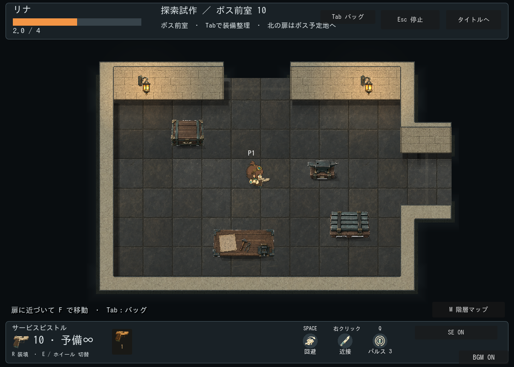
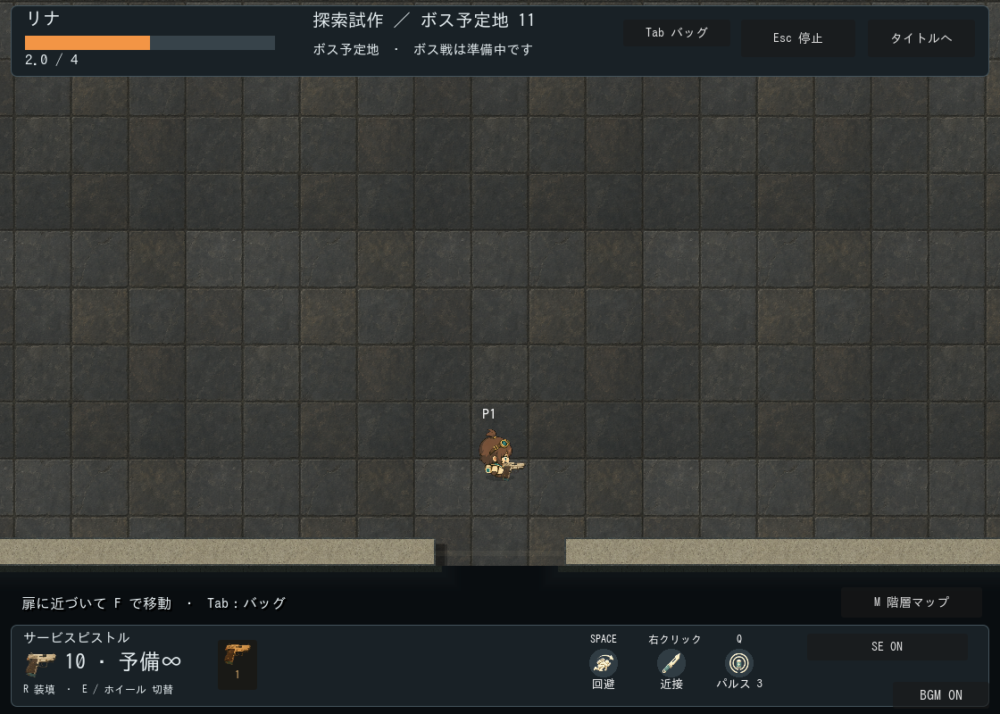

# ボス前室・南入口の制作記録

区分: 生成/移動は実装済み、ボス戦・演出は未実装。[現行仕様](../../../design/GAME_RULES.md)。

仕様票: 工房テーマ、前室880×600・ボス予定地2240×1200。正投影・追従カメラ倍率1、キャラと家具の倍率は共通。前室北出口からボス南入口へ接続し、前室の探索入口は東西南のいずれか。壁厚・開口幅・扉到着点はworkshop_room_shell.gdの共通値を流用する。ボスの北寄り配置は本体実装時に確定する。

素材: 既存工房の床・壁・扉枠・灯り・前室家具を流用。ボス室は大型家具を置かず空間を確保。新規生成なし。原本はdata/stage_themes/workshop.tresとdata/fields/workshop_trial.tres、workshop_annex.tres。組立レシピはexploration_floor.gdとworkshop_room_variants.gd。前室専用の足跡・排熱・扉封鎖・ボス本体/演出素材は後続。

100seedの接続・到達性と実移動を検証。画面上の壁接続と入口を目視確認。ボス戦の視認性、前室の期待感、正式美術とユーザー採用は未確認。HP・弾薬の無料回復は置かない。
