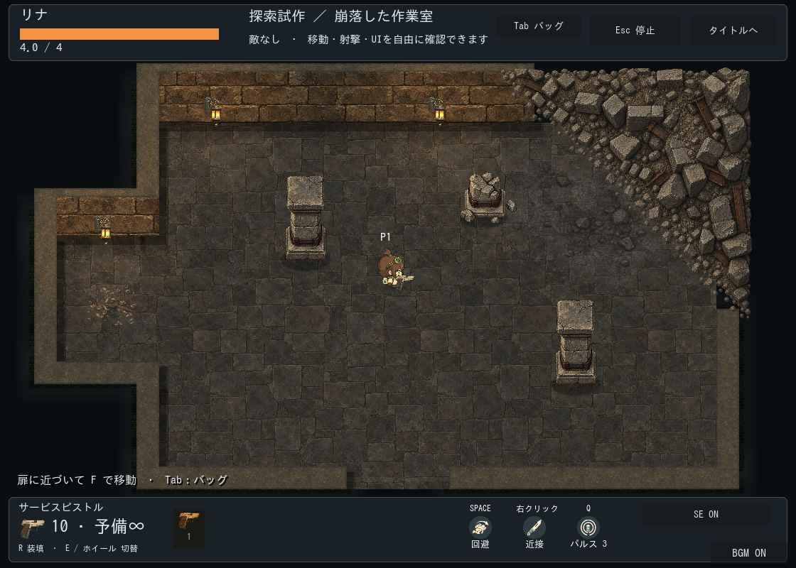
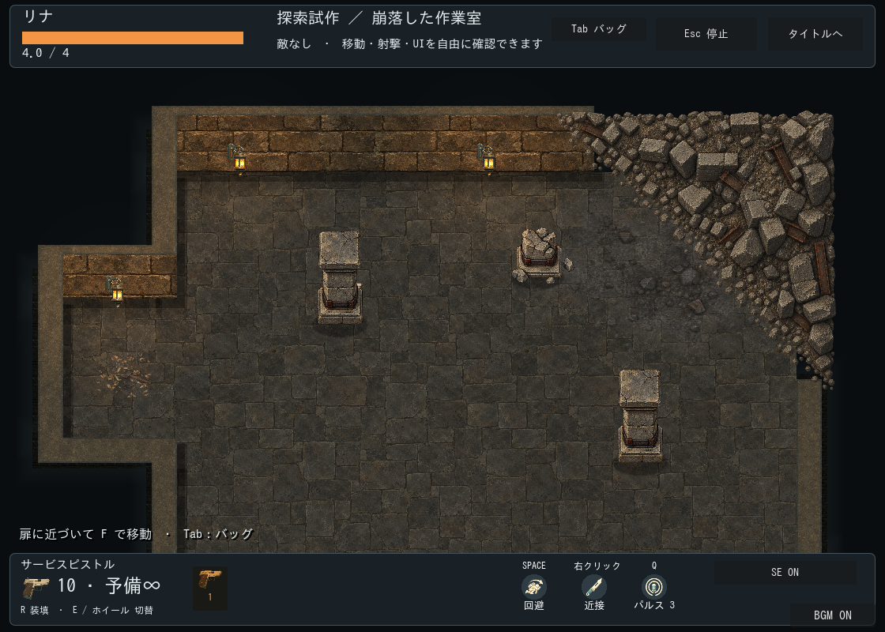

# 崩落した作業室：実機試作

区分: 制作・検証記録。2026-09-25。ユーザー依頼により崩落案01を1室試作し、Godotの実画面で評価する。全ランダム室への適用は今回の範囲外。

最新方針: 瓦礫案は見送り。このページは比較試作の記録。現在は[瓦礫なしの部屋バリエーション](../workshop-room-variants/README.md)を使用する。柱の通常姿勢のみ流用。

## 仕様票と制作前の素材台帳

- 用途: 敵なしの探索検証室。南入口から入場、北東角が崩落。左側に増築の張出し。中央は移動・射撃可能な広場。
- 基準: 既存リナ、カメラ倍率1。見下ろし正投影、床から約70度。床・壁・灯りは旧鋳造区の既存素材を流用。
- 当たり判定: 床・壁と装飾を分離。瓦礫の細粒に個別の衝突を付けない。崩落は通れる床を削り、柱は足元の独立矩形で判定。
- 部屋と扉: 南側の検証用前室との往復、扉幅144pxと到着点を確保。ランダム抽選へはまだ追加しない。
- 新規生成: 内蔵image_genで崩落角1枚、柱2姿勢のシート1枚。既存テーマに合う灰褐色石・煤・錆びた鉄。床・巨大な影・光を素材へ焼き込まない。

|素材|必要理由|寸法・原点の計画|状態|
|---|---|---|---|
|collapse-ne.png|北東の直線輪郭を崩落地形へ置換|約480×400px。北・東の外側は密な岩、南西へ崩れた斜面。原点は配置矩形左上|生成・検証室へ接続済み|
|pillars.png|中央の遮蔽と元の建築の履歴|左右2セル、通常柱と折れ柱。通常約80×110px、折れ柱約85×55px。足元中央を登録|生成・検証室へ接続済み|
|既存床・壁・灯り|他の部屋と世界観を合わせる|既存尺度維持|流用|

生成後に実寸・alpha・切出し領域・接地原点・原本ハッシュ・プロンプトを記録する。比較画像の提出、全扉への到達、柱と崩落の衝突、往復後の重複なしを完了条件とする。ユーザー採用・Web性能は別途確認。

## 接続結果

検証室1120×700px、カメラ追従・倍率1。`scenes/game/collapsed_workshop_preview.tscn` をGodotで開いてF6で再生する。敵なしで移動・射撃・回避でき、南の扉から前室へ往復可能。通常タイトルのランダム探索にはまだ追加していない。

[新規素材と登録値](../../../../assets/stages/ashen-foundry/collapse-v1/manifest.json) / [全4回の生成指示](../../../../assets/stages/ashen-foundry/collapse-v1/prompts.json)。内蔵image_genで2点を生成し、崩落の向き・柱の透過の確認で各1回の改訂を実施。原本PNGのバイト列は変更せず、GodotのAtlasTextureで参照領域を登録した。

崩落1254×1254pxを360×360pxで配置。柱シート1536×1024pxから通常(215,106,382,784)、折れ(867,427,533,482)を参照し、両方とも倍率0.15。接地基準は通常の参照内(約187,780)、折れ(220,約413)。柱表現は前面が比較的大きく、既存キャラとの最終的な高さの受入は未完了。PNGの見かけの茶色い背景についてはalphaを測定し、輪郭外の背景にalpha=0があることを確認。表示に不透明な背景矩形は出ていない。

崩落の細かな岩の衝突は作らず、8本の幅40pxの非表示矩形を画像の内側へ置く。床描画は下にも続くが、岩の内部へは移動・射撃不可。これは試作の近似であり、任意の岩形状に一致する汎用多角形衝突やランダム配置の完成ではない。接地影は既存の独立shadow_rect、粉塵と切屑は既存の床デカールを流用。独立柱はYソート、崩落は壁より前・人物より後ろのsurface_overlay。

Godot描画版 `tests/collapsed_workshop.gd` PASS。部屋検証・南北の相互扉・出入口到達・張出しまでの経路・柱/崩落のsolid・柱越しの射線・往復後の配置数を確認。既存 `tests/exploration_rooms.gd` もPASS。headlessでは既知の証明書読み込み・終了時ObjectDB警告が残る。描画版では該当エラーなし。

目視で色の調和、外形、透過境界、柱の奥の遮蔽を確認。ユーザーによる移動の手触り、大型敵の迂回と突進、岩際の引っ掛かり、Web性能、ランダム抽選への組込みは未確認・未実施。コンセプトの全面的な崩れ壁を再現した完成版ではなく、再利用できる部品を本編の描画・移動基盤へ接続した最初の見本。
