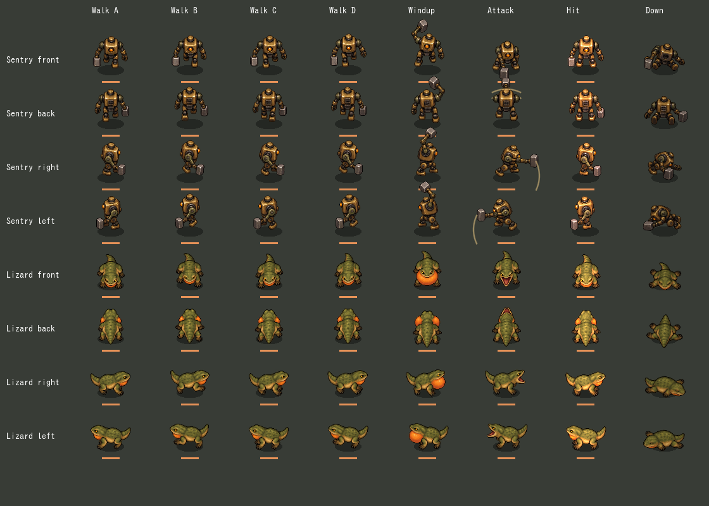
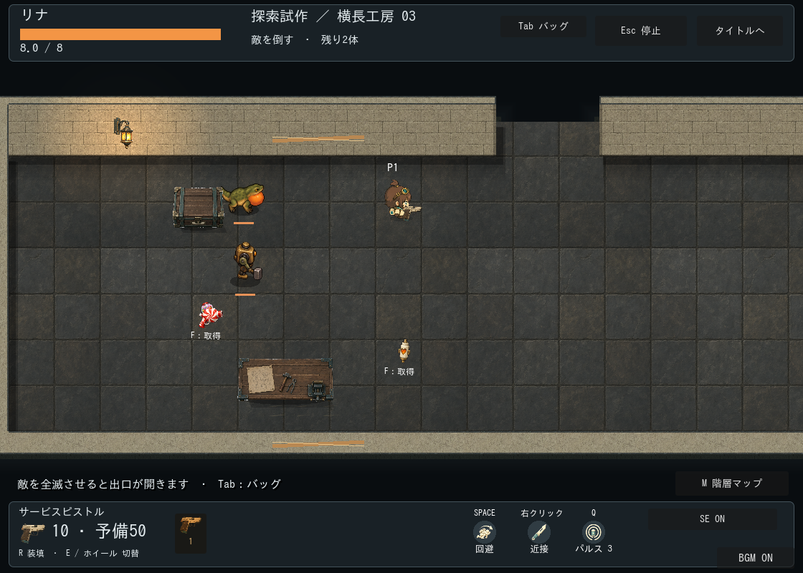
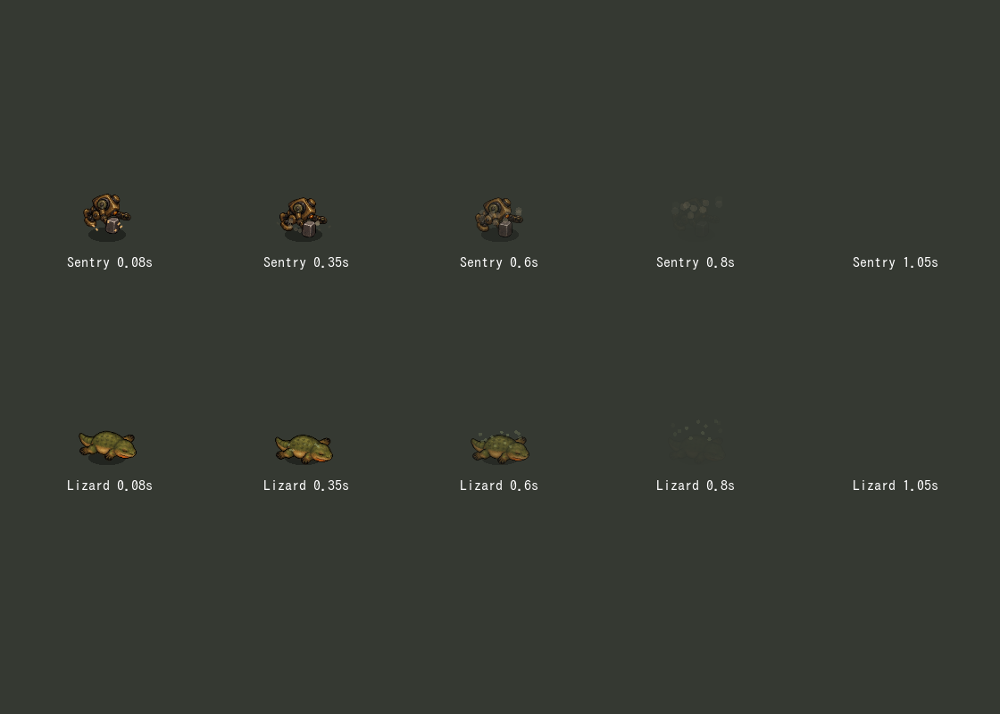

# 通常敵アニメーション v2 制作記録

状態: 本編組み込み・自動検証・通常倍率の連続コマ比較済み。ユーザーの最終受入は未確認。ユーザー依頼は敵の拡大とアニメーション残課題の対応。

仕様: 既存の番機・トカゲを参照し、通常表示を約20%拡大。移動・被弾・攻撃判定は変更しない。今回は関節分割案に代わり、両種とも専用コマ方式で全身の整合を優先する。原画は加工せずGodotの領域指定で利用する。

|素材|不足と今回の制作範囲|状態|
|---|---|---|
|番機 atlas v2|前後右左×歩行4・構え・攻撃・復帰・倒れ、32コマ。同じ手にハンマーを維持|本編接続済み|
|トカゲ atlas v2|前後右左×四足歩行4・膨張・開口・復帰・倒れ、32コマ|本編接続済み|
|被弾反応|行動を中断しない短い発光と揺れ|実装済み|
|撃破演出|戦闘Actorから独立した倒れ・退色。停止・離室に対応|実装済み|

接地原点・表示縮尺・領域は生成後のメタデータで確定。方向別の体格・装備・接地・ループを通常倍率の連続フレームで確認する。追加SE生成なし。画像はbuiltin image_genで各1枚を制作し、プロンプトと原本パスを記録する。

## 成果物と組み込み

- 原本: [番機v2](../../../../assets/first-workshop/enemies/sentry-sheet-v2.png)、[トカゲv2](../../../../assets/first-workshop/enemies/lizard-sheet-v2.png)。各32コマ、887×1774 RGBA。
- 送信指示: [番機](sentry-prompt.txt)、[トカゲ](lizard-prompt.txt)。builtin image_gen各1回。旧v1を参照画像とした。追加SE生成なし。
- [manifest](manifest.json)に寸法・ハッシュ・行列順・倍率を保存。実際の生成レイアウトは等間隔でないため、実装のSENTRY_Y/LIZARD_Yと方向別接地原点で領域を指定する。原本画素は未加工。
- 番機0.36倍（通常胴高約52px）、トカゲ0.32倍（横向き全長約64px）。旧版から概ね20%拡大。移動・被弾半径14px、攻撃距離・攻撃時刻は変更しない。
- 歩行4コマは実移動38pxで1周期。停止時は待機へ戻り、画面左方向は専用絵。全身メッシュ変形は撤去した。
- 構え・攻撃・復帰は戦闘位相を使用。被弾時は短い色・位置の変化。倒れ姿勢の表示はActorから独立し0.85秒で落ち着いて退色。死亡判定・報酬は待たせず、ポーズ時は停止、離室・再挑戦で消去する。

専用の関節リグは採用せず、専用コマ方式で歩行・攻撃を実現した。独立した関節の可動を実装済みとは扱わない。歩行コマの体格には小さな揺れがあり、全方向の連続再生の自然さ・斜め攻撃・高負荷時の実機受入は継続確認。専用テストは歩行選択、距離同期、停止、リセット、被弾、Actor退役後の倒れ表示、停止・離室消去をPASS。描画ありの射撃戦闘、近接・宝箱回帰もPASS。一部headless回帰は終了時の既存系統のObjectDB/Resource警告を伴う。

撃破後の消失演出: 本体は0.85秒で退色し、番機は短い火花6粒と埃、トカゲは控えめな土色の粒子を残す。全体は1.1秒で消去。粒子は描画のみで、追加SE・衝突・報酬遅延なし。停止・離室・再挑戦の消去は従来の撃破表示と共通。

0.08／0.35／0.6／0.8／1.05秒を描画確認。自然な連続再生のユーザー受入は別。追加画像・音声生成なし。
