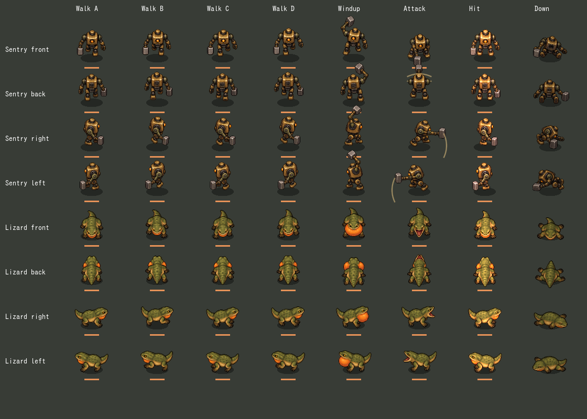
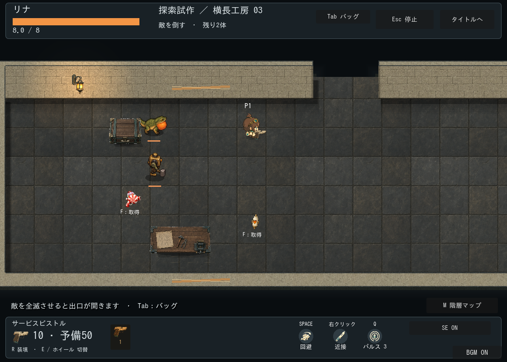
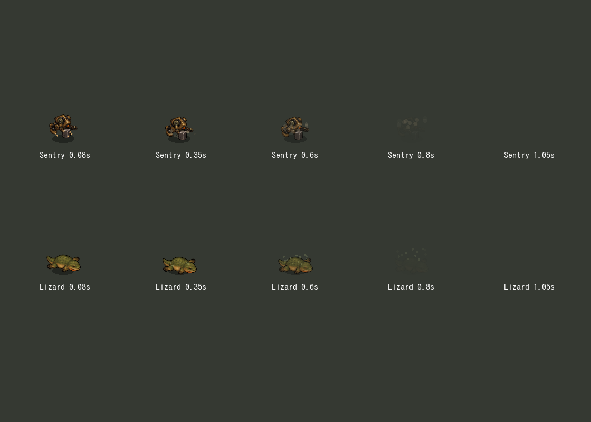
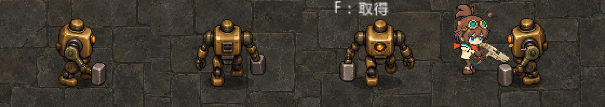
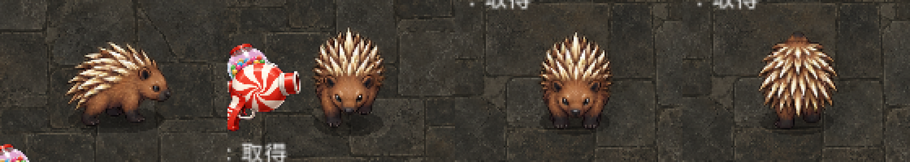
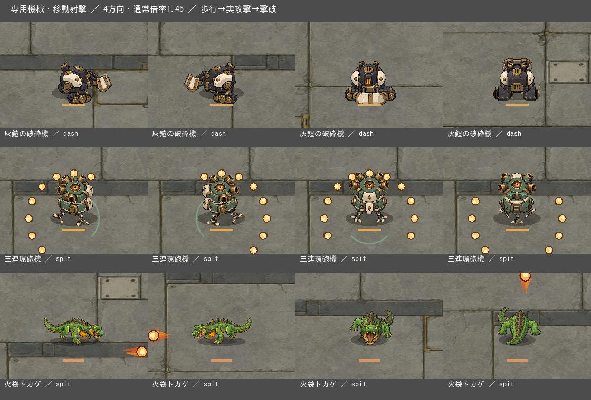
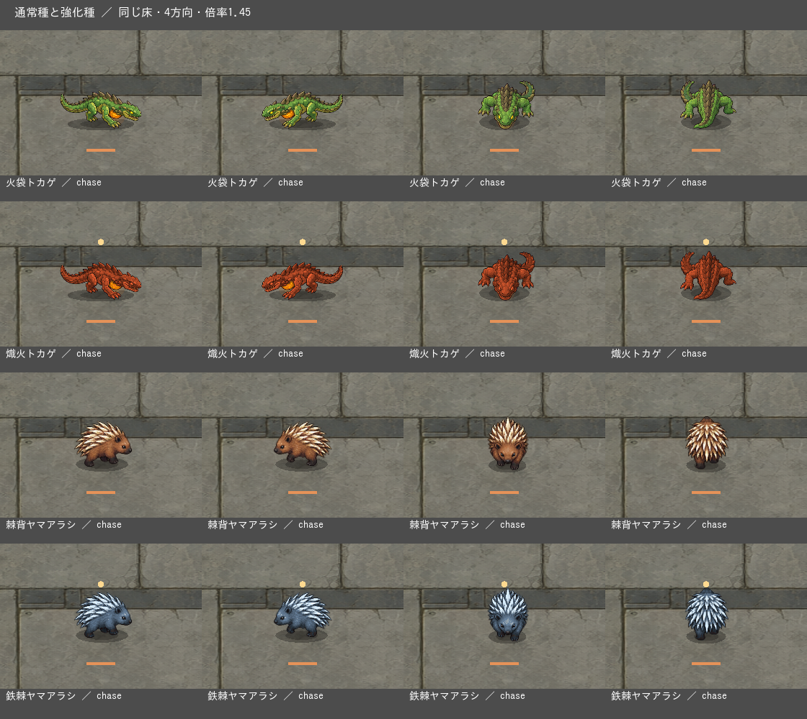
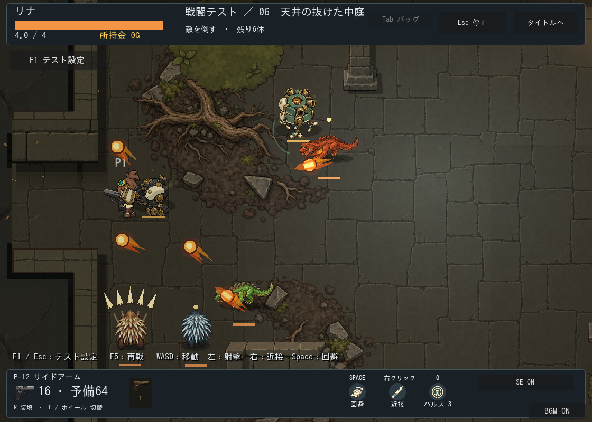
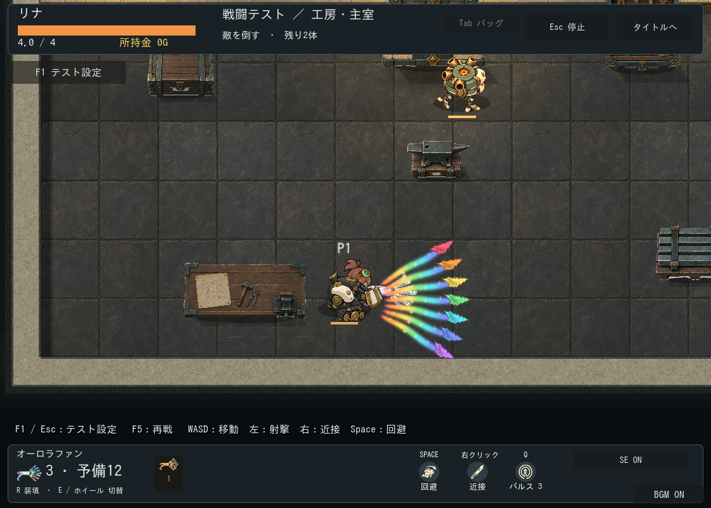
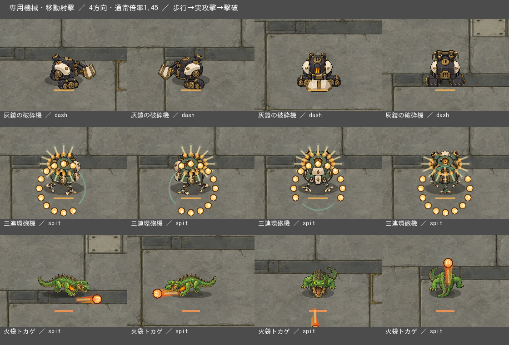

# 通常敵アニメーション v2 制作記録

[仮描画4種の専用素材制作](remaining-machines.md): 2026-10-04、走り番機・浮遊散弾機・破砕番機・環砲機の専用素材を制作し、ユーザー指示で通常起動へ適用済み。

状態: 本編組み込み・自動検証・通常倍率の連続コマ比較済み。ユーザーの最終受入は未確認。ユーザー依頼は敵の拡大とアニメーション残課題の対応。

仕様: 既存の番機・トカゲを参照し、通常表示を約20%拡大。移動・被弾・攻撃判定は変更しない。今回は関節分割案に代わり、両種とも専用コマ方式で全身の整合を優先する。原画は加工せずGodotの領域指定で利用する。

|素材|不足と今回の制作範囲|状態|
|---|---|---|
|番機 atlas v2|前後右左×歩行4・構え・攻撃・復帰・倒れ、32コマ。同じ手にハンマーを維持|本編接続済み|
|トカゲ atlas v2|前後右左×四足歩行4・膨張・開口・復帰・倒れ、32コマ|本編接続済み|
|被弾反応|行動を中断しない短い発光と揺れ|実装済み|
|撃破演出|戦闘Actorから独立した倒れ・退色。停止・離室に対応|実装済み|

接地原点・表示縮尺・領域は生成後のメタデータで確定。方向別の体格・装備・接地・ループを通常倍率の連続フレームで確認する。追加SE生成なし。画像はbuiltin image_genで各1枚を制作し、プロンプトと原本パスを記録する。

## 成果物と組み込み

- 原本: [番機v2](../../../../assets/first-workshop/enemies/sentry-sheet-v2.png)、[トカゲv2](../../../../assets/first-workshop/enemies/lizard-sheet-v2.png)。各32コマ、887×1774 RGBA。
- 送信指示: [番機](sentry-prompt.txt)、[トカゲ](lizard-prompt.txt)。builtin image_gen各1回。旧v1を参照画像とした。追加SE生成なし。
- [manifest](manifest.json)に寸法・ハッシュ・行列順・倍率を保存。実際の生成レイアウトは等間隔でないため、実装のSENTRY_Y/LIZARD_Yと方向別接地原点で領域を指定する。原本画素は未加工。
- 番機0.36倍（通常胴高約52px）、トカゲ0.32倍（横向き全長約64px）。旧版から概ね20%拡大。移動・被弾半径14px、攻撃距離・攻撃時刻は変更しない。
- 歩行4コマは実移動38pxで1周期。停止時は待機へ戻り、画面左方向は専用絵。全身メッシュ変形は撤去した。
- 構え・攻撃・復帰は戦闘位相を使用。被弾時は短い色・位置の変化。倒れ姿勢の表示はActorから独立し0.85秒で落ち着いて退色。死亡判定・報酬は待たせず、ポーズ時は停止、離室・再挑戦で消去する。

専用の関節リグは採用せず、専用コマ方式で歩行・攻撃を実現した。独立した関節の可動を実装済みとは扱わない。歩行コマの体格には小さな揺れがあり、全方向の連続再生の自然さ・斜め攻撃・高負荷時の実機受入は継続確認。専用テストは歩行選択、距離同期、停止、リセット、被弾、Actor退役後の倒れ表示、停止・離室消去をPASS。描画ありの射撃戦闘、近接・宝箱回帰もPASS。一部headless回帰は終了時の既存系統のObjectDB/Resource警告を伴う。

撃破後の消失演出: 本体は0.85秒で退色し、番機は短い火花6粒と埃、トカゲは控えめな土色の粒子を残す。全体は1.1秒で消去。粒子は描画のみで、追加SE・衝突・報酬遅延なし。停止・離室・再挑戦の消去は従来の撃破表示と共通。

0.08／0.35／0.6／0.8／1.05秒を描画確認。自然な連続再生のユーザー受入は別。追加画像・音声生成なし。

## 接地と向きの修正を番機・ヤマアラシへ展開（2026-09-27、ユーザー依頼）

火袋トカゲv3で行った「浮いて見える」修正と「歩行中は進む方向を向く」を、番機・ヤマアラシにも適用した（経緯は[トカゲの制作記録](../fire-pouch-lizard/README.md)）。画像生成なし、攻撃・移動・判定・時刻は変更なし。

|対策|実装|
|---|---|
|影を体に合わせる|`enemy_sheet_visual.gd` の `SHADOWS` に、敵・向きごとの楕円（中心x・中心y・横半径・縦半径px）。シートから測った表示寸法（番機: 正面・背面の幅約56px（ハンマー込み）・横向き約39px、足は原点の線。ヤマアラシ: 正面約39px・横向き約55px）に合わせ、足の接地線の上に置く。腹の下に濃い接地影を重ねる|
|絵全体の上下の揺れ・待機の上下動・撃破時の跳ねをやめる|全ての通常敵で縦の持ち上げを0にした。構え・攻撃で狙う方向へずらす動きは縦成分を0.3倍|
|歩行中は進む方向を向く|`exploration_enemy.gd` の表示状態で、追跡中に歩いている間は実際の移動方向（平滑化）を向く。向きは、今の向きから55°を超えて曲がったときだけ切り替える（斜めの経路での正面⇔横のちらつき防止）。構え・攻撃は従来どおり標的の方向|
|ボスは対象外|独楽の鋳造機は `fire_pouch_lizard.gd` を継承しているため、`face_movement = false` で明示的に外した。直前の変更（トカゲの表示状態で向きを置き換え）では、ボスの追跡中の描画方向にも影響が出る状態だったため、あわせて修正した|

- 本編ループでの撮影: `tools/capture_lizard_motion.gd` に `-- --enemy=workshop_sentry` / `quillback` を追加（部屋にいない種類は、遭遇処理と同じ手順で生成）。それぞれ26秒、エラーなし。番機は、向きの切り替えの許容幅を入れた後、1コマだけの行き来がなくなった（残る2〜4コマの切り替えは経路の実際の曲がり）。
- 目視（Claude）: 番機は両足、ヤマアラシは体の下が影に乗り、影が足より下へずれない。
- 自動テスト: `enemy_motion`・`fire_pouch_lizard`・`quillback`・`exploration_enemy_spawns`・`enemy_audio`・`furnace_warden`・`boss_activity`・`boss_attack_selection`・`boss_cannon`・`boss_presentation`・`boss_pressure`・`boss_rewards` はPASS（`quillback_art` は描画確認用で、PASS表示なし）。
- 未確認: ユーザーの目視確認と採用。
## 2026-09-29：通常敵3種の攻撃演出調整

読了: art/README、VISUAL_STYLE_GUIDE、ENEMY_CREATION_TEMPLATE、ENEMY_BOSS_ART_PLAN、AUDIO_BIBLE、音響manifest、音響CLI README、現行の敵・弾・Sound実装。対象は番機・トカゲ・ヤマアラシ。既存コマと専用SEを流用し、コード描画で発射・振り下ろし・着弾の短い演出と炎の揺らぎを追加する方式。必要な既存SEは揃っている。新規画像・SE生成は0件、原本・接続点の変更なし。SEのゲーム内ゲインを調整する。視認性、音色・混戦での聞き取りはユーザー受入待ち。火力・弾数・攻撃間隔を演出都合で変更しない。

## 2026-10-04 強化個体の初期接続記録（機械2種の美術は下記専用版で更新）

読了: ENEMY_CREATION_TEMPLATE、ENEMY_BOSS_ART_PLAN、既存4種の実装とenemy_sheet_visual。既存方向・歩行・攻撃素材とSEを流用し、新規生成は0枚。通常強化2種（火袋トカゲの連射型、ヤマアラシの三波型）と強敵2種（灰鎧の破砕機、三連環砲機）を別IDで追加する。原本を維持し、描画スナップショットは元型に対応、色調と頭上の印で見分ける。構えと復帰を維持し、無予告の高速化を避ける。自動検証・連続動作・採用は別記する。

4種はレジストリ経由で本編・Visual Hubに接続済み。visual_hub_enemiesの12種×4方向×待機/歩行/実攻撃検査で、攻撃実行・相手生存・射撃敵の発射・片付けまでPASS。灰鎧の破砕機は突進型で弾を出さない。美術は旧素材の派生であり、4体の新規原画を生成したものではない。混戦の連続動作と手応えのユーザー採用は未確認。

## 2026-10-04 専用機械2種・移動射撃トカゲ：制作前仕様

読了：art/README、ENEMY_CREATION_TEMPLATE、VISUAL_STYLE_GUIDE、planning/ENEMY_BOSS_ART_PLAN、development/ASSET_GENERATION_SETUP、imagegen SKILL、候補素材README・asset_check README、対象戦闘/表示/撃破コード。比較基準は採用済みリナ（rina-style-check-2026-09-26/sheet-3x.png）の輪郭・整理した陰影。古い鉱殻イノシシ案は今回の機械2体へ流用しない。

|対象|役割・方式|必要素材・今回の生成|寸法・原点・接続|
|---|---|---|---|
|ash_ram 灰鎧の破砕機|横避けを要求する方向固定突進。履帯車体、前面破砕板を引いて溜め、押し出し、突進、反動と排気。移動距離で履帯を回す|透過3列×3行パーツシート1枚。列=前/後/右（左は反転）。行=車体/独立破砕板/独立履帯ポッド。既存図形素材を置換|表示全幅約62px、高さ約56px。接地中心(0,0)、被弾半径20px維持。車体中心(0,-20)、左右履帯中心±17,-3。破砕板は各方向の前端から±6pxスライド|
|triple_ring 三連環砲機|近寄る方向を選ばせる90度の安全扇形を残す3波攻撃。三脚の支持、砲座開閉、反動、排熱|透過3列×3行パーツシート1枚。列=前/後/右（左反転）。行=胴/独立環状砲座/独立関節付き脚。原本と寸法共通のAtlas領域で組む|表示幅約68px、高さ約62px、被弾半径20px。車体(0,-25)、砲座(0,-34)、脚根元は胴下。後脚→胴→前脚の描画順、脚先の接地と持上げを分ける|
|fire_pouch_lizard / ember_lizard|発射中も低速で間合い調整。発射ごと中央/左右へ小さく分散し横移動を牽制。直前0.12秒の狙い固定と回復時間維持|新規画像なし。既存4方向の歩行下半身と射撃上半身を領域合成し、移動と口の反動を両立|移動は衝突判定付き、死亡/画面外では攻撃中止。他の継承敵には移動射撃を適用しない|

今回の生成範囲は機械2種のシート各1枚。内蔵imagegenを使用、SE生成なし。既存sentry_windup/sentry_swing/sentry_downを流用（音色の採用は別途）。待機・移動・構え・攻撃・復帰・被弾・撃破をパーツ位置・回転で駆動する。戦闘タイマーを描画へ渡し、描画から判定は変更しない。原本/候補を保存して検査し、今回依頼の新規実装として使用場所に別コピーを接続する。ユーザーの美術採用とは区別する。

確認計画：透過・各セルの独立と余白、接続点、通常倍率と拡大、4方向×歩行3周期・攻撃3回、壁・停止・再開・死亡・混成最大6体。全体テストと美術の目視/ユーザー採用は別記録。

## 専用版の接続結果（2026-10-04）

- 生成済み：内蔵imagegenで各1枚。灰鎧の破砕機1254×1254、三連環砲機1233×1275。原本・生成情報とSHA256は `assets/generated/elite-machines/`、候補は `assets/candidates/ash-ram/v1/` と `assets/candidates/triple-ring/v1/`、実行用コピーは `assets/first-workshop/enemies/elite-machines/`。原本画素は未加工。生成情報JSONに原本名・寸法・制作記録を保存した。
- 本編接続済み：`elite_machine_visual.gd` が3方向×3パーツをAtlas参照し、左は右を反転。等分でない行の空白は破砕機0/.355/.68/1、環砲機0/.335/.635/1で分割。車体倍率.135、破砕板.112、履帯.095、環砲座.14。原点は接地中心。三脚は胴内の付け根と足先を結び、歩幅・足上げに合わせ角度と長さを変える。前仕様表の数値は設計目安、実装値は本段落。
- 動作：破砕板の引込み→突進→復帰・排気、履帯の移動距離同期。環砲機は三脚歩行、砲座上昇、射撃反動、安全扇形、排熱。両機の被弾・撃破時の部品崩れと退色を接続。専用SEは未生成、既存番機SEを流用。
- トカゲ：通常・強化型の連射中移動、5段階の小幅分散、限定先読みを接続。既存歩行と吐炎頭部を合成。最後の狙い固定と壁判定・射撃中止条件は維持。
- 検査：候補2枚のasset_checkは各PASS（hard/warnとも0）。1×1の透過・外周検査であり、全パーツの接続品質を自動保証するものではない。専用テストで18領域の存在、移動射撃、分散、先読みと狙い固定、機械ID・撃破分類・反動を確認。
- 描画確認：4方向を歩行3秒・実攻撃17秒・撃破1秒、15fpsで315コマ記録。静止抽出で歩行、攻撃、撃破の接続を確認し、脚が胴から離れる箇所を修正。連続再生の自然さ、混成最大6体・別床での視認性、音色、ユーザー採用は未確認。生成済み・本編接続済みと美術採用を区別する。

[歩行アニメーション](elite-walk.webp) / [連続攻撃](elite-attack.webp) / [撃破](elite-death.webp)

## 強化通常種の識別と混戦確認（2026-10-04）

制作前読了：art/README、VISUAL_STYLE_GUIDE、ENEMY_CREATION_TEMPLATE、ENEMY_BOSS_ART_PLAN、現行描画と敵定義。方式は既存4方向8コマを維持し、描画シェーダーで材質色を置換。熾火の緑の鱗を赤銅、鉄棘の毛を青灰・明るい棘を銀へ分ける。寸法・接地・判定は維持。新規画像/SE生成0件、不足原画なし。通常種との4方向比較、実戦6体・停止再開・撃破を確認する。

配色の反映結果：`enemy_variant_palette.gdshader` で、緑系の鱗を赤銅色、鉄棘の有彩色を明度別の青灰/銀へ置換。元の透過・暗い輪郭・陰影を保持し、図形のHPバーと影は対象外。撃破表示へ同じmaterialを引き継ぐ。画像生成なし。4方向の同倍率比較で識別差を確認。

混成確認：`tools/review_mixed_enemies.gd` で通常/強化トカゲ、通常/鉄棘ヤマアラシ、灰鎧、三連環の6体を中庭・工房主室で各20秒実行。全6体が構え・攻撃・復帰へ遷移、停止再開と撃破を確認。静止抽出では暖色/寒色による種別の判別と炎/棘弾の表示を確認できた。一方、破砕機が主人公と接近・重複する場面では予告を読みづらくなる余地がある。無敵の静止標的による観察であり、回避難度や連続動作の自然さ・聴感の合格とは扱わない。

次の評価：操作しながら接近時の破砕板の溜めを見分けられるか、環砲機の安全方向へ実際に移動できるか、SEを聞き分けられるか。攻撃性能とSEは今回変更していない。

## 機械SEと武器演出の見直し：制作前（2026-10-04）

読了：AUDIO_BIBLE、音響manifest、asset_generator/README、ASSET_GENERATION_SETUP、候補素材/機械チェック手順、敵制作テンプレート、現行Sound・ram_sentry・ring_sentry・elite_machine_visual。破砕機は突進開始、環砲機は斉射成功時に専用音を各1候補生成（計2、再試行なし）。構え・復帰は既存合成方式で固有音を用意。既存番機素材は他敵で使用するため維持。新規画像なし。候補を検査後、依頼範囲の本編接続として使用場所にコピーし、ユーザー試聴採用とは区別する。攻撃性能は維持。

音と表示の対応：破砕板の引込みに低い駆動音、打出しに金属機構と圧力の短音、復帰開始に排気。環砲座の上昇に上昇する共鳴、各斉射に短い三層の破裂、復帰に圧抜き。全周の閃光ではなく砲口ごとの短い光と排煙を使用。オーロラファンは既存倍音合成を維持し、短い煌めきと扇状粒子・虹色の命中へ改善。音源認識・発火回数・停止・重複上限・録音ピークと画面を確認し、聴感は別記する。

### SE/VFXの反映結果

新SE2件は候補保存・機械チェック後に使用中音源へコピーし、本編へ接続。生成済み/本編接続済み、試聴とユーザー採用は未確認。破砕機は打出し時の後方火花と方向の短い予告線、環砲機は実際に射撃できた砲口だけ0.16秒の発光・排煙を追加。壁で塞がれた砲口には発射の光を出さない。原画・攻撃範囲・速度・弾数は維持。

オーロラは7色×2の扇状粒子（射撃方向、命中は逆向き）を0.18〜0.26秒表示し、軌跡に5点の煌めきを追加。粒子上限650と効果40件を維持。全周リングを取り除き、発射方向へ短い色弧を表示。合成音は短い煌めきと端点フェードを追加。

[実再生の録音](machine-aurora-mix.wav)：0〜3秒=破砕機、3〜6秒=環砲機、6〜9秒=オーロラ、9秒以降=同時要求＋BGM。機械音の低音補助、同種集約、ゲーム側のゲイン/コンプレッサーを含む。[測定条件と値](machine-audio-review.json)。録音/ピーク測定を音色の試聴済みとは扱わない。

残る確認：ヘッドホン/スピーカーで音色と危険音の聞き取り、映像と可聴アタックの一致、混戦での継続した手動回避。全38武器の個別SE新規制作は今回の完了範囲に含まない。

4方向の連続記録を更新し、構え/発射の抽出フレームで予告線と砲口発光を目視確認。音のアタックと映像の厳密な同時録画比較は未実施。

## 音色の再指定（2026-10-04）

ユーザー評価：オーロラはもっと神々しく、機械はもっと重厚なメカニック音。読了：音響基準・manifest・現行Sound・生成CLI・共通生成設定。オーロラは聖鐘と無言の合唱的な倍音を短く広げる1候補（0.8秒、発射間隔1.25秒（rateは秒間発射数ではなく間隔））、破砕機は鋼の駆動/ピストンの重い立上り1候補（0.5秒）、環砲は低い金属胴鳴りと砲閉鎖機の斉射1候補（0.5秒、斉射間隔0.5秒）。計3候補、dry-run後に各1送信、再試行なし。候補検査後に依頼された差し替えとして接続、音色の最終採用は別。構えの合成音も低域/金属倍音へ変更予定。原画・VFX・性能は維持。

今回の実行結果：オーロラのdry-run後、1送信がHTTP 400で拒否。詳細原因はレスポンス本文非表示のため未確定。新音源保存なし。破砕機02はdry-runのみ、環砲機02は未実行。AGENTSの通信/パラメーターエラー時停止に従い追加送信・再試行・provider切替なし。ゲームコード・使用中SEは変更していない。今回の音色修正は未完了。

明示的再試行：fw_aurora_divine_02、同条件・新名・allow-repeatでdry-run後1送信。再びHTTP400、新音源なし、機械未送信。無料調査では送信プロンプトが473文字で、ElevenLabs公式ヘルプのSound Effects入力上限450文字を超えると判明。ただしWeb画面向けの説明であり、APIエラー本文を確認できないため今回の直接原因とは断定しない。短縮案290文字を用意、追加送信は停止中。

次回用オーロラ短縮案：One divine rainbow magic shot: immediate sacred bell chord, warm wordless choir-like harmonics and luminous crystalline overtones. Majestic, holy, full-bodied. Smooth short reverberant decay within 0.8 seconds. No melody, speech, lyrics, percussion, harsh laser or beep. No leading silence.

調査参照：[公式Sound Effectsヘルプ](https://help.elevenlabs.io/hc/en-us/articles/25735182995985-What-is-Sound-Effects)（画面上限450文字）、[API仕様](https://elevenlabs.io/docs/api-reference/text-to-sound-effects/convert)。短縮案fw_aurora_divine_03はdry-runのみ確認済み、未送信。

### 短縮版の生成成功と接続

ユーザーの再送承認後、オーロラ03（290文字）が成功。続けて短い指示文の破砕02・環砲02も各1回成功。dry-run後3送信、候補追加なし。オーロラの聖鐘/合唱的倍音、機械の鋼鉄/油圧/低い胴鳴りを指定。原画・VFX・性能は今回変更なし。

生成情報は音響manifest、候補はaurora-divine/v3・ash-ram-launch/v2・triple-ring-salvo/v2、本編音源はassets/audio/se。候補原本を保ち同内容を本編へコピー。検査は機械2音PASS、オーロラWARN（原音ピーク-0.06dBFS）。3音とも音割れ0、先頭無音0ms。元音は未加工、再生側のゲインで補正。機械は低域中心なので短い金属倍音の合成音を重ねた。神々しさ・重量感は狙いであり、試聴採用済みとは扱わない。

[差し替え後の録音](machine-aurora-divine-mix.wav)：破砕0〜3秒、環砲3〜6秒、オーロラ6〜9秒、以降は同種集約ありの6体分要求＋オーロラ＋BGM。[測定値](divine-heavy-audio-review.json)。指定条件でクリップ0。音色、スピーカーでの低音の聞こえ方、映像との可聴同期はユーザー確認待ち。

2026-10-04、ユーザーの「一旦これでOKです」によりオーロラ03・破砕02・環砲02の現行SEを暫定採用。機器別の聞こえ方・最大混戦の聴感を別途検証したという意味ではない。
