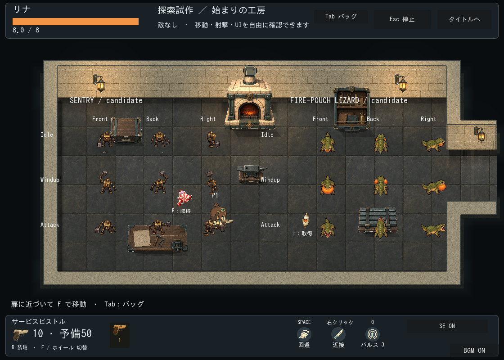
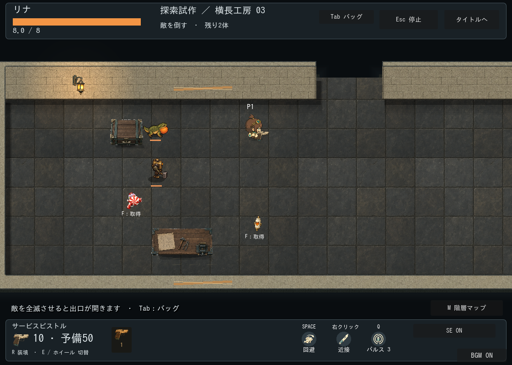
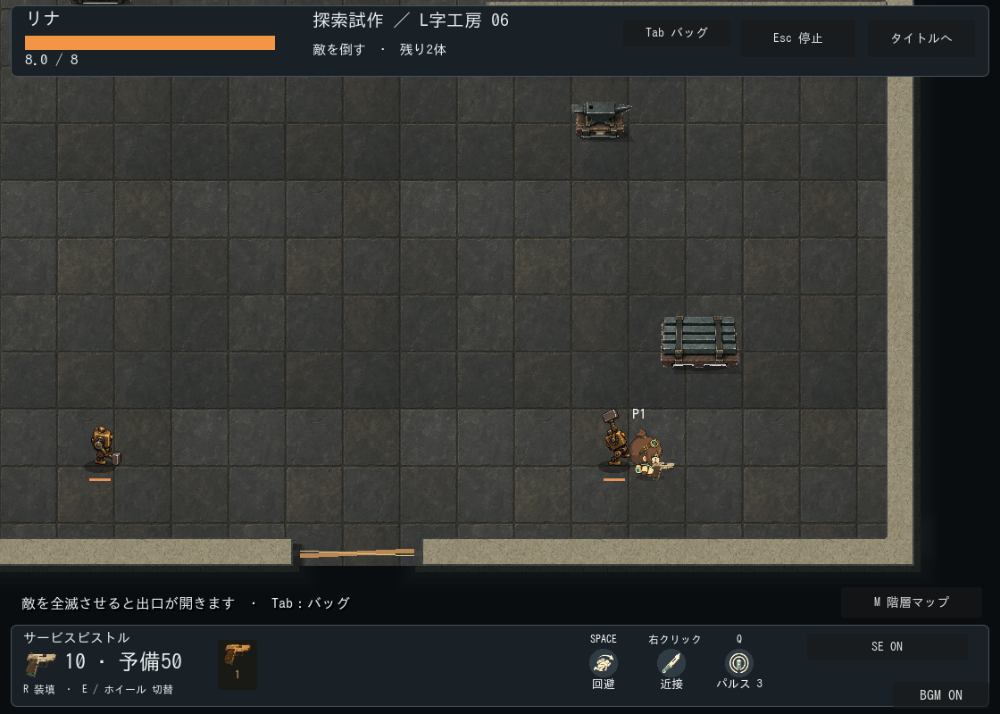

# 通常敵2種：外見候補 v1

後継: [アニメーションv2](../enemy-animation-v2/README.md)。現在の本編はv2を使用。以下はv1の制作・初期組み込み記録。

状態: 2026-09-22、ユーザーの反映依頼により本編へ組み込み済み。美術上の最終受入は未確認。ユーザーの戦闘確認では問題なしとの報告を受領したため、次に外見と動作の素材化を開始した。今回の画像自体のユーザー採用とは区別する。

## 生成物と再現情報

built-in image_genで各1回、合計2回生成。既存CLIのAPI設定は変更していない。原本の画素編集なし。両方1254×1254 RGBA、透明部分あり。完全なパーツ分割・歩行アニメーションではなく、全身の外見と動作の候補シート。

|素材|原本|送信プロンプト|
|---|---|---|
|工房番機|[sentry-sheet-v1.png](../../../../assets/first-workshop/enemies/sentry-sheet-v1.png)|[sentry-prompt.txt](sentry-prompt.txt)|
|火袋トカゲ|[lizard-sheet-v1.png](../../../../assets/first-workshop/enemies/lizard-sheet-v1.png)|[lizard-prompt.txt](lizard-prompt.txt)|

列は前・後・右、行は待機・構え・攻撃。各418×418の9領域をGodotで表示。番機は0.14倍、トカゲは0.15倍の固定縮尺で、コマごとの自動拡大はしない。[manifest.json](manifest.json)に原本SHA-256、領域、表示倍率を記録。alpha非ゼロ境界は薄い画素を含む診断値であり、切り出しや当たり判定には使用しない。接地原点は未校正。

## 通常サイズの確認



[専用プレビュー](../../../../tests/enemy_art_preview.gd)をGodotで実行して取得。既存の工房とプレイヤーを比較対象とし、候補は画面上のギャラリーとして重ねている。家具との重なりは実際の配置・前後関係の受入確認を意味しない。

```powershell
& .local/tools/Godot_v4.7.2-stable_win64_console.exe --path . --script res://tests/enemy_art_preview.gd
```

出力は `.local/enemy-art-preview.png`。描画ありで実行し保存成功、エンジンエラーなし。通常倍率の静止画で、機械と生物の輪郭の違い、ハンマーの持ち上げ、喉袋の膨張を目視確認した。連続動作の読みやすさは未確認。

## 本番組み込み前の修正・不足素材

- 番機の前・後の打撃が横振りに見え、固定した攻撃方向と一致しない。正面・背面それぞれの狙う方向へ振り下ろす素材が必要。持ち手の左右も全コマで統一する。
- 足元の位置と体格がコマ間で揺れる。共通の接地原点・胴寸法を確定し、手・口・喉袋の接続点を記録する。現在の9コマをそのまま連続再生しない。
- 番機の胴・腕・ハンマー、トカゲの胴尾・頭口・喉袋・脚を分離し、歩行・攻撃復帰・被弾・死亡を制作する。左右非対称の番機は安易な反転で装備側を変えない。
- 薄い周辺画素があるため、暗い床と明るい床の双方で縁を確認する。必要なら原本の再編集を行う。
- 影と発光は独立させ、家具との前後関係、複数敵と弾の重なり、実ゲームの連続動作で再確認する。

戦闘のダメージ時刻・予備動作時間・射撃間隔・判定半径は変更していない。以下の初期組み込みを実施。上のパーツ分割・方向の修正・美術受入は今後の改善項目。


## 本編への初期組み込み

[enemy_sheet_visual.gd](../../../../scripts/visuals/enemy_sheet_visual.gd)で原本から直接描画。行の実境界はy=0/390/830、各コマに接地アンカーを指定し、番機0.17倍・トカゲ0.15倍。上の比較ギャラリーの矩形とは異なる。原本の画素加工なし。

前・後・右と、右を反転した左を選択。斜めは近い方向へ丸める。構えはwindup、トカゲの開口はspit、番機の打撃はrecover開始0.2秒に対応。死亡時は画像を非表示。HP表示と影は別描画。番機の前後打撃の原画はまだ狙う方向と完全一致せず、固定された攻撃方向に短い軌跡を表示する。左反転では装備の持ち手が変わるため、将来の専用左向き素材で改善する。歩行には実移動距離に同期した連続メッシュの足運び・体の上下動を追加。待機の呼吸、構えの引き、発射・打撃の反動も追加。画像のUVは固定で原本は変更しない。専用歩行コマ・関節パーツ・死亡アニメーションは未実装。





本編シーンを使った描画ありのfire_pouch_lizard / exploration_encounterテストがPASS。両種の表示と構えを通常サイズで目視確認。素材がゲームから使われる状態と、全方向・全動作の最終美術受入は区別する。
