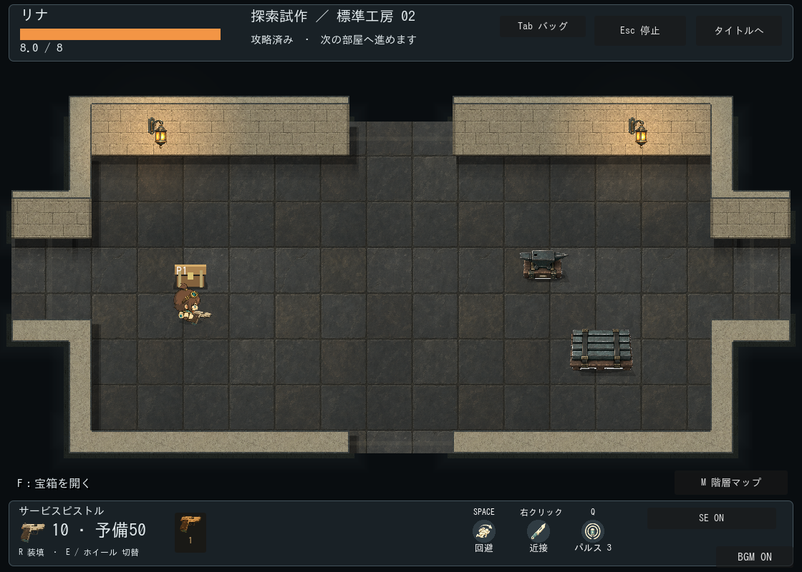
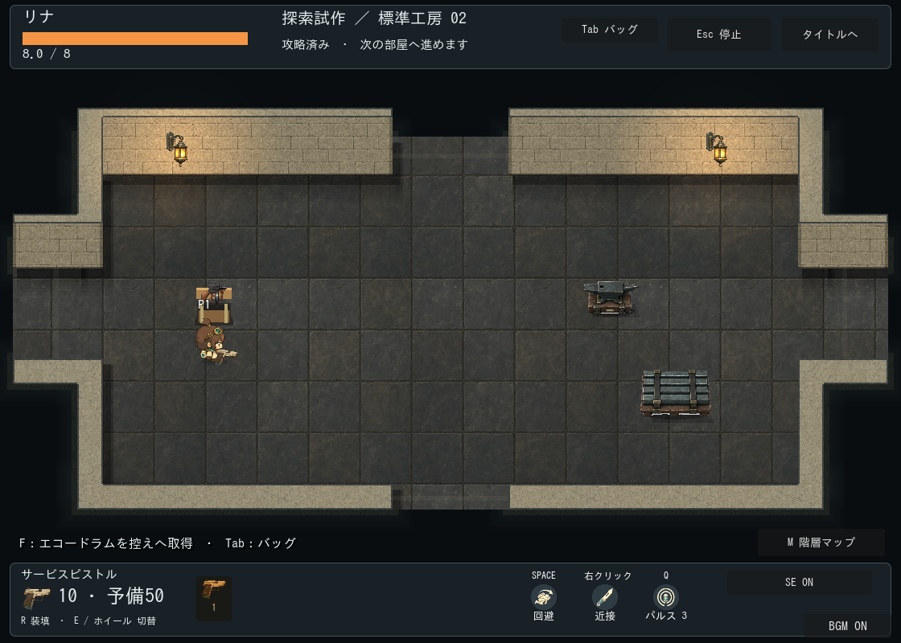
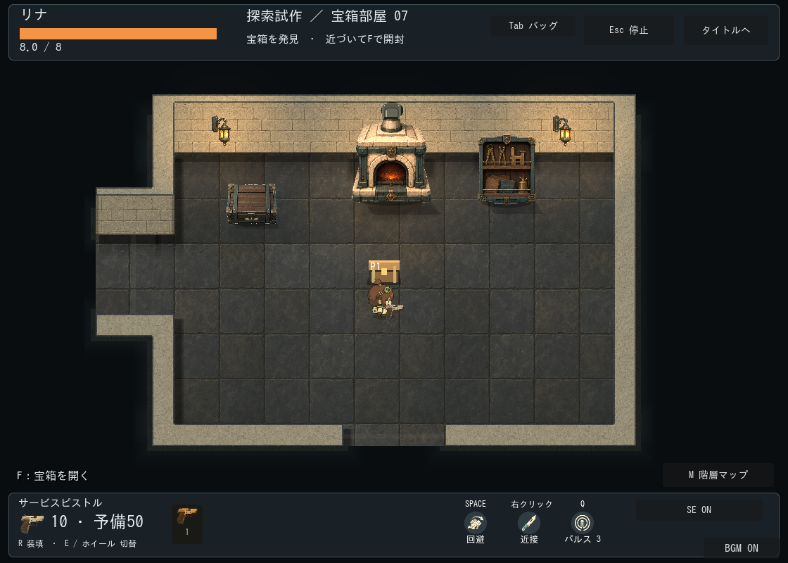
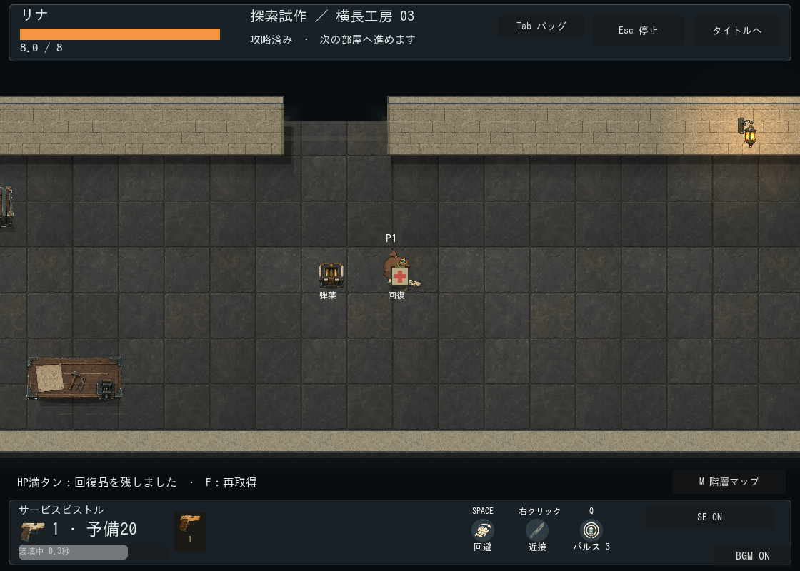

# 探索の宝箱と補給：仮演出

区分: 制作・検証記録。本編接続済み、正式美術・ユーザー受入は未完了。[現行ルール](../../../design/GAME_RULES.md)、[今後の報酬案](../../../planning/EXPLORATION_REWARDS.md)。

仕様票: 工房の初戦クリア報酬と宝箱部屋。幅44px程度の低い木箱、見下ろしの蓋・正面・留め具・内部・影をコードで描画。武器アイコンは既存画像。新規画像・SE生成なし。箱には衝突を追加せず、到達可能で壁・家具・扉から離れた位置へ置く。

原本・派生レシピ: `scripts/world/exploration_chest.gd` の図形描画。独立した画像原本なし。出現は0.4秒の拡大、開封は0.35秒の蓋移動、開封後は武器を上に表示。閉／開／空を進行データで保持し、再訪では演出を再生しない。既存SEの出現・開封・取得を流用。

通常サイズの画面で箱と内容表示を確認。専用テストの描画あり実行がPASS。正式な蓋の回転・発見演出・希少度表現・連続操作の気持ちよさ、SEの試聴、全seed配置は未確認。現在の仮描画を正式素材完成と扱わない。

## 宝箱部屋・補給の追加

仕様票: 宝箱部屋は既存の小部屋880×600と工房テーマを再利用。壁・扉・家具の倍率や接続は変更しない。箱は共通44px、弾薬は36×36px、回復キットは26×29px程度。床に置く低い品として扱い、非衝突・人物と共通のYソートに配置。到達性と相互96px間隔、扉・到着点からの余白は配置処理で確保する。

素材一覧と原本: 箱は前述のコード描画、弾薬はassets/first-workshop/ammo.png、回復キットはscripts/world/exploration_supply.gdの図形描画が原本兼レシピ。派生画像と有料生成は追加しない。正式な回復品画像、箱の蓋と材質表現は後続候補。

通常サイズで表示を確認。5seed/35部屋の配置テストがPASS。仮素材のユーザー採用、連続操作、補給量のバランス、SE試聴は未確認。
