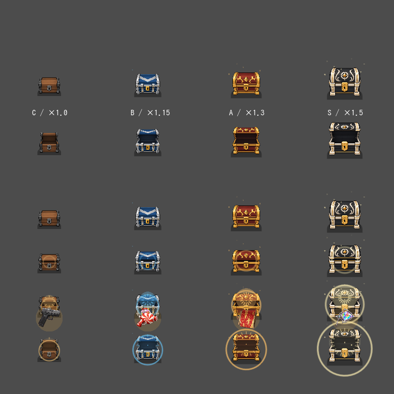
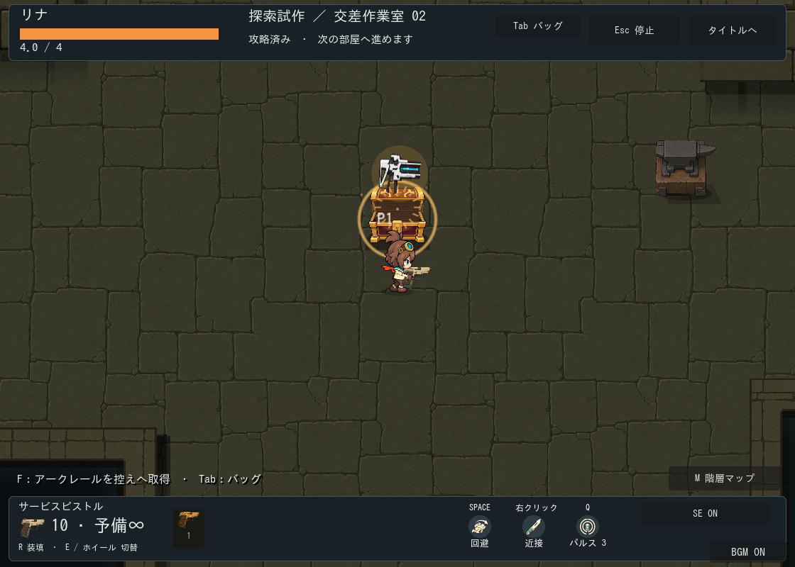
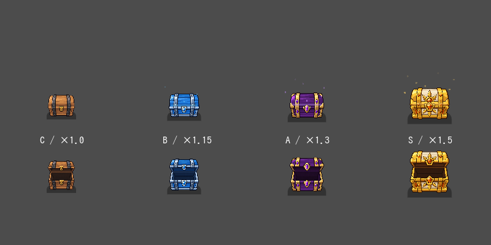
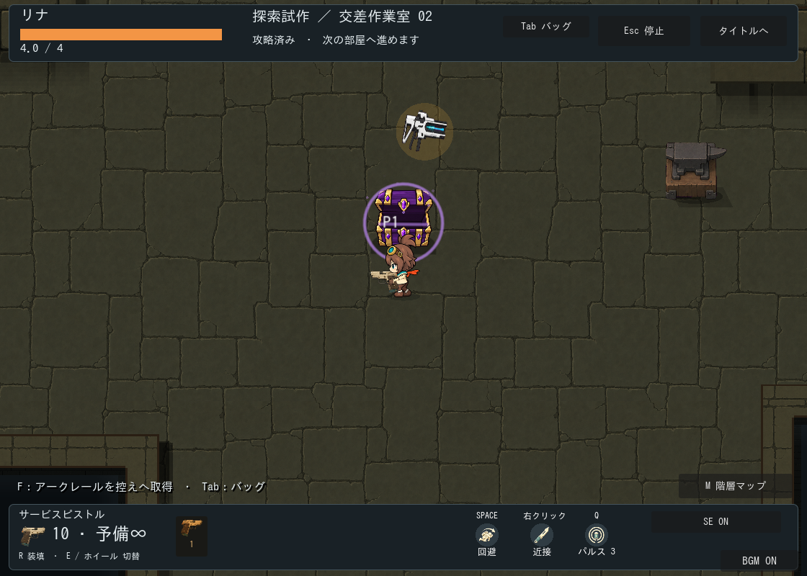
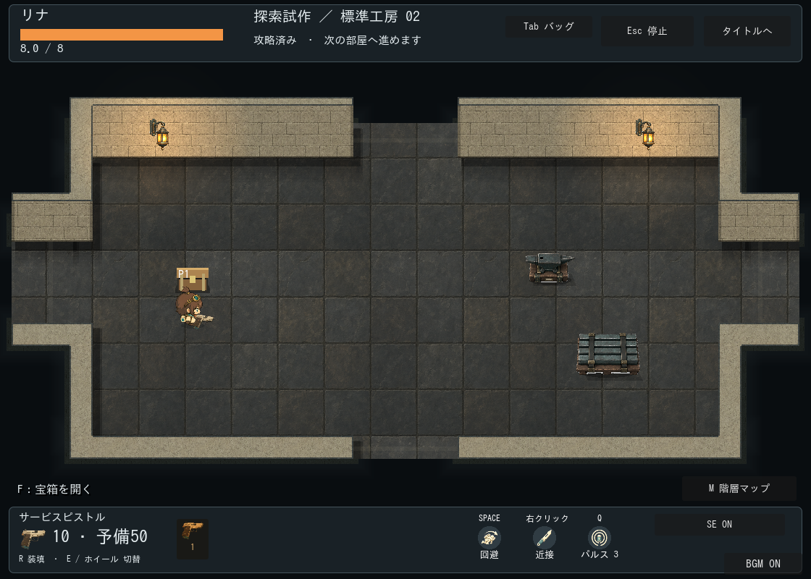
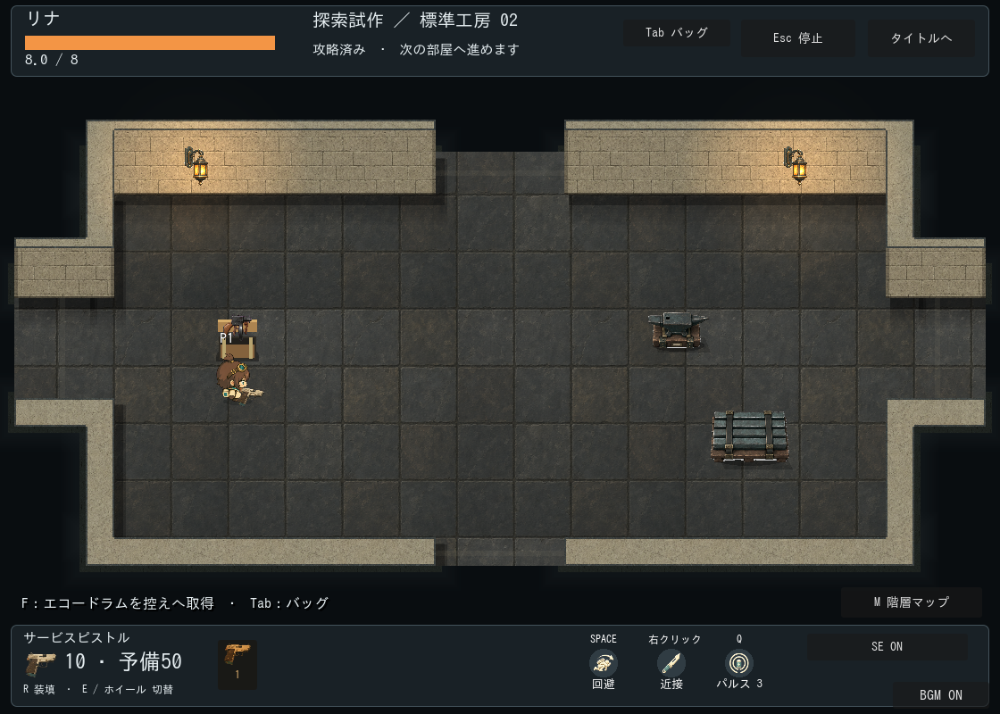
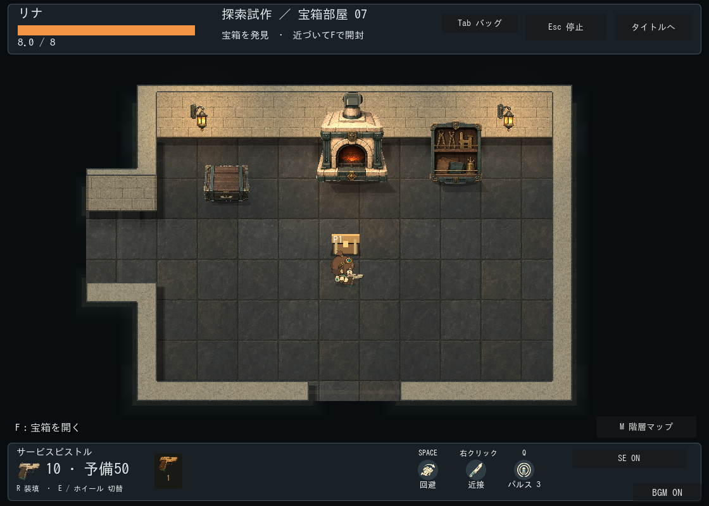
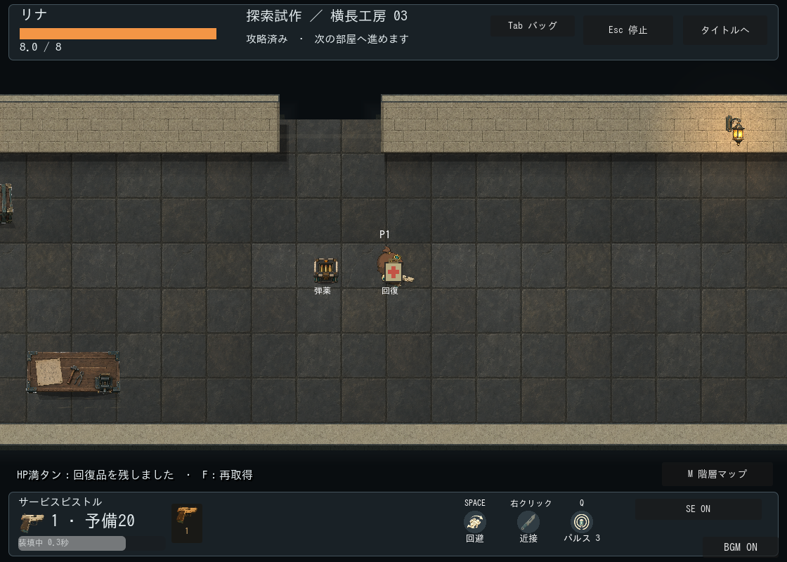

# 探索の宝箱と補給：仮演出

## 採用版の実行素材と演出（2026-09-29、生成・本編接続済み）

内蔵imagegenで4枚・16コマを生成。原本と各生成文はassets/sprites/chests/rarity-v2、manifest.jsonにSHA-256と切出し矩形。原本無加工のAtlas描画、tools/chest_atlas.gdでalpha>.5の境界と3px余白を測定する。レア内は閉コマ幅から共通縮尺、各コマ下端をy=10へ合わせる。Cの開コマは原画で幅がやや狭く、剛体として完全一致ではない。蓋は4段階再生で、連続した3D回転ではない。

溜め0.12秒、少し開/半開/全開、着地埃、閃光・放射粒子、全開後の飛び出しを接続。SEは前回実装を維持、新規生成なし。chest_rarity（全4段階・着地寿命・SE・ミュート）、exploration_reward（停止・回収・再訪）、production_doors（25移動・ボス回収と出口）が描画ありPASS。通常倍率と実床の静止画を目視確認。ログ/キャッシュ/証明書の環境エラーあり。実プレイでのテンポ・聴感・ユーザー受入は未確認。

最新依頼に基づきv3の採用意匠を本編へ反映する。既読のart入口・VISUAL_STYLE_GUIDE・STAGE_CREATION_TEMPLATE・STAGE_ASSET_GUIDE・STAGE_TEMPLATES・生成設定とimagegenスキルを適用。内蔵imagegenで各レア1枚、2×2の閉／少し開／半開／全開空箱、計4枚16コマ。参照はcomp-traditional-v3.png。上面主体の正投影、共通の箱幅・足元・光源、背景透過。床影・光・粒子は別描画。原本と生成文はassets/sprites/chests/rarity-v2、切出し座標・原点・ハッシュを台帳化。既存44pxと倍率差を維持し、蓋の段階表示・開封フラッシュ・放射粒子・着地埃を接続。既存レア別SEを流用し、新規音生成なし。停止・再訪・回収との整合と通常サイズ画像を検査。原画の一致・自動検査・手動受入は区別する。

## 王道箱の装飾追加（2026-09-29、デザイン採用）

ユーザーが「一旦これで行きましょう」と評価し、comp-traditional-v3.pngを当面の採用デザインとした。C=茶木と鉄、B=青と銀の山形、A=赤茶と金の曲線、S=黒と銀紋章・金縁。箱の輪郭を保つ方針も採用。これはカンプの採用であり、本編のrarity-v1を置換した意味ではない。次工程はこの意匠を維持した透過の閉/開素材、開封時の模様整合、通常倍率確認、本編置換。旧比較案は比較履歴として保持する。

内蔵imagegenでv2を編集し、[装飾版カンプ](comp-traditional-v3.png)を保存。[生成文](comp-traditional-v3-prompt.txt)。Cは鍵穴金具、Bは銀の山形、Aは金の曲線、Sは銀の紋章と金縁を追加。元の箱形・配色・配置が概ね保持されたことを目視確認。本編変更なし。下段は生成見本で、実ゲーム倍率や開封時の模様整合は未検証。

依頼: 宝箱の形を維持し、装飾をもう少し追加。comp-traditional-v2.pngを編集対象として内蔵imagegenでカンプ1枚を制作する。共通画風・ステージ規格・imagegenスキルを継続適用。C/B/A/Sの輪郭・比率・色・視点と配置を保持し、金具の面取り、縁取り、留め具と蓋の大きな紋章を追加。Cは控えめ、Sほど豊かにする。細かな模様の密集・角や翼・形状変更は避ける。カンプのみ、本編置換・開封コマ・SEは対象外。

## 王道の宝箱へ修正（2026-09-29、生成済み・採用待ち）

結果: [比較カンプ](comp-traditional-v2.png)を1枚生成。[生成文](comp-traditional-v2-prompt.txt)。C=平蓋の木箱、B=青い補強箱、A=赤茶と金の丸蓋、S=黒と白銀の背高箱。箱の範囲内で蓋と金具・比率を変える方向へ修正。下段は生成された縮小見本であり、実ゲーム倍率での検査ではない。本編未変更、ユーザー採用待ち。

ユーザー指示: 添付例に近いイメージ、奇抜さは不要。前案の壺・花・舟などの発想を外し、一般的な宝箱としてレア別の比率・蓋・材質・脚・金具に差を付ける。内蔵imagegenでC/B/A/S横並びカンプ1枚。添付例は素朴→豪華の段階と宝箱らしさの参照、リナfront.pngは滑らかな輪郭・整理した陰影の主参照。図柄の再現、ドット絵化はしない。既読の共通美術規格・ステージ規格・imagegenスキルを継続適用。今回も比較のみで本編変更なし。

## 機械感を抑えた追加案（2026-09-29、生成済み・採用待ち）

内蔵imagegenで3枚・12案を制作。木革の王道案、森の丸い収納、陶器・布の宝物入れを目視比較。本編変更なし。森案の背景が暗くラベルと下段の視認性が低い点、各案の視点と細部量は正式素材化前に調整が必要。縮小実測・開封構造は未検証。

- [王道案](comp-classic-v1.png) / [生成文](comp-classic-v1-prompt.txt)
- [森の案](comp-forest-v1.png) / [生成文](comp-forest-v1-prompt.txt)
- [宝物入れ案](comp-keepsake-v1.png) / [生成文](comp-keepsake-v1-prompt.txt)

ユーザー評価: 工房案は機械的すぎる。今回の範囲は比較カンプ3枚、各C/B/A/S。既読の共通画風・ステージ素材規格・imagegenスキルを継続適用し、リナfront.pngの線と塗りを参照。木革の古典的宝箱／森の職人の収納／陶器と織物の宝物入れを比較する。歯車・圧力金庫・厚い機械装甲を避け、各レアを異なる輪郭にする。内蔵imagegen、本編変更・開封素材・音生成なし。原画と生成文を保存し、形の比較と実行素材の検証を分ける。

## 追加カンプ3方向（2026-09-29、生成済み・採用待ち）

内蔵imagegenで3枚・計12デザインを生成。各図のC/B/A/Sを目視比較済み。本編変更なし。下段は生成された輪郭検討であり、ゲーム内の縮小実測ではない。遺跡案は質感が細かく、実行素材化では簡略化が必要。冒険案は見下ろしが浅めで、背景周囲の透過も不均一なため、そのまま実行素材として採用しない。現段階は形の比較用。

- 工房: [カンプ](comp-workshop-v1.png) / [生成文](comp-workshop-v1-prompt.txt)。木箱・円筒金庫・六角収納・両開き強化箱。
- 遺跡: [カンプ](comp-ruins-v1.png) / [生成文](comp-ruins-v1-prompt.txt)。石箱・壺・八面体・階段状の封印箱。
- 冒険: [カンプ](comp-adventure-v1.png) / [生成文](comp-adventure-v1-prompt.txt)。革鞄・横樽・扇形・舟形の宝箱。

ユーザー依頼: 複数案の比較。直前に読了した共通画風・ステージ素材規格とimagegenスキルを継続適用。内蔵imagegenで比較ボード3枚、各C/B/A/Sの4種類。方向は工房の道具／古代遺跡の封印／冒険の宝物。色違いにせず、輪郭・材質・蓋構造を変える。リナfront.pngを線と塗りの参照に使用。カンプのみで、本編接続・開封コマ・SE生成は今回の範囲外。通常倍率・開封構造と採用は後続確認。

## 輪郭を分けるカンプ（2026-09-29、生成済み・採用待ち）

結果: 内蔵imagegenで比較カンプ1枚を生成。道具箱／機材ケース／丸い祭具／王冠形として輪郭の差を目視確認。下段は生成されたシルエット比較で、実行素材からの抽出ではない。通常ゲーム倍率・開封構造は未検証。本編変更なし。[原画](design-comp-v2.png)、[生成プロンプト](design-comp-v2-prompt.txt)。

ユーザー評価: rarity-v1は同形状の色違いに寄りすぎ。参考画像の意図はレアごとに形を変えること。今回の依頼はデザインカンプのみで、本編置換はしない。

読了資料: 本記録、art/README、VISUAL_STYLE_GUIDE、STAGE_CREATION_TEMPLATE、STAGE_ASSET_GUIDE、STAGE_TEMPLATES、imagegenスキル（共通規格は直前の制作から継続適用）。リナfront.pngを線・塗りの主参照とする。方式: 内蔵imagegenで4案を並べた比較カンプ1枚。C=平たい木製道具箱、B=角張った鉄製機材ケース、A=丸蓋と張り出した脚の紫の祭具箱、S=王冠状の蓋と中央封印を持つ黒金の遺物箱。見下ろし正投影、水平辺は水平。参考ゲームの図柄そのものは再現しない。

今回の生成範囲: 閉じた4案の比較画像1枚のみ。必要な開封コマ・分離パーツはデザイン採用後に制作。カンプを実行素材と混同しない。原画と生成文をこの制作フォルダーへ保存し、形の差と通常サイズでの読みやすさを確認する。

## レア度別正式素材の制作（2026-09-29、生成・本編接続済み）

結果: 内蔵imagegenで4シート（各1774×887、RGBA）を生成し、通常箱の図形描画を置換。原本は実行素材と同じ assets/sprites/chests/rarity-v1 に無加工で保存（当初予定のassets/generatedへの重複保存は行わない）。各prompt.txtが実際の生成文、manifest.jsonにSHA-256・生成方式を記録。Cはリナ、B/A/SはC原画を参照。切出しはexploration_chest.gdのCHEST_REGIONS。閉コマ幅に共通縮尺を合わせ、開コマの下端もy=10へ固定。背景透過を確認し、輪郭外の微小alphaを含む余白はAtlas領域で除外する。床影・粒子・光輪は別描画。

開封は0.16秒の揺れ後に閉→開の2コマ切替、全体0.85秒と飛び出しを維持。中間の蓋回転素材は未制作。閉/開の通常サイズ比較と探索画面を目視。chest_rarity、exploration_rewardは描画ありPASS。既存環境エラー・終了時警告あり。連続動作の手動評価・ユーザー採用は未完了。

読了: art/README、VISUAL_STYLE_GUIDE、STAGE_CREATION_TEMPLATE、STAGE_ASSET_GUIDE、development/STAGE_TEMPLATES、ASSET_GENERATION_SETUP、imagegen/SKILL。リナのfront.pngを描き方の参照として使用。

方式: 内蔵imagegenでC/B/A/S各1枚の透過シートを制作。各シートは横2区画、左が閉、右が開いた空箱。箱底の位置・縮尺・正投影の向きを一致させる。強い見下ろし、水平辺は水平、左上光源、暗い滑らかな輪郭と3段階の陰影。木・鉄・真鍮、青/紫/金のレア色。床・影・粒子・アイテムを焼き込まない。

必要素材と不足: 4種×閉/開の8コマが不足。影、光、出現/開封の時間管理、アイテム飛び出し、SEは既存実装を流用。今回は通常武器/レリック共通のレア別箱を制作し、ボス専用素材は流用。生成範囲は4シート、追加SE生成なし。

実装仕様: 原本はassets/generated、実行素材はassets/sprites/chests/rarity-v1。基準幅44px、倍率C/B/A/S=1/1.15/1.3/1.5。足元中央を原点とし、閉/開の幅と底面を合わせる。非衝突・既存Yソート・既存配置余白を維持。切出し矩形と原本ハッシュは素材台帳へ記録。確認は4種の閉/開比較と探索画面、状態・再訪テスト。生成済み・本編接続済み・目視・ユーザー採用を別々に記録する。

区分: 制作・検証記録。本編接続済み、正式美術・ユーザー受入は未完了。[現行ルール](../../../design/GAME_RULES.md)、[今後の報酬案](../../../planning/EXPLORATION_REWARDS.md)。

仕様票: 工房の初戦クリア報酬と宝箱部屋。幅44px程度の低い木箱、見下ろしの蓋・正面・留め具・内部・影をコードで描画。武器アイコンは既存画像。新規画像・SE生成なし。箱には衝突を追加せず、到達可能で壁・家具・扉から離れた位置へ置く。

原本・派生レシピ: `scripts/world/exploration_chest.gd` の図形描画。独立した画像原本なし。出現は0.4秒の拡大、開封は0.35秒の蓋移動、開封後は武器を上に表示。閉／開／空を進行データで保持し、再訪では演出を再生しない。既存SEの出現・開封・取得を流用。

通常サイズの画面で箱と内容表示を確認。専用テストの描画あり実行がPASS。正式な蓋の回転・発見演出・希少度表現・連続操作の気持ちよさ、SEの試聴、全seed配置は未確認。現在の仮描画を正式素材完成と扱わない。

## 宝箱部屋・補給の追加

仕様票: 宝箱部屋は既存の小部屋880×600と工房テーマを再利用。壁・扉・家具の倍率や接続は変更しない。箱は共通44px、弾薬は36×36px、回復キットは26×29px程度。床に置く低い品として扱い、非衝突・人物と共通のYソートに配置。到達性と相互96px間隔、扉・到着点からの余白は配置処理で確保する。

素材一覧と原本: 箱は前述のコード描画、弾薬はassets/first-workshop/ammo.png、回復キットはscripts/world/exploration_supply.gdの図形描画が原本兼レシピ。派生画像と有料生成は追加しない。正式な回復品画像、箱の蓋と材質表現は後続候補。

通常サイズで表示を確認。5seed/35部屋の配置テストがPASS。仮素材のユーザー採用、連続操作、補給量のバランス、SE試聴は未確認。
