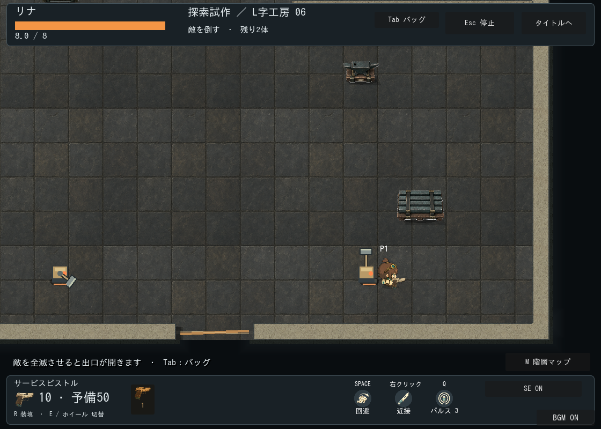
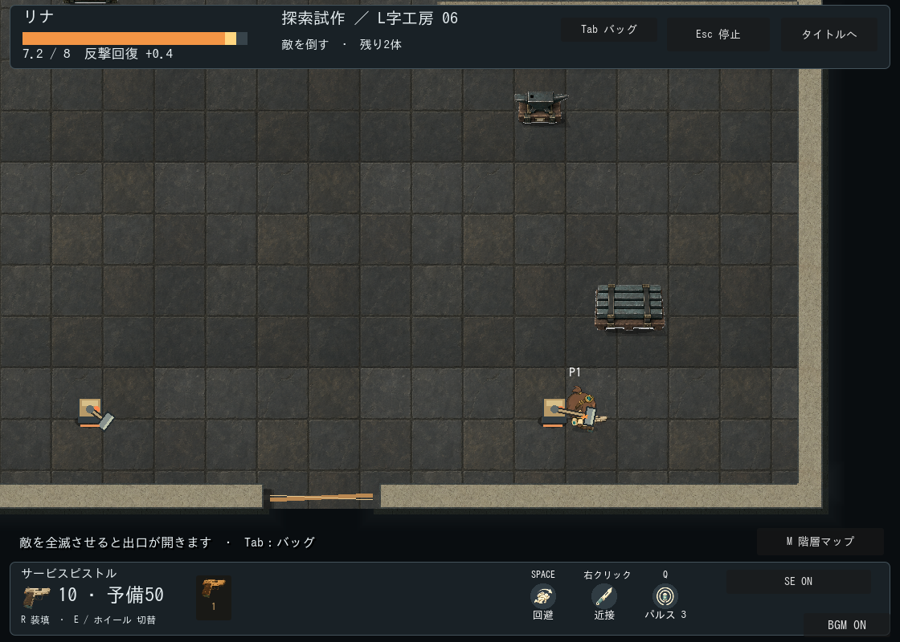
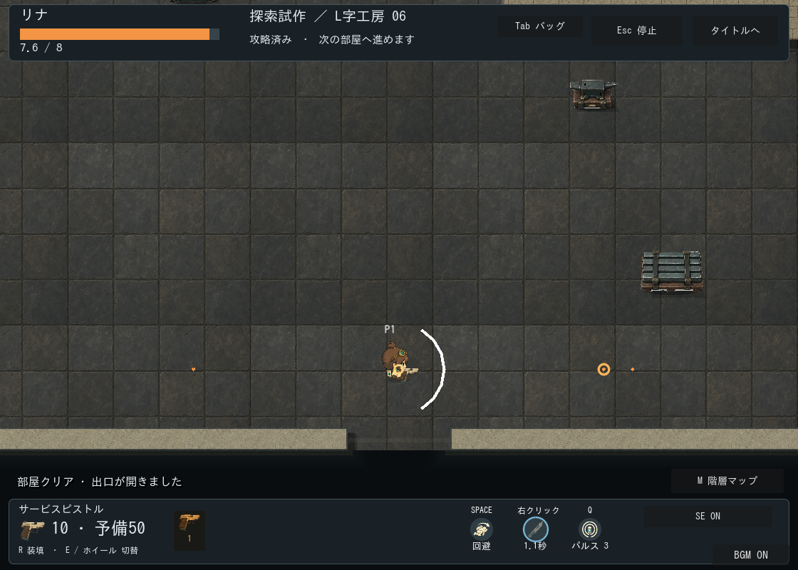

# 探索の最初の敵・仮表示（2026-09-22）

| 仕様 | 内容 |
| --- | --- |
| 用途 | ランダム工房の通常室、近接敵1系統の挙動確認 |
| 部屋 | 既存生成版2。床・壁・家具の配置と倍率を維持 |
| 出現 | 入室位置から260px以上、敵同士128px以上、通行経路上に2体 |
| キャラ比 | 敵の本体30×30px、当たり半径14px。プレイヤーを縮小しない |
| 仮素材 | コード描画の黄銅色の箱型番機、接地影、目、HP線 |
| 予告 | 床扇形なし。工具の引き上げと上体の引き、最後に打撃、硬直後に復帰。0.65秒・方向固定。判定は62px・120度を維持 |
| 出口 | 既存開口に横棒を仮描画。四方向共通。F移動禁止、追加物理壁なし |
| 状態 | 全滅で横棒と敵を消し、探索を続ける。再訪で復活しない |

追加生成なし。原本・派生画像はなく、描画レシピは `scripts/visuals/sentry_visual.gd` と `scripts/world/exploration_door.gd`。敵の攻撃時間・方向は `scripts/combat/exploration_enemy.gd` の値スナップショットから取得。既存のPlayerシーンを被弾・移動の接続に使用し、身体/装備画像とアニメーションは敵側で非表示にする。壁接続の面割当と当たり判定は変更しない。

1120×800、seed22、描画ありの `tests/exploration_encounter.gd -- --capture`。構え・打撃の工具位置が通常倍率で異なることを目視確認。HP表示も打撃後に更新して撮影。旧床扇形は[置換前の画像](windup-floor-legacy.png)に履歴として保存。108入口の安全な出現/接近経路、通常6室の戦闘と往復、停止、被弾、参照破棄は自動検証。

**未確認・後続**：正式美術のユーザー採用、手動プレイの難易度/複数敵の読みやすさ、Web負荷。正式な敵の見下ろし素材、移動/死亡アニメーションと今回の攻撃パーツの正式化、出口の開閉素材、予告/解放音は今後検討。P3は3系統中の1系統で、報酬とボスは対象外。

動作予告への置換検証：headlessと描画ありの遭遇テストがPASS。通常権限の実行ではログ/証明書/描画キャッシュの環境エラーとObjectDB警告が出たため、描画ありは必要な権限で再実行し、警告なしでPASSを確認した。Godotエディタのインポートも成功。確認画像は静止した位相の比較であり、連続操作・複数敵の読みやすさ・ユーザー採用の確認を代替しない。
