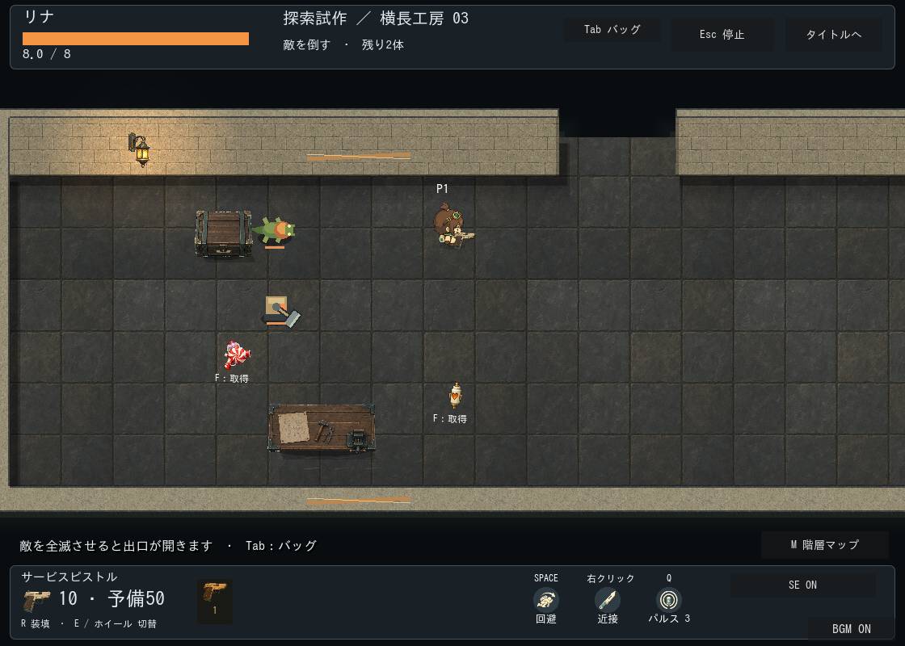

# 火袋トカゲ：射撃・混成の試作と素材仕様

区分: 制作・検証記録／正式素材は未制作。2026-09-22。
正本: [現行動作](../../../design/GAME_RULES.md)、[敵の美術案](../../../planning/ENEMY_BOSS_ART_PLAN.md)。画像生成や予算の承認ではない。

## 実装した試作

緑の低い胴・4脚・尾・橙の喉袋で、箱型の番機とシルエットを区別する。初戦は番機のみ、以降は番機＋トカゲ。喉袋が膨らむ0.8秒の構え、0.22秒間隔の2発、最後の吐き出し0.22秒＋1.4秒の硬直。狙いは構え開始時に固定。生体と弾はコード描画で、外部画像・音の生成なし。

原本に相当する描画レシピはscripts/visuals/lizard_visual.gdとprojectile_art.gdのenemy_fire_seed分岐。挙動はfire_pouch_lizard.gd、数値はexploration_enemy_catalog.gd。専用SE・正式な歩行/死亡アニメーションは未実装。

通常サイズで番機との形の差・膨らむ喉袋・丸い火種を目視確認。元の流用弾は白い短線で見づらかったため、半径6pxの橙の本体と短い尾に変更。尾は装飾。静止画の比較であり、連続プレイの読みやすさを確認済みとはしない。

## 正式素材を作る際の仕様案

|項目|仕様案|
|---|---|
|表示寸法|尾を含め約56×40px、膨張時も64×48px以内を目安。接地中心を原点とし移動半径14pxとは独立|
|視点|既存プレイヤーと同じ見下ろし正投影。低い胴と脚を見せ、機械部品・金属装甲は付けない|
|方向|前・後・右の3方向を基礎に、左は左右対称なら反転。正式画像の正面を回転するだけで全方向を代用しない|
|パーツ|胴＋尾、頭/開閉する口、喉袋、前後脚。影・火種・発光は別。喉袋は縮小/中間/最大を用意|
|動作|待機、歩行、踏ん張りと吸気、吐き出し、息継ぎ、被弾、死亡。まず構え・吐き出し・復帰を優先|
|出力|透明PNG、方向内で共通キャンバス、接地原点と口/喉袋/脚の接続点を記録。原本は表示寸法の整数倍で制作し縮小確認|
|接続|戦闘側の残り時間と固定方向へ表示を合わせる。素材の再生長を理由にダメージ時刻を変えない|
|受入|音なし・グレースケールでも膨張と射撃方向が分かる。家具の前後、複数敵・弾との重なり、通常倍率で確認|

仕様案の全パーツを一括生成せず、まず3方向の外見と喉袋の可動が成立するか確認してから動作素材へ進む。正式制作開始時に視点・寸法・原点・切り出し方法を確定する。

## 検証と未確認

専用テストはheadless・描画ありでPASS。関連回帰（遭遇、10seed/108入口の出現、ランダム階層移動、既存弾の判定/表示）はPASS。headlessの制限環境ではログ/証明書エラー、既存のObjectDB/Resource終了時警告が出る。描画ありを必要な権限で実行した専用テストは警告なしでPASS。

ユーザーの戦闘確認では問題なしとの報告を受領。外見素材は[候補v1](../enemy-appearance-v1/README.md)を生成済み、本番未採用。

未確認: 難度と資源消費の継続評価、低性能端末/Web、正式美術・音響のユーザー採用。テスト内の配置は表示比較用で、実際の出現位置は既存の安全な配置処理を使用する。
