# 火袋トカゲ：射撃・混成の試作と素材仕様

区分: 制作・検証記録／正式素材は未制作。2026-09-22。
正本: [現行動作](../../../design/GAME_RULES.md)、[敵の美術案](../../../planning/ENEMY_BOSS_ART_PLAN.md)。画像生成や予算の承認ではない。

## 実装した試作

緑の低い胴・4脚・尾・橙の喉袋で、箱型の番機とシルエットを区別する。初戦は番機のみ、以降は番機＋トカゲ。喉袋が膨らむ0.8秒の構え、0.22秒間隔の2発、最後の吐き出し0.22秒＋1.4秒の硬直。狙いは構え開始時に固定。生体と弾はコード描画で、外部画像・音の生成なし。

原本に相当する描画レシピはscripts/visuals/lizard_visual.gdとprojectile_art.gdのenemy_fire_seed分岐。挙動はfire_pouch_lizard.gd、数値はexploration_enemy_catalog.gd。専用SE・正式な歩行/死亡アニメーションは未実装。

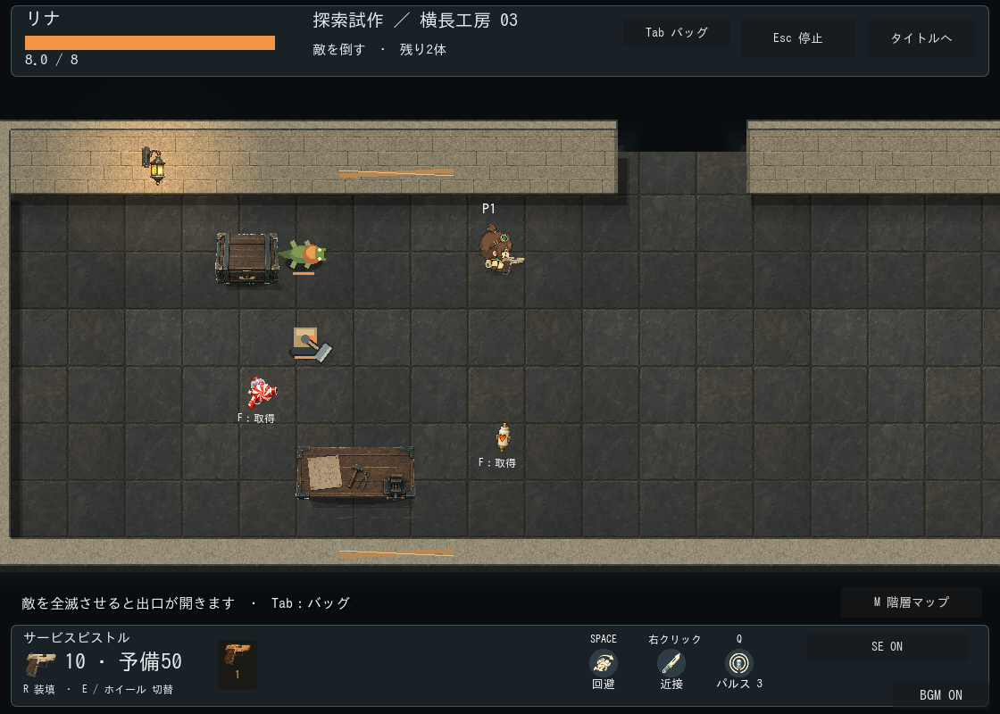

通常サイズで番機との形の差・膨らむ喉袋・丸い火種を目視確認。元の流用弾は白い短線で見づらかったため、半径6pxの橙の本体と短い尾に変更。尾は装飾。静止画の比較であり、連続プレイの読みやすさを確認済みとはしない。

## 正式素材を作る際の仕様案

|項目|仕様案|
|---|---|
|表示寸法|尾を含め約56×40px、膨張時も64×48px以内を目安。接地中心を原点とし移動半径14pxとは独立|
|視点|既存プレイヤーと同じ見下ろし正投影。低い胴と脚を見せ、機械部品・金属装甲は付けない|
|方向|前・後・右の3方向を基礎に、左は左右対称なら反転。正式画像の正面を回転するだけで全方向を代用しない|
|パーツ|胴＋尾、頭/開閉する口、喉袋、前後脚。影・火種・発光は別。喉袋は縮小/中間/最大を用意|
|動作|待機、歩行、踏ん張りと吸気、吐き出し、息継ぎ、被弾、死亡。まず構え・吐き出し・復帰を優先|
|出力|透明PNG、方向内で共通キャンバス、接地原点と口/喉袋/脚の接続点を記録。原本は表示寸法の整数倍で制作し縮小確認|
|接続|戦闘側の残り時間と固定方向へ表示を合わせる。素材の再生長を理由にダメージ時刻を変えない|
|受入|音なし・グレースケールでも膨張と射撃方向が分かる。家具の前後、複数敵・弾との重なり、通常倍率で確認|

仕様案の全パーツを一括生成せず、まず3方向の外見と喉袋の可動が成立するか確認してから動作素材へ進む。正式制作開始時に視点・寸法・原点・切り出し方法を確定する。

## 検証と未確認

専用テストはheadless・描画ありでPASS。関連回帰（遭遇、10seed/108入口の出現、ランダム階層移動、既存弾の判定/表示）はPASS。headlessの制限環境ではログ/証明書エラー、既存のObjectDB/Resource終了時警告が出る。描画ありを必要な権限で実行した専用テストは警告なしでPASS。

ユーザーの戦闘確認では問題なしとの報告を受領。外見素材は[候補v1](../enemy-appearance-v1/README.md)を生成済み、本番未採用。

未確認: 難度と資源消費の継続評価、低性能端末/Web、正式美術・音響のユーザー採用。テスト内の配置は表示比較用で、実際の出現位置は既存の安全な配置処理を使用する。

## 画風統一版 v3 の試作（2026-09-26、ユーザー依頼「2枚を基準にしてトカゲの試作に進んで」）

基準: [画風の共通規格](../../VISUAL_STYLE_GUIDE.md)、描き方の基準 [style-reference-v2](../../../../assets/generated/style-reference-v2.png)、格の幅の基準 [style-range-v1](../../../../assets/generated/style-range-v1.png)（[記録](../style-reference-2026-09-26/README.md)）。格は「威圧感のある敵」。

### 仕様票

|項目|内容|
|---|---|
|敵ID・役割・状態|fire_pouch_lizard、生物・遠距離（喉袋の火種2発）、実装済み。見た目のみ差し替え|
|参照元|挙動 `scripts/combat/fire_pouch_lizard.gd`、表示 `scripts/visuals/enemy_sheet_visual.gd`（`lizard_visual.gd` 経由）、現行素材 `assets/first-workshop/enemies/lizard-sheet-v2.png`|
|画風|8方向版リナと同じ濃い茶色の輪郭線・2〜3段の平塗り・左上からの光。威圧寄り（這う低い姿勢、細く光る黄色の目、牙、背のトゲ、長い尾、光る橙の喉袋）|
|明るさ|本体は床（平均明度約20）よりはっきり明るい中間調の緑。規格3.5の「暗い素材色の敵も床より明るく」に従う|
|寸法|現行と同程度。横向きの全長（尾を含む）で通常倍率約64〜72px。移動・被弾半径14px、攻撃距離・時刻は変更しない|
|方向|正面（下向き）・背面（上向き）・右向きを生成。左向きは右向きの左右反転（左右対称の体のため）。派生画像の段階で列として焼き込み、実装の列構成（前・後・右・左）は維持|
|動作方式|現行と同じコマ方式|
|動作一覧|歩行4コマ、構え（喉袋が膨らむ）、吐き出し（口を開き喉袋がしぼむ）、復帰、撃破（倒れ）。被弾は既存の発光と揺れ|
|戦闘との同期|既存どおり戦闘側の位相・残り時間で行を選ぶ。素材の再生長で攻撃時刻を変えない|

### 必要素材の台帳

|素材ID|用途／動作|方向|コマ数|原点／接続点|既存・流用・新規|状態|確認方法|
|---|---|---|---|---|---|---|---|
|lizard_v3_sheet_a|歩行4コマ|正面・背面・横（左向きで生成）|3×4=12|各セルの足元中央を接地原点|新規（生成）|生成済み|通常倍率の連続コマで3周期（未実施）|
|lizard_v3_sheet_b|構え・吐き出し・復帰・撃破|正面・背面・横（左向き）|3×4=12|同上。シートAと同じ体格|新規（生成、シートAを参照）|生成済み|通常倍率で構え→吐き出し→復帰（静止コマのみ確認）|
|lizard-sheet-v3（派生）|本編用の4列×8行アトラス|前・後・右（左の反転）・左|32|全セル共通の接地原点|派生（背景除去・整列）|本編接続済み|本編で連続動作（未実施）|
|影・火種・喉袋の発光|—|—|—|—|既存のコード描画を流用|流用|—|
|SE|—|—|—|—|既存を流用。今回生成しない|流用|—|

### 生成の方針

- 画像CLIは1024×1024の正方形だけのため、2枚に分ける。各シートは3列（正面・背面・右）×4行。背景は単色のマゼンタ（#FF00FF）にして、派生の段階で透明にする。
- 参照: シートAは style-range-v1 のトカゲの切り出しと8方向版リナ。シートBは、それにシートAを加える（体格・配色の一致のため）。
- 生成は最大3回（ユーザー承認の残り3件）。2回で揃わない場合、3回目はどちらかの作り直しに使い、それ以上は相談する。

### 生成と組み込みの結果（2026-09-26）

- 生成: `tools/generate_image.py`、gpt-image-2、high、1024×1024。各1回。
  - シートA（歩行）: 88件目、推定0.110ドル。指示 [v3/prompt-sheet-a.txt](v3/prompt-sheet-a.txt)、参照は [v3/ref-lizard-design.png](v3/ref-lizard-design.png)（style-range-v1 の (405,105,280,245) を切り出し）と [リナ](../style-reference-2026-09-26/ref-rina.png)。原本 [lizard-v3-sheet-a.png](../../../../assets/generated/lizard-v3-sheet-a.png)。
  - シートB（構え・吐き出し・復帰・撃破）: 89件目、推定0.112ドル。指示 [v3/prompt-sheet-b.txt](v3/prompt-sheet-b.txt)、参照はシートAと上記の設計画像。原本 [lizard-v3-sheet-b.png](../../../../assets/generated/lizard-v3-sheet-b.png)。
  - 画像CLIの上限91件に対し、残りは1件。
- 生成時の差異: 横向きの列は、指示の「右向き」ではなく**左向き**で描かれた。左右対称の体のため、左向きをそのまま使い、右向きはその反転にした。シートBは、シートAに合わせて左向きで指示した。
- 派生: [tools/build_lizard_v3_atlas.gd](../../../../tools/build_lizard_v3_atlas.gd) で [lizard-sheet-v3.png](../../../../assets/first-workshop/enemies/lizard-sheet-v3.png)（1376×2048、4列×8行、1マス344×256）を作成。マゼンタを透明にし、縁の紫がかった画素は輪郭の茶色へ置き換え。生成画像の姿はマス目からはみ出すため、つながった形ごとに検出し、中心の位置でマスへ割り当てた。各姿は横方向の中央、最下点を接地線（y=236）に置く。原本は加工していない。
- 本編接続: `scripts/visuals/enemy_sheet_visual.gd` のトカゲをv3へ切り替え。均等なマス目で、接地原点(172,230)、表示倍率0.24（横向きの全長約77px、正面約47px）。行の選び方（歩行4・構え・吐き出し・復帰・倒れ）と列（前・後・右・左）は従来どおり。v2の画像は戻せるように残した。攻撃・移動・判定・時刻は変更なし。

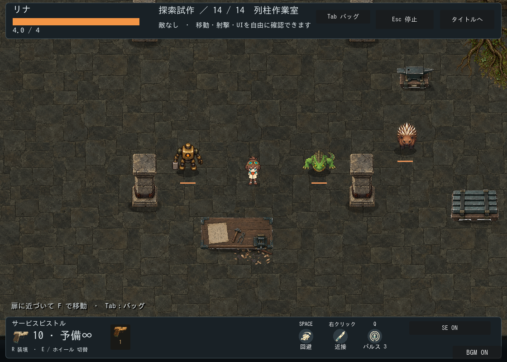

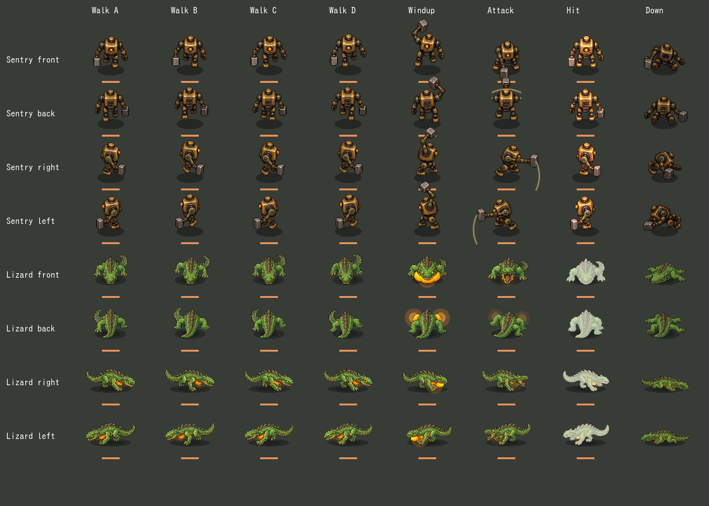

### 確認結果

- 自動テスト: `enemy_motion`・`fire_pouch_lizard`・`exploration_enemy_spawns` はPASS（`--headless`）。`enemy_animation_review` は描画ありで全32コマの表示画像を保存。`enemy_art_preview` は旧v1シートを読み込む箇所で既知の警告が出るが、終了コード0（今回の変更と無関係）。
- 計測（[比較シート](../../reviews/style-comparison-2026-09-26/README.md)と同じ方法、正面・待機）: 平均明度 31.8→**45.4**、明度のばらつき 14.1→18.8、輪郭の対背景差 9.6→**18.1**（リナ25.2）、遠目の目立ち度 7.9→**12.2**。画面上の大きさ 54×65→47×47px。
- 目視（Claude）: 床の上で番機より目立ち、リナと同じ描き方に見える。威圧寄りの形（トゲ・牙・光る目）は通常倍率でも読める。正面・背面は細長い体を頭側・尾側から見るため、番機やリナより小さく見える。構えの膨らんだ喉袋、吐き出しの開いた口は正面と横で読める。背面では喉袋が見えず、構えと吐き出しの差が小さい。
- 被弾時の既存の色変化（明るくする処理）は、明るくなった体では黄色っぽく飛び気味。

### 未確認・次の作業

- 通常速度の連続再生（歩行3周期、発進・停止・旋回、構え→吐き出し→復帰を3回）。静止コマの並びでは、歩行が自然かどうかは判断できない。
- 横向きと正面の大きさの差が、戦闘中の読みやすさに与える影響。
- 撃破の倒れ姿勢と既存の消失演出の見え方。
- 被弾の色変化の調整要否。
- ユーザーの採用。

### デザインレビュー後の調整（2026-09-26、生成なし）

Claudeのデザインレビュー（正面・背面の形が弱い、向きで大きさが跳ぶ、格に対して小さい、黄緑でおもちゃっぽい、背面で危険の合図が隠れる、被弾の光り方が黄色く飛ぶ）を受け、ユーザー了承のもと生成を使わない4点を実施した。

|対策|実装|
|---|---|
|正面・背面を大きく|`enemy_sheet_visual.gd` の表示倍率を向きで分けた。正面・背面0.30、横向き0.24（正面約40×60px、横向きの全長約77px）|
|色味を深い緑へ|`build_lizard_v3_atlas.gd` で、色相65〜150°・彩度0.25超の画素を、色相+16°・彩度×0.85・明度×0.9に変換。目・喉袋・トゲは範囲外|
|被弾を白く光らせる|組立時に白い影絵の画像 `lizard-sheet-v3-flash.png` も出力し、被弾中に本体へ重ねる（不透明度0.75×被弾の強さ）。従来の「色を掛けて明るくする」処理はトカゲだけ外した。番機・ヤマアラシは従来どおり|
|喉袋を常に弱く光らせる|`paint_pouch_glow`: 本体の後ろに橙の光を描く。通常は半径9pxで弱く明滅、構えで半径15pxまで強まり、吐き出し後0.22秒で消える。背面は首の左右2か所に置き、体の脇から光が漏れて見えるようにした|

あわせて、コードレビューの指摘（組立スクリプトが、1マスに姿が2体入る場合を検出しない）を修正し、同じマスへの重複で停止するようにした。

- 計測（正面・待機、光を含む）: 平均明度41.6、ばらつき17.4、輪郭の対背景差17.1、遠目の目立ち度10.5、画面上の大きさ58×58px（光の範囲を含む）。明るさの目標（35以上）は保っている。
- 自動テスト: `enemy_motion`・`fire_pouch_lizard`・`quillback`・`exploration_enemy_spawns` はPASS。
- 目視（Claude）: 被弾は白く光り、黄色く飛ばない。構えの光は正面・横で強く見え、背面でも首の左右に橙が見える。色は黄緑から緑へ移ったが、まだ鮮やかな緑で、見本の深い緑ほどは沈んでいない。**正面・背面は大きくなったが、細長い棒状の形は変わらない**（倍率では形は直らない）。
- 計測スクリプトの修正: 喉袋の弱い光で足元に小さな点が出て、比較シートの計測が1画素の点を拾ったため、`capture_style_comparison.gd` を「近くの150画素以上の形」を選ぶように直した。他の素材の値は変わらないことを確認。

### 正面・背面の描き直し（2026-09-26、生成1回）

ユーザー依頼「残り1回で正面・背面を描き直してください」。

- 生成: 90件目（上限91に到達。これ以上の生成には上限の引き上げの承認が必要）、推定0.116ドル。指示 [v3/prompt-sheet-c.txt](v3/prompt-sheet-c.txt)。参照はシートA・シートB・設計画像。原本 [lizard-v3-sheet-c.png](../../../../assets/generated/lizard-v3-sheet-c.png)（4列×4行。1〜2行目が正面、3〜4行目が背面、それぞれ8姿勢を読む順に並べた）。
- 内容: 脚をワニのように左右へ広げ、頭を大きく、尾を横へ曲げた、横に広く低い姿。背面の構えでは、喉袋が首の左右に膨らむ。
- 組立: `build_lizard_v3_atlas.gd` を3枚対応に変更。正面・背面の列はシートCから、横向きはシートA・Bから取る（A・Bの正面・背面は不使用）。全32マスがちょうど1体ずつ埋まることを確認して停止する。
- 色合わせ: シートCは色がくすみ暗かった（緑の平均: A 色相75°・彩度0.66・明度0.55、C 色相78°・彩度0.52・明度0.50）。Cだけ色相−3°・彩度×1.27・明度×1.1で、Aの平均に合わせてから共通の変換をかけた。
- 喉袋の光: 背面の光の位置を、喉袋が膨らむ首の左右（アトラス上で±70, −105）へ移した。背面の歩行中は光を出さない（体の外に出た光が茶色い耳のように見えたため）。構えと吐き出しでは出す。
- 表示倍率は変えていない（正面・背面0.30、横0.24）。正面は画面上で約54×47px。

- 計測（正面・待機、光を含む）: 平均明度40.3、ばらつき16.3、彩度52.7、輪郭の対背景差16.0、遠目の目立ち度9.9、外接74×49px（光を含む）。明るさとばらつきの目標は満たす。
- 自動テスト: `enemy_motion`・`fire_pouch_lizard`・`quillback`・`exploration_enemy_spawns` はPASS。`enemy_animation_review` は描画ありで全32コマを保存。
- 目視（Claude）: 正面・背面が、横に広い低い姿になり、トカゲとして読める。番機と同程度の存在感。正面・背面と横向きの色の差は、色合わせ後は小さい。正面の歩行4コマは脚の違いが小さい。背面の吐き出しと復帰は見分けにくい。

### 本編ループでの動作確認（2026-09-26、ユーザー依頼「ゲームを起動してトカゲの動きを確認して」）

- 方法: [tools/capture_lizard_motion.gd](../../../../tools/capture_lizard_motion.gd)。生成階層（seed 22）の2番目の通常室（トカゲが出る部屋）で、本編の `_physics_process` を60ステップ/秒で26秒回し、2ステップごとにトカゲの周囲を切り出した。他の敵のうち番機は倒し、同じ部屋のもう1体のトカゲはそのまま。リナは標的としてトカゲの周りを回る（距離220〜460px、攻撃距離310pxをまたぐ）。最後の7秒は真下に置いて正面を出し、24秒で被弾、24.6秒で撃破させた。HUDは非表示、カメラはトカゲを追う。
- 出力（Git管理外）: `.local/lizard-motion/`（780コマ、`frames.txt` に状態・行・列、`player.html` で等速〜1/4速・コマ送り再生）。代表区間を下に保存した（通常サイズ、左上から右へ時間順）。
- 記録された流れ: 待機 → 歩行（背面・左・右・正面）→ 構え → 吐き出し → 復帰を、左・背面・右・正面で各1〜2回。歩行は1コマ約0.1秒、4コマで約0.4秒の周期。

|区間|画像|
|---|---|
|右向きの歩行（0.8秒）|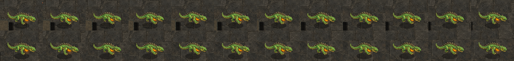|
|背面の歩行（0.8秒）|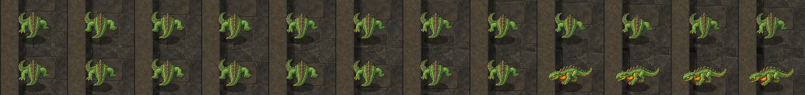|
|背面→右への向き替え|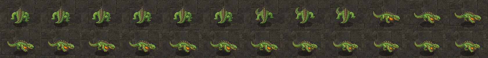|
|正面の構え→吐き出し→復帰（0.1秒おき）|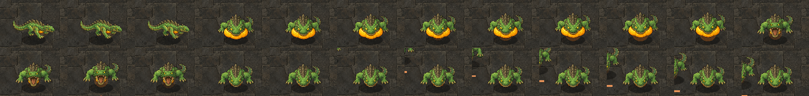|
|右向きの構え→吐き出し→復帰（0.1秒おき）|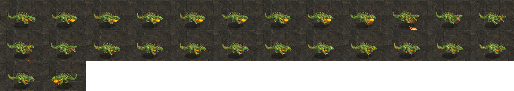|
|被弾→撃破→消失（約0.07秒おき）|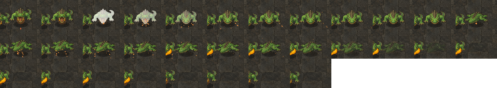|

確認結果（Claudeの目視と記録。ユーザー採用ではない）:

- **歩行**: 横向きは、脚の踏み替えと体の小さな上下が読める。背面・正面は、脚と尾の動きが小さく、止まって見えやすい。
- **構え・吐き出し・復帰**: 正面は喉袋が大きく膨らみ、光が強まってから口を開くため、攻撃の予告として最も読みやすい。横向きも光と口で読める。構えの間、喉袋の絵は最初から最大で、膨らむ変化は光の強まりだけ。
- **被弾**: 白く光って約0.2秒で戻る。黄色く飛ばない。
- **撃破**: 倒れ姿勢→粒子→約1秒で消える。倒れ中に喉袋の光は出ない。
- **向き替え**: 4方向の絵の切り替えなので、背面→横は1コマで切り替わる。大きさの差（背面0.30倍・横0.24倍）は、切り替わりの瞬間に目立つほどではない。
- **既存の挙動による違和感**: 追跡中の体の向きは「リナのいる方向」で決まり、歩く方向（経路探索で壁を回り込む向き）とは別。記録では、上へ歩きながら左向きの絵になる区間があり、**横歩きしているように見える**（t=2.3〜3.0秒）。v2から同じ仕組み。見た目だけ「歩行中は進行方向を向く」に変える余地がある（攻撃の向きは変えない）。

### 向きと歩行の調整（2026-09-26、ユーザー了承、生成なし）

|対策|実装|
|---|---|
|歩行中は進む方向を向く|`exploration_enemy.gd` に、実際の移動方向を滑らかにした `visual_heading`（表示専用）を追加。止まった状態から歩き出すときはその方向をすぐ採用し、歩行中の小さな曲がりは平滑化する。`fire_pouch_lizard.gd` の表示状態で、追跡中に歩いている間だけ向きをこれに置き換える。構え・吐き出し・復帰は従来どおり標的の方向。攻撃・判定・経路は変更なし。番機・ヤマアラシは今回変えていない|
|正面・背面の歩行を見やすく|`enemy_sheet_visual.gd` で、トカゲの正面・背面の歩行時だけ、上下の揺れを強め（最大約3px）、歩調に合わせて左右に1.5px振り、足元を支点に約4°傾ける|

本編ループで再撮影した結果（同じ26秒の手順）:

- 横歩きは解消した。以前「上へ歩きながら左向き」だった区間は、背面の絵のまま上へ歩く。向きの切り替わりは、状態の記録上、1コマだけの行き来がない。
- 正面・背面の歩行は、揺れと傾きで歩いていると分かるようになった（下の画像）。
- 自動テスト: `enemy_motion`・`fire_pouch_lizard`・`quillback`・`exploration_enemy_spawns`・`enemy_audio` はPASS。

|区間|画像|
|---|---|
|背面の歩行（調整後、0.8秒）|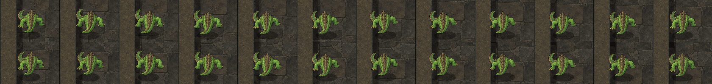|
|正面の歩行→構え（調整後）|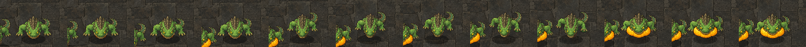|
|背面で上へ歩く→右へ曲がる（調整後）|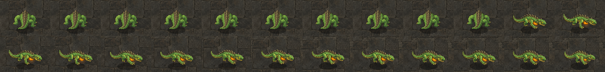|

### 浮いて見える問題の修正（2026-09-27、ユーザー指摘「宙に浮いている感」、生成なし）

4倍拡大で確認した原因: (1) 影が敵共通の小さな円（半径21pxを縦0.4倍）で、原点の3px下に描かれ、足・顎・尾より下にずれていた。(2) 細長い体に対して影が短く、後ろ脚と尾の下に影がなかった。(3) 歩行で絵全体を上へ揺らし、前回の調整で正面・背面の揺れを強めたため足ごと浮いた。(4) 待機中も0.5pxの上下動があった。

|対策|実装（`enemy_sheet_visual.gd`、トカゲのみ）|
|---|---|
|影を体に合わせる|向きごとの楕円 `LIZARD_SHADOW`（中心y・横半径・縦半径px）。正面・背面は(−5, 24, 8)、横向きは(−3, 32, 6)。足の接地線の上に置き、腹の下に濃い接地影（半径0.62倍、不透明度0.22）を重ねる|
|絵全体の上下の揺れをやめる|トカゲは縦の揺れを0にした。正面・背面の歩行は、左右1.5pxの揺れと足元を支点にした約4°の傾きだけ|
|待機中の上下動をなくす|トカゲは待機の上下動をしない|
|その他の持ち上がり|構え・吐き出しで体を狙う方向へずらす動きは、縦成分を0.3倍にした（正面向きで3px持ち上がっていた）。撃破時の小さな跳ね（5px）はトカゲでは出さない|

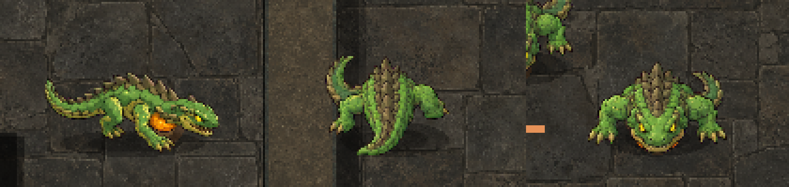

- 目視（Claude）: 3方向とも足・腹が影の上に乗り、影が体の外へずれない。暗い床の上では影が薄めに見える。
- 自動テスト: `enemy_motion`・`fire_pouch_lizard`・`quillback`・`exploration_enemy_spawns` はPASS。本編ループの撮影（26秒）もエラーなし。
- 番機・ヤマアラシは、従来の影と揺れのまま（同じ浮き方の可能性がある）。

### 残る課題

- 番機・ヤマアラシへの展開は2026-09-27に実施（[記録](../enemy-animation-v2/README.md#接地と向きの修正を番機ヤマアラシへ展開2026-09-27ユーザー依頼)）。向きの処理はトカゲ専用の置き換えから、敵共通の `exploration_enemy.gd` へ移した（ボスは除外）。
- 構え中、喉袋の絵は最初から最大（膨らむ変化は光だけ）。
- ユーザーの採用。

