# 炉守りの管理機：戦闘とパーツの試作

区分: 本編の仮実装。正式素材・手動受入前。[現行仕様](../../../design/GAME_RULES.md)、[ボス制作案](../../../planning/ENEMY_BOSS_ART_PLAN.md)。

仕様票: ID furnace_warden、機械系ボス。HP48/身体半径44px、表示は幅180px前後・高さ150px程度。通常カメラ倍率1、足元原点。突進・大槌・連射・全周衝撃波・扇射と段階変化、1.5秒起動、踏破まで接続。絵の外接矩形を身体判定には使わない。

| 部品/動作 | 現在 | 正式素材で必要なもの |
| --- | --- | --- |
| 胴・頭・炉口 | 独立した図形と発光色 | 方向別の胴・頭、炉蓋/内部、段階差分 |
| 左右腕/関節/槌 | 肩・肘・手を結び、構えで手先が上がる | 上腕/前腕/工具、ピボット、裏面と重なり |
| 左右脚/接地影 | 移動距離に同期する脚の位置 | 足運び差分または関節パーツ、接地調整 |
| 構え/突進/連射/衝撃波/復帰 | 戦闘タイマーを読むコード表示 | 技ごとの方向別姿勢、突進の踏み込みと制動、連射反動、衝撃波リング、炉口開閉、煙/鋲 |
| 被弾/段階変化/撃破 | 明滅、炉色変化、仮退色と粒子 | 外装破損、動力停止・崩壊差分 |
| SE | 既存番機・トカゲ・勝利音を流用 | 実プレイ試聴後に不足を判断 |

原本兼レシピ: scripts/visuals/furnace_warden_visual.gd。画像生成・ピクセル加工なし。手足・炉を分けた動作ラフで、方向別の独立リグや正式美術ではない。鋲は既存火種表示の仮流用。前室/床/壁は工房テーマを変更せず使う。

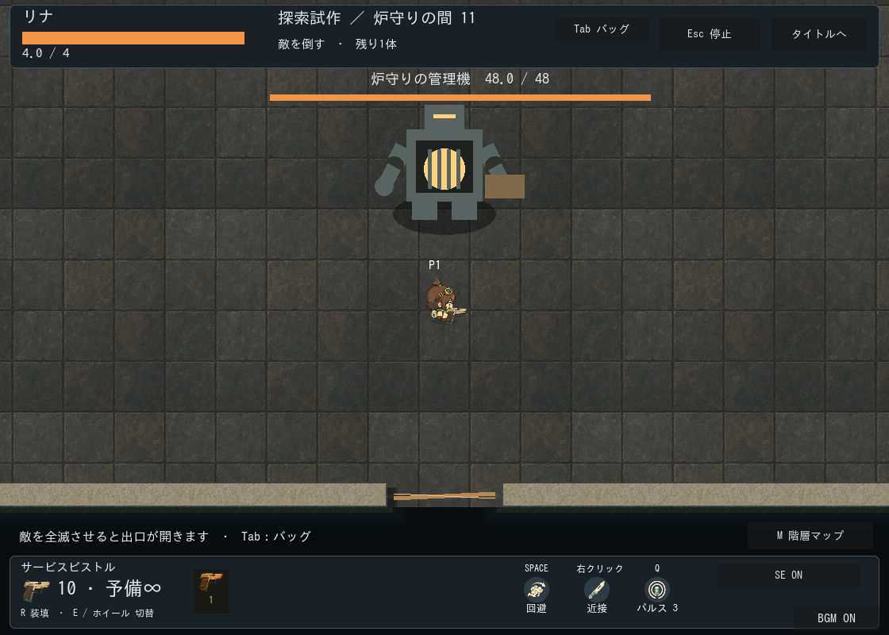

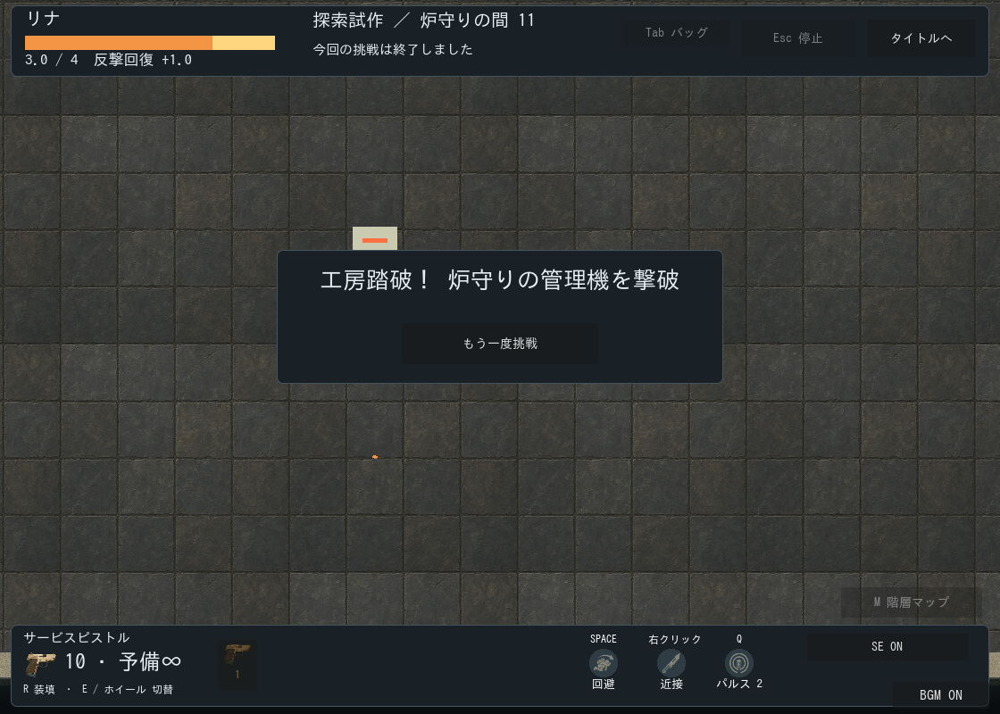

自動検証は起動・停止・攻撃・回避・段階移行・撃破・再挑戦・相打ちまでPASS。静止画でキャラとの寸法とHUDを確認。連続動作の読みやすさ、全方向の見た目、HP4での戦闘時間/難度、吸引耐性、正式素材と専用SE、ユーザー採用は未確認。ボス固有報酬・次階層・セーブは未実装。

距離を詰める突進、追従連射、3連衝撃波を追加。輪と発射光はコードによる仮表示。必要な正式素材にも突進/制動/連射反動/衝撃波を含める。

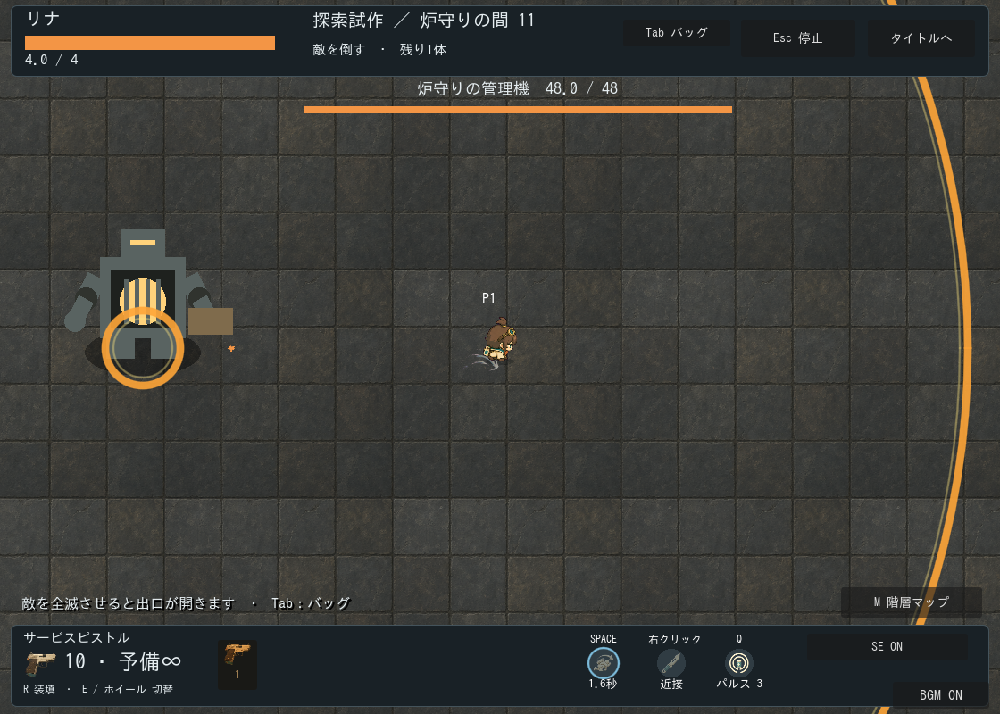

## 採用デザイン：独楽の鋳造機（素材原画v1）

ユーザー採用: B1。現行Actor IDはfurnace_wardenを継続予定。従来の人型・槌・脚の表は旧試作の記録で、今後の正式素材仕様ではない。表示幅180px前後を出発点とし、暴走時の装甲展開分を別途確保する。半径44pxの判定と画像外接寸法は分ける。今回の生成範囲は画像原画3枚。内蔵image_gen使用、SE生成・ゲームへの差し替えは未実施。

|原画|内容|状態|
|---|---|---|
|[本体](../../../../assets/generated/foundry-spinner-v1/body.png)|4方向×通常/暴走の8点、4列2行|生成・目視済み、方向と足元位置の登録は未完|
|[パーツ](../../../../assets/generated/foundry-spinner-v1/parts.png)|台座、炉心、閉じた外装、注ぎ口、開閉装甲4点、軸キャップ、射出口、破片、残骸。4列3行|生成済み、装甲は前後形状が似ており接続面の補筆・整合が必要|
|[エフェクト](../../../../assets/generated/foundry-spinner-v1/effects.png)|衝撃波、右向き発射閃光、突進擦過火花、着地粉塵。各4コマ、4列4行|生成・目視済み、位置合わせと連続再生は未確認|

[送信プロンプト](../../../../assets/generated/foundry-spinner-v1/prompts.json)、[原本SHA256](../../../../assets/generated/foundry-spinner-v1/manifest.json)。画像編集・切出しなし。PNGはRGBAで透明画素を含むことを検査済み。本体とVFXには広い半透明の色/発光が残って見えるため、暗い床・明るい床で縁とハローの確認が必要。

組立方針: 接地影→奥側装甲→台座/炉心→手前装甲→発光/VFX。注ぎ口は非対称のため左右単純反転禁止。台座は見下ろし投影なので画像全体を平面回転させず、回転コマまたはリング専用表現を追加する。通常から暴走への開閉中間姿勢、突進時の傾斜、撃破推移は本原画だけで完成扱いにしない。炉心・外装の寸法とピボットを登録し、隠れる接続面を補完する。

演出対応: 待機=炉内明滅、移動=台座の回転、突進=傾斜と擦過火花、連射=射出口閃光/反動、落下=持上げ→着地粉塵、全周攻撃=衝撃波、暴走=装甲展開/排熱、撃破=炉の消灯/破片/残骸。独立した排熱煙ループと炉光マスクは未制作。発射後の煙はVFX2行目に含まれる。VFXの拡大縮小だけから攻撃判定を生成しない。特に原画の衝撃波は楕円だが現行判定は世界座標の円なので、そのまま画面全域に拡大して流用せず円形の判定位置へ合う描画を作る。

未確認: 通常倍率の本編表示、全方向・連続動作、切出し境界、透過縁、部品の接続、エフェクト重複時の視認性と負荷、音との同期。素材生成を本編反映・アニメーション完成とは扱わない。

## 専用音候補

後続の明示依頼で回転突進SE・着地/衝撃波SE・ボスBGMを各1件API生成済み。[音響記録](../../../AUDIO_BIBLE.md)とassets/audio/asset_manifest.jsonを参照。音声Resourceの認識は確認済み、試聴・ループ調整・本編接続は未完。

## 独楽の鋳造機の本編接続（2026-09-23）

ユーザーがBGM改訂04を暫定採用し、ボス制作を依頼。本体8方向/状態セル、撃破残骸、生成VFXの閃光と着地粉塵を本編接続。表示名は独楽の鋳造機、内部ID furnace_wardenは保持。原画はassets/generated/foundry-spinner-v1を維持し、同一バイトのランタイム用コピーをassets/sprites/boss/foundry-spinnerへ配置（生成原本ディレクトリはGodot対象外）。画像編集なし。描画コードのRect2がアトラス参照レシピ。

本体セル384×512、描画192×256、正常行の左上(-96,-218)、暴走行(-96,-197)、接地原点(0,0)。正面/右/背面/左を角度で選び、左右反転なし。暴走への変化は1.2秒の画像ブレンドで、独立した装甲ヒンジの完全リグではない。台座の回転は前面を周回する発光点、突進の傾き、擦過火花で表現。上面投影を壊す全身画像回転は行わない。落下攻撃は持ち上げと着地粉塵、既存の前方扇形判定を弧で示す。攻撃判定と威力は維持。

粒子はActor内の最大48個の寿命付きプール。戦闘dtでのみ更新し、独立した常時_processを持たせない。突進火花は0.3秒、暴走煙は0.7秒。Actor退役で残存粒子も解放。撃破表示は従来の独立death_visualの破片と残骸退色を使用。衝撃波は世界座標の円を直接描画し、原画の楕円リングは不使用。生成パーツの個別装甲/炉心と擦過火花シートも現時点では不使用。

音: ボス室入場でfw_spinner_boss_04を-23dB、退出/死亡/踏破/再挑戦は既存コンテキスト管理に従う。96秒末尾の減衰を数値確認し、仮ループ終端92秒。音楽的な継ぎ目は未試聴。重厚SE再生成失敗分と未採用のspinner_01 SEは接続せず、既存heavy_dodge/landing/rapidを仮接続。正式SEは残課題。

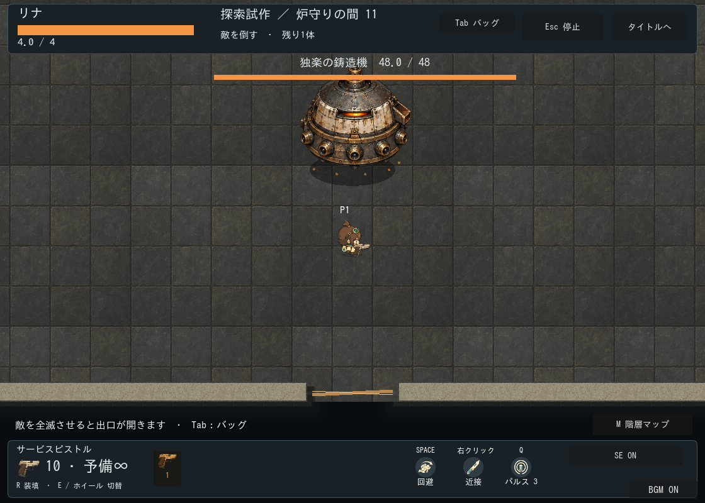
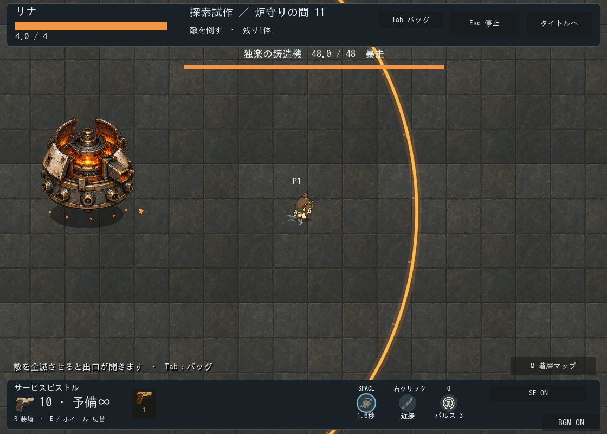

通常倍率の静止画、戦闘判定、暴走連続攻撃、粒子上限・ポーズ停止、BGM入場/終了切替を確認。全方向の連続動作の美術評価、Web/低性能端末の負荷、ループ継ぎ目、SEとBGMの実戦試聴は未確認。生成素材の個別装甲リグは今後の改善であり完成と扱わない。

### 衝撃波の質感強化

輪を明るい細い先端・橙の帯・内側の揺らぐ残光の4層へ変更。既存生成VFXの着地粉塵4コマを輪の後方へ小さく配置し、短い火花・石粒を重ねる。内部は塗りつぶさない。判定コード・速度・ダメージは変更なし。先端の揺らぎは最大約1.4px、装飾は内側32px程度。円周分割上限512、粒子配置上限96/輪、粉塵はその半数かつ画面外を省略。戦闘の描画時間に同期するためポーズで停止。boss_pressureの描画と回避・同輪再被弾防止テストを確認。Web/低性能端末の実測は未確認。

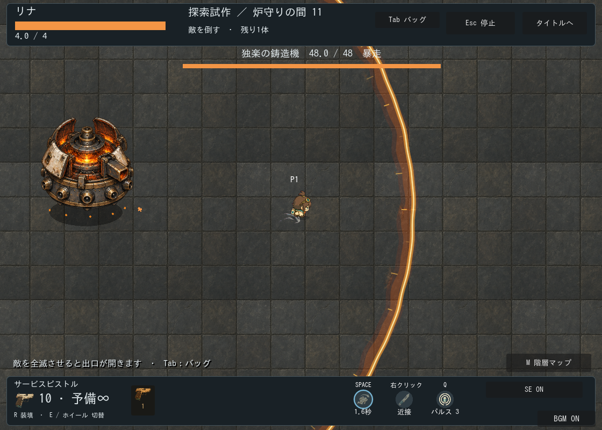

### 跳躍と機械的な暴走移行

後続修正で全身クロスフェードを廃止。1.2秒の移行中は振動→0.35秒後から炉心・台座・4装甲で組立表示→方向別暴走画像へ接続。装甲参照は原画各列x=index*362+8,y=420,w=346,h=310（隣接セル混入を避ける）。追加生成なし。既存パーツには方向別の完全なヒンジ形状がないため、移行中の組立は共通の見下ろし姿勢であり、全方向独立リグの完成とは扱わない。

衝撃波ごとに0.65秒の跳躍と着地を実装。最大65px持ち上げ、影を接地位置に残し、着地時に輪/粉塵/SEを同期。最終発生後は輪の寿命待ちをやめ、0.4秒で復帰へ移行。半径44pxの障害物迂回と併せてboss_pressureで検証。通常敵・ボス戦回帰テスト通過。ユーザーの具体的なスタック場面との一致と全方向の連続動作評価は未確認。

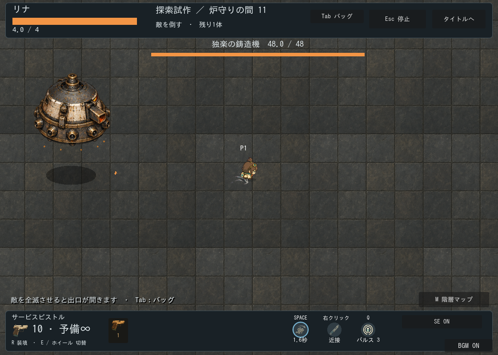
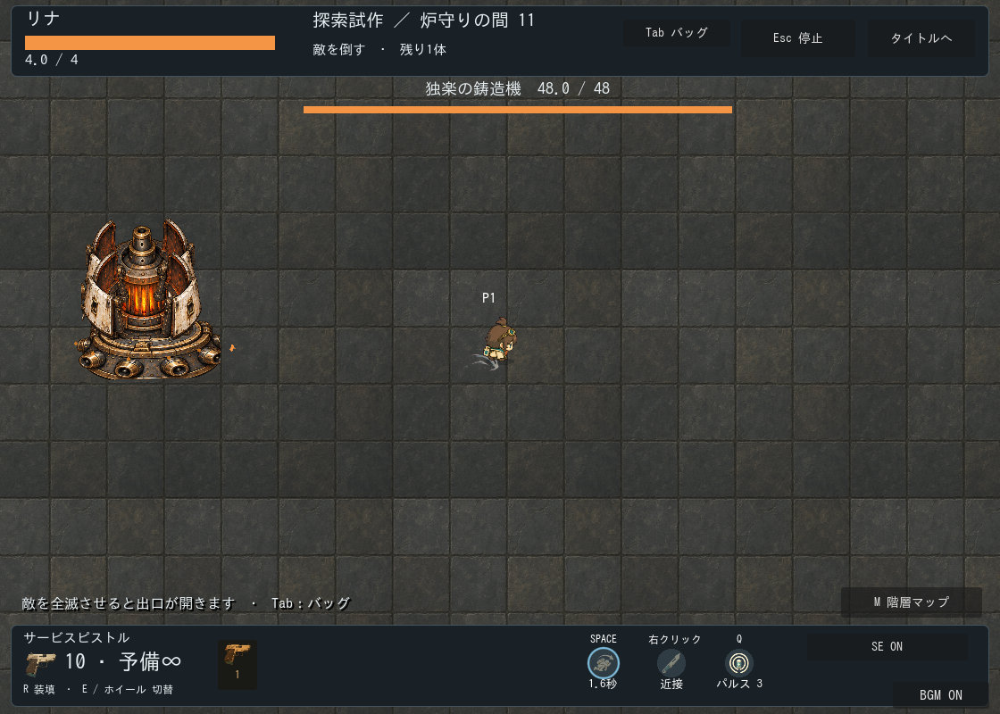

南壁際の長時間停止を2配置で再現（12秒無攻撃）。近接射程へ入れない大型判定と近接技の固定順序が原因。進入不可の近接技を連射へ切り替えて解消。boss_activity.gdに再現回帰テストを追加。

### 専用SEの追加候補

爆発・崩落fw_spinner_explosion_01、回転突進fw_spinner_dash_03、暴走ロック解除・排圧fw_spinner_overdrive_01を各1件生成。生成条件は音声manifest、用途と確認状況は[AUDIO_BIBLE](../../../AUDIO_BIBLE.md)を正本とする。Godot認識確認済み、未試聴・本編未接続。爆発映像と撃破音を最後まで再生する処理は別途対応が必要。

### 演出レビューの対応（現行）

- 撃破：即時の内部爆発、0.22秒の追加爆発、1.4秒の主爆発・装甲6片、粉塵と残骸退色。表示寿命4.5秒。光球/火花はコード描画、破片は既存partsの装甲セル、粉塵はeffects最下段を再利用。原本変更・追加生成なし。判定/報酬は待たせず、踏破は開封後の出口操作で確定。
- 音響：生成済みの突進・着地・暴走・排圧・内部/主爆発を接続。エンジン専用1枠、距離減衰、ポーズ/ミュート/退役停止。音量は仮値、音の採用状況はAUDIO_BIBLEが正本。
- 突進：短い加速と制動、回転表示の追従、傾き。構えの沈み込みと復帰の揺り戻しを追加。既存の壁衝突と攻撃順序は維持。
- 連射：反動を追加し、弾と閃光を方向52pxの同一原点へ統一。実際に射出できた連射のみ音/閃光を出す。
- 暴走：中間だけ共通正面のパーツへ変わる方式を廃止。方向別の通常/開放姿勢を振動・炉心発光・排圧煙でつなぐ。全方向ヒンジリグは未制作であり、連続的な装甲開閉の完成とは扱わない。初期の共通パーツ展開の記録は旧方式。

boss_pressure、furnace_warden、boss_activity、exploration_encounter、追加boss_presentationのアサーション通過。描画版で方向別移行4枚と爆発を保存し、正面の中央切れ目や結果パネルによる遮蔽を修正した。通常倍率の静止画確認は実施。連続動作のユーザー受入、音響試聴、Web/低性能環境負荷は未確認。終了時ObjectDB/Resource警告は継続課題。

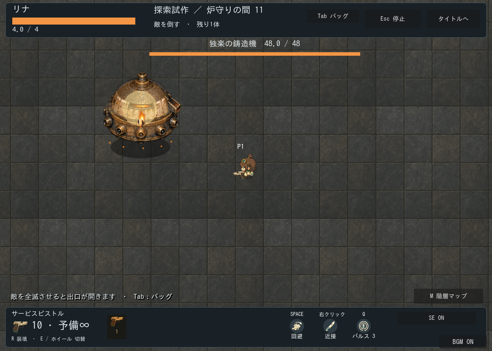
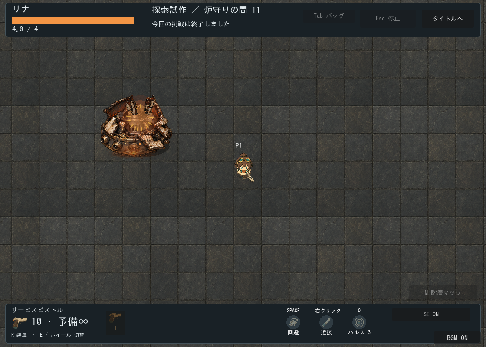

## 全周砲撃・主砲の追加素材（2026-09-23）

状態：2026-09-24に本編接続済み。後続レビューで機銃を復帰し、全周斉射・主砲と併存。現行の威力・回数はGAME_RULESへ反映。素材と音はユーザー暫定採用、実戦での最終受入は未確認。

[素材manifest](../../../../assets/sprites/boss/foundry-spinner/cannon-v1/manifest.json) / [送信プロンプト](../../../../assets/sprites/boss/foundry-spinner/cannon-v1/prompts.json)。built-in image_genで2枚、ElevenLabs統一CLIでSE各1候補を生成。原本を無加工コピーしPNGはRGBA。Godot取り込みとaudio_assetsのResource/尺確認済み。

|素材|内訳・用途|接続時の条件|
|---|---|---|
|ordnance.png（1254角、2列2行）|左上：全周用球形砲弾、右上：右向き主砲弾、左下：小発砲、右下：主砲発砲|砲弾幅16/28px、閃光48〜90pxを初期候補。砲弾と閃光の原点を別に登録。薄いalpha余白を画像本体と誤認しない|
|impact.png（1774×887、4列2行）|着弾→膨張→爆発最大→煙の8コマ|443/444pxの端数を含む。共通444px仮想キャンバスへ原点を登録し、コマ別に拡縮しない。終盤は透明度で消す|
|fw_spinner_salvo_01.mp3|全周斉射用の短い砲声、認識0.64秒|1弾ごとではなく1斉射の単位で再生する想定。連射の重なりを試聴|
|fw_spinner_main_cannon_01.mp3|主砲の重い発砲、認識1.28秒|実際の発射に同期。BGM/通常銃声を覆わない音量へ調整|

既存流用：body/partsの砲口、pressure_hissの排圧、internal_blastの小着弾、explosionの大着弾候補。発射前の装填は機構動作と既存音で検討し、追加の音は今回は生成していない。全周発射は各口の原点・奥/手前の描画順、主砲は向き固定と反動を戦闘の時刻へ合わせる必要がある。既存の独立砲口パーツは1視点のため、そのまま平面回転で全方向の立体砲身リグが完成するわけではない。まず方向別本体と発砲口の対応を使い、独立砲身の追加絵は接続時に要否判断する。

目視：鉄/真鍮/橙の質感、4素材と8コマの分離を確認。爆発の中盤から煙への形状差と中心位置は連続再生で確認が必要。明暗床上・実際の16/28pxの弾の識別性、全方向の発射口、画面端、重複爆発、ポーズ・破棄、Web負荷は未確認。SEは未試聴であり、重厚さの指定を聴感上の合格とは扱わない。爆風による二重被弾は実装時に禁止する。

### 砲撃音改訂・着弾音の生成範囲

ユーザー評価：salvo_01は金属音が強い。今回の依頼は全周砲声salvo_02（0.6秒）、小着弾shell_impact_01（0.65秒）、主砲着弾heavy_impact_01（1.2秒）を各1候補、計3件。低く丸い火薬音を主成分とし、金属の余韻を除く。発射・小着弾・主砲着弾で同期点を分ける。既存の主砲発射音は維持。3件ともdry-run後に各1回生成済み、再試行なし。Godot認識尺は順に0.60/0.64/1.20秒、audio_assets検証通過。本編未接続・音色と実戦音量は未試聴。旧salvo_01は不採用候補として保持し、salvo_02もユーザー採用待ち。

### 砲撃の本編接続と登録値（2026-09-24）

- 使用箇所：furnace_warden、projectile、combat_session、boss_cannon_art、boss_cannon_impact。画像原本は変更なし。切出し・寸法・原点はboss_cannon_art.gdを正本とする。
- 球形弾は原画(235,280,154,155)を17px、大型弾は(684,240,456,225)を56×28px。閃光は(140,760,400,350)/原点(120,170)/倍率0.15、主砲は(640,680,580,490)/原点(210,240)/倍率0.28。発光の透明余白で弾のサイズを決めない。
- 弾の判定原点は方向52px。見た目は斉射(x=cos角×72,y=sin角×23−38)、主砲(x=cos角×62,y=sin角×24−67)から射出し、0.16秒で判定位置へ合わせる。これは立体砲口と床上判定の表示補間であり、独立砲身リグではない。後方閃光は本体の奥へ描画。本体の4方向差分を維持。
- 着弾8コマはx境界0/443/887/1330/1774、y境界0/443/887。固定76px/216px、0.64秒、後半の透明度で消す。爆風は1回のみ、演出による追加被弾はない。演出数40件上限、戦闘dt・ポーズ・部屋リセットに従う。
- SEはsalvo_02/main_cannon_01/shell_impact_01/heavy_impact_01を本編接続。音量と試聴状態はAUDIO_BIBLEを参照。

自動確認：boss_cannon（照準固定、2連主砲、直撃/爆風1回、回避、壁、消去、寿命、ポーズ）、既存boss_pressure/activity/presentation/furnace_warden/exploration_encounter。Godot描画版で通常倍率の発砲・斉射・爆発を確認。全方向の連続アニメーション、難度、実戦音量、Web負荷は未受入。headless終了時の既存ObjectDB/Resource警告は残る。

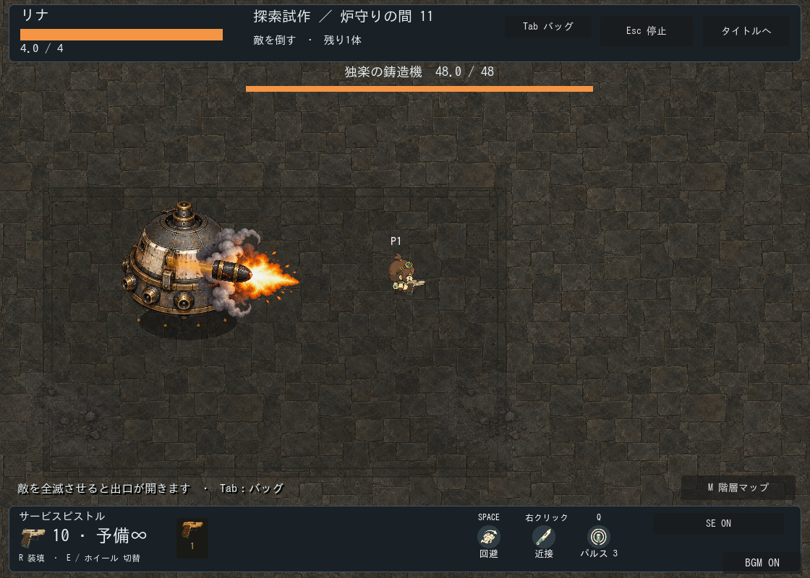
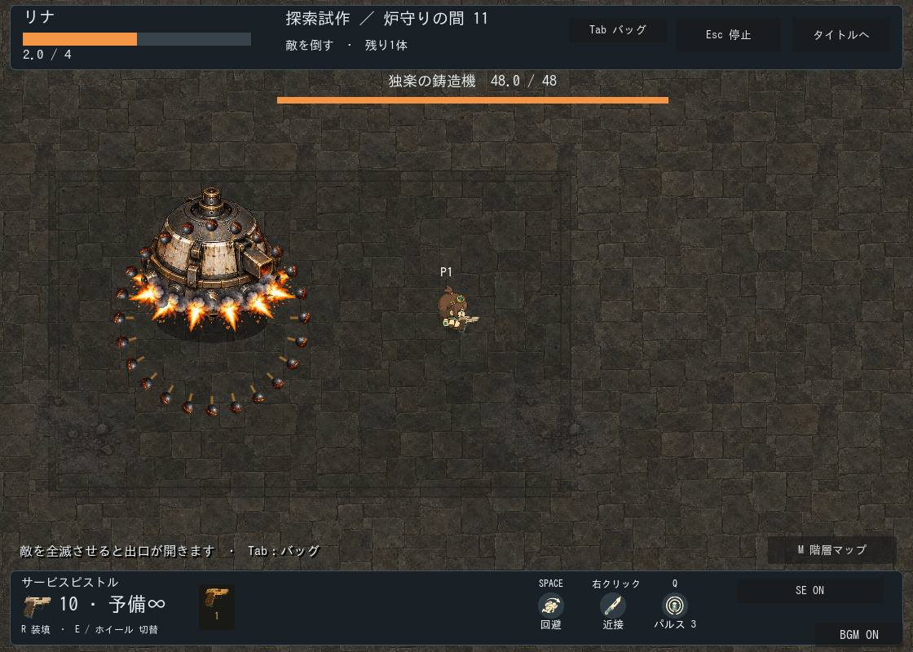
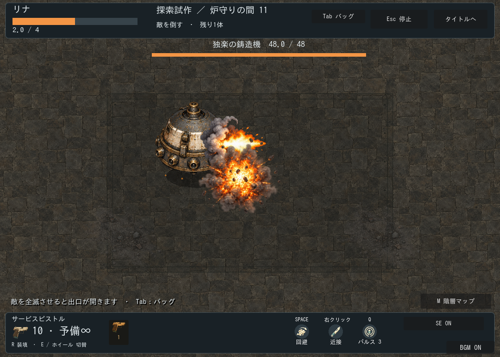

### 攻撃の役割と選択の再整理

マシンガンを既存の鋲表示・小型閃光・rapid SEで復帰。通常40発/暴走70発の混合連射は移動を促し、全周斉射は弾の隙間、主砲は照準固定後の回避、突進/打撃は接近、衝撃波はロールに役割を分ける。基本巡回順から届かない近接枠と直前の技を飛ばす。新規素材生成なし。boss_attack_selectionと既存ボステストで発射数・全技への到達・停止/再挑戦を確認。実戦難度と音量は手動受入待ち。

### 主砲の重量感・速度の強化

既存のordnance/impactを再利用し、追加生成なし。大型弾56×28px、速度900px/s、判定半径14px。飛行中は90pxの短い残光3層と火花7本、砲口は発射前に発光し、閃光0.24秒・反動1.8。着弾は216pxの8コマ爆発と短い衝撃環・火花12本。演出を戦闘dtへ同期し、威力2・爆風64pxは維持。boss_cannon/boss_presentation/boss_attack_selection通過、描画版で飛行・着弾の通常倍率確認。実プレイの回避しやすさは未受入。

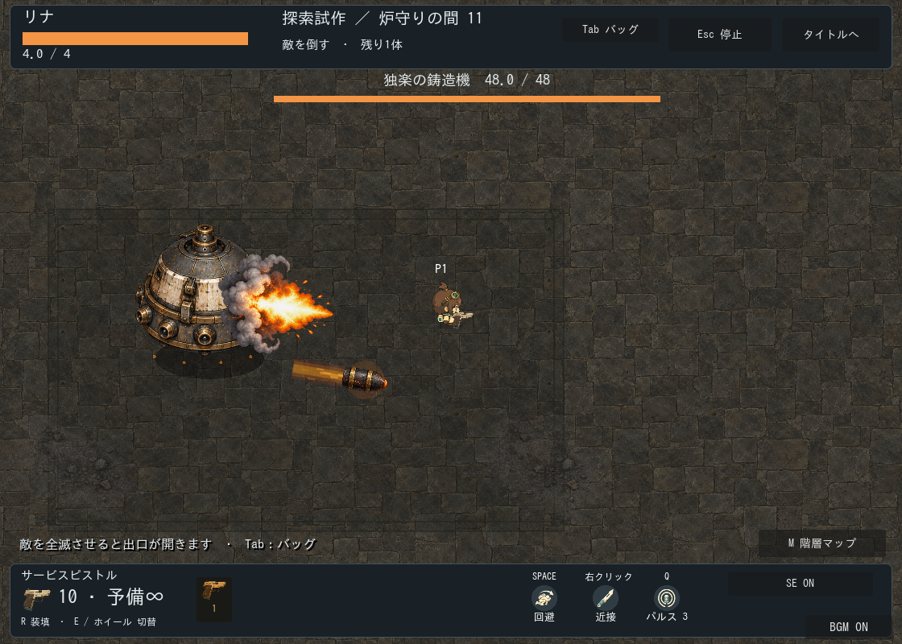

### 開始・撃破報酬の制作範囲（本編接続済み）

開始は2.4秒の炉心点灯・振動・排圧。既存body/effectsとengine/ventを使用。既存素材で撃破爆発を4.5秒へ延長し、報酬箱の出現→単品レリックと少量通貨→出口で踏破へ接続する。

不足素材：ボス専用宝箱の閉・半開・開・空の4コマを1シート生成。見下ろしの正面寄り、錆びた鉄/真鍮/橙の炉心、共通の接地原点(セル幅0.5,高さ0.8)、同寸法、透過、影は別描画。表示幅80px前後、衝突なし。接続前に実寸と切出しを確認する。新規生成の範囲はこの1シート。出現chest_spawn、開封chest_open、取得rare_pickup、機械排圧boss_vent、撃破爆発は既存SEを再利用。生成・本編接続・目視・ユーザー採用を別途記録する。

### 宝箱素材の生成・接続結果

built-in image_genで専用宝箱1シートを生成。原本1309×1201 RGBAを無加工保存。[生成プロンプト](../../../../assets/sprites/boss/foundry-spinner/reward-v1/prompt.txt) / [画像と来歴のmanifest](../../../../assets/sprites/boss/foundry-spinner/reward-v1/manifest.json)。閉/半開はy=0..560、開/空はy=560..1201、x=0/654起点で幅654。接地原点は左列x342/右列x315、上段y513/下段y574。全コマ倍率0.14、見た目の胴幅約79px。等分セルでは下段の蓋が混入するため、実際のalpha範囲に合わせて登録。画像データは加工していない。

開始2.4秒・再挑戦0.8秒、Enterスキップ、既存排圧/エンジンSEとBGM開始を接続。撃破後4.6秒で専用箱を出し、跳ねと着地0.4秒・開閉とアイテム飛び出し0.85秒へ接続。閉・半開・開・アイテム飛び出しを通常倍率で確認し、接地位置と隣コマ混入を修正。数値・取得条件はGAME_RULESを正本とする。報酬箱と起動演出は本編接続済み、自動回帰通過。ユーザーの最終採用・連続動作のテンポ・試聴・Web負荷は未確認。追加SE生成なし。

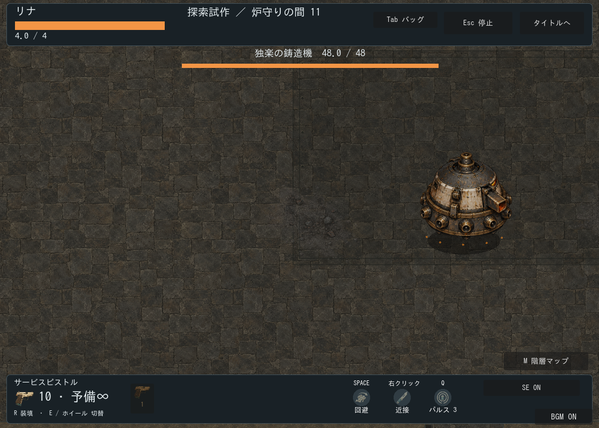
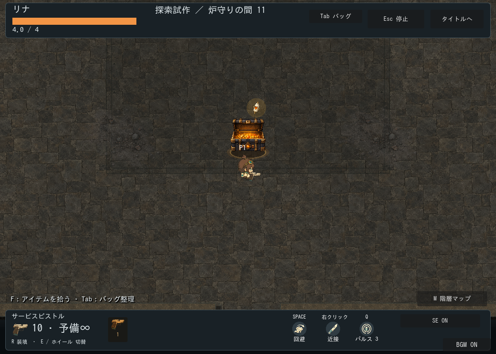

### 宝箱と撃破演出の改訂（2026-09-24）
追加生成なし。既存箱4コマ（原点・倍率は上記のまま）へ跳ね・着地伸縮・開封揺れを適用し、カタログのアイコン1個を0.85秒で箱ごとに決めた安全な方向へ放物線状に飛ばす。選択UIと開始/撃破の説明バナーを廃止。ボスは4.5秒の多段崩壊、1.4秒の主爆発に砲弾着弾アトラスを1.5倍で再利用する。装甲片は着地後静止して退色。4.6秒後に箱を出す。本編接続と自動検証済み。音響は既存を再利用し、今回の聴感・ユーザーによるテンポ採用は未確認。

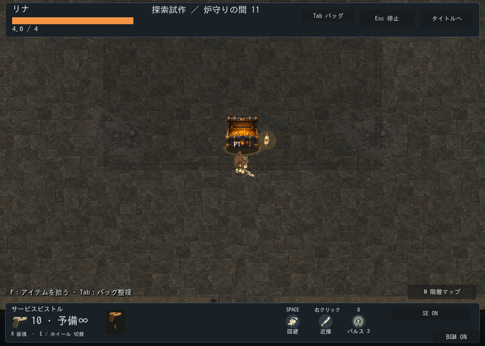
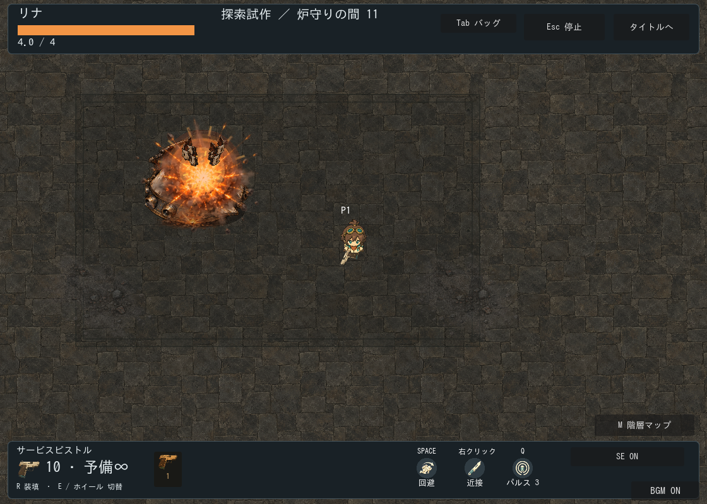
