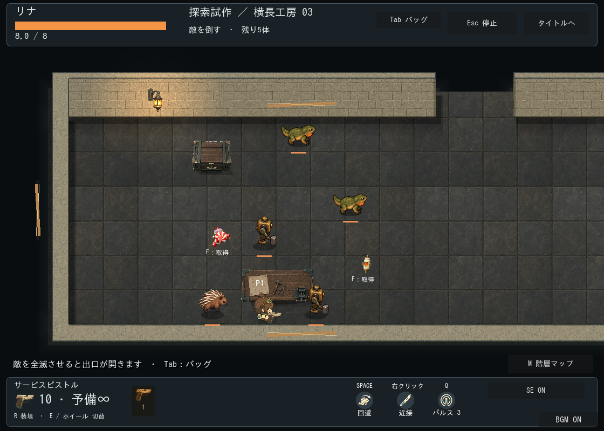
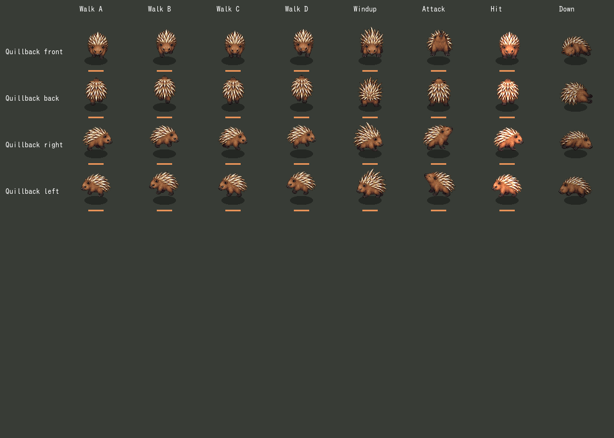
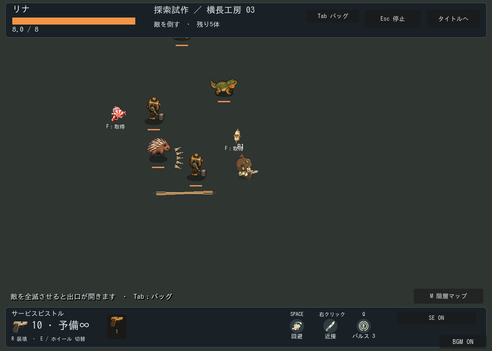

# 棘背ヤマアラシ：素材・実装記録

区分: 本編接続済み、ユーザー受入前。[現行仕様](../../../design/GAME_RULES.md)、[制作テンプレート](../../ENEMY_CREATION_TEMPLATE.md)。

## 仕様票

生物系の範囲射撃敵、ID quillback。工房の見下ろし視点、茶色の毛・象牙色の棘、左上光源。身体は約45〜60px、判定半径20px。表示と判定は独立。4方向の専用コマ方式で、左右反転は使わない。歩行4コマを移動距離へ同期し、停止中は歩行位相を進めない。

| 必要素材 | 制作・用途 | 状態 |
| --- | --- | --- |
| 身体シート | 4方向×8行＝32コマ。歩行4、構え、発射、待機/復帰、撃破 | 生成・本編接続・静止比較済み |
| 被弾 | 専用差分なし、既存の明滅と揺れ | 接続済み |
| 棘弾 | 象牙色の細い棘をコード描画、速度方向へ回転 | 接続済み |
| 接地影/撃破粒子 | 共通コード描画、生物用 | 接続済み |
| 構え/発射/撃破SE | fw_quill_windup_01/fire_01/down_01 | 各1候補生成・接続、未試聴 |

## 原本・派生レシピ

画像原本は[quillback-sheet-v1.png](../../../../assets/first-workshop/enemies/quillback-sheet-v1.png)。内蔵image_genによる新規生成1枚、[最終プロンプト](prompt.txt)。887×1774 RGBA。原本ピクセルは変更せず、enemy_sheet_visual.gdで列4分割と行境界・接地原点を指定し、倍率0.34で描画。余白を含めた均等生成からずれた行はランタイム領域指定で補正。個別コマの自動拡縮なし。ファイルハッシュは[manifest](manifest.json)。

構え0.95秒、発射表示0.25秒、硬直1.7秒。画像終了を攻撃のトリガーにせず、戦闘時刻を参照する。SEのプロンプト・ハッシュ・生成条件は[audio manifest](../../../../assets/audio/asset_manifest.json)。生成は既存CLI、再試行なし。画像API環境の変更はない。

## 検証と残確認

配置・発射・停止・被弾・キャンセルの自動テストと、4方向32コマの静止比較を確認。透過背景と切出しに大きな欠けなし。前後の歩行差分は控えめで、連続動作の自然さ・接地の微調整は手動評価を残す。SEの音色・BGMとの音量比、実戦での難度、Web/低性能端末の負荷、ユーザー採用は未確認。
