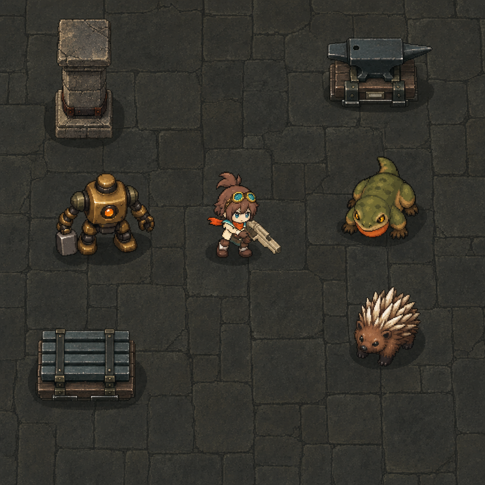
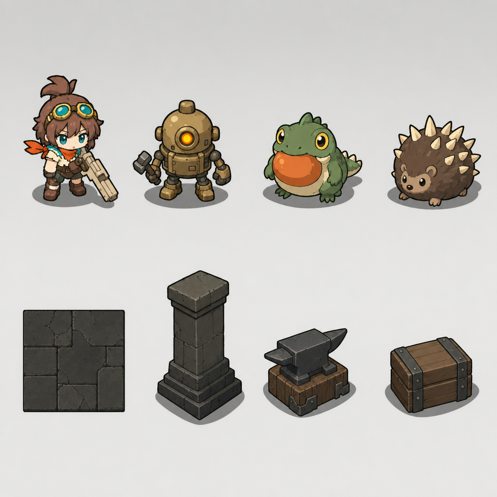
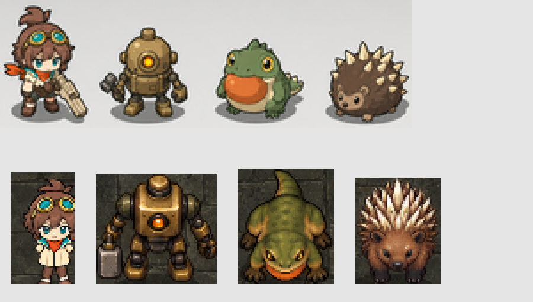
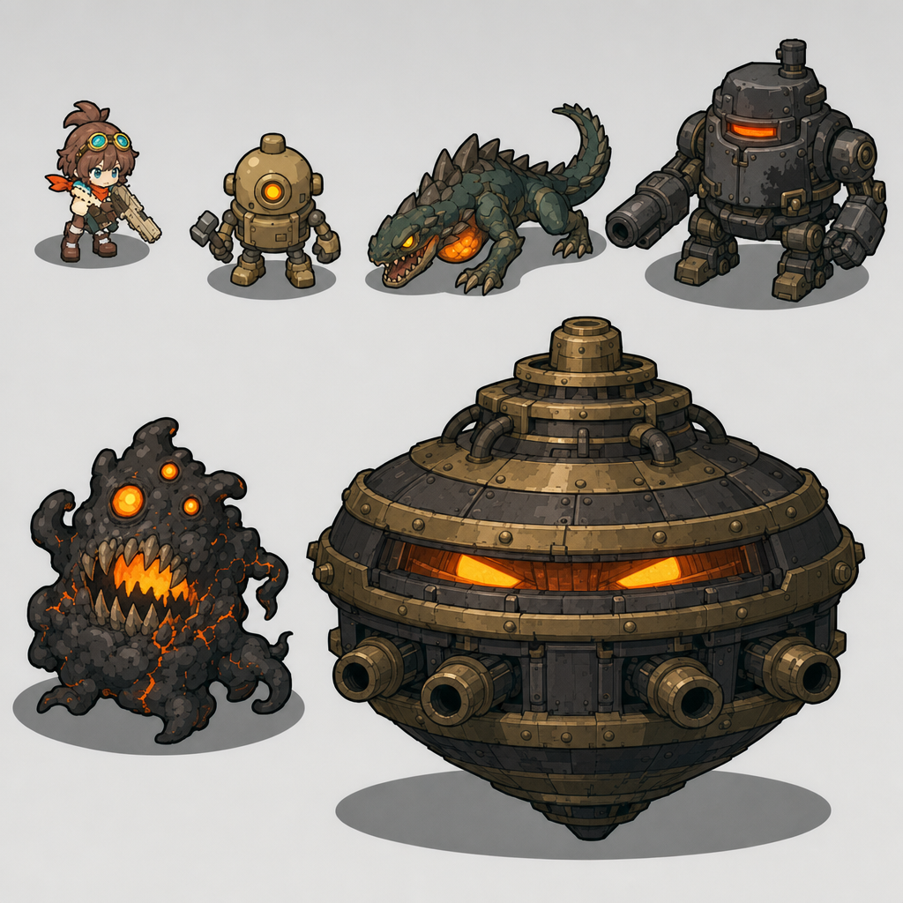
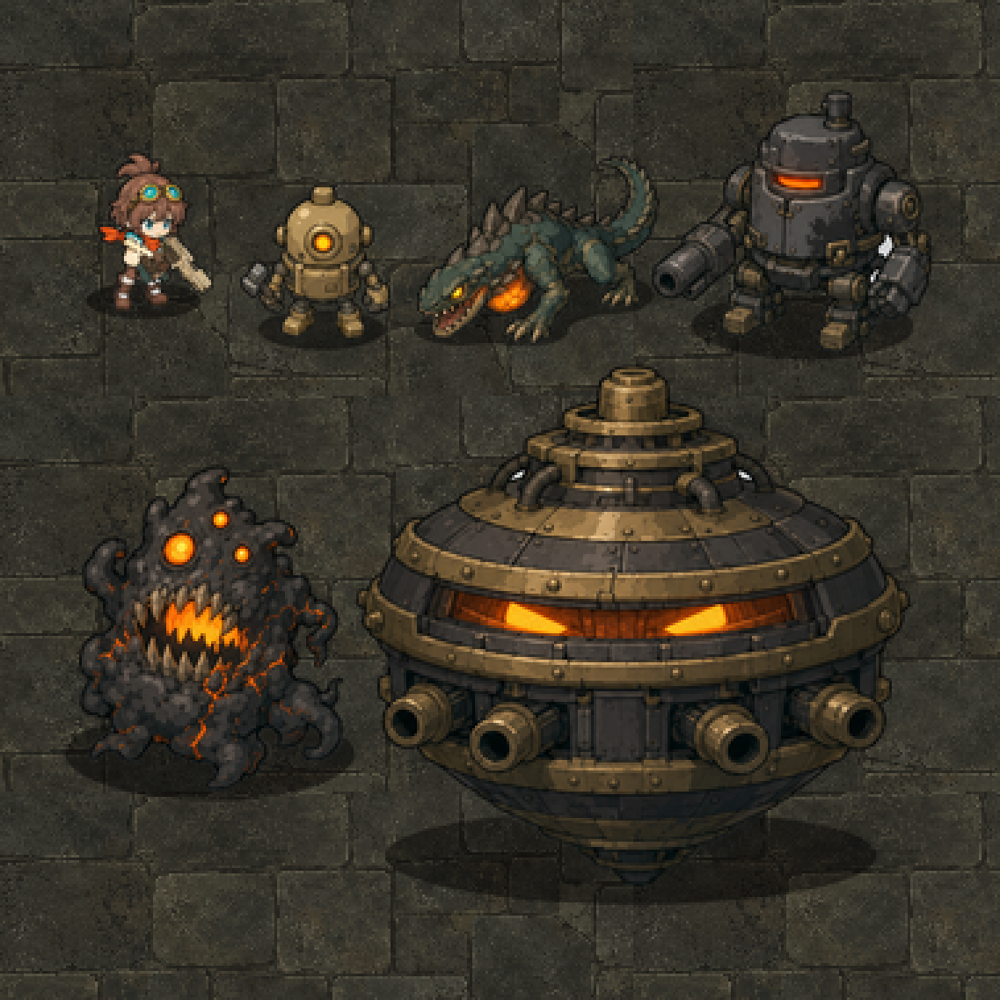

# 画風の基準画像 v1・v2（2026-09-26）

区分: 制作記録（生成）。状態: v1は不採用候補、v2は採用候補（どちらもClaudeの評価）。ユーザー確認待ち。本編・ゲーム素材は変更していない。
目的: [画風の共通規格](../../VISUAL_STYLE_GUIDE.md)の段階1。8方向版リナの絵柄に、通常敵・床・家具を合わせた見本を作る。

[制作指示の索引](../README.md)

## 前提となったユーザー決定（2026-09-26）

- **基準は8方向版リナの絵柄**（[確認画像](../../reviews/rina-style-check-2026-09-26/README.md)）。
- **銃は小さくしない。** 多様な銃を使うゲームなので、武器の形の楽しみを残す。参考動画のゲームでも、銃は体とほぼ同じ長さで描かれている。
- 基準画像の生成を許可（「生成でよいです」）。

## 参考動画から読み取った方針（`.local/reference-video/` のフレームを目視）

- キャラ・敵・木箱などの家具・床の線まで、すべて濃い輪郭線と平塗りに近い陰影で描かれている。背景は、線をなくすのではなく、彩度と明暗差を下げ、形を大きく単純にすることで奥に下げている。
- 敵もキャラと同じ低頭身・デフォルメ。
- 参考動画のゲーム画面は、著作物のため生成の参照画像には使っていない。方針を文章で指示した。

## 生成条件

- CLI: `tools/generate_image.py`、gpt-image-2、quality high、1024×1024、1回。参照画像3枚（edits）。
- 使用量台帳: 85/86件目。推定0.114ドル（使用量からの換算。請求額ではない）。CLIの上限では、これ以上の生成はできない（上限の変更にはユーザー承認が必要）。
- 指示文: [prompt.txt](prompt.txt)（英語、2458バイト）。
- 原本: [assets/generated/style-reference-v1.png](../../../../assets/generated/style-reference-v1.png)（同名JSONに送信条件・参照画像のハッシュ・使用量）。

### 参照画像の作り方

いずれも本編の描画を撮影した既存の確認画像から切り出した（最近傍補間で拡大）。作成スクリプトは使い捨てで、`.local/build_style_refs.gd`（Git管理外）。

|ファイル|元画像|切り出し|倍率|
|---|---|---|---|
|[ref-rina.png](ref-rina.png)|`reviews/rina-style-check-2026-09-26/sheet-normal.png`|96×128のマス: 正面・待機（行2列0）、斜め前・走行（行1列4）、側面・走行（行0列6）、背面・待機（行6列0）|3倍|
|[ref-enemies.png](ref-enemies.png)|`reviews/style-comparison-2026-09-26/lineup.png`（補正前）|番機(372,308,84,78)・トカゲ(671,315,70,81)・ヤマアラシ(867,262,64,76)|3倍|
|[ref-environment.png](ref-environment.png)|`reviews/style-comparison-2026-09-26/boss.png`|(600,30,360,370): 床・柱・金床・資材箱・根の一部|2倍|

## 結果

### Claudeの評価（目視）

- **リナ**: 髪・ゴーグル・スカーフ・大きめの銃・濃い輪郭線が再現された。
- **通常敵・家具・床**: **ほぼ現行素材のまま**。番機・トカゲ・ヤマアラシは、絵画的な陰影と写実寄りの質感・体型が残り、リナの「濃い線と平塗り」に揃っていない。床は細かい石の質感が残り、柱・金床・資材箱も現行とほぼ同じ。
- **縮尺**: リナが画像の高さの約18%で描かれ、指示の約8%より大きい。
- **結論**: 段階1の目的（全体の画風をリナに揃えた見本）は**達成できていない**。基準画像としては不採用を提案する。

### 原因の推定と次回の改善案

- 現行の敵・環境の画像を参照に渡したため、生成がその描き方に強く引っ張られた可能性が高い。次回は**参照画像をリナだけ**にして、敵と環境は文章で指示する。
- 1枚に全要素を詰めず、**敵1体＋床の小片**のように対象を絞る。
- 縮尺は、ゲーム画面の再現ではなく「設定画の並び（同じ倍率で横一列）」として指示する方が守られやすい。
- いずれも、CLIの上限（86件）の引き上げについてユーザーの承認が必要。→ 同日、ユーザーが上限を5件引き上げ（86→91）、v2で上記の改善案を適用した。

## 未確認

- ユーザーの評価。
- 本編の倍率（キャラ全高約63px）へ縮小したときの見え方。

## v2：参照はリナだけ、設定画の並び（2026-09-26）

- 上限: ユーザー承認で86→91件（+5）に引き上げ（`tools/image_budget.py`）。v2は86件目、残り4件。推定0.108ドル。
- 指示文: [prompt-v2.txt](prompt-v2.txt)（2379バイト）。参照は [ref-rina.png](ref-rina.png) の1枚だけ。敵・環境は文章で指示した。
- 構成: 明るい灰色の無地背景に2段。上段はリナ・番機・火袋トカゲ・ヤマアラシ、下段は床の見本・柱・金床・資材箱。
- 原本: [assets/generated/style-reference-v2.png](../../../../assets/generated/style-reference-v2.png)

ゲームと同じ大きさ（リナの全高63px）に縮小して、現行の本編表示と並べた比較（3倍に拡大）。上段がv2、下段が現行。

縮小の手順: v2の上段（x40〜1000, y140〜440）を、リナの高さ約260px→63pxの倍率（0.242）でLanczos縮小。現行は比較シートの `lineup.png` から切り出した。使い捨てスクリプト `.local/scale_v2.gd`（Git管理外）。等倍は [v2-game-scale.png](v2-game-scale.png)。

### Claudeの評価（目視）

- **画風の統一**: 達成。全要素が、リナと同じ濃い茶色の輪郭線、2〜3段の平塗り、丸く太い形で描かれている。ゲームの大きさでも、4体が同じ作品に見える。現行（下段）との差ははっきりしている。
- **番機・ヤマアラシ**: 現行の特徴（真鍮の丸い頭と橙の単眼・ハンマー／茶色の丸い体と白い棘）を保ったまま、デフォルメされた。
- **火袋トカゲ**: **カエルのように見える**。上体を起こして座る姿勢と、平たい顔のため、トカゲらしさ（長い胴・這う姿勢・長めの尾）が薄い。本番制作ではこの形をそのまま使わない。
- **家具の角度**: 柱・金床・資材箱が斜めから見た立体（等角投影に近い）で描かれた。[ステージ素材ガイド](../../STAGE_ASSET_GUIDE.md)の「正投影・横辺は水平」に合わない。基準として使うのは線・塗り・明暗の描き方だけにし、角度は各素材の制作時に正す。
- **床の見本**: 大きな石板と濃い目地で、現行より落ち着いている。明暗の順序（床が最も暗く平坦、家具が中間、キャラが最も明るい）も守られている。
- **リナ**: 参照とほぼ一致するが、ズボンが濃い茶色になるなど細部に差がある。リナ自身は現行の素材を正とする。

### 提案

v2を「描き方（線・塗り・明暗・デフォルメの度合い）」の基準画像として採用する。トカゲの形と家具の角度は基準に含めない。残り4件は、トカゲの試作（段階3）に回す。

## 敵の格の幅の見本 v1（2026-09-26）

ユーザー意向「絵柄は統一しつつ、かっこいい部分は残したい。可愛いだけにしない」（他作品の、丸い形のまま威圧感のあるボスの画面を提示）を受け、[画風の共通規格](../../VISUAL_STYLE_GUIDE.md)の3.4に「揃えるのは描き方、敵ごとに変えてよいのは性格」と「敵の格による描き分け」を追記した。そのうえで、格の上限側（かっこよさ・威圧感・重厚感）の基準を作るため1回生成した。

- 87件目（上限91）、推定0.109ドル。残り3件。
- 指示文: [prompt-range-v1.txt](prompt-range-v1.txt)（2616バイト）。参照は [ref-rina.png](ref-rina.png) と [ref-v2-grunt.png](ref-v2-grunt.png)（v2の番機を切り出した愛嬌側の見本）。
- 内容: リナ（大きさの基準）、愛嬌のある番機、威圧感のある火袋トカゲ（這う姿勢・牙・光る喉袋）、重厚な歩行機械（砲腕・赤い覗き窓）、灰と燠の異形（非対称・三つ目・牙の口）、独楽型の大型ボス。
- 原本: [assets/generated/style-range-v1.png](../../../../assets/generated/style-range-v1.png)

ゲームと同じ大きさ（リナ63px）に縮小し、本編の床に置いた確認（3倍表示。等倍は [range-on-floor.png](range-on-floor.png)）。背景の灰色は縁からの塗りつぶしで透明にし、灰色の影は半透明の黒に置き換えた。使い捨てスクリプト `.local/range_on_floor.gd`（Git管理外）。床は `reviews/style-comparison-2026-09-26/boss.png` の (600,420,240,150) を敷き詰めた。

### Claudeの評価（目視）

- **描き方の統一と、格の幅**: 達成。全員が同じ濃い輪郭線と平塗りの陰影で描かれたまま、番機の愛嬌から、トカゲ・歩行機械の威圧感、異形とボスの重厚さ・不気味さまで描き分けられている。威圧感は、描き込みではなく、目つき・牙・姿勢・大きさ・発光で出ている。
- **暗い敵が床に沈む**: 床の上に置くと、異形の黒い体は輪郭と発光以外がほとんど見えない。トカゲの暗い緑とボスの暗い鉄も、床と近い明るさ。[比較シート](../../reviews/style-comparison-2026-09-26/README.md)で見つかった「ボスが床より暗い」問題と同じ。本番制作では、本体の色を床より明らかに明るくするか、明部の帯・縁の光を加える（規格3.5に追記）。
- **ボスの角度**: 独楽型ボスは横から見た角度に近く、ゲームの見下ろし角度より上面が見えない。本番制作で見下ろし側に直す。
- **描き込み量**: 異形の煤の塊や、ボスのリベットは、ゲームの大きさでは細かすぎる部分がある。規格3.1の「細部の最小単位」に合わせて本番で整理する。

### 提案

v2（描き方の基準）と、この見本（格の幅の基準）の2枚を、今後の敵制作の参照にする。暗い素材色と角度の問題は、この2枚から写さない。

