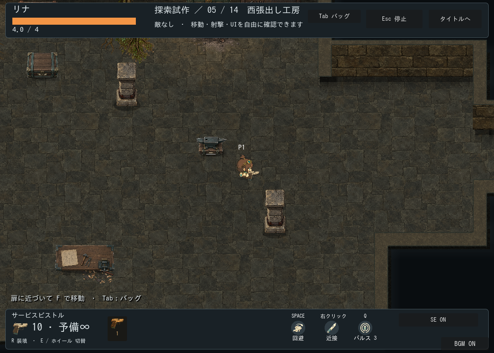
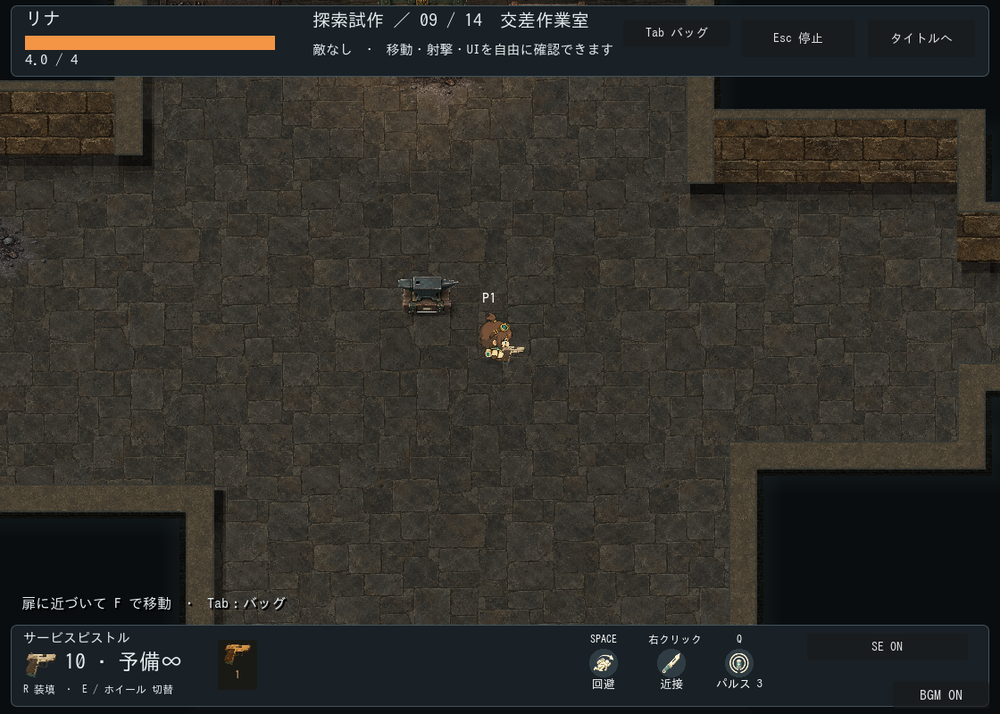
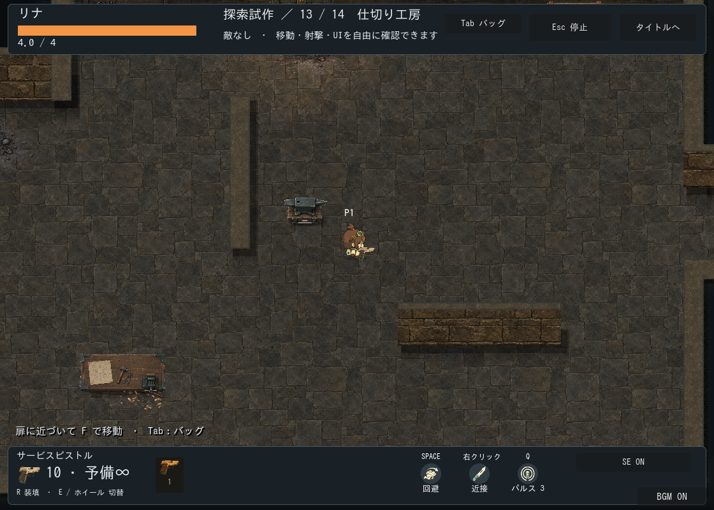
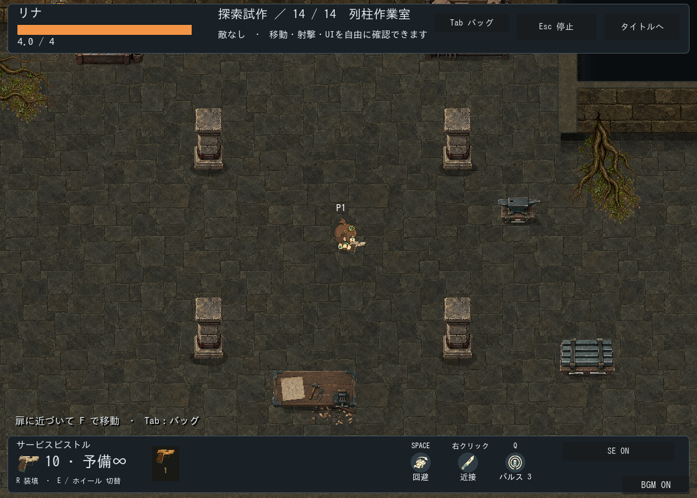
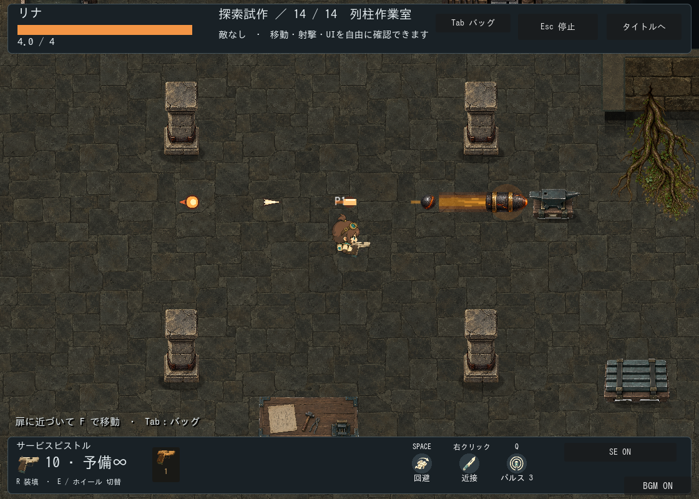

# 工房の形状・寸法バリエーション

区分: 制作・検証記録。現行は生成版4。下段の生成版2は従来6形状の制作履歴。

## 生成版4：瓦礫を使わない増築工房（2026-09-25）

### 仕様票・素材台帳

対象はランダム探索の通常戦闘室。開始・宝箱・ショップ・ボス前室・ボス室の役割と形状は維持する。通常室は既存4種＋追加10種の14種をseed固有の順で重複なし抽選。1フロアに全種を出す仕様ではない。部屋接続のランダム生成と、検証済み形状の抽選を組み合わせる方式で、無制約に輪郭を生成する方式ではない。

最新のユーザー方針に従い瓦礫は使用しない。崩落案は比較履歴に留める。張出し・くぼみ・食違い・柱・短い仕切りで建築の用途と移動経路を変える。追加室は1440×960px、壁32px/北面48px、扉は北南144px/東西112px、通常キャラと倍率1の追従カメラを維持。四隅を切り欠いても四方向の中央開口と到着地点を保持する。

|部品|流用元・派生レシピ|今回の状態|
|---|---|---|
|床・壁・縁・灯り・局所汚れ・工房設備|旧鋳造区テーマ、wall-kit-v2、既存家具。素材周期・人間基準の寸法を維持|新規生成なし、本編接続|
|独立柱|[既存の柱原本・manifest](../../../../assets/stages/ashen-foundry/collapse-v1/manifest.json)。pillars.pngの(215,106,382,784)をAtlasTexture参照。表示48×98.5px、原点(-24,-96)、足元衝突(-22,-18,44,34)、影(-30,-12,60,25)、tint(.76,.74,.69)|西張出し・北棟は2本、列柱室は4本。通常柱のみ使用|
|仕切り壁|既存上面・正面素材を部屋座標で反復。縦32×240px、横256×32px|独立した移動/射線遮蔽物|
|瓦礫・折れ柱|使用しない|以前の試作と原本は保持、本編抽選対象外|

### 形状一覧と全体確認画像

以下はGodotの実描画を**全体確認用に縮小した画像**。ゲームのカメラ倍率は変更しない。左右の扉で14室を巡回する確認シーンは `scenes/game/workshop_variants_preview.tscn`。F6で起動し、左右の扉に近づいてFで移動する。敵なし。通常のランダム探索でも同じ形状と組立処理を使用し、扉はフロアの接続に応じて四方向に変わる。

|ID|形状・特徴|全体確認|
|---|---|---|
|standard|標準|[画像](v4/overview-standard.png)|
|wide|横長|[画像](v4/overview-wide.png)|
|tall|縦長|[画像](v4/overview-tall.png)|
|elbow|従来L字|[画像](v4/overview-elbow.png)|
|west_annex|西張出し＋2本柱|[画像](v4/overview-west_annex.png)|
|east_annex|東張出し|[画像](v4/overview-east_annex.png)|
|offset|北西・南東の食違い|[画像](v4/overview-offset.png)|
|reverse_offset|北東・南西の逆折れ|[画像](v4/overview-reverse_offset.png)|
|cross|左右非対称の交差室|[画像](v4/overview-cross.png)|
|north_wing|北棟＋2本柱|[画像](v4/overview-north_wing.png)|
|south_wing|南棟|[画像](v4/overview-south_wing.png)|
|alcove|鉤形|[画像](v4/overview-alcove.png)|
|partitioned|短い縦横の仕切り|[画像](v4/overview-partitioned.png)|
|pillared|4本柱の広場|[画像](v4/overview-pillared.png)|

### 組立と配置の条件

四隅の切欠きを床矩形と壁矩形へ同時に適用し、露出した縦の上面と横の正面/上面を追加する。内部接合線を隠す柱は置かない。独立柱は明示した支持点に置き、人物とYソートする。床外・壁・既存柱・出入口・開始地点を塞ぐ家具を除外し、壁付き設備は取り付けられる正面壁の存在を確認する。炉や棚を切欠きの外に浮かせない。追加装飾は既存の配置検査と床クリップを利用する。

### 通常倍率の確認画像

### 検証と残事項

100seedの再現性・役割・接続・到達性（713通りの形状/家具/開口）、全14種の抽選出現と同フロア通常室の非重複を検証。14形状×15通りの空でない入口組合せを検査。描画版では巡回14室の接続、左右各入口から6体の敵を配置できること、通常倍率/全体画像の保存を確認。壁の接合、切欠きの床、柱と家具の重なりを目視確認。既存の部屋遷移と連結壁テストもPASS。headlessでは既知の証明書ストア/終了時ObjectDB警告が残る。Web、ユーザー採用、全シードの美術、長時間戦闘における追跡AIの手触りは未確認。敵の配置検査は実戦品質の合格を意味しない。

## 生成版2の仕様票

対象はランダム探索。基調は石床/石積み/金属縁。通常リナと家具の実寸、倍率1の追従カメラを維持。部屋ごとの空間は独立し、マップの1マスは接続関係の模式表示で実寸面積ではない。

|形状ID|フィールド寸法|用途・確認画像|
|---|---|---|
|standard|1120×600|開始と標準室。[画像](standard.png)|
|compact|880×600|宝箱/ショップ予定地。[画像](compact.png)|
|wide|1760×600|横長作業室、横追従。[画像](wide.png)|
|tall|1120×1080|縦長作業室、縦追従。[画像](tall.png)|
|elbow|1440×1000|右上を切り欠いたL字、両軸追従。[画像](elbow.png)|
|hall|2240×1200|ボス予定地、両軸追従。[画像](hall.png)|

ボスは大広間、開始は標準、宝箱/ショップは小部屋。通常室は横長/縦長/L字/標準をseed依存の開始順で循環し、通常10室で全6形状を保証する。8〜12室にも対応。形状をテンプレートIDへ含め、生成版を1から2へ更新。同seedでも版1と版2の配置は異なる。

壁厚32px、北壁厚48px、描画高さ36pxを維持。床は左上(128,128)、右端W-128、下端H-88。扉は北南144px、東西112px、各辺中央。到着点は室内へ100px。北開口時の壁付き設備、南開口時の机などは既存除外規則を継承する。

L字は右上を(864,128)から切り欠き、床を上側矩形と下側矩形へ分割。段の床際はy=368、縦壁上面と横壁正面の接続は既存の面割当処理。四方向の扉位置を維持し、床外に壁を配置する。到達性探索は寸法に応じて増やし最大16384点に制限。

## 素材一覧・原本・派生

新規画像生成なし。床、上面、正面、外周縁、露出端、室外基礎、扉敷居はworkshop_showcaseテーマとwall-kit-v2を共用。家具は工房/隣室の棚・炉・作業台・資材箱・金床・パレット・北壁灯を流用。素材寸法・反復周期・家具衝突寸法は変えず、部屋内の配置基準点だけを移動する。L字の切欠き、床外、到着点/開始点を塞ぐ配置は除外。

原本と抽出/透過レシピは[工房素材](../workshop-showcase/README.md)、[壁材](../wall-kit-v2/README.md)のmanifestを参照。派生画像なし。配置レシピはWorkshopRoomVariants、寸法に応じた外周はWorkshopRoomShell。小部屋の余白は探索専用CanvasLayerでテーマの室外色へ統一し、対戦へ影響させない。

## 検証・未確認

100seedで6形状出現、接続・寸法/壁/床の再現性、274通りの形状/家具/開口の到達性を検証。全室往復・資源と拾得状態・再挑戦・倍率1を統合確認。seed22の6画像は通常表示のスクリーンショットで、全体を縮小した図ではない。小部屋の室外余白、L字の接続、大部屋の人物比を目視確認。既存四方向扉と追従カメラテストもPASS。

全seedでの美術確認、ユーザー採用、照明なし比較、手動操作感、Webは未確認。特殊部屋の機能とボス戦用家具/遮蔽物調整は別作業。自動テスト成功と美術上の採用は分ける。描画統合はPASS、終了時ObjectDB警告が残る。

## カメラと敵弾の視認性調整（2026-09-25）

上記の形状比較画像は変更前の倍率1。現在の本編は1.2倍に寄せる。下は同じ列柱室の現在の倍率で、敵弾5種を比較のため静止配置したGodot画像。左から火弾・棘・機銃・斉射弾・主砲。前4種の表示を1.3倍、主砲は素材側の倍率を維持。新規素材生成なし。輪郭/芯はProjectileArtのコード描画を調整。カメラの拡大は全オブジェクトへ適用される。人物・弾・背景の識別を目視確認。実戦の回避難度・ユーザー採用は未確認。

