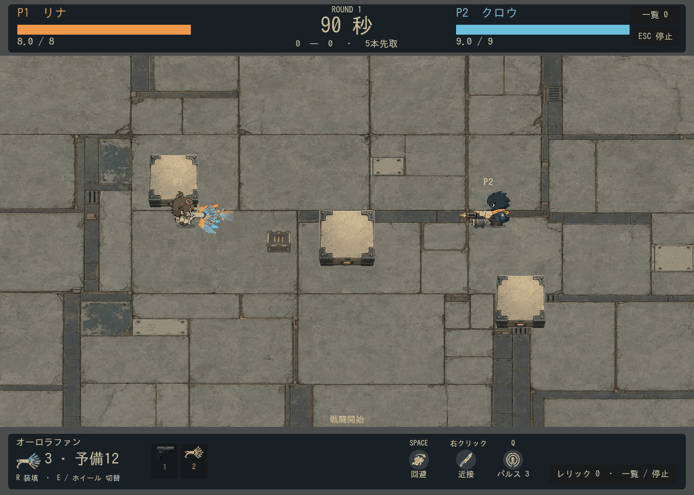

# オーロラの虹の帯

2026-09-13。「色違いの矢と線に見える」という修正後レビューを受け、軌跡の色とつながりを再設計した。追加画像生成は0件。

各弾の軌跡の中で赤〜紫の7色を滑らかに補間する。弾が誘導・反射で離れても、一本ごとに虹が残る。先端のごく短い区間は弾芯の色へ接続する。本体は別のHSV計算をやめ、軌跡と同じ7色パレットを上下方向に使用する。白いベースと握り側は残す。

実移動履歴を進行距離80pxで切り、Curve2Dから連続した点列を作る。共有する点へ小さな波を付けるため、旧実装のように線分の継ぎ目がずれない。基準幅3.8pxの色の芯と低不透明度の外側2層で柔らかさを加える。履歴は24点を上限とし、停止中の時間は進めない。虹の尾の赤と先端側の紫が消えすぎないよう、フェードと弾色への接続区間を短くした。

弾芯の7色・発射数・当たり判定・威力・誘導・反射は維持。プリズムは従来の5色のまま。

## 確認

- `weapon_readability`：色の接続、判定維持、材質解除が合格。`.local/logs/aurora-ribbon-test.log`。
- `aurora_ribbon`：曲がる履歴を80px以内の指定長へ切る処理、連続した点列、7色の端点と中間補間を確認。`.local/logs/aurora-curve-test.log`。
- `projectile_hp`：方向、全38弾の寸法、ポーズとリセットが合格。`.local/logs/aurora-projectile-test.log`。
- `capture_aurora_ribbon.gd -- 37`：実戦48フレームを再描画。前版より虹色の連続性と柔らかさが増したことを複数フレームで目視確認。`.local/logs/aurora-ribbon-render.log`。

前段の全71テストに加え、今回は上記の対象テストを実施。人間による再プレイの受入評価や多人数時の負荷測定は未実施。
