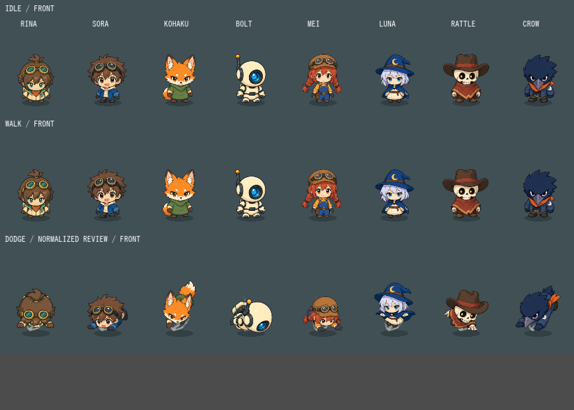

# 全8人のゲーム用方向別素材

2026-09-12。リナで採用した方向・足元・歩行・回避の基準を他7人へ展開し、選択画像とゲーム描画へ統合済み。

[4方向の動作比較GIF](motion.gif) / [正面](front.png) / [背面](back.png) / [右](right.png) / [左](left.png)

比較は上から待機・歩行・回避。回避はキャラ間の姿勢を比較するため全員同じ進捗でゆっくり再生し、終了後の立ち姿も含める。実ゲームの回避時間はリナ0.38秒、他7人0.26秒。GIFはそのままのゲーム速度ではない。

## 各キャラの素材

1人につき3方向×立ち姿・踏み込み・活動・着地の12ポーズを1枚から切り出す。立ち姿の靴を分離して固定パーツ歩行に使い、回避は専用ポーズを描画。左向きは側面の反転。

|キャラ|加工結果|生成指示|見た目|
|---|---|---|---|
|リナ|[先行修正](../rina-dodge-2026-09-12/README.md)|既存採用済み|飛び込み|
|ソラ|[12ポーズ](01-sora/processed.png)|[指示](01-sora/prompt.txt)|低い飛び込み|
|コハク|[12ポーズ](02-kohaku/processed.png)|[指示](02-kohaku/prompt.txt)|狐の尾を伴う跳び込み|
|ボルト|[12ポーズ](03-bolt/processed.png)|[指示](03-bolt/prompt.txt)|脚を畳む低い滑走|
|メイ|[12ポーズ](04-mei/processed.png)|[指示](04-mei/prompt.txt)|手を前へ伸ばした滑り込み|
|ルナ|[12ポーズ](05-luna/processed.png)|[指示](05-luna/prompt.txt)|足を畳む浮遊ステップ|
|ラトル|[12ポーズ](06-rattle/processed.png)|[指示](06-rattle/prompt.txt)|低く身を投げ出す回避|
|クロウ|[12ポーズ](07-crow/processed.png)|[指示](07-crow/prompt.txt)|肩と嘴から飛び込む回避|

## 共通化した点

- 向きを照準で選び、回避中だけ移動方向を優先。斜め境界のヒステリシスも全員共通。
- 靴の支持範囲を基準に方向ごとの原点を統一。通常等身の背面を圧縮する方法からゲーム専用素材へ置換。
- 左右の靴を逆位相で動かし、足元を支点に小さく体重移動。原画の輪郭を歩行コマごとに描き直さない。
- 各方向の立ち姿で表示倍率を決め、その方向の回避全コマに同じ倍率を適用。生成時の背丈差を調整し、短い回避姿勢の個別拡大はしない。
- 種族・衣装・武器・ID・性能を維持。通常等身の設定画は別資料として保存し、今回は再生成しない。

帽子・耳・嘴などによる顔の見かけサイズや、専用ポーズ間の細かな描線の差は残る。3段階回避にはコマの切替があり、歩行も実際の地面へ足を完全固定する方式ではない。人間による操作感の受入は未実施。

原画は `assets/generated/fw-directions-*.png`、ゲーム素材とハッシュ・倍率・原点は `assets/first-workshop/directional-characters/*/manifest.json`、切り出し調整と靴領域は各人の `extraction.json` に保存。[費用・検証・制作記録](../../../archive/2026-09-12/character-directions/REPORT.md)。
