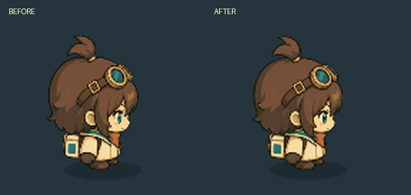
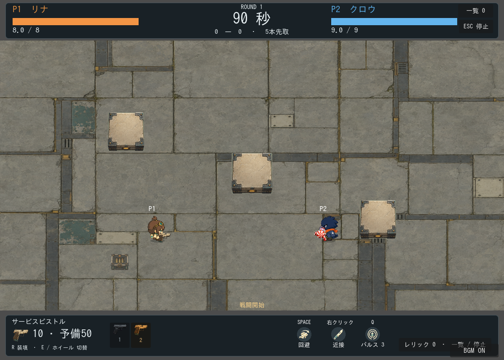

# 待機・歩行モーションのリッチ化

2026-09-21。リナ基準の共通モーションを、同じパーツ構造を持つ8人へ接続。
既存の胴体・左右の靴・方向別画像を使用し、追加の画像生成は行っていない。

## 比較

リナの拡大比較。左が従来の数式による動き、右が新しいキーフレームと状態間の補間。
待機→歩行→停止→後ろ歩き→停止を同じ移動意図で比較する。

[全8人の比較GIF](before-after.gif)。上が従来、下が新方式。元のゲーム表示の1.7倍で撮影。
動画はGodotの実描画210フレームを元に、15fps・7秒のループとしてまとめたもの。
GIFの色数は192色。実ゲームの描画色数は減らしていない。

## 変更した表現

- 待機：2.6秒周期の呼吸と左右への小さな重心移動。
- 歩行：基準0.52秒周期。左右の足を交互に持ち上げ、接地に合わせて体を圧縮・復元する。
- 発進・停止：0.12秒/0.20秒の姿勢補間と、進行方向への傾きの追従・収束。
- 武器：体の動きに合わせて最大2px追従。照準角度は維持。
- 回避：既存の専用絵・時間・射撃解禁を維持。回避へ入る際は歩行の補間を即時中断する。

Godotで`scenes/visuals/actor_animation_state.tscn`を開き、BodyPlayerのidle/moveを編集する。
胴体・左右の靴はSpriteノード。リナの初期画像を配置してあるため、シーン単体でも編集時に見える。
詳細は[アニメーション構成](../../../development/ACTOR_ANIMATION.md)を参照。

今回の頭・髪・腕は胴体と同じ画像。まばたき、髪や衣服の独立した揺れ、キャラ固有の演技は
パーツ分割・描き足し等を行う次段階。素材や性能が変わったという意味ではない。

実プレイで振幅・テンポ・長時間の見やすさの受入は未実施。
検証結果は[記録](../../../archive/2026-09-21/CHARACTER_MOTION.md)、再実行は[TESTING](../../../development/TESTING.md)。
