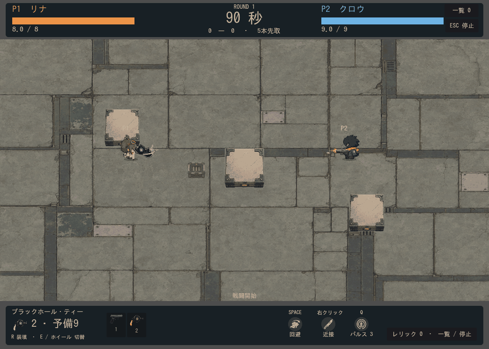
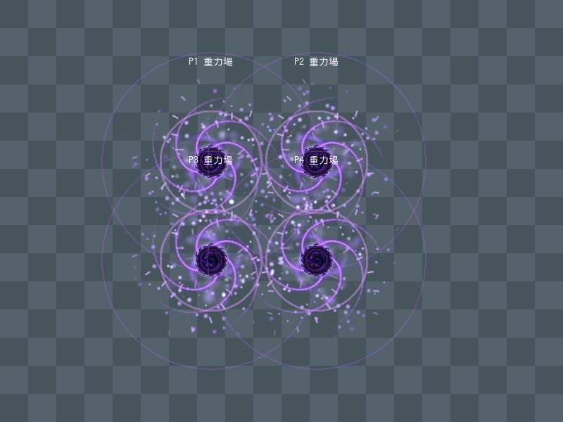

# レジェンド武器の重力場

2026-09-13。ブラックホール・ティーの残留演出を、Godotのネイティブパーティクルと背景参照シェーダーで強化。追加の画像生成は0件。

## 現行の構成

- 既存の発光する渦5本と、吸引方向を示す32本の短い光線。
- `CPUParticles2D` 2系統：光の粒96個、淡い霧28個を上限に放出。円周から内向きに発射し、半径方向の加速と公転を組み合わせる。
- 中心付近180×180pxのシェーダー：背景を数pxずらす局所的な重力レンズ、回る光の帯、中心の暗がりと発光。画面全体をゆがめない。
- 既存の中心PNGを回転・脈動。新しい連番画像は作成していない。

GPUパーティクルではなく、現在のGL Compatibility構成に合わせたCPUパーティクルを採用。シェーダーの描画はGPU。ネイティブ粒子は `speed_scale=0` と `request_particles_process(dt)`、シェーダーは独自の `effect_age` で戦闘時間に同期し、実時間の `TIME` は使わない。時間制御は[Godot CPUParticles2D公式仕様](https://docs.godotengine.org/en/stable/classes/class_cpuparticles2d.html#class-cpuparticles2d-method-request-particles-process)に従う。

背景の読み取りは[Godotのscreen-reading shader](https://docs.godotengine.org/en/stable/tutorials/shaders/screen-reading_shaders.html)を使用。今回のカメラ付きCompatibility描画では矩形コピーで背景が黒くなる現象があり、重力場ごとのビューポートコピーに変更して確認。ゆがみ自体の描画範囲は中心付近だけだが、コピー負荷は画面サイズ・同時重力場数に依存する。

吸引・ダメージ・敵弾吸収・持続3.2秒・各範囲は変更していない。

## 検証

- `legendary_weapons`：既存の重力場の性能、壁、吸収、停止、消滅が合格。`.local/logs/gravity-legendary-test.log`。
- `gravity_legendary`：材質の個別生成、粒子数上限、戦闘時計、ポーズ／結果画面停止、再開、ラウンド削除が合格。`.local/logs/gravity-legendary-lifecycle.log`。
- `capture_gravity_legendary.gd`：実戦96フレーム、Compatibility/OpenGLでシェーダーエラーなし。
- `check_gravity_legendary_render.gd`：4個の重なりを描画。戦闘時間を止めて描画フレームだけ進めても画像がピクセル単位で一致し、再開時には変化することを確認。`.local/logs/gravity-legendary-overlap.log`。
- `.local/gravity-legendary-export.zip`：Web向けデータパックへ書き出し。ブラウザー実機の速度・低性能端末の負荷測定は未実施。

実装：`scripts/visuals/gravity_legendary.gd`、`assets/shaders/gravity_lens.gdshader`、呼び出し元 `scripts/combat/gravity_well.gd`。
