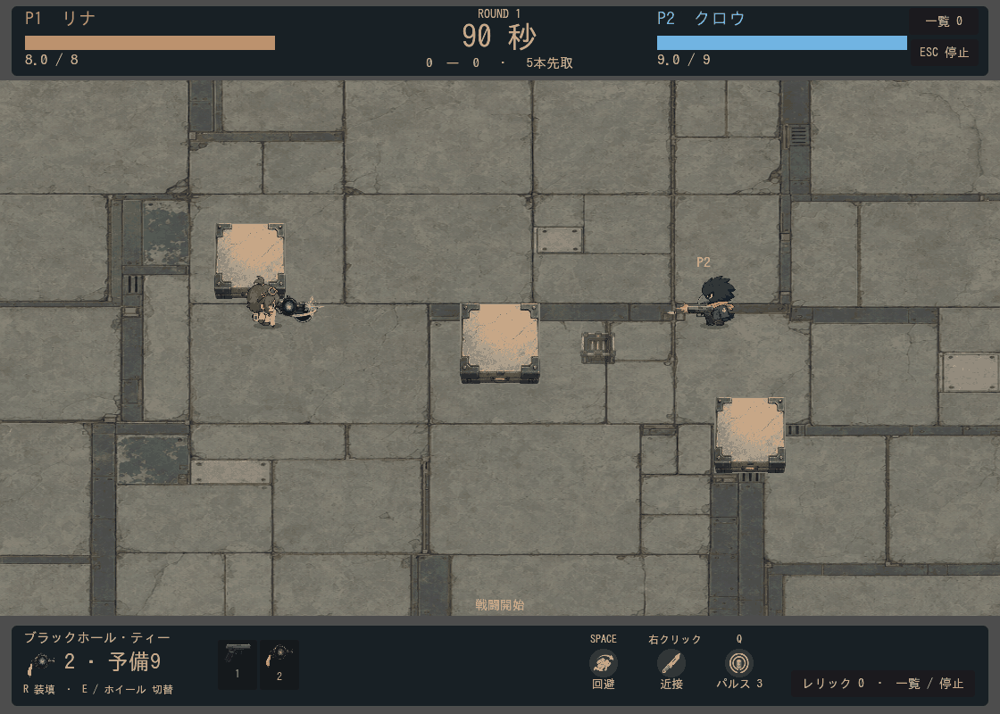

# ブラックホール・ティーの残留演出

2026-09-13。弾の着弾・寿命切れで生成する既存の重力場に、中心へ流れる発光を重ねた渦5本、吸い込まれる粒子32個、出現時の拡大、中心の脈動を追加。追加調整で渦を太く明るくし、広がりと回転速度、中心画像の大きさも強めた。寿命末尾のフェードは既存処理を使用する。描画のみの変更で追加画像生成は0件。

重力場は3.2秒持続。吸引半径155px、ダメージ範囲72px、敵弾への影響半径125px、吸収半径15pxを維持。従来の範囲線は位置を維持して明度を抑え、中心の太い輪を細く調整し、弾を囲む共通の識別リングは追加しない。演出は戦闘のstepに同期するため、ポーズや結果表示では停止する。

`tests/legendary_weapons.gd` 合格（`.local/logs/gravity-residue-test.log`）。吸引・回避中の挙動・壁越しダメージ防止・敵弾吸収・持続時間・ポーズ／結果／リセットを検証。

`tools/capture_gravity_residue.gd` で実戦96フレームを描画。ブラックホール・ティーを1発撃ち、相手側から通常弾を発射する。新しいダメージ床や炎上効果は追加していない。
