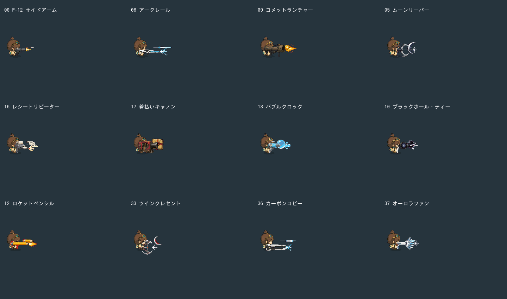
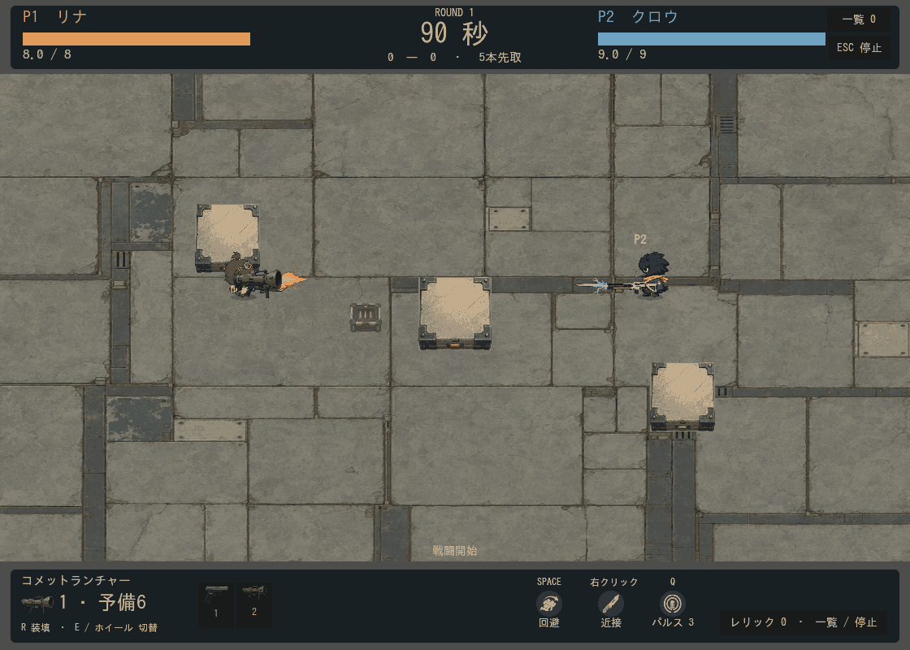

# 弾の大きさ・動きの差別化

2026-09-13。全38武器の表示寸法と軌跡を再調整。既存PNGを使用し、追加の有料生成は0件。

比較は実際の `Projectile.step` と描画を使った独立レーン。射撃間隔・同時発射数・敵・分裂処理は省いた、単発の形と飛行の確認用。右端で再発射する。実戦の発射・壁衝突・ロケットの分裂は下の動画を参照。

通常弾は8〜15px程度の小さい基準に維持。アークレールは42×6pxの光と最大100pxの残光、カーボンコピーは36×5pxと最大84pxの残光。細長い発光部分と軌跡は演出で、レーザーの接触判定は従来の中心半径4pxを維持する。持続ビームへの変更ではない。

コメットは38×25pxの枠内に収めたロケット＋噴炎＋煙、月刃は36×34pxの枠内で回転、レシートは34×16pxの紙が小さく揺れる。小包は通常の伝票弾とは別の38×32px枠。泡は25px前後の球が加速時に伸び、重力球と種は小さく脈動する。画像の比率を維持するため、枠より実寸が小さいものもある。レーザー2種とレシートのみ縦横を独立指定。

軌跡は武器ごとの長さ・幅・最大サンプル数で調整し、回転・伸縮から独立して世界座標へ描画。破片には大型弾の噴炎や長い軌跡を継承しない。着弾・分裂・銃口演出も武器ごとの倍率を使用。弾を囲む共通の識別リングは追加していない（重力弾の元画像や爆発範囲の演出は別）。

## 接触判定の変更

|対象|旧半径|新半径|
|---|---:|---:|
|ムーンリーパー|8|13|
|コメット|11|12|
|重力球|10|13|
|泡|5|10|
|ツインクレセント|8|11|
|最終弾の小包|9|14|

円形判定を維持し、壁と敵への接触に同じ半径を使用。破片等の明示的な `radius` 指定が優先。通常の伝票弾は半径5のまま。威力・発射間隔・弾数・移動速度・爆風半径は変更していない。対人戦での新しい大きさの有利不利は、今後のプレイ評価が必要。

## 検証

- 全69件を実行。66件合格、旧半径を固定値で参照した3件を更新し再実行して合格。ログ `.local/logs/run_tests-20260913-110705.log`、`personality-equipment.log`、`personality-legendary.log`、`personality-pattern.log`。
- 新規 `projectile_personality`：通常弾が外れるかすり位置で大型泡は命中、派生弾の半径指定優先、小包とのサイズ差、泡の加速時伸縮、軌跡の上限を確認。
- 比較72フレーム、実戦48フレームを出力。複数フレームを目視確認。実戦の同時弾数は最大14。
- `.local/projectile-personality-export.zip` を起動。最新の寸法・半径を収録し、docs・tools・tests・生成原画・旧VFXシートの非収録を確認。約15.48MiB、Web実行エンジンを含まないデータパック。

再現用：`tools/capture_projectile_personality.gd`、`tools/capture_projectile_personality_battle.gd`。性能設定は `data/catalog.json`、見た目は `data/weapon_visuals.json`。
