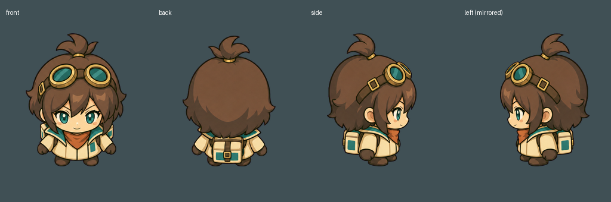
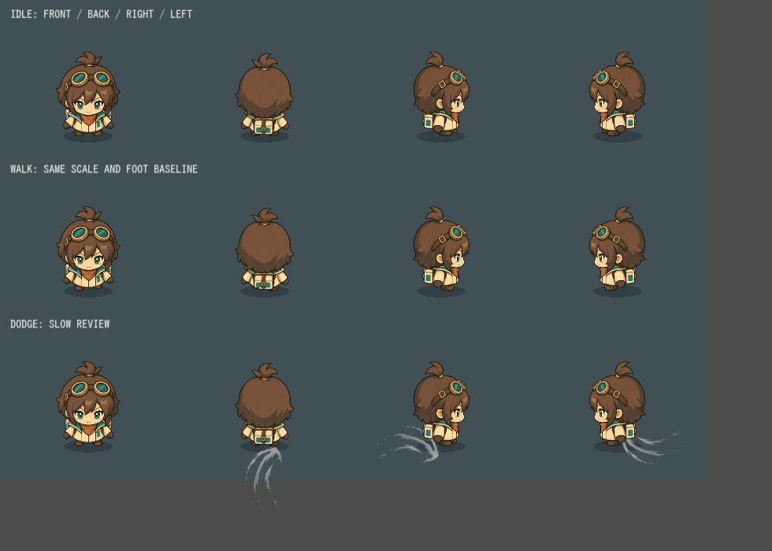

# リナ：ゲーム専用4方向の先行修正

この文書は方向別素材導入時の記録。現在は[足元・歩行・専用ドッジの修正版](../rina-dodge-2026-09-12/README.md)を使用する。以下の専用ポーズ未生成の記述は導入当時の状態。

2026-09-12。正面・背面・右側面を同時に1枚生成し、左側面は反転で使用。リナの選択画像・ゲーム内表示へ接続済み。他7人は前回の素材のままで、この先行修正を基準に展開する。

## 修正した点

- 全方向をゲーム用の低頭身で描き、同じ倍率で切り出して足元を揃えた。通常等身の圧縮や、向きごとの拡大縮小をしない。
- 正面は顔・胸がこちら向き、背面は顔なし、側面は横顔。前後で左右反転せず、側面だけ左右を切替。
- 照準に応じた4方向切替。斜め付近はヒステリシスで安定させる。逆向き移動でも照準を保ち、ドッジ中は移動方向を優先。
- 左右の靴は固定パーツで交互に動かす。小さな靴が裾から離れないよう、立ち位置より下には動かさず裾側へ持ち上げる。
- ドッジは既存のリナの動きを維持。時間0.38秒、無敵0.31秒、距離153.4pxは変更なし。

## 確認用画像

[ゲーム画面](battle.png) / [動作比較GIF](motion.gif)

GIFは上から待機・歩行・ドッジ、左から正面・背面・右・左。ドッジ行は1回0.6秒の比較用スロー表示。実際のゲームでは0.38秒。

今回の目標は方向別の基準を作ること。ドッジ専用の踏み切り・飛び込み・着地の新規ポーズは未生成で、現在も固定パーツの移動・傾き・伸縮による表現。他7人の統一と専用ドッジポーズは後続工程。

## 生成・加工

既存CLI、gpt-image-2 / high / 1024×1024 / 1枚。[生成指示](prompt.txt)、原画 `assets/generated/fw-rina-directions-v1.png`、同名JSONに生成情報を保存。

今回のusage換算は$0.110143。成功分累計$4.0154205。別に過去の成否・課金不明1送信あり。累計37送信、保守予約$37、予約上限$38。推計は請求確定額ではない。追加候補・自動再生成なし。

`tools/build_rina_directions.py` で単色背景を透過、方向ごとに切り出し、足を分離。`assets/first-workshop/rina-directions/manifest.json` に原画ハッシュ・共通倍率・元矩形・足領域を保存。元画像は上書きしない。

## 検証

Godotでインポート・48フレーム撮影・対戦画面を確認。rina_directions、rina_dive、workshop_visuals、catalog、characters、character_animation、character_selectの7テストが合格。足の移動制約を調整後、rina_directionsを再実行して合格。

検証対象は4方向の選択、斜めの切替安定、正面の不要な反転防止、後ろ歩き、回避方向優先、左右の足の交代と下方向への分離防止、既存回避性能、肖像と武器の前後関係。人間による操作感の評価は未実施。

