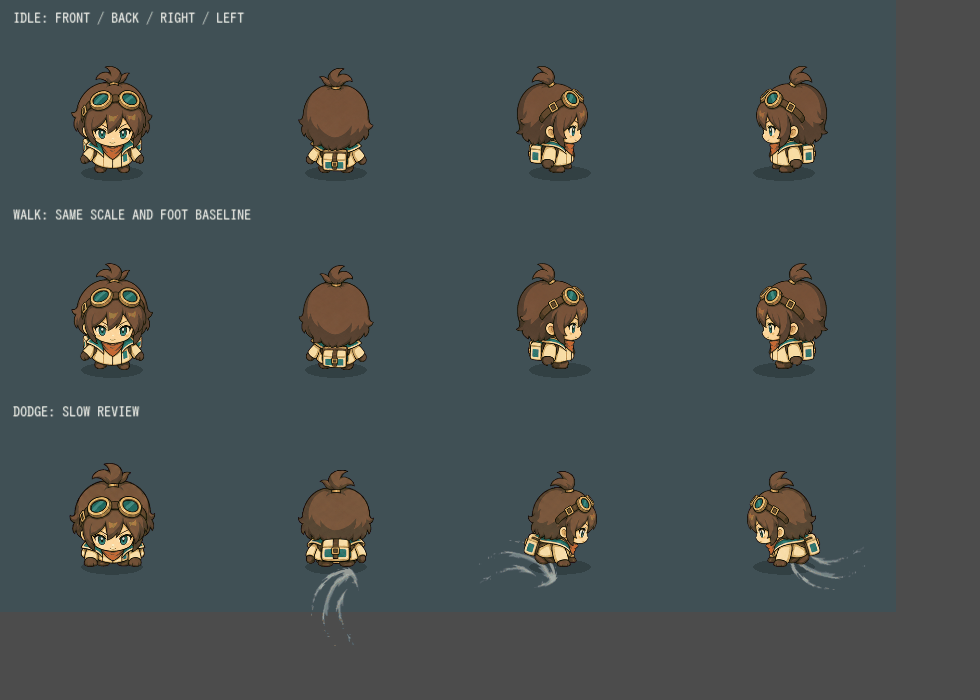

# リナの現行ゲーム素材・動作

足元・歩行の修正と専用ドッジをゲームへ統合済み。方向別の立ち絵は維持。

- 足の支持範囲の中央と底辺を統一。側面の横ずれ4.25pxを解消。
- 固定の靴を左右交互に持ち上げ、胴体は足元を支点に小さく体重移動。通常速度の周期は毎秒約2.33回。輪郭を毎フレーム描き直さない。
- 前・後・右の3方向×踏み込み・飛び込み・着地の9枚を使用。左は右の反転。横は腕を伸ばして脚を畳み、上下は頭と胴体の重なりで移動方向を表す。
- 回避時間0.38秒、無敵0.31秒、移動距離153.4pxを維持。段階は0.04／0.22／0.12秒。

[ゲーム画面](battle.png) / [ドッジ実時間相当GIF](motion-realtime.gif) / [9ポーズ](poses.png) / [生成指示](prompt.txt)

上から待機・歩行・回避、左から正面・背面・右・左。回避は比較用にゆっくり表示し、着地から立ち姿へ戻る区間を含める。GIFは再生環境の時間精度に依存する。

残る制約：歩行は小さな固定パーツの動きであり、地面に足を完全固定する足運びではない。回避は3段階なのでコマの切替があり、原画間に小さな頭部形状・描線の差もある。人による操作感の受入は未実施。今回の追加生成は1枚で終了。

加工レシピは `assets/first-workshop/rina-dodge/manifest.json`、描画は `scripts/visuals/rina_dodge.gd`。[生成費用・検証記録](../../../archive/2026-09-12/rina-gait-dodge/REPORT.md)。
