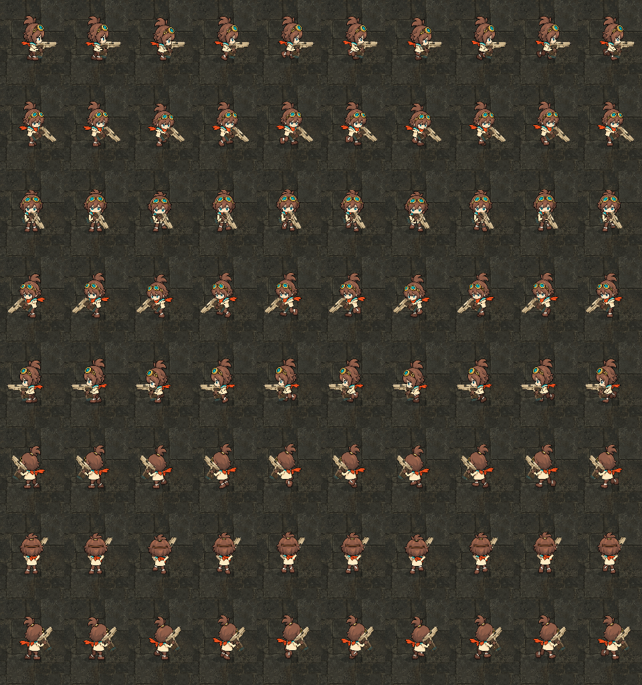
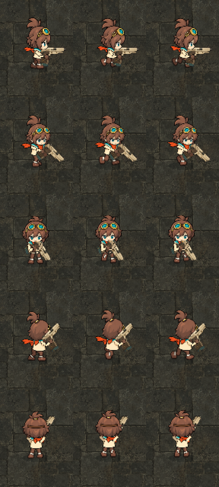

# リナの絵柄確認：8方向版の本編表示（2026-09-26）

区分: 確認資料。状態: 撮影済み。2026-09-26、ユーザーがこの絵柄をゲーム全体の基準に採用。銃は小さくしない（多様な銃の形を楽しめるように）。ゲーム素材・本編コードは変更していない。有料生成なし。
目的: [画風の共通規格](../../VISUAL_STYLE_GUIDE.md)の基準を「修正後のリナ」に置くため、現行の8方向版の見た目を確定する（生成し直しの段階0）。
関連: [リナの体型と独立パーツの試作（制作記録）](../rina-parts-2026-09-25/README.md) / [画風の同倍率比較シート](../style-comparison-2026-09-26/README.md)

[美術の確認資料索引](../README.md)

## 条件

- 本編と同じ探索シーンの列柱作業室の床、カメラ1.2倍。リナは8方向版（`scripts/visuals/character_rig8.gd`、素材 `assets/first-workshop/rina-run-8dir/`）で、初期装備のピストルを持った状態。
- 8方向版は、本編では**標準で無効**。起動引数 `--rina-run` かVキーで有効になる。撮影スクリプトはこれを自動で有効にする。同日の初回撮影は、この切替を見落として旧表示のリナを撮っていたため、全画像を撮り直した（ユーザー指摘）。
- 照準方向＝移動方向として、その場で待機・走行させて撮影した（位置は固定）。回避・近接・後退・照準と移動方向のずれは対象外。
- 撮影: `Godot --path . --script res://tools/capture_rina_style_check.gd --quit-after 5000`（Godotは[TESTING](../../../development/TESTING.md)のローカル実行ファイル）。

## 画像

- [in-game.png](in-game.png): HUDありの実画面（右下向きの待機）。
- [sheet-normal.png](sheet-normal.png): **通常サイズ（評価用）**。1マス96×128px。
  - 行（上から）: 右・右下・下（正面）・左下・左・左上・上（背面）・右上。
  - 列（左から）: 待機2コマ（0秒・0.6秒）、走行8コマ（1周期）。
- [sheet-3x.png](sheet-3x.png): 3倍に拡大した調査用（最近傍補間）。
  - 行（上から）: 右（側面）・右下（斜め前）・下（正面）・右上・上（背面）。左向きの3方向は反転表示なので省略。
  - 列（左から）: 待機、走行2コマ目、走行6コマ目。

## 目視で気づいた点（Claudeの所見。採否はユーザー判断）

- **絵柄**: 約2頭身。濃い茶色の輪郭線と、平塗りに近い2〜3段の陰影。栗色の髪と跳ね毛・ポニーテール、真鍮のゴーグルと青緑のレンズ、アイボリーの服、橙色のスカーフ、茶色の靴が、全8方向で揃っている。
- **8方向の描き分け**: 正面・斜め前・側面・斜め後ろ・背面が、通常サイズでも区別できる。左向きの3方向は反転。
- **走行**: 側面と斜めでは、脚の交互の踏み出しとスカーフのなびきが通常サイズでも読める。正面と背面は、脚の動きが小さく見える。
- **銃**: 正面では体の前に斜めに構え、胴と顎の一部に重なる。背面では右肩の上へ銃身が出る。通常サイズでは、ピストルが体に比べて大きめに見える。
- **他の素材との差**: [比較シート](../style-comparison-2026-09-26/README.md)の計測で、リナの輪郭の対背景差は25.2。通常敵（9.6〜11.6）の2倍以上あり、試行補正後の敵（12.8〜13.9）でも約半分。濃い線と平塗りのリナに対し、敵・ボス・家具は線が弱く絵画的な陰影で、描き方の差がはっきりしている。

## 確認していただきたいこと

1. この絵柄（頭身・濃い輪郭線・平塗りに近い陰影・配色）を、ゲーム全体の基準として採用するか。
2. 銃の大きさと持ち方（正面・背面）を、基準の確定前に直すか、後回しにするか。

## 未確認

- 回避・近接・後退、照準と移動方向が違うときの姿勢。
- 他の床の色や、灯りのある部屋での見え方。
- 動き（コマ送りの速さ・弾み）の評価。これは静止画の範囲外。
