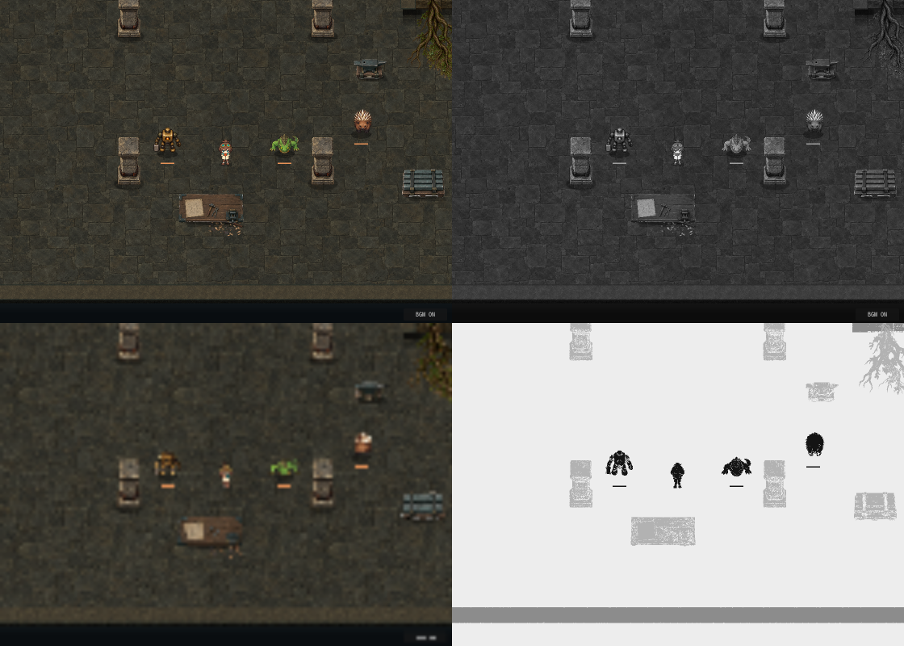
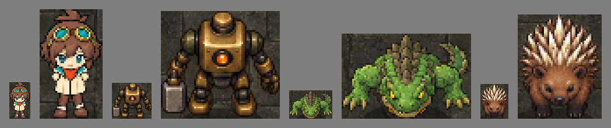
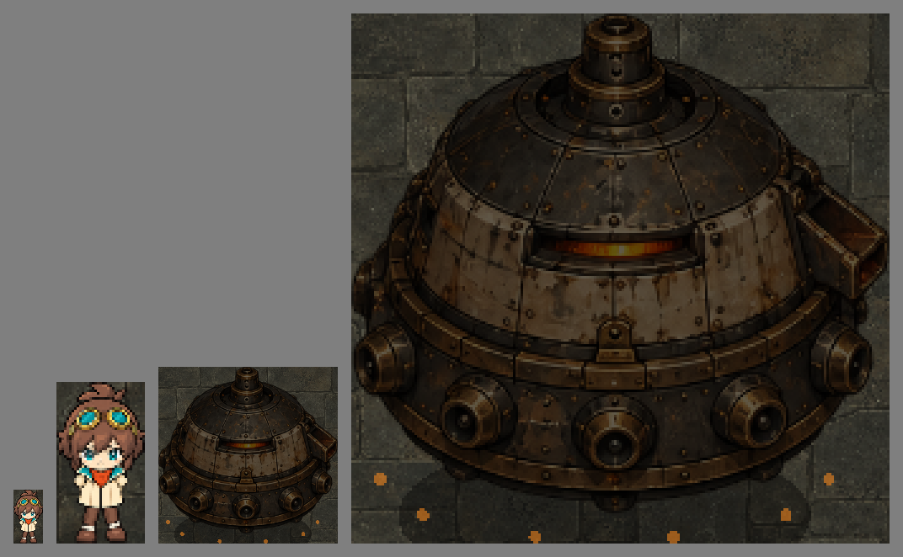
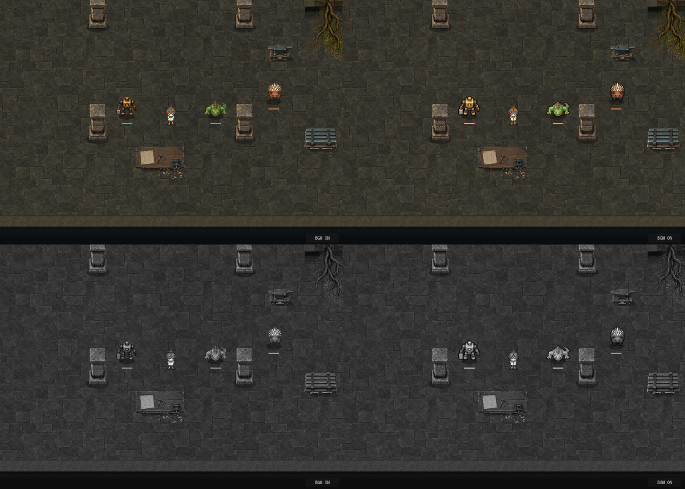
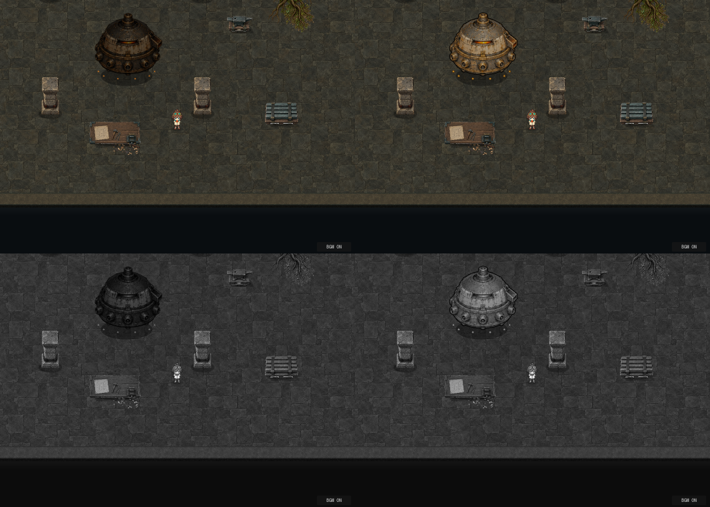
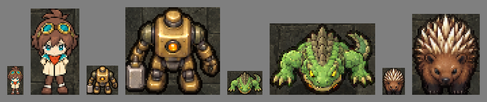
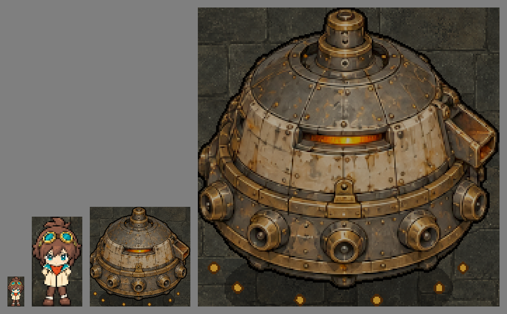

# 画風の同倍率比較シート（2026-09-26）

区分: 確認資料（計測と補正の試行）。状態: 計測済み、敵・ボスの補正を試行済み。どちらもユーザー確認待ち。ゲーム素材・本編コードは変更していない（補正は撮影スクリプト内だけで適用）。有料生成なし。
関連する正本: [画風の共通規格](../../VISUAL_STYLE_GUIDE.md)（提案）

[美術の確認資料索引](../README.md)

## 条件

- 本編と同じ探索シーン（部屋形状の確認用ギャラリー）の列柱作業室、seed 1、表示1120×800、探索カメラ1.2倍、Godot 4.7.2の描画。
- 現行素材をそのまま並べた静止画。リナは正面・待機、敵は下向き。敵のAIと物理処理は止めている。
- リナは**8方向版（修正後）**。本編では起動引数 `--rina-run` かVキーで有効になる表示で、撮影スクリプトが自動で有効にする。初回の撮影（同日）は誤って旧表示のリナで計測していたため、リナの行と関連する記述を差し替えた。敵・家具・床の値は変わらない。
- ボスは縦に大きく敵の列と同じ画面に入らないため、同じカメラ倍率・同じ部屋で別に撮影した。
- 計測では、リナの手持ち武器と「P1」表示を隠した。HUDは計測画像から除外し、`*-in-game.png`だけに表示している。
- 撮影: `Godot --path . --script res://tools/capture_style_comparison.gd --quit-after 8000`（Godotは[TESTING](../../../development/TESTING.md)のローカル実行ファイル）。約2分。補正前と補正後を続けて撮影する。

## 画像

**注意（2026-09-26後半）**: 火袋トカゲを画風統一版v3へ差し替えた後、同じスクリプトで撮り直したため、下の画像と `metrics.json` のトカゲはv3（計測値は[トカゲの制作記録](../../production/fire-pouch-lizard/README.md#確認結果)）。本書の表・考察のトカゲの値は差し替え前（v2）のもの。補正後の画像では、v2用の試行補正がv3にもかかっている。

|ファイル|内容|
|---|---|
|[lineup-in-game.png](lineup-in-game.png) / [boss-in-game.png](boss-in-game.png)|HUDありの実画面|
|[lineup.png](lineup.png) / [boss.png](boss.png)|計測に使った画面（HUDなし）|
|[lineup-strip.png](lineup-strip.png) / [boss-strip.png](boss-strip.png)|各キャラを通常サイズと3倍（最近傍補間）で並べた切り出し。評価は通常サイズ、3倍は調査用|
|[sheet.png](sheet.png)|左上: 通常 / 右上: グレースケール / 左下: ぼかし（1/8縮小→拡大） / 右下: 影絵（黒=キャラ・敵、薄灰=家具、灰=壁）|
|[metrics.json](metrics.json)|全計測値と画面上の外接矩形|

## 計測値

- 明度: sRGBの値から求めた輝度（0〜100）。
- 細部量: 素材内部の隣接画素間の明度差の平均。大きいほど、細かい明暗の変化が多い。
- 輪郭の対背景差: 素材の外周の画素と、同じ位置の背景（その素材を除いて撮影した画面）の明度差の平均。
- 遠目の目立ち度: 画面を1/8に縮小して戻した（ぼかした）画像で、その素材の外接矩形内の明度が、素材なしの画面と比べてどれだけ変わるかの平均。遠目に見たときの目立ち方の指標。補正の試行で追加した。
- 影の画素（下の層を一様に暗くしただけの画素）は色の統計から除外した。

|系統|素材|画面上の幅×高さ(px)|平均明度|明度のばらつき(標準偏差)|彩度|細部量|輪郭の対背景差|
|---|---|---|---|---|---|---|---|
|キャラ|リナ（8方向版）|36×63|44.5|26.8|47.9|8.6|25.2|
|通常敵|番機|68×62|28.5|18.9|55.8|7.1|11.6|
|通常敵|火袋トカゲ|54×65|31.8|14.1|62.2|5.0|9.6|
|通常敵|棘背ヤマアラシ|48×60|38.6|23.7|46.4|9.8|11.3|
|ボス|独楽の鋳造機|213×210|12.5|7.3|55.6|2.0|10.3|
|家具|柱（4本の平均）|57×117|34.1|13.8|29.8|5.0|13.9|
|家具|作業台|160×73|32.6|14.5|35.4|2.3|9.9|
|家具|資材箱|106×70|29.9|14.9|18.5|3.6|15.7|
|家具|金床|81×48|27.8|13.8|20.7|3.3|13.6|
|装飾|根|112×178|18.8|9.5|68.2|4.6|9.6|
|壁|下辺の壁|1120×39|23.8|3.1|27.6|1.3|12.5|
|床|中央付近 240×120|—|20.5|3.2|18.9|1.4|—|

上側の2本の柱は画面上端で切れているため、柱の幅×高さは下側の2本の値。明度などは4本の平均。

## 読み取れたこと

1. **明るさの順序が逆転している。** 規格案では「床 < 背景物 < キャラ・敵」としたが、番機（28.5）とトカゲ（31.8）は柱（34.1）より暗い。背景物より明るいのはリナとヤマアラシだけ。
2. **ボスが床より暗い。** 独楽の鋳造機の平均明度12.5は床（20.5）を下回り、明度のばらつきも7.3と小さい。リベットなどの細部は多いが、明暗差が小さく、通常サイズでは暗い塊に見える。
3. **輪郭は背景物の方が強い。** 輪郭の対背景差は、柱13.9・資材箱15.7に対し、通常敵は9.6〜11.6、ボスは10.3。動くものが背景に埋もれやすい。
4. **床の描き込みは過剰ではない。** 床の細部量1.4・ばらつき3.2は、全素材の中で最小。「床の細かい模様がキャラを簡素に見せている」という規格案の診断は、この計測では裏付けられなかった。床は現状の方向でよい。
5. **統一感の差は、描き込みの量より明暗と輪郭の設計にある。** 細部量はリナ8.6・ヤマアラシ9.8・番機7.1が近い。リナの輪郭の対背景差は25.2で、通常敵（9.6〜11.6）の2倍以上ある。リナは濃い輪郭線と平塗りに近い陰影、敵は輪郭線の弱い絵画的な陰影で、描き方の違いが数値にも出ている。外れているのは、トカゲ（5.0）とボス（2.0、明暗差が小さいため）と、柱（5.0、敵並み）。
6. **彩度**: キャラ・敵は46〜62、床・壁・家具は19〜35で、役割の分離はできている。例外は根の装飾（68）で、敵より鮮やか。
7. **大きさ**: 通常敵はリナとほぼ同じ高さ（リナ63px、敵60〜65px）。ボスは高さ約3.3倍。

## 目視で確認したこと

- 通常画面・グレースケール・ぼかし・影絵の4枚を確認した。グレースケールとぼかしでは、柱の方が番機・トカゲより目立つ。影絵では、4体とも種類を見分けられる。
- リナの見え方は[リナの絵柄確認](../rina-style-check-2026-09-26/README.md)を参照。

## 未計測・制限

- 弾・VFX、拾得物、宝箱、壁の正面（石積み）、灯りのある部屋、リナ以外の7キャラ、走行中や攻撃中の姿勢は対象外。
- 家具の範囲には、接地影の一部や周囲の破片が含まれることがある。敵の範囲には足元のHPバー（数px）を含む。
- 数値はこの部屋・この配置での相対比較用。別の部屋や照明では変わる。
- 自動テストの追加はしていない。撮影スクリプトの正常終了（PASS表示）と、上記の目視確認までが今回の範囲。規格案の数値の採用は、ユーザーの判断待ち。

## 補正の試行：敵・ボスの明るさと輪郭（2026-09-26）

[画風の共通規格](../../VISUAL_STYLE_GUIDE.md)の3.2（輪郭）と3.5（明暗）を、原画を変えずに実現できるかの試行。**撮影スクリプト内だけで適用**し、本編には接続していない。

### 方法

- 敵1体ずつを`CanvasGroup`（子の描画をまとめてから加工できるGodotのノード）で包み、試行用シェーダー [actor_readability.gdshader](../../../../assets/shaders/actor_readability.gdshader) をかける。
- 本体（不透明度0.6以上の画素）だけを補正する。ガンマで暗部を持ち上げ、コントラスト・明るさ・彩度を調整する。接地影や発光などの半透明の画素は変えない。
- 本体の外側2pxに輪郭を付ける。色は、隣接する本体の色を35%の明るさに落としたもの（規格の「固有色の暗色」）。
- 補正値は敵ごと。調整は3回で打ち切った。1回目は明るさ不足、2回目はボスが白っぽく褪せたため、3回目で彩度を戻した。

|敵|ガンマ|コントラスト|明るさ|彩度|
|---|---|---|---|---|
|番機|0.7|1.1|+0.04|1.12|
|火袋トカゲ|0.8|1.2|+0.02|0.95|
|棘背ヤマアラシ|1.0|1.0|0|1.0（輪郭のみ）|
|独楽の鋳造機|0.5|1.2|+0.04|1.3|

### 結果

|敵|平均明度|明度のばらつき|彩度|細部量|輪郭の対背景差|遠目の目立ち度|
|---|---|---|---|---|---|---|
|番機|28.5 → **35.5**|18.9 → 23.3|55.8 → 51.7|7.1 → 7.9|11.6 → 13.9|5.5 → 10.4|
|火袋トカゲ|31.8 → **35.5**|14.1 → 19.7|62.2 → 64.8|5.0 → 5.7|9.6 → 13.3|7.9 → 11.6|
|棘背ヤマアラシ|38.6 → 35.5|23.7 → 24.4|46.4 → 46.9|9.8 → 9.5|11.3 → 12.8|13.9 → 13.9|
|独楽の鋳造機|12.5 → **33.2**|7.3 → 13.4|55.6 → 47.9|2.0 → 3.9|10.3 → 9.9|6.7 → 8.4|
|（参考）リナ（8方向版）|44.5|26.8|47.9|8.6|25.2|11.4|
|（参考）柱（下側2本）|34.6|13.5|29.0|4.8|14.2|11.9|

- **通常敵3種**: 平均明度35以上、明度のばらつき15以上に届き、柱より明るくなった。遠目の目立ち度も、番機はほぼ2倍、トカゲは1.5倍になった。輪郭の対背景差は12.8〜13.9に上がったが、**8方向版リナの25.2の約半分**にとどまる。2pxの暗い輪郭では、リナの濃い線には届かない。
- **ヤマアラシ**: 補正値は変えず、輪郭だけを付けた。暗い輪郭の画素が加わった分、平均明度は下がって見える。
- **ボス**: 平均明度は2.7倍の33.2になった。ただし目標値（明度35・ばらつき15・輪郭13）はどれも少し届かない。遠目の目立ち度8.4は、柱の11.9より低いまま。2回目の設定では明度38.6まで上がったが、彩度が33へ落ち、真鍮と炉の色が抜けた白っぽい見た目になったため、3回目の設定を推奨案とした。
- **計測上の注意**: 暗い床の上に暗い輪郭を付けると、「輪郭の対背景差」は小さく出る。輪郭の効果は、本体と輪郭の境目の締まりとして目視で確認した。

### 目視で確認したこと

- 通常敵: 番機は真鍮の明部が立ち、トカゲは腹の橙が見やすくなった。輪郭で、柱や床との境目がはっきりした。
- ボス: 下地の鉄・真鍮の帯・炉の窓が見分けられるようになった。錆の色は残っている。
- 補正前後の画像は[lineup-before-after.png](lineup-before-after.png)・[boss-before-after.png](boss-before-after.png)。HUDありの補正後画面は`*-corrected-in-game.png`。

### 未確認・課題

- **本編には未接続**。採用する場合は、敵の生成処理（`scripts/game/exploration_encounter.gd`）でCanvasGroupに包む変更が必要。その際は、並び順（y-sort）、撃破演出（`enemy_death.gd`は撃破時の見た目を別ノードで描く）、被弾の点滅との重なりを確認する。
- HPバー・ボスの粒子・攻撃予告の円弧にも輪郭が付く。HPバーは許容範囲に見えるが、攻撃予告と大型攻撃のVFXでの見え方は未確認。
- 敵1体ごとに追加の描画処理が入る。敵6体の部屋やWeb版での負荷は未計測。
- 歩行・攻撃・被弾・暴走中の姿勢、灯りのある部屋、他の床の色では未確認。
- ボスを目標値まで上げるには、補正だけでは色が抜ける。素材側の中間調の明るさ自体を見直す（派生画像の再加工または再生成）余地がある。
- 補正値は目視と計測での試行値で、ユーザー採用前。
