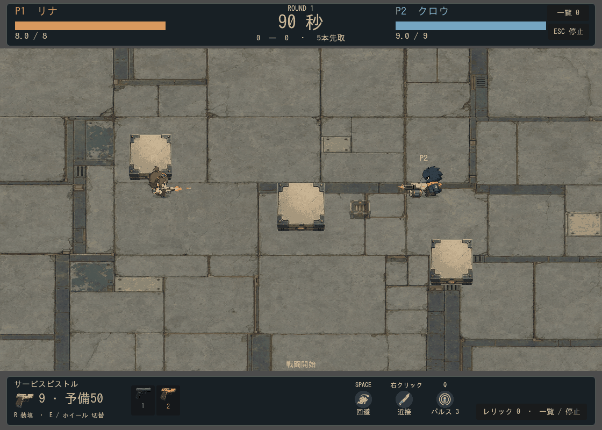
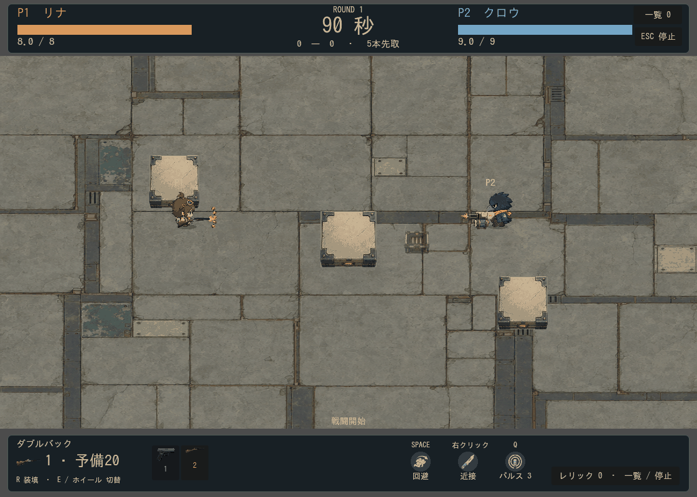

# 武器の視認性・個性の再レビュー

2026-09-13。ユーザーの実プレイ感想を受けた現行38武器のレビュー。ゲームの画像・設定・性能は変更せず、計測と比較資料を作成した。

結論：修正を推奨する。前回の差別化で通常弾を小さくしすぎ、回避に必要な最低限の見やすさを満たせていないものがある。オーロラファンの虹表現も不足。武器本体は全長だけではなく、銃身の太さ・背景とのコントラスト・握り位置から見える範囲で評価する必要がある。

## 1. 弾の視認性を最優先に修正

|代表例|見える弾の大きさ|接触判定の直径|問題|
|---|---:|---:|---|
|サービスピストル|約11.3×2.9px|10px|芯が非常に細く、510px/sで移動する|
|ダブルバック・ペッパーボックス|約5.9×6px|10px|小さな茶色の点で、軌跡もない|
|ミニガトル|約7.7×5px|10px|短い細線の軌跡と小さい弾が背景に埋もれる|
|スカウトニードル|約27×3.9px|10px|長さはあるが幅が細く、700px/s|
|チョークライフル|約17.1×5px|10px|680px/sで細い弾が飛ぶ|

いずれも標準倍率1のゲーム内px。例えば800px高のゲーム画面を600px高へ縮小表示すれば、見かけはさらに約75%になる。α≧160の範囲を計測したもので、内部の透明部分や細い線はこの矩形に含まれる。画像面積の全部が明瞭とは限らない。

優先対象は ID 0 / 4 / 19 / 20 / 21 / 24 / 27 / 29 / 30 / 31。通常弾・散弾の芯と輪郭を合わせた太さ8〜10px、針弾は6〜8pxを最初の調整案とする。短い方向性のある残光、明るい芯と暗い縁を組み合わせ、明るい床と暗い床の両方で検証する。基準値は仮案であり、実プレイで調整する。

細い画像を等比拡大するだけでは弾が長くなりすぎる場合がある。太さと長さを別に設計する必要がある。まず見た目を既存の判定に近づけ、回避しやすさを確認してから必要な判定変更を検討する。既に大きい月刃・ロケット・重力球・泡まで一律に大きくする必要はない。

## 2. オーロラファンは虹を主題に再設計

現在は本体が白〜青の扇状フィン、弾が青紫の羽状、軌跡色は `#bfc7ff` の単色。7発が同じ画像・色・軌跡を使う。軌跡の `aurora` は `rail` と同じ描画分岐で、細い線に白い芯を重ねるだけ。着弾と銃口はarcane系の共通画像。設定値上の弾枠26×12pxに対し、画像の見える部分は約26×8.4pxで、派手さに使える面積も小さい。

提案は「虹の扇を撃つ武器」。7発に赤〜紫の配色順を与え、弾芯・帯状の残光・着弾を同じ色に対応させる。発射時には扇に沿って虹色に光り、残光は少し波打つ帯にする。発光だけを足すと白く混ざるので、彩度と色の分離を保つ。7本の太い光が回避経路を覆わないよう、帯の太さと残存時間に上限を設ける。本体の光学窓の配色も同時に見直す。

7発・拡散角・誘導・反射などの性能は、最初の演出修正では維持する案。現在の青白いSFデザインと、ユーザーが期待する虹のテーマの違いは、単純な倍率変更では解決しない。

## 3. ショットガンなどの本体

ダブルバックは約52×17px。短いわけではないが、細い暗色の銃身とストックが背景やキャラに重なり、小さく見える。握り点から銃口までは約31.5pxで、画像全長がそのままキャラの前に見えるわけではない。

ペッパーボックスは約44×27px。拡散銃としては控えめな大きさ。チョークライフルは62×14pxと長いが薄く、同じ種類の問題を持つ。

ダブルバック・ペッパーボックスは15〜25%程度の拡大を起点に、銃身の厚みと輪郭のコントラストを補強する案。本体の変更後は握り点・銃口・左右反転を再確認する。実銃寄りの銃をすべてコミカルな太い形に変える必要はなく、読み取れる厚みを確保する。

HUD・準備画面も同じ画像を縦横比維持で枠に収めるため、細長い画像は薄く見える。本体の戦闘倍率だけを変えてもUIは改善しない。UI上の見え方も別に確認する。

## 4. 追加で見つかった個性の弱さ

- プリズムバースト：発射処理は5色を `opts.color` に設定するが、専用Artはそれを参照せず武器プロファイルから描画する。弾ごとの色分けが新しい弾描画へ接続されていない。
- `prism / rune / echo / thread / orbit / helix` の軌跡名は、現状では専用形状の分岐を持たず共通の線へ落ちる。名前ほど違う軌跡になっていない。
- `stars` は円粒、`leaves / paper` は短い線を使う。星・葉・紙の形を活かす追加余地がある。
- 発射・着弾は8系統で共有している。全武器の固有化より、虹・プリズム・星・ルーンなどテーマの強い武器を優先すると、演出密度を抑えながら違いを出しやすい。

大型月刃、コメット、ブラックホール、泡、鉛筆、小包は既に形・動きの差があるため、視認性の底上げ対象と同じ拡大をかけずに維持する案。

## 実施順の提案

1. 小さな通常弾・散弾・針弾の最低限の視認性を揃える。
2. オーロラファンとプリズムバーストの色を発射から着弾まで接続する。
3. ダブルバック・ペッパーボックス・細い長銃の本体を調整する。
4. 星・ルーンなどテーマの強い武器の専用軌跡を補強する。

判定の可視範囲とのずれ、複数人の弾幕、背景の明暗、縮小表示を確認し、再度プレイ評価する。

## 確認範囲

全38武器を同じリナ・倍率1で左右から描画し、実行中のSprite寸法と半径を計測。ダブルバック、サービスピストル、オーロラファンは各48フレームの自動射撃を実戦シーンで描画した。人間が操作したプレイではなく、ユーザーの感想を画像・数値・コードで追検証したもの。

[全38武器の実測と所見](measurements.md)／[右向き比較](all-38-right.png)／[左向き比較](all-38-left.png)。左右比較は中立背景、動画は実際の床・壁を使用。

再現：`tools/audit_weapon_readability.gd`、`tools/capture_weapon_audit_battle.gd -- 4`（20 / 37も指定可）。ログ `.local/logs/weapon-readability-audit.log`、`.local/logs/weapon-audit-{04,20,37}.log`。ゲーム実装を変更していないため、今回の確認は描画と計測のみ。新しい素材生成・ゲーム性能変更は行っていない。
