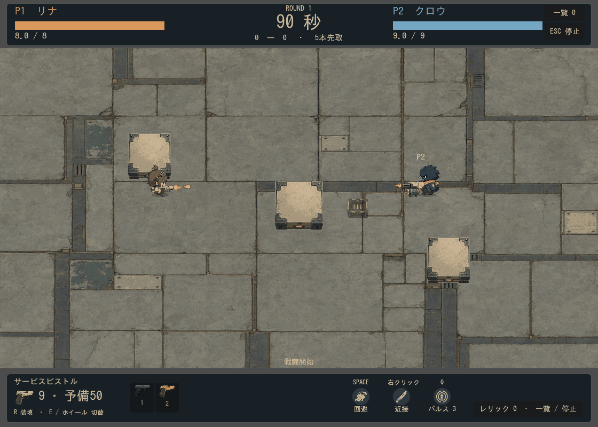
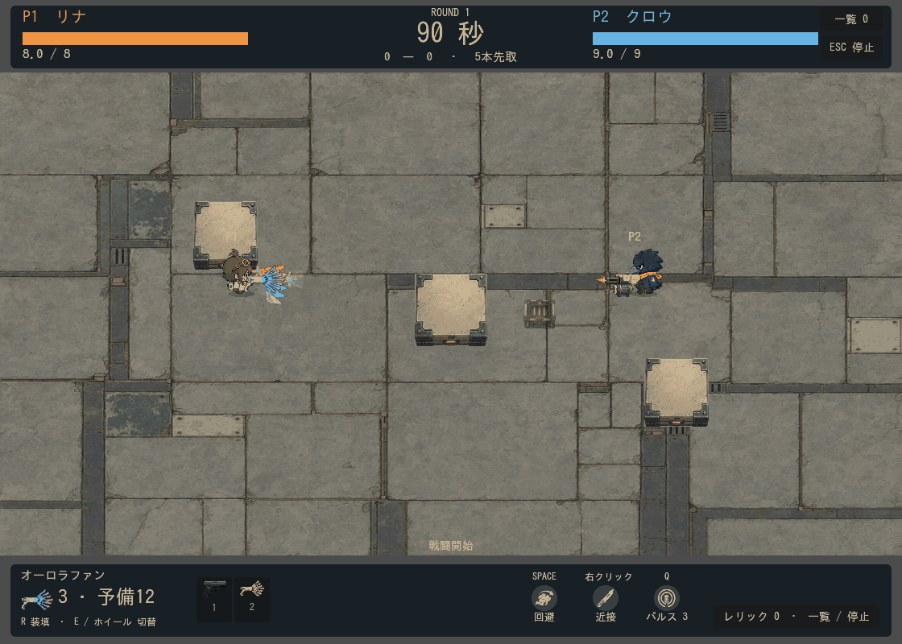
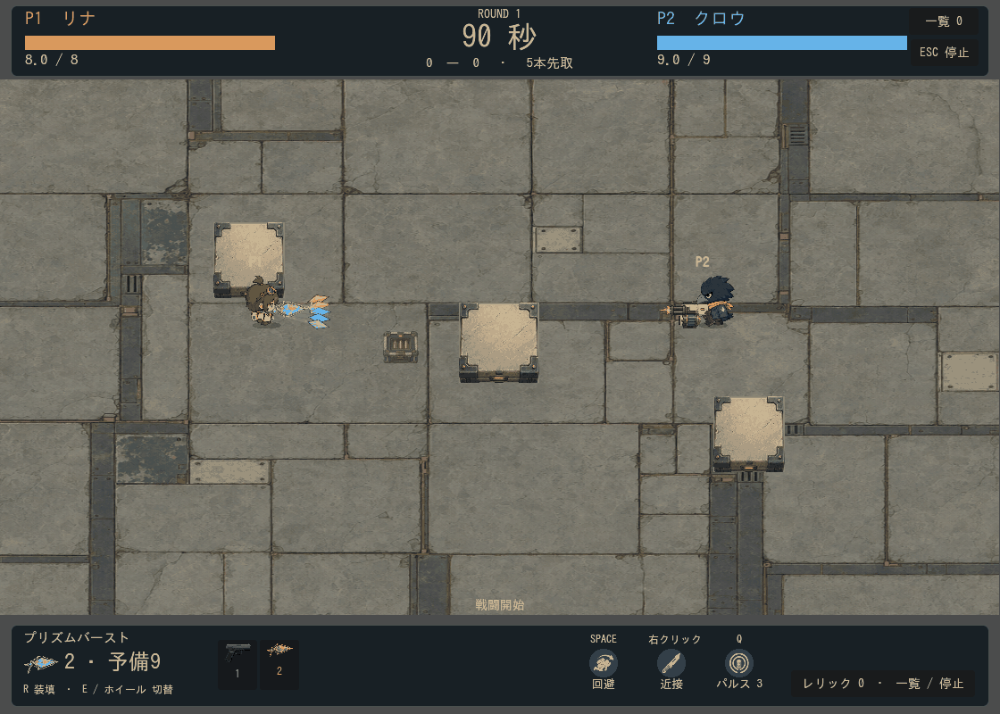
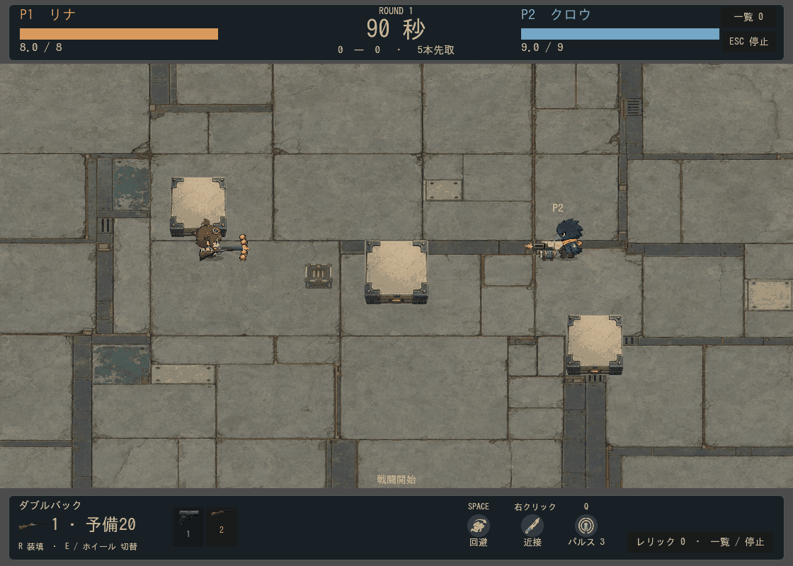

# 弾の視認性・虹表現・武器本体の修正

2026-09-13。[実プレイ感想に基づくレビュー](../weapon-readability-audit-2026-09-13/README.md)の優先項目を実装。追加の画像生成は0件。元画像とコード・シェーダーで調整した。

## 通常弾・散弾・針弾

ID 0 / 4 / 19 / 20 / 21 / 24 / 26 / 27 / 29 / 30 / 31 は表示の太さを8〜10pxに設定。元画像内の透明部分により、実際の可視範囲は若干小さい。長さと太さを独立して調整し、細い画像が過度に長くならないようにした。短い軌跡を28px・幅1.8pxへ揃え、散弾にも進行方向を示す軌跡を追加。これらとリベット・ホチキス弾には輪郭を補強するシェーダーを使用する。

|例|変更前の表示枠／実寸|変更後の表示枠|
|---|---|---|
|サービスピストル|12×7枠、実寸約12×3|16×9|
|ダブルバック・ペッパーボックス|8×6枠、実寸約6×6|10×10|
|ミニガトル|9×5枠|14×9|
|スカウトニードル|27×4枠|28×8|
|チョークライフル|25×5枠|26×8|

## オーロラファン・プリズムバースト

オーロラは赤〜紫の7色、プリズムは5色を発射順に割り当てる。弾ごとの `visual_color` を専用画像・軌跡・着弾へ渡す。描画側の色は性能上の色や判定から独立している。

オーロラ弾は30×14px、最大68pxの色付き帯状の残光と細い副線。小さな波を付け、7色を白く混ぜない。プリズムは25×11px、最大56pxの色付き残光。発射時に配色順の扇状閃光、着弾時に弾色の火花を表示する。

オーロラ本体は白いベースを保ちながら前方フィンを虹色にする。戦闘・アクティブ武器HUD・準備画面の画像・床の武器に同じ材質設定を使用。HUDの小さな武器切替ボタンの組み込みアイコンは元画像のまま。

## 本体とその他の軌跡

- ダブルバックは戦闘表示倍率1.3→1.56（20%増）、ペッパーボックス1.1→1.35（約23%増）。チョークライフルも1.55→1.7（約10%増）。正規化された握り点・銃口から再計算し、左右の持ち方を維持。輪郭も補強。
- 星は十字のきらめき、ルーンは菱形の記号、葉は菱形の面、紙は折れた形の線へ変更。
- スプライトの色変換が軌跡へかからないよう、軌跡を専用CanvasItemへ分離。回転や伸縮に依存しない世界座標の描画を維持。

当たり判定・威力・弾速・発射数・拡散角・反射・誘導・装填時間は今回変更していない。月刃・ロケット・泡・重力場のサイズも維持。

## 検証

- 全71件の回帰テスト合格：`.local/logs/run_tests-20260913-122418.log`。
- `weapon_readability`：7色／5色が実際の発射から専用Sprite・軌跡・着弾へ届くこと、通常弾の厚みと判定維持、持替え時の材質解除・UI用材質のキャッシュを検証。
- 全38武器を倍率1で左右から再描画：[右](all-38-right.png)／[左](all-38-left.png)。実寸は `runtime-measurements.json`。
- 実戦4ケース（ID 4 / 8 / 20 / 37）各48フレームを描画。動画は共通パレットで圧縮。人間が操作したプレイではなく、固定入力による実装描画の確認。
- `.local/weapon-readability-export.zip` に最新のシェーダー・軌跡スクリプト・配色データを書き出し。

再現：`tools/capture_weapon_readability.gd -- 37`（4 / 8 / 20も指定可能）。追加の実プレイでは、複数人の弾幕、縮小表示、虹の帯が回避経路を隠さないかを確認する。Web実機の負荷・操作感は別途評価が必要。
