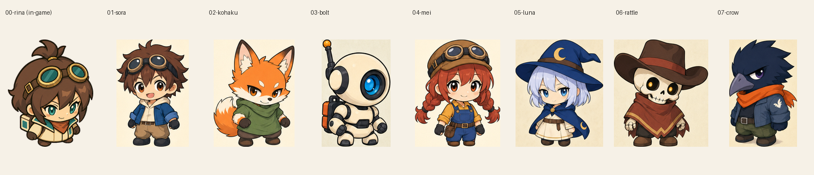

# キャラクター修正指示

2026-09-12。ユーザー承認済みの方針：既存キャラクターの識別点を復元し、ゲーム用の足回りを実装済みリナへ統一する。通常等身は自然な脚の長さを保つ。

リナは採用済み正面画像を維持。他7人の通常等身前後＋低頭身の修正設定シートを制作・確認済み。以前の人間版コハク・ラトル・クロウは旧比較案として保存する。後続依頼でゲーム差し替え・全員の歩行・背面・キャラ別回避を実装済み。[実装結果](../../../archive/2026-09-12/character-integration/REPORT.md)。以下の比較・後続工程は設定画時点の記録で、現在の残課題は実装結果を参照。

[通常等身一覧](normal-lineup.png) / [56px表示比較（3倍表示）](chibi-lineup.png) / [元画像・切り出し・usageの記録](manifest.json)

|キャラ|通常等身（前後）|低頭身|原画|
|---|---|---|---|
|ソラ|[通常等身](01-sora/normal-proportions.png)|[低頭身](01-sora/chibi.png)|[シート](01-sora/sheet.png)|
|コハク|[通常等身](02-kohaku/normal-proportions.png)|[低頭身](02-kohaku/chibi.png)|[シート](02-kohaku/sheet.png)|
|ボルト|[通常等身](03-bolt/normal-proportions.png)|[低頭身](03-bolt/chibi.png)|[シート](03-bolt/sheet.png)|
|メイ|[通常等身](04-mei/normal-proportions.png)|[低頭身](04-mei/chibi.png)|[シート](04-mei/sheet.png)|
|ルナ|[通常等身](05-luna/normal-proportions.png)|[低頭身](05-luna/chibi.png)|[シート](05-luna/sheet.png)|
|ラトル|[通常等身](06-rattle/normal-proportions.png)|[低頭身](06-rattle/chibi.png)|[シート](06-rattle/sheet.png)|
|クロウ|[通常等身](07-crow/normal-proportions.png)|[低頭身](07-crow/chibi.png)|[シート](07-crow/sheet.png)|

## 確認結果と残る調整

- コハクの狐、ラトルの骸骨、クロウの鳥人を復元。ボルトも丸い頭・青い単眼へ戻った。
- ソラの茶髪・ゴーグル、メイの三つ編み・つなぎ、ルナの魔女帽子・マントを復元。
- ルナは長いズボン部分が消え、裾の下に小さな左右の靴が見える。コハク・ボルト・ラトルも短い足回り。
- ソラ・メイ・クロウはリナより腰下の長さが残る。絵柄と種族の修正はできたが、全員のゲーム用比率が完全に揃ったとは扱わない。固定パーツ化で胴体・靴の位置を調整して再比較する。
- 帽子・耳を含む全高56pxで比較したため、顔や胴体の見かけの大きさは各人で異なる。実装時は足元原点と胴体の見かけサイズも照合する。
- 切り出しは元の画素を保存。ルナの背面は隣の低頭身帽子が入り込む欄の端だけ多角形で切り出した。描き直し・脚の形の加工はしていない。各人のsheet.pngは原画全体を保持。

元画像：`assets/characters/fighters.png`（4列×2行、ID順）。頭身の基準：`tests/fixtures/art/legacy-rina-twohead/rina.png`。ルナだけでなくソラ・ラトル・クロウも脚の見える長さを減らす。靴の大きさは個性を残し、左右別パーツとして読み取れる形にする。輪郭の安定と交互歩行は画像だけで解決済みとせず、実装時に固定パーツと逆位相の動作を確認する。

|対象|生成指示|
|---|---|
|ソラ|[01-sora.txt](01-sora.txt)|
|コハク|[02-kohaku.txt](02-kohaku.txt)|
|ボルト|[03-bolt.txt](03-bolt.txt)|
|メイ|[04-mei.txt](04-mei.txt)|
|ルナ|[05-luna.txt](05-luna.txt)|
|ラトル|[06-rattle.txt](06-rattle.txt)|
|クロウ|[07-crow.txt](07-crow.txt)|

## 受入条件

- 狐・骸骨・鳥人・単眼ロボットの種別と、各人の帽子・髪型・主要配色を元画像と照合。
- 低頭身の全身を同じ56px高で比較し、長いズボン部分や膝が見えないこと、靴が左右別に読めることを確認。
- 通常等身前後と低頭身で種族・衣装・装備が一致すること。
- 生成結果は個別確認し、不合格でも自動で追加生成しない。

## 生成枠

ユーザー承認の7枚を完成。最初のソラ送信は成否不明で停止後、ユーザーの「進めてください。」を受けて1回再送し成功。前回予約は解放せず、予約上限$37・累計最大36送信として管理。全体は36送信（成功35・成否不明1）、保守予約$36。

今回受領した7枚のusage換算合計は$0.8113765。成功分の全体累計は$3.9052775。成否不明の1回はusage・請求有無が不明であり、合計に算入できていない。これは請求確定額ではない。成否不明の台帳と旧lockは保持し、ユーザーの再開指示を追記した。以降の自動再生成は行わない。

## ゲーム用アニメーションの後続工程

設定画だけではゲーム用モーションは完成しない。修正設定画の見た目を確認後、各キャラのゲーム用基準画像を整え、頭・胴体・左右の靴を固定パーツとして扱う。最低限、待機、左右の靴が逆位相で交代する歩行、回避の踏み切り・空中・着地、向きと武器の前後関係を確認する。上下移動の背面表現は別途必要で、正面画像だけで完成とはしない。

回避はリナの飛び込みを基準とし、ボルトの低い滑走、ルナの短い跳躍など外見に合う表現を検討する。画像の伸縮・移動で成立する部分と、専用ポーズが必要な部分を実装時に分ける。新たな有料アニメーションシートは今回の7枚枠に含めない。キャラ別の見た目を変えるだけで無敵時間・距離・クールダウンを変更しない。

検証では同じ表示サイズで左右交代、輪郭の揺れ、着地時の足位置、上下移動、移動方向と照準が異なる場合を確認。回避の性能を変える場合は既存リナの距離・無敵検証を他キャラにも適用する。
