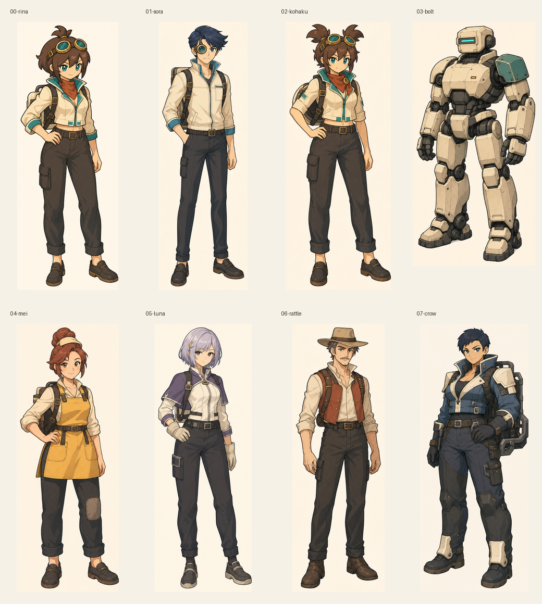
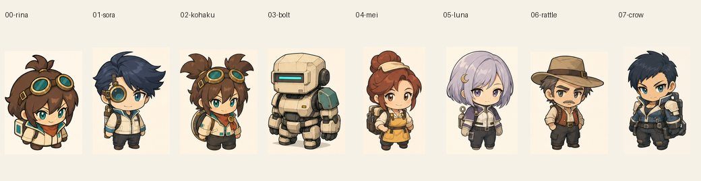

# 8人のキャラクター設定画

[キャラクター美術定義](../../../design/CHARACTER_BIBLE.md)を基にした初稿。通常等身の前面・背面と、ゲーム用2頭身への対応を別画像として保存する。リナの採用済みデザインを除き、人物像と外見は今回の制作案であり、設定画の完成をゲーム実装済みとは扱わない。

|人物|元設定シート|通常等身前後|前面|背面|2頭身|
|---|---|---|---|---|---|
|リナ|[シート](00-rina/sheet.png)|[通常等身](00-rina/normal-proportions.png)|[前](00-rina/front.png)|[後](00-rina/back.png)|[2頭身](00-rina/chibi.png)|
|ソラ|[シート](01-sora/sheet.png)|[通常等身](01-sora/normal-proportions.png)|[前](01-sora/front.png)|[後](01-sora/back.png)|[2頭身](01-sora/chibi.png)|
|コハク|[シート](02-kohaku/sheet.png)|[通常等身](02-kohaku/normal-proportions.png)|[前](02-kohaku/front.png)|[後](02-kohaku/back.png)|[2頭身](02-kohaku/chibi.png)|
|ボルト|[シート](03-bolt/sheet.png)|[通常等身](03-bolt/normal-proportions.png)|[前](03-bolt/front.png)|[後](03-bolt/back.png)|[2頭身](03-bolt/chibi.png)|
|メイ|[シート](04-mei/sheet.png)|[通常等身](04-mei/normal-proportions.png)|[前](04-mei/front.png)|[後](04-mei/back.png)|[2頭身](04-mei/chibi.png)|
|ルナ|[シート](05-luna/sheet.png)|[通常等身](05-luna/normal-proportions.png)|[前](05-luna/front.png)|[後](05-luna/back.png)|[2頭身](05-luna/chibi.png)|
|ラトル|[シート](06-rattle/sheet.png)|[通常等身](06-rattle/normal-proportions.png)|[前](06-rattle/front.png)|[後](06-rattle/back.png)|[2頭身](06-rattle/chibi.png)|
|クロウ|[シート](07-crow/sheet.png)|[通常等身](07-crow/normal-proportions.png)|[前](07-crow/front.png)|[後](07-crow/back.png)|[2頭身](07-crow/chibi.png)|

## 一覧

通常等身の資料はゲーム内に読み込まない。2頭身の切り出しにも紙背景が残っており、ゲーム用の透過・パーツ分け・モーションは次段階。既存キャラのID、性能、武器、ゲーム素材を変更していない。

## 再現と保存

元画像は `assets/generated/fw-character-*.png`、要求・参照・usageは同名JSON、共通履歴は `assets/generated/first-workshop-usage.json`。送信プロンプトは [character-prompts](../../production/character-prompts) に保存。既存OpenAI画像CLIのgpt-image-2 / high / 1024 PNG、1人1回。

加工ツールは `tools/export_character_settings.py`。絵を描き換えず、余白を使って前後と2頭身を分割し、元画像と切り出しを両方残す。[manifest](manifest.json)に原画ハッシュと切り出し座標を保存する。

## 使用量と確認結果

承認された8回のみ生成し、すべて成功。今回のusage料金表換算は **$0.885463**、累計28回 **$3.093901**。保守予約$28、承認上限$29。請求書との照合は未実施。各回の換算額はmanifestと元JSONに保存。追加候補・API再送・音響生成なし。

予算等5テストと各回のローカルcheckが合格。8枚の元シートを目視確認し、8枚の元シートコピーと32枚の分割画像、2枚の一覧を保存。ゲームのコード・性能・使用画像は今回変更していない。

確認点：コハクには参照元に似たゴーグルが加わり、髪色も想定した琥珀色より茶色寄り。リナとの差をさらに出すかは採用時に判断する。2頭身欄の手足の長さや細部には個体差があり、そのまま完成スプライトとせず、ゲーム用の固定パーツ化と56px前後の実寸確認で揃える。
