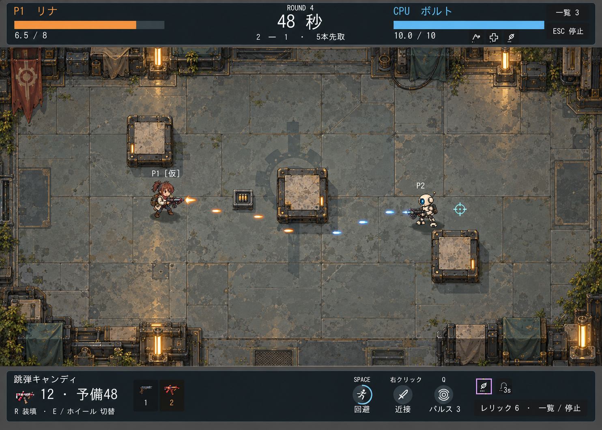

# 現行戦闘画面に沿った美術案

2026-09-12。内蔵image_genで1枚生成。実装変更なし。

構図の原本はbattle-ui-2026-09-12/implemented-cpu.png。現在のBATTLE_UI_C.md、duel.tres、hud.tscnを確認し、上下HUD・3遮蔽物・2参加者・弾薬箱・小型キャラの構成を基準にした。美術参照は始まりの工房の02・04。プロンプト全文はprompt.txt。

前の一覧図より現行の平面2Dプレイ画面へ寄せた美術モック。生成画像の遮蔽物位置/寸法には差があり、画素単位の仕様図ではない。周辺装飾は実装時に移動可能領域へ侵入させない。床の模様と弾のコントラストは要実プレイ確認。キャラ造形、仮ラベル、一部武器アイコンは正式決定ではない。HUDの回避文字にも生成由来の誤字があり、実装では現在の正確なテキストで組版する。ゲームに組み込んだスクリーンショットとは区別する。
