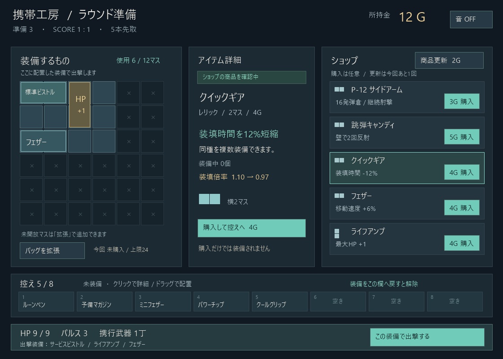

# 準備UI改修前の確認案

2026-09-12。ユーザーの事前画像確認依頼に対し、現行1120×800の解像度でコード描画した提案。画像生成APIの使用・課金なし。ゲーム実装は未変更。

基本レイアウト: 装備380px、詳細280px、ショップ380px、下段に控え8枠、最下段に出撃帯。装備セルは50px＋間隔4pxの6×6。現行58pxより縮小するため、小ウィンドウ時のドラッグ精度を実装後に確認する。

ショップは通常5商品を常時表示。改造・無料確保が追加される場合は商品領域内だけスクロールし、更新ボタンは固定。バッグ拡張はバッグ側から3形状の選択ポップオーバーを開き、選択後にグリッドへ配置する。実装時は価格・不可理由・配置確定時の支払いを維持する。

クリックは詳細確認、ドラッグは配置。所持品の詳細では「配置する」「控えへ戻す（装備時）」「売却/破棄」を区別して表示する。クリック配置は「配置する」から入る。画像はショップ品の閲覧状態で、これらのボタンは未表示。購入後は控えに追加して強調し、配置モードへ強制移行しない。配置中は品名と取消を表示する。

控えは8枠を固定表示し、枠全体を装備解除ドロップ先にする。初稿ではテキスト/形状による代替表示。正式アイコンを入れる際はアイコン中心へ調整する。詳細欄の性能比較は提案機能であり未実装。HPはキャラ基礎値＋レリック個数分で計算する。

例示状態は準備3・12G・開放12マス・使用6マス、リナの基礎HP8＋ライフアンプ1個でHP9。サービスピストル2マス、ライフアンプ2マス、フェザー2マス。控え5個。現データの個別品を使った説明用の構成で、進行中セーブから取得したものではない。

出撃警告は必要な場合だけ出撃帯に表示。「近接のみで出撃」「未確保品を失う」を併記できるようにし、平常時の画像には表示していない。毎回の確認ダイアログは追加しない。

再描画はdraw_preview.ps1。最終の色/アイコン制作に先立つ配置・導線の確認用。実際に起動したゲームのスクリーンショットではない。
