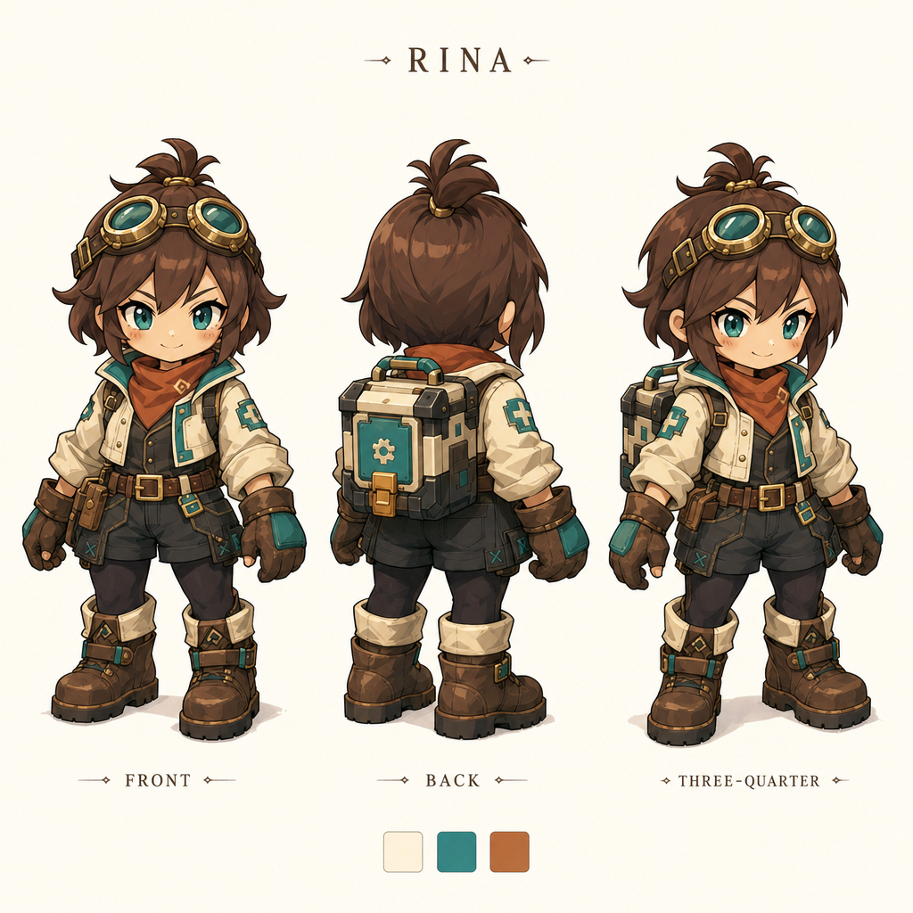

# リナ：採用済み低頭身デザイン

2026-09-12。ユーザーの「上下移動に違和感が出にくい低頭身、かわいい現代的なデフォルメ」の希望に合わせて、正面・背面・斜め向きを1枚で再検討した。同日「これでいきましょう」の回答で本デザインを採用。追加承認後にゲームへの差し替えを実施（詳細は下記導入結果）。

大きな目、短い手足、大きなブーツ、ゴーグル、小型の携帯工房を採用。ドット絵ではなく輪郭の明瞭なアニメ調。指示は2.25頭身だったが、出力はおよそ2.5〜3頭身に見え、厳密な頭身やゲームカメラでの上下移動の適合は未検証。これはデザイン確認用であり、完成アニメーションではない。

## 生成記録

- ユーザー承認：確認用1枚、保守予約上限$15→$16。追加再生成なし。
- 既存の画像CLI `tools/generate_image.py`、OpenAI `gpt-image-2`、high、1024×1024、1枚。
- [送信プロンプト](prompt.txt)。参照は旧リナ原画 `assets/generated/fw-rina.png`。衣装・色・職人要素を参考にし、等身と描画を変更するよう指示。
- 原画：`assets/generated/fw-rina-chibi-concept.png`。本フォルダのPNGは原画の無加工コピー。
- 要求・参照ハッシュ・usage：`assets/generated/fw-rina-chibi-concept.json`。累計履歴：`assets/generated/first-workshop-usage.json`。
- 今回のusage料金表換算：$0.110743。累計15回、$1.648424。保守予約$15、予約上限$16。請求額未照合。
- 予算等のローカル5テストと送信前checkが合格。生成画像を目視確認。API失敗・自動retry・音響生成なし。

## 採用基準と実装時の確認

本画像をリナの外観基準とする。数値上の2.25頭身へ無理に再調整せず、採用画像の大きな頭、短い手足、ブーツ、ゴーグル、携帯工房と配色を維持する。ドット絵への変更は今回の決定に含めない。

追加承認後、前後方向の待機4コマ・回避6コマをゲームへ導入。移動シートは脚の交代が不十分で不採用とし、待機素材の脚を交互に動かす描画を使用する。足元原点と独立武器の前後関係を調整した。[導入結果](../../../../archive/2026-09-12/rina-chibi/REPORT.md)を参照。

前回の14回分と本デザイン案の生成記録は履歴として維持。追加3シートの費用・検証は導入結果へ記録した。
