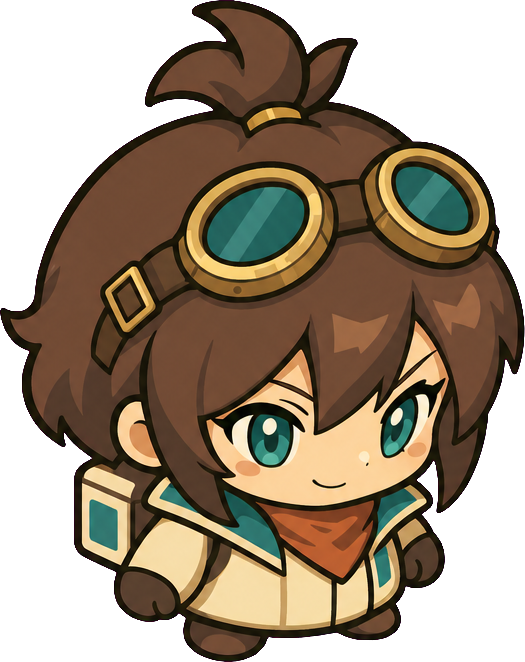

# 2頭身リナ：デザインと歩行の比較試作

後続の差し替え依頼でデザインをゲームへ導入済み。生成歩行シートは使わず、1枚の固定パーツを動かす方式へ変更した。[最新の導入結果](../../../../archive/2026-09-12/rina-twohead/REPORT.md)。以下は比較試作時点の記録。

ユーザー提示のガンナーちゃん・Enter the Gungeon・pss the fearの画像を参考に、頭と髪を大きく、胴体と脚を簡略化する方向を検討。ゴーグル、茶髪、象牙色/青緑、携帯工房を残す。デザイン1枚と歩行シート1枚の生成、および実寸比較までの依頼。ゲームへの正式差し替えは行わない。

生成は既存のOpenAI画像CLI、gpt-image-2 / high / 1024 PNG / 各1枚。予約上限$19→$21の追加承認済み。[デザイン指示](design-prompt.txt)、[歩行指示](walk-prompt.txt)。歩行は2列2行の4コマとし、左右の足の交代を指定したローカルガイドを添える。

添付参考画像はデザイン参照用。生成キャラクターはリナの新案で、参考ゲームのキャラクターを直接使用するものではない。

## ローカル実行の記録

最初はプロジェクト外の添付画像パスを履歴へ記録する処理がValueErrorとなり、API送信前に停止した。履歴18回・最終success・対象PNGなし、および要求履歴を保存する前のコード位置を確認。送信されていないロックを `preflight-unsent-lock.txt` に保管し、参考画像を本フォルダへコピーしてローカルcheck後に実行した。API失敗の再送ではない。

原画とusageは `assets/generated/fw-twohead-design` / `fw-twohead-walk` のPNGとJSON。共通履歴は `assets/generated/first-workshop-usage.json`。旧ゲーム素材は維持する。

## 結果

左は現行リナの待機（約68px）、中央は新案64px、右は新案48px。GIFは床画像上の比較用合成で、実際のゲーム録画ではない。新案は同じ生成4コマを8fpsで再生し、上下に平行移動する。上移動は前を向いた後退の比較としてコマ順を逆にする。背面・独立武器・回避は今回の試作対象外。

頭と髪を大きくし、腰から下を短くまとめたことで、48pxでも顔とゴーグルが識別しやすい。一方、歩行4コマは足の左右交代がまだ読み取りにくく、髪・輪郭の揺れもある。自然な歩行を達成した完成素材とは扱わず、デザインと動作の比較試作として保存した。追加再生成や現行ゲームの差し替えは行っていない。

[4コマ一覧](walk-contact.png)、[静止比較](size-comparison.png)。加工は透過化・固定倍率縮小・セル分割・足元揃えのみで、脚を切り分けて動かしたり新しいポーズを合成したりしていない。[加工情報](processing.json)、再現ツール `tools/twohead_preview.py`。

## 使用量・検証

- デザイン $0.114221、歩行 $0.114689（各行は小数6桁に丸めたusage換算）。
- 未丸め値から算出した追加合計 **$0.228911**、累計20回 **$2.208438**。保守予約$20、承認上限$21。請求額未照合。
- API送信2回成功。ローカルの送信前パス問題は上記記録のとおり。API通信の再送なし。
- 予算等の5テスト合格。各回ローカルcheck合格。原画、4コマ一覧、実寸比較PNGを目視確認。手動プレイや実ゲームのアニメ評価は未実施。
