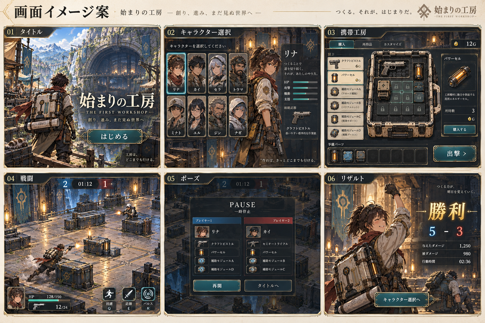

# 各画面のイメージ初稿

2026-09-12。内蔵image_genで一覧図1枚を生成。プロジェクトの画像API CLIは使用していない。ゲームへの組込みなし。

世界観の参照: [始まりの工房](../first-workshop-2026-09-11/README.md)の01・02・04画像。

タイトル、キャラクター選択、携帯工房での準備、戦闘、ポーズ、試合結果の美術・レイアウト比較用。正式仕様や実装済み画面ではない。

生成画像のキャラ名・能力バー・武器名・HP/弾数・操作キー・価格・結果統計は仮表示。6×6グリッドや控え8枠の正確さは未達。キャラの顔・性別・種族、自然言語の追加コピーも確定設定ではない。戦闘の俯瞰角度は現行2D実装との差があり、実装時には座標・遮蔽・照準との整合が必要。次の詳細画面では現行ルールの文字/値をUIで組版し、回避ポーズを個別に確認する。

生成プロンプト全文はprompt.txtに保存。画像は01_screen_overview.png。
