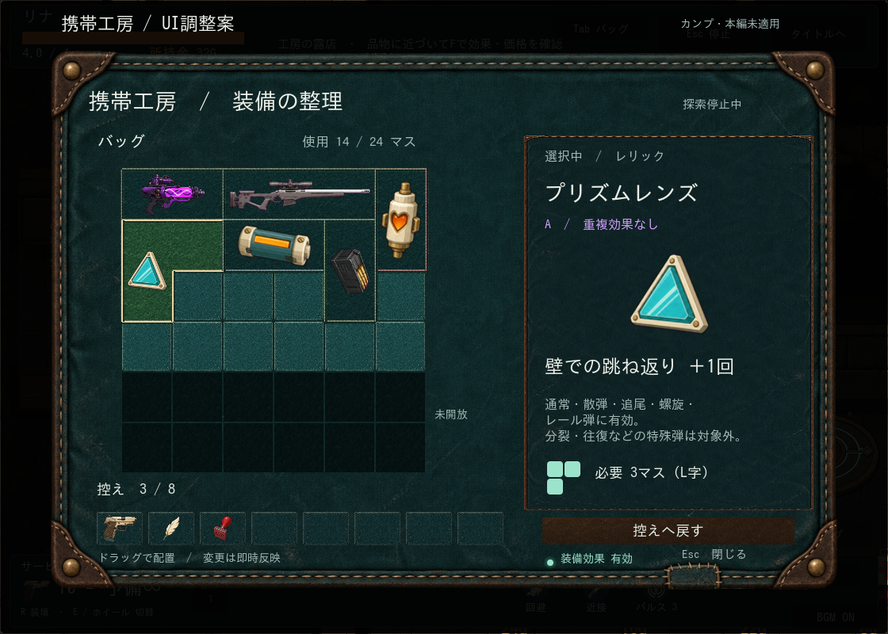
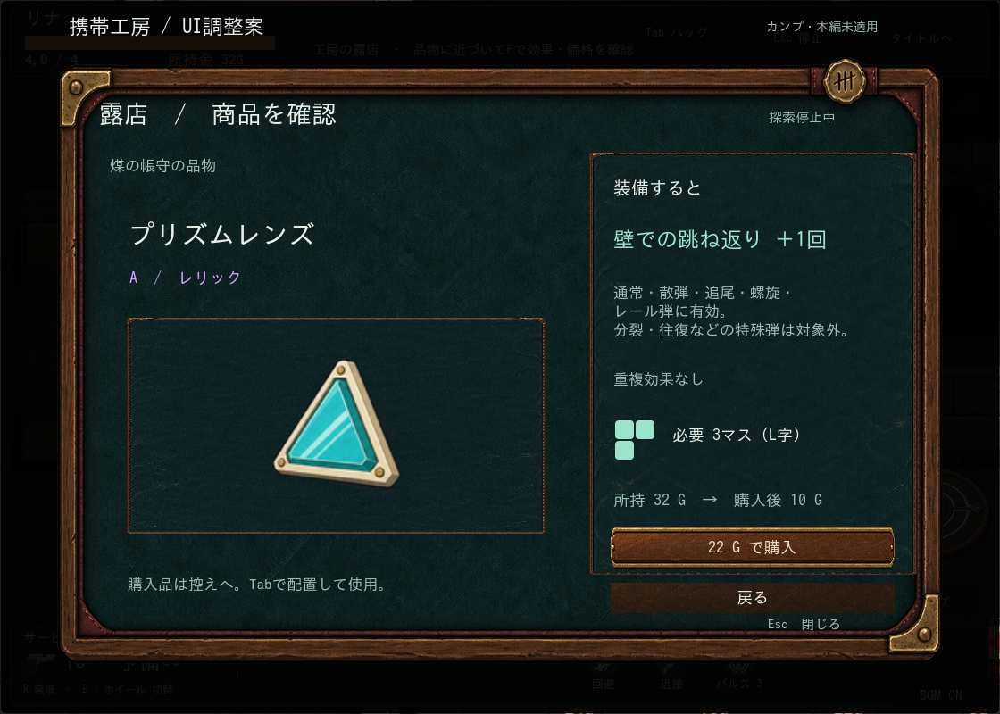
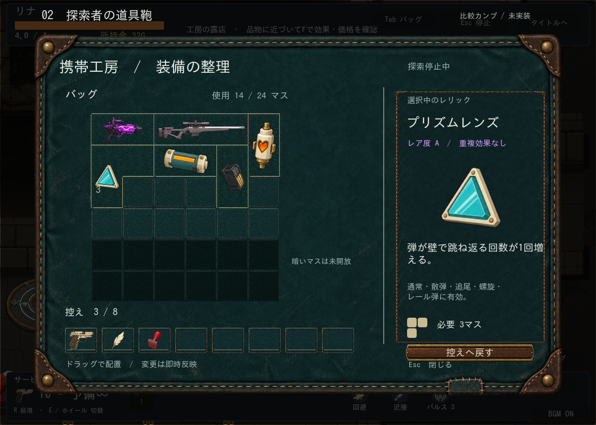
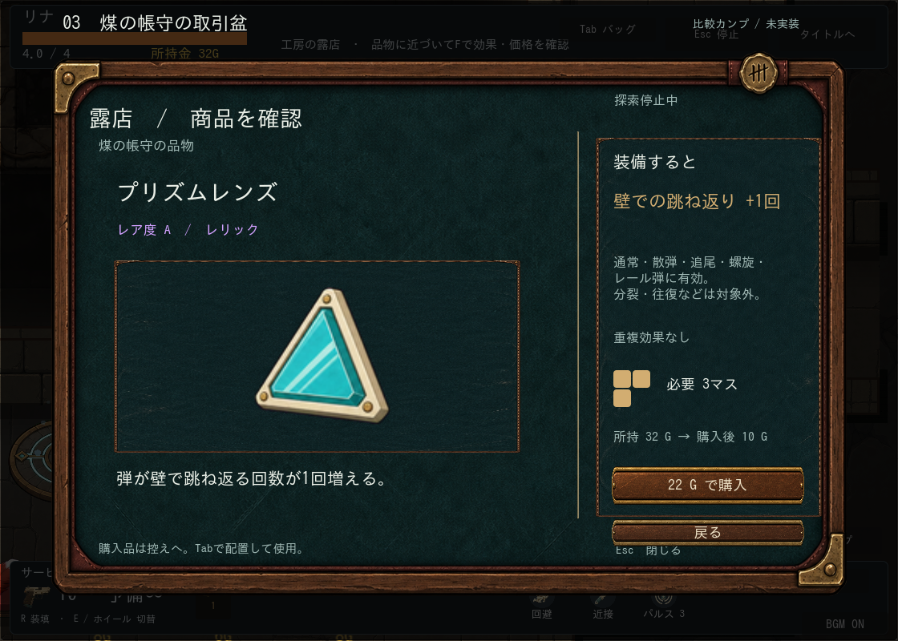
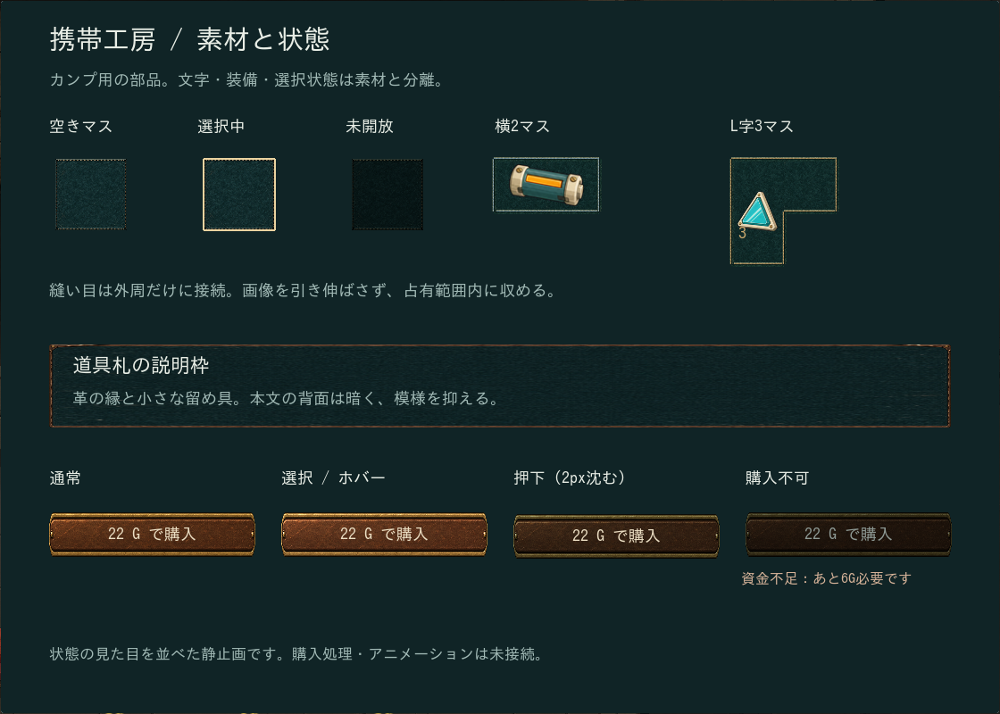
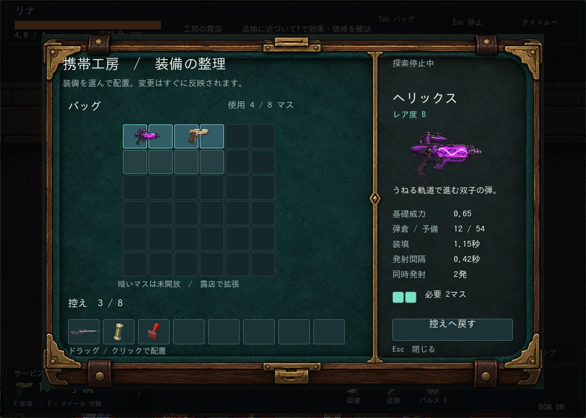
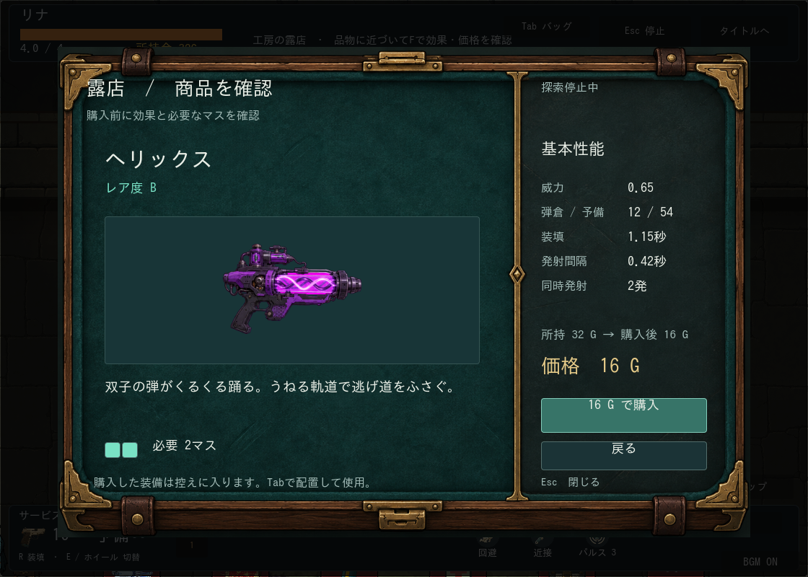
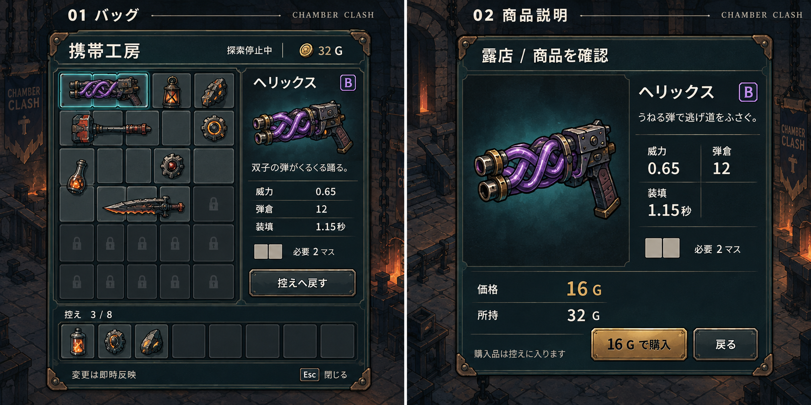

# 探索バッグ・商品説明のカンプ

区分：探索UIの制作記録と比較案。状態：2026-10-05、バッグv9・ショップv13・探索HUD A案を本編へ接続済み。現行操作は[GAME_RULES](../design/GAME_RULES.md)、残課題はROADMAP。以下の旧カンプの未実装表記は制作時点の履歴。

## 探索HUD専用素材の制作（2026-10-06・本編接続済み）

ユーザーがレビュー後の制作・適用を依頼。読了：docs/art/README.md、VISUAL_STYLE_GUIDE.md、ASSET_GENERATION_SETUP.md、imagegenスキル、workshop素材README、現行HUD各スクリプト。方式：内蔵画像生成で透明なHUD部品アトラスを1枚作り、A配置へ接続する。既存shell.pngは色・材質の参照。新規SEなし。

必要素材：薄いHP筐体、武器筐体、共通の小枠、行動リング、ボスHP端飾り、歯車貨。HUD専用の6部品が不足。1120×800のゲーム内ではHP268×52、武器296×86、小枠42〜48、リング44、ボス端20、通貨24px前後。角は固定し中央を伸縮、中心原点のリング/通貨は比率維持。発光・ゲージ・装填中通電はコードで描画する。

今回の生成範囲は6部品を含む1アトラス。原本とプロンプトはassets/candidates/exploration-ui/hud-v2、接続用コピーはassets/ui/exploration/workshop。通常サイズ・8武器・小画面・ボスレイアウト・停止メニューを撮影する。ユーザーの最終採用と連続した混戦の視認性は別確認。行動キーはホバーのみで補完する。

生成結果：内蔵image_gen 1回、1536×1024 RGBA、原本の画素編集なし。透過はアルファチャンネルで確認。原本と正式コピーは同一SHA-256。REGIONSで6領域を切り出し、9分割の端を固定して接続。HPは204×22の読み取り領域へ拡大。行動の操作名/キーはホバーに追加、装填中だけ光が流れ、待ち時間終了でリングが0.3秒発光。初回構文検証でSkin定数名がGodotの組込みクラスと衝突したためHudArtへ修正。その後の実Godot撮影テストはPASS。通常サイズ、8武器・装填、小画面、ボス表示データで枠とアイコンの収まりを確認。実際のマウス移動で近接アイコンのホバー「近接（右クリック）」を撮影確認。全体テストはrun_tests-20261006-001607.logでPASS160 / FAIL0 / NO-PASS4 / 計164。NO-PASSは撮影用enemy_animation_review、enemy_art_preview、enemy_death_review、quillback_art。ユーザーの最終採用と連続した混戦の視認性は未確認。

## 探索HUD A案の採用・本編接続（2026-10-05）

ユーザーがA案を選択。現行のworkshopアトラスを再利用し、左上HP/歯車貨・右下武器/弾数/行動・右上操作アイコンへ接続した。8武器は所持分だけ左へ延びる小枠に収める。BGMとSE設定・タイトル移動は同じ配色の停止メニューへ。ボスHPは上中央へ分離。リロード秒数と常時の部屋/操作説明は隠し、ゲージとアイコン、接近案内・ホバーに情報を分担する。新規画像/音源生成なし。

共有コンポーネントはcompactフラグを探索でだけ有効化。対戦UIの既定表示と戦闘値は変更しない。HP/反撃回復の数値はViewに保持し、HPのホバーで確認できる。実Godotの通常・ボス表示データ・8武器・リロード・停止・840×600表示で収まりを目視確認。shared_combat_hudの実マウス切替/停止とexploration_hud_aの設定・重複メニュー防止・表示検査がPASS。ボス画像はレイアウト検証用データを通常背景へ渡したもので、実ボス戦の動作検証とは区別する。残る受入は混戦での視線移動と手動の操作感。

全体検証：`run_tests-20261005-234941.log` はPASS160 / FAIL0 / NO-PASS4 / 計164。NO-PASSは撮影用のenemy_animation_review、enemy_art_preview、enemy_death_review、quillback_art。初回はexploration_bag_uiが旧座標をクリックして失敗したため、期待値・assertは維持し、実ボタンの中心をクリックする入力準備へ修正。再実行で解消。

## 探索HUD配置2案（2026-10-05・本編未適用）

ユーザーの次工程依頼により、現在の探索ステージをGodotで撮影し、採用済み携帯工房のshell素材と実武器/行動アイコンを重ねたカンプを作成。新規AI画像生成なし。本編コード変更なし。上/下の全面帯、リナの名前、部屋状況の常時文章、操作の常時説明を省き、HP・弾数・所持金・行動残数を優先する。タイトル移動と音設定は停止メニューへ移す案。地図/バッグ/停止は右上アイコン、意味とキーはホバー/初回案内で補う想定（カンプに動作未実装）。

- [A：四隅へ分散](../../assets/candidates/exploration-ui/hud-v1/a.png)：HPと所持金は左上、装備/弾数/行動は右下。中央と左下を空ける。第一候補だが、HPと弾数の視線移動が必要。
- [B：左下に集約](../../assets/candidates/exploration-ui/hud-v1/b.png)：HP/所持金/弾数/行動を左下へまとめる。視線移動を抑える一方、下側の占有が大きい。
- [現行との比較](../../assets/candidates/exploration-ui/hud-v1/comparison.png)。背景と装備画像は現行ゲームから取得。HP3.2/4、弾倉7/10・予備無限、所持金28、追加武器2個、近接待ち時間とパルス3回は配置比較用の状態であり、撮影時の実プレイ値ではない。

原寸1120×800の2案で画面内配置と文字を目視確認。生成レシピは候補render.cjs、元のHUDあり画面はcurrent.png。最大8武器時、ボスHP、瀕死、反撃回復、リロード、操作対象への接近表示は採用案決定後の展開対象。武器の多数所持は切替時だけ一覧を広げるなど、戦闘中の占有を増やさない方式を検討する。被弾/硬貨獲得/装填/武器切替の短い反応は今後の実装で、常時歯車や粒子を動かさない。今回は配置比較のみで全ゲームテストは未実行。

## ショップ本編接続（2026-10-05）

ユーザーの適用依頼で、v13原本と領域定義をassets/ui/exploration/workshopへ同一コピーし、候補フォルダーを参照せず本編へ接続。shop_skinが真鍮枠・扉・レール・歯車・動力管・展示台・受け取り口を描き、exploration_shopが実カタログ説明・占有形・価格・所持金・拡張セルを表示する。長文は枠内スクロール。回復は現行のコード描画を維持、弾薬は既存画像を使用。

展開1.3秒、購入成功後1.2秒の受け取り、収納0.3秒。取引は成功時に一度だけ確定し、演出中の再購入を禁止。通常の取消は無料、購入成功後のEscは取引を取り消さない。既存の購入/拒否音を維持し、今回SEの生成・変更なし。UIの機構は可視化したが、配管は既存素材とコード描画の組合せである。

実Godotの武器・レリック・回復・弾薬・拡張・所持金不足を撮影し、枠内配置を目視確認。拡張マスへの展示台配管の重なり、購入不可理由と受け取り口の余白を修正。shop_workshopは実マウス入力で展開中の拒否、購入、二重課金防止、拡張、資金不足、収納後の停止解除を確認。player_feedbackの既存購入・取消・永続化テストもPASS。終了時のリソース残り警告は失敗と区別する。連続プレイの体感・各解像度と音の試聴は未確認。

全体検証：run_tests-20261005-230853.log は PASS 159 / FAIL 0 / NO-PASS 4（計163）。NO-PASSは撮影用enemy_animation_review / enemy_art_preview / enemy_death_review / quillback_art。候補素材参照禁止・既存購入・バッグ操作を含め成功。最終の余白調整後もshop_workshop単体をPASS確認。

## 商品説明専用素材v13：生成前記録（2026-10-05）

読了：素材制作入口、VISUAL_STYLE_GUIDE、採用workshop素材README、imagegenスキル、v12描画処理。方式は既存外枠・歯車・動力管を流用し、不足する扉、レール、歯車ハウジング、展示台、受け取り口、配管接続部を透過アトラス1枚で内蔵画像生成する。今回の範囲は6部品の原画1枚。候補shop-v13にプロンプトと原本を保存し、本編から参照しない。正面・左上光源・真鍮と青緑・暗い輪郭を維持。歯車は別レイヤーで回すためハウジングに描き込まない。扉377×311、レール10×325、ハウジング72×70、展示台186×27、受け取り口94×29、管接続部12px程度を通常サイズの目安とし、原点は中央、接続点は組込時に台帳へ記録。生成後はアルファ・各部品の分離・原寸との見た目を確認し、カンプ接続とユーザー採用を区別する。

生成結果：内蔵image_genで6部品を含む原本1枚（1536×1024 RGBA）を生成。背景アルファ0の画素843826を確認し、原本の透過を保持。[プロンプト](../../assets/candidates/exploration-ui/shop-v13/prompt.txt)、[原本](../../assets/candidates/exploration-ui/shop-v13/accessories-source.png)、[領域・接続台帳](../../assets/candidates/exploration-ui/shop-v13/manifest.json)を保存。原点は中央、部品領域はregions.jsonで管理。歯車は原本のハウジング内部に既存歯車を描画し、前面カバーを再描画する。

[専用素材を組み込んだプレビュー](../../assets/candidates/exploration-ui/shop-v13/motion.webp)と[4状態比較](../../assets/candidates/exploration-ui/shop-v13/comparison.png)を作成。原寸の静止状態と扉展開途中を目視確認、文字境界・回転方向の検査と105フレーム出力が成功。素材の比率はカンプに合わせた暫定値で、レールの幅と配管接続の細部は本編解像度で引き続き調整対象。生成済み・候補カンプ接続済み。本編接続・ユーザー採用・連続再生の体感確認は未実施。画像生成だけで音響は追加していない。次は本編UIへの接続と実操作確認。

## 商品説明カンプv12：機構の接続修正（2026-10-05・本編未適用）

レビュー指摘への対応。既存アトラスとコード描画で構造を修正し、新規素材生成なし。歯車は円形のくぼみ・固定軸・前面カバーで枠内へ埋め、両端とも外枠内に収めた。回転角を累積する単調増加の関数に変え、購入強調後の逆回転を解消（60fps相当の時刻サンプルで単調性を検査）。

扉は固定幅の板を左右へ平行移動し、レール・縦の収納口の奥でクリップする。以前の幅縮小は撤去。管は真鍮の外殻と端点金具を持ち、結晶から側管・展示台・購入スイッチへ段階的に通電する。専用完成素材ではなく、構造確認用の仮描画である。

[4状態の静止画](../../assets/candidates/exploration-ui/shop-v12/comparison.png)と[7秒の演出プレビュー](../../assets/candidates/exploration-ui/shop-v12/motion.webp)。購入想定では商品が下の受け取り口へ縮小移動し、収納後は消えたまま、所持金28→14Gとボタンのチェックへ切り替わる。ループ先頭だけリセットする。実際のインベントリ追加・入力・SEは未実装。小さな受け取り口への縮小はUI上の受け渡し表現としての案。

4状態の文字境界検査と105フレーム出力が成功。原寸静止画・展開途中・購入完了フレームを目視確認。本編コードは未変更、全ゲームテストは未実行。残る専用素材は扉/収納レール・歯車カバー・配管接続金具・展示台/受け取り口。構造の確認後に制作し、本編へ接続する。連続再生の体感と各解像度の確認は残る。

## 商品説明カンプv11：機構と通電（2026-10-05・本編未適用）

ユーザーの機械感・エネルギー感の指摘を反映。既存の携帯工房アトラスを再利用し、左右の動力管、下部に埋め込む歯車、結晶動力部、商品展示台と購入スイッチへ繋がる通電表現を追加。新規画像/音響API生成なし。文字領域の外で動かし、右歯車と購入ボタンの重なりはボタン幅の調整で解消した。

[静止画4状態](../../assets/candidates/exploration-ui/shop-v11/comparison.png)と[6秒ループプレビュー](../../assets/candidates/exploration-ui/shop-v11/motion.webp)を作成。開始1.15秒でロック解除と左右の覆いが開き、待機中は歯車・管内の光・接続部の少量粒子が動く。3.7〜4.8秒は購入を想定した通電と商品持ち上げの強調。実購入・受け渡し・SE・入力受付は未実装の演出カンプ。覆いと展示台はコード描画による仮表現で、専用完成素材ではない。

レリック欄の購入即強化に見える0→12%表示を撤去し、「重ねて装備 / 2個で22.6%短縮」に変更（0.88の2乗から算出）。占有形・不足理由・拡張候補の表示は維持する。render.cjsで4状態と90フレームを再描画できる。1120×800の静止画一覧、原寸と展開途中のフレームを目視確認し、文字境界検査もPASS。連続再生の体感・本編・各解像度は未確認。次はユーザー確認後の本編接続。今回ゲームコード変更なし、全ゲームテスト未実行。

## 商品説明カンプv10（2026-10-05・本編未適用）

採用済み携帯工房のshell/drive/powerアトラスと、現行Godotのショップ撮影・商品画像・カタログ数値を使った静止画案。新規AI素材生成なし。真鍮枠と青緑の内張りを共通化し、左に商品と占有形、右に効果、下に価格付き購入ボタンを配置する。画面タイトルや操作説明は加えず、上限・重複効果・購入不可の理由は残す。

[4状態比較](../../assets/candidates/exploration-ui/shop-v10/comparison.png)：[武器](../../assets/candidates/exploration-ui/shop-v10/weapon.png)、[レリック](../../assets/candidates/exploration-ui/shop-v10/relic.png)、[バッグ拡張](../../assets/candidates/exploration-ui/shop-v10/expansion.png)、[所持金不足](../../assets/candidates/exploration-ui/shop-v10/insufficient.png)。ガードリベット10G、クイックギア14G、拡張8G/次回10Gを現行値から表示。所持金28G（不足例5G）と重複0個は比較用の状態。重複欄は購入・装備後の効果予測としての案であり、購入だけでは装備効果は発生しない。本編化では装備状態との区別が必要。

1120×800で4状態を描画し、一覧とレリック原寸で枠内の収まりを目視確認。テキスト幅と縦方向の境界はrender.cjsで検査。data.jsonに出典データ、*-art.pngに商品原本を保存し、render.cjsから再描画できる。本編のショップコード・操作・アニメーション・SEは未変更。次はデザイン確認を踏まえた本編接続と、長い商品名/説明・装備済み重複・各解像度での確認。全ゲームテストは今回未実行。

## 開き終わりの電子音を短縮（2026-10-05）

ユーザー確認で対象は「閉じる時」ではなく「開き終わる時」。エネルギー層の持続部のみ、開始から120〜220ms（全体470〜570ms）でsmoothstep減衰し、その後は消音。先頭470msは採用版のPCMと一致を確認し、機械層・閉じる音・コードは変更なし。0.83秒のファイル長は維持し、末尾を無音にする。原本と以前の結合版はretired/workshop-openへ保持済み。manifestに編集レシピと新しいSHA-256を記録。新規生成なし。check_audioは不合格0/警告0、試聴評価は未確認。再インポート後のworkshop_inventory・generated_sound・audio_assetsは3本PASS、FAIL/NO-PASS 0。workshop_inventoryの終了時リソース残り警告は別扱い。音源のみの変更で全体テストは再実行していない。

## 結合SEの採用・本編接続（2026-10-05）

「一旦これで行きましょう」の採用指示を受け、[結合音](../../assets/audio/se/fw_workshop_open_energy_01.wav)を通常起動へ接続。試聴版とSHA-256一致を確認してコピーし、開始時にworkshop_openを1回だけ再生。従来の3合成音の発火を撤去し、収納・ミュート・破棄時の停止を維持。音量は採用済みゲインから追加減衰しない。Godotの既定圧縮がQOAだったため、無圧縮16bit PCMへ明示して試聴WAVを維持する。原本2件と結合版をmanifest登録し、候補一式と旧合成ソースをretired/workshop-openへ保存。新規API生成なし。

検証：run_tests-20261005-193639.log は PASS 158 / FAIL 0 / NO-PASS 4（計162）。NO-PASSは撮影用 enemy_animation_review / enemy_art_preview / enemy_death_review / quillback_art。121音源のResource認識、起動1回・旧合成音0回、途中収納・ミュート・候補参照禁止を確認。実機BGMとの混ざり方は未確認。

以下の候補・未適用という記述は制作時点の履歴。

## エネルギー音の追加接続（2026-10-05・候補）

ユーザーの「エネルギー音も欲しい・つなげる」依頼。既存機械音fw_workshop_open_01を維持し、追加は低い充電の立上りと広がる動力音1件・1候補のみ。既読の音響基準、manifest、CLI、生成環境、候補運用と本編700ms/通電350msのタイムラインを使用。ElevenLabsでエネルギー層だけを0.5秒生成し、既存機械音の350msから重ねる。原本を保持し、結合WAVと再現レシピを保存する。通常起動への正式適用は合成結果の試聴と区別する。

結果：エネルギー音fw_workshop_energy_01をdry-run後に1回生成。原本0.48秒、機械音0ms/-12dB＋エネルギー350ms/-10dBで[結合試聴版](../../assets/retired/workshop-open/v2/workshop-open-energy-preview.wav)を作成。全長0.83秒（700msの開く動きの後に130msの音の尾）。原本を変更せず、各層に4ms立上り/25ms末尾フェードを適用。再現は候補v2のmix.py、出所ハッシュとゲインはmix-recipe.json。エネルギー原本・結合版とも数値検査は不合格0/警告0。Godotの44.1kHzステレオWAV認識・0.83秒・ループ無効を確認。音色の試聴評価と通常起動への適用は未実施。本編コード変更なし、全ゲームテストは再実行していない。

## 開くSEの専用音源制作（2026-10-05・候補）

再試遊で合成音が「おもちゃみたい」との指摘。既読：対象sound/workshop_soundと開閉タイムライン、AUDIO_BIBLE、音響manifest、音響CLI、共通生成環境、候補素材運用。方式を短い合成音の調整からElevenLabsの専用音源へ変更する。今回の生成は開く音1件・1候補のみ。重い金属ロック解除→短い機械駆動→低く厚い通電を700msへまとめ、細かい電子音や音階を避ける。収納音は今回対象外。保存先workshop-open/v1、試聴・採用は生成と区別する。

制作結果：dry-run後に1回だけ生成し、原本[fw_workshop_open_01.mp3](../../assets/retired/workshop-open/v1/fw_workshop_open_01.mp3)と音響manifestを保存。GodotのAudioStreamMP3認識・0.68025秒・loop=falseを確認。原本の数値検査はMP3オーバーシュート6サンプル・ピーク+0.56dBFSの警告、不合格0。原本を保持し、floatデコードから-12dBで[試聴用WAV](../../assets/retired/workshop-open/v1/listening-preview.wav)を作成。試聴用は不合格/警告0。音色と映像との合い方は未試聴。候補素材運用のユーザー最終確認前につき、通常起動のSEは未差し替え。音色採用後は開く3合成音を1素材へ置換して、途中収納/ミュートの停止を維持する。今回は本編コード変更なし、全ゲームテストは再実行していない。

## 試遊フィードバック反映（2026-10-05）

開くSEの単発の合成音を再設計。3回の留め具打音、8回のラチェット＋モーター、加速する通電音と高音の点火に変更。既存の合成方式を維持し、新規API生成なし。開始時刻を合わせた確認用WAVは `.local/workshop-open-review.wav`。数値検査はピーク-15.17dBFS、クリップ0、先頭無音0ms、不合格/警告0。聴感は未確認。

初期の詳細表示用selectedを配置待ちと混同しないようplacement_armedを分離。明示クリックかドラッグ中だけプレビューを出し、配置/解除成功・ドラッグ終了で解除する。実マウス入力の回帰テストとGodot撮影で確認。確認画像は `.local/two-rooms-bag-ui.png`。ヘッドレスのOS座標非対応は明示座標で表示検査する。

検証：run_tests-20261005-164910.log は PASS 158 / FAIL 0 / NO-PASS 4（計162）。NO-PASSは既存の撮影用 enemy_animation_review / enemy_art_preview / enemy_death_review / quillback_art。終了時リソース警告は別集計。音色の試聴評価は未確認。

## 本編への適用（2026-10-05）

ユーザーの「本編への適用・装備操作・SE」の依頼で、既存3アトラスを[正式素材領域](../../assets/ui/exploration/workshop/README.md)へ昇格し、16領域をGodotで描画する。新規画像/音源のAPI生成なし。700msで展開、500msで入力開始、250msで収納。歯車回転・管内流動・起動粒子を接続。実マウスによるドラッグ装着/解除とクリック配置、閉じ中の操作拒否、HP/弾薬保持は自動テストで確認。1120×800の実Godot撮影で枠・管・マス・本文の収まりを目視確認。開閉0/250/450/700msも実描画して蓋の展開と本文のフェードを確認。SEは既存操作音と専用合成4音を接続し、試聴は未確認。

検証：run_tests-20261005-162812.log は PASS 158 / FAIL 0 / NO-PASS 4（計162）。NO-PASSは撮影用の enemy_animation_review / enemy_art_preview / enemy_death_review / quillback_art。終了時のリソース残り警告は失敗判定と分離。資料リンク207件分も検査済み。

以下のv1〜v9各節は制作時点の履歴。本文の「次」「未実装」「採用待ち」は当時の状態であり、現行作業指示にはしない。

## 蓋のある携帯工房v8（2026-10-05）

### 完成画風の部品制作・開始記録

#### 素材組立・開閉確認

追加のユーザー決定：「携帯工房」と使用マス数「14 / 24」も削除。視覚/操作で分かる内容を文字で重ねて説明しない方針をVISUAL_STYLE_GUIDEへ正本として記録し、資料索引のUI入口から参照する。現在の候補描画へ反映。マス形状と収納ポケットを維持し、効果などの判断情報は残す。

画面内配置と説明整理：ユーザー指摘により、旧画面を丸ごと貼る方式から、装備マス/収納ポケットと必要なアイテム情報だけを個別に配置する方式へ変更。枠の角が内容へ重なっていたためbody_frameを角66px固定の9分割描画に変更。「未開放」「控え/未装着」「必要3マス/L字」「選択中/レリック」「控えへ戻す」と画面内の確認用見出し/時刻を削除。未開放は暗いマス、収納は下段のポケットで区別し、名前・レアリティ・効果/対象・重複効果の有無は維持。右のレリックは現行02.pngから直接描画する。既存画像やゲームデータそのものは変更しない。

修正後の実寸画像を目視し、角金具とマス/詳細欄の重なりが解消したことを確認。[配置検証](../../assets/candidates/exploration-ui/v9/layout-check.json)：0〜700msを10ms間隔で回転込みの部品外接矩形と内容欄を確認し、範囲はx56〜1064/y82〜715（1120×800内）。エフェクトの配置は静止画像でも確認。動画/4段階画像も更新済み。ブラウザーでのドラッグ操作や本編UIは対象外のため未接続。

ユーザーの組込依頼により、[新素材プレビュー](../../assets/candidates/exploration-ui/v9/preview.html)を制作。16部品をAtlas領域から描画し、蓋表裏・ヒンジ・留め具・歯車・軸受・接続軸・核・保持具・管・継手・固定金具へ反映。内部の装備/説明はv6の既存画像を維持。原PNGの画素編集はせず、描画時の領域参照・回転・縮小・明度で組む。台帳の内張りと直管に隣接部品が混入する領域を見つけ、regions.jsonとブラウザー用regions.jsを修正。途中の留め具が宙に残らないよう蓋端へ追従させた。未通電時は管の内部を暗くする。

確認：[4段階の組立画像](../../assets/candidates/exploration-ui/v9/review-sequence.png)、[実寸の起動完了](../../assets/candidates/exploration-ui/v9/review-700.png)、[開閉アニメーション](../../assets/candidates/exploration-ui/v9/opening-review.webp)。プレビューと同じrenderer.jsを同梱Canvasで実描画し、0/250/450/700msを目視。歯車/管は装備欄の外側、核は中央上部へ収まる。開く/逆再生/動き抑制を実Canvasでエラーなく描画、16領域の境界とブラウザースクリプト構文を確認。連続動画は出力済みだがリアルタイムの操作感/回転のちらつき評価は未実施。2D投影の蓋は完成時に薄い裏面を外側へ残す。音と装備操作、本編Godotへの接続は未実装。

再現：[render-review.cjs](../../assets/candidates/exploration-ui/v9/render-review.cjs)へCANVAS_PACKAGEとSHARP_PACKAGEで既存ライブラリの場所を渡しNodeで実行。PNG4枚/比較画像/動画を生成する。新規ライブラリの導入なし。ブラウザーのfileプロトコル操作制限を変更せず、UIの描画コードそのものをオフラインで検証した。

制作結果：v9に16部品を3枚のアトラスとして保存。[外装](../../assets/candidates/exploration-ui/v9/shell.png)、[駆動](../../assets/candidates/exploration-ui/v9/drive-transparent.png)、[動力](../../assets/candidates/exploration-ui/v9/power-transparent.png)。原本3枚と駆動/動力の透明化・核の減光指示による修正版2枚。内蔵image_gen使用、全文指示と原本パスは[manifest](../../assets/candidates/exploration-ui/v9/manifest.json)。生成画像のRGBには背景色が残るが、RGBAのalpha=0領域として分離されていることを検査した。外装1254×1254、他1536×1024。部品間の透明余白と独立した輪郭を原画で確認。生成配置は完全な等分ではないため、[部品領域・原点台帳](../../assets/candidates/exploration-ui/v9/regions.json)に実画素の領域を記録。左右蓋は表裏各1枚を反転流用する。

状態：候補素材制作済み、ユーザー採用・本編接続・通常倍率の組立/連続動作確認は未実施。核は減光版で、発光は実行時に重ねる。歯車の厳密な噛合い、透明境界の縁、ガラス内部と流動光の合成は組立時に確認する。独立PNGへの書き出しは行わずアトラス領域参照方式。全ゲームテストは素材のみの工程のため実行していない。

依頼「素材作って」に基づく。読了：美術入口、VISUAL_STYLE_GUIDE、ASSET_GENERATION_SETUP、imagegenスキル、v8構造/配置仕様。方式は内蔵image_genによる透過PNGの部品アトラス制作。既存B案を材質/配色の参照とし、滑らかな暗色輪郭と大きな陰影面を使う。新規生成範囲は外装シート（蓋表・裏・本体枠）、駆動シート（歯車・軸受・ヒンジ・留め具）、動力シート（核・保持具・管・継手・固定具）の3枚。不足分をこの3系統にまとめ、各部品の間に透明余白を設ける。発光と粒子は既存の実時間描画で重ねる方式を採用し、素材へ強い光や粒子を焼き込まない。保存先は候補領域v9。採用、本編接続、連続動作確認は生成と区別する。

接続レビュー反映：核は0〜85msで30%まで先行点灯し、100msからの歯車駆動に先立つ。核→左右駆動ケースの実体導管と通電線、ケース→上管、上管→下管の接続、管を本体へ固定するブラケットを追加。上管400ms/下管480msから通電し、粒子も同じ時刻に各入口y248/y430から発生する。外周SVGはpathLength=950で正規化し、約1399pxの実経路全体へ点灯が届くよう修正。核の早期点灯と外周の後段点灯を分離。Nodeで先行点灯、粒子の開始/終了、701時刻の描画呼出し、経路正規化を検証しPASS。目視は引き続き未確認。

次の素材工程：構造と配置を引き継ぎ、左右の蓋と裏面、ヒンジ/留め具、歯車と軸受、核と保持具、ガラス管/継手/ブラケットを完成画風へ仕上げる。発光マスクと粒子は本体の絵へ焼き込まず分離する。完成素材制作は本工程ではまだ実施していない。

追加依頼：歯車・エネルギー管・パーティクルを同プレビューへ追加。[effects.js](../../assets/candidates/exploration-ui/v8/effects.js)で独立描画。左右のヒンジ外側に12歯/8歯の歯車対を配置し、100〜450msで大歯車720度/小歯車は逆方向1080度回転、閉じると逆転。加速・減速はsmoothstep。核近くの上辺から左右の軸受ケースへ移し、軸でヒンジへ接続した。大歯車中心(85,185)/(1035,185)、半径24、小歯車は同じxのy220、半径16。歯車の外周は本文領域x120〜1000と管の開始y248を避ける。開いた後は停止。左右外側のガラス管4本に青緑の流動光を描く。起動時のみ接続部付近に最大28粒の短命な青緑/真鍮色粒子を出し、文字と装備の範囲を避ける。閉じる際は粒子を抑制。動き抑制時は回転・管内流動・粒子を停止し、静的な通電色を残す。新規画像/音源生成なし。

追加検証：NodeでJavaScript構文、0〜700msの701状態と描画API呼出し（模擬Canvas）、粒子数上限・座標・寿命、完了時停止、閉じる時の粒子抑制、動き抑制設定を検証しPASS。模擬Canvasは見た目の保証ではなく、実表示の目視は未確認。

ユーザー承認した再設計：開く約0.7秒、閉じる約0.25秒。閉じた姿から留め具を解除し、左右外側のヒンジを軸に蓋が開き、暗い遺物核と導線が起動する。[開閉プレビュー](../../assets/candidates/exploration-ui/v8/preview.html)。0〜120msで留め具解除、100〜450msで蓋を96度展開、350〜600msで点灯、430〜550msで内容を表示。500msから確認用ボタンを有効にする。装備操作は未接続。

制作方式：新規画像生成は行わず、構造検討用の蓋を[独立SVG](../../assets/candidates/exploration-ui/v8/lid.svg)、留め具・核・発光をCSS/SVGで制作した。左蓋原点は(104,423)、右蓋は(1016,423)、蓋サイズ456×554、基準画面1120×800。右蓋は同じSVGを左右反転。核中心(560,136)。内部はv6カンプの(120,155)から880×530を表示し、元の発光する外枠・核を使用しない。機械の形を見せる試作で、完成版の絵柄に合わせた描き込みと裏面は未制作。

連打による途中反転、4倍スロー、0〜700msのコマ送り、動きを抑える設定を用意。動き抑制時は拡大と回転を省き100msの状態遷移に置換し、核の脈動も停止する。タイムラインは[motion.js](../../assets/candidates/exploration-ui/v8/motion.js)、表示と操作は[preview.js](../../assets/candidates/exploration-ui/v8/preview.js)に分離。

確認：NodeでJavaScript構文、700/250msの到達、500msの操作開始、途中反転、スロー/動き抑制、全時刻の値域を検証しPASS。ブラウザー操作ツールのfileプロトコル制限により実表示と動きの目視は未確認。前回と同じ制限を回避する操作は行っていない。本編GDScript・SEは変更せず、全ゲームテストは未実行。次は動きの目視評価、完成パーツ素材の仕上げ、Godot接続。

## 開閉演出の試作v7（2026-10-05）

ユーザーの依頼によりB案を起点に専用の開閉演出を試作。[操作できるHTML](../../assets/candidates/exploration-ui/v7/preview.html)。開く360ms、閉じる180ms、留め具解除→左右展開→核と導線の点灯。開いた後は核の低振幅の脈動のみ。再生・逆方向への切替・スロー・時刻指定・動きを抑える設定を用意。音源の生成と本編への接続は行っていない。

方式：v6の完成カンプをCanvas上の描画領域に分けてタイミングと移動量を検討するモーション試作。独立した完成パーツ画像ではないため、焼き込まれた発光や区切りの制約が残る。実装済みのexploration_bag.gdは状態変更でrefreshするため、本編化するときは開閉を管理する外側のノードと更新される装備内容を分離し、配置変更で開く演出を繰り返さない構造にする。

必要な完成素材：左右の外枠/パネル（展開時に見える裏面を含む）、左右の留め具、核の保持具、非発光の核、核の発光マスク、導線の非発光面と発光マスク、内張り、装着マス。各パーツは1120×800の共通基準位置と移動原点を台帳へ記録し、装備・文字・選択表示は別描画する。これらの独立素材制作とGodot本編接続は未完了。

確認範囲：ブラウザー操作ツールがfileプロトコルを拒否したため動作の目視確認は未実施。HTMLはローカルで開く確認用。ゲームのGDScript変更なし、全ゲームテストは今回未実行。演出の採用評価は未確認。

## メカ・エネルギーを構造に組み込むv6（2026-10-05）

ユーザーの再検討依頼を受け、小さい表示灯を足すだけのv5から外装とマスの意味を再設計する。読了：WORLD_AND_DUNGEON_CONCEPTの携帯工房（装備を接続して稼働させる設備という提案）、VISUAL_STYLE_GUIDE、v5カンプと描画ソース、既読の素材入口・生成環境・imagegen手順。これを新しい資源/隣接/配線ゲームルールの採用と混同しない。

比較案：A「職人の整備盤」＝真鍮の接続レール、被覆された導管、小さいガラス動力管と補修金具。B「遺物核の携帯工房」＝上辺の遺物核と金属保持具、縁の細い発光導線。布/革は緩衝材と携帯部に残し、メカと未知の動力を道具の構造にする。マスは共通の着脱式装着区画に見直し、控えは未接続の布ポケットとする。

新規生成範囲：内蔵image_genで空の外装2枚と装着マスの素材1枚、計3枚。文字・武器・レリックは実素材/実データをGodotで後乗せ。6×6と実占有を保持し、外装の発光は主に縁へ限定。発光線を装備間の隣接効果や接続条件に見せない。比較用の静止画、採用/本編適用/動作は別工程。

制作結果：外装2枚と装着マス1枚を各1回生成し、現行の武器・レリック画像とデータを重ねて4画面を制作。装着区画は固定金具と接点のある板、控えは布として用途を区別。動力部とタイトルが重ならないようタイトルを内側へ移動し、下端の操作説明も外装の導線と離した。

|案|特徴|バッグ|商品説明|
|---|---|---|---|
|A：職人の整備盤|ガラス動力管、銅の導管、真鍮金具。整備可能な機械の印象|[画像](../../assets/candidates/exploration-ui/v6/a-bag.png)|[画像](../../assets/candidates/exploration-ui/v6/a-shop.png)|
|B：遺物核の携帯工房|上辺の遺物核、保持金具、青緑の細い導線。未知の力を利用する道具の印象|[画像](../../assets/candidates/exploration-ui/v6/b-bag.png)|[画像](../../assets/candidates/exploration-ui/v6/b-shop.png)|

推奨はB。ダンジョンの神秘性と、回収した技術を職人が補修して使う世界観案を両立しやすい。Aは機械的な整備設備を前面に出したい場合の比較案。ユーザー採用は未確認。

確認：1120×800の4画面を目視。6×6、24開放、14使用、占有重複なしをassert確認し、最終描画にSCRIPT ERRORなし。本編UI・入力・購入処理・全ゲームテストは対象外。発光は原画に焼き込まれた静止表現で、動力核の脈動や導線の点灯アニメーションは未実装。採用後は核・発光・導線を別レイヤーへ分け、緩やかな脈動と装着完了時の短い点灯を検討する。エネルギー残量や隣接ボーナスは新設しない。

保存先：[全文プロンプト・原本台帳](../../assets/candidates/exploration-ui/v6/manifest.json)、[再現用ソース](../../assets/candidates/exploration-ui/v6/ui_comp_v6.gd.txt)。v2〜v6の保存ソースを対応する`.local/ui_comp_v*.gd`へコピーし、描画あり `--script res://.local/ui_comp_v6.gd --quit-after 240`、外部timeout 90秒で再現する。素材は候補領域のみ、本編から参照しない。

## レビュー反映とエネルギー表現の試案（v5、2026-10-05）

v4レビューに基づき、空きマスを明るく、未開放は模様と縁も暗くし、選択中は面と太い外周で示す。グリッドの1マス間隔は59→64px、詳細欄は約280→367pxへ拡幅。L字に付けていた個数に見える「3」を削除し、詳細の「必要3マス（L字）」で説明する。効果文は短い主文と対象/例外へ分け、不自然な途中折り返しを避けた。購入ボタンのみ真鍮縁を維持し、戻る/控えへ戻すは暗い革面へ。ホバーには明るい外周を追加。下段の操作も位置を整理した。

携帯工房らしいメカ/エネルギー表現の提案：布・革・金具を土台として、装備効果が有効な時の小さな灯り、装備配置完了時に短く走る光、拡張成功時に金具が噛み合う短い動きなど、実際の操作・状態に対応させる。常時大きく発光する回路や、意味のない充電ゲージは追加しない。今回の静止画は「装備効果 有効」の小さな青緑の灯りだけを例示。エネルギー資源・消費仕様は新設しない。動きの案は未実装。

[状態比較](../../assets/candidates/exploration-ui/v5/states.png) / [再現用ソース](../../assets/candidates/exploration-ui/v5/ui_comp_v5.gd.txt)。既存v2〜v4ソースと合わせて`.local/ui_comp_v5.gd`へ配置し、描画あり `--script res://.local/ui_comp_v5.gd --quit-after 240`、外部timeout 90秒で再現。新規画像生成なし、v3/v4素材を再利用。3枚の静止画を目視し、最終描画にSCRIPT ERRORなし。占有14マスと重複なしをassert確認。本編・入力操作・購入処理・アニメーション・全ゲームテストは対象外。採用待ち。

## 内部部品を揃えたv4（2026-10-05）

状態：新素材3枚とカンプ3枚を作成済み。ユーザー指示によりマス・説明枠・ボタンを新素材で制作。読了：資料索引、DOCUMENTATION_GUIDE、美術入口、既読のVISUAL_STYLE_GUIDE・ASSET_GENERATION_SETUP・imagegen手順、v3の描画ソースと制作記録。外装はv3の道具鞄/取引盆を流用し、既存装備・本編背景・実占有形状を維持する。

生成範囲：内蔵image_genでマスの布素材、説明用の革縁パネル、ボタン用の革札を各1枚、計3枚。文字・アイコンを焼き込まない。素材不足はこの3種。生成後は候補のv4へ保存し、伸縮可能な角/辺/中央に分けた描画で組む。複数マスは中央の布面をつなぎ、外周のみに縫い目を表示する。選択・押下・無効は同じ原画の色/縁/位置の状態差で表現し、状態比較図も作る。全体の動作実装と採用は別工程。

結果：マスは布の縫い目、説明は革の縁取り、ボタンは茶革と真鍮留めで統一。生成は各1回、追加再生成なし。原画の透明領域に微小なアルファ値が残るため、表示時にalpha 0.5以上の外接矩形を用い、指定サイズに合うようにした。原PNGは変更せず、角・辺・中央をAtlasTextureとして分離し、角を固定サイズで描画する。長方形/L字は内側の辺を描かず外周の素材をつなぐ。ボタンの文字は別描画で中央揃え。

確認：1120×800のバッグ、商品説明、状態表を目視。静止画で通常/選択/未開放のマスと、通常/ホバー/押下/購入不可のボタンを比較。押下案は暗くして2px沈め、無効時は暗色と別置きの理由文で区別する。原画と3画面の最終描画にSCRIPT ERRORなし。v3の占有整合assert（24開放/14使用/重複なし）も通過。本編UI、入力、購入処理、アニメーション、全ゲームテストは今回のカンプ制作の対象外で未実施。

保存先：[素材・全文プロンプト台帳](../../assets/candidates/exploration-ui/v4/manifest.json)、[描画ソース](../../assets/candidates/exploration-ui/v4/ui_comp_v4.gd.txt)。再現にはv2/v3/v4のソースを対応する`.local/ui_comp_v*.gd`へコピーして、描画あり `--script res://.local/ui_comp_v4.gd --quit-after 240`、外部timeout 90秒で実行する。現行ゲームのコードや採用済み素材は変更していない。

## 世界観に合わせた3案（v3、2026-10-05）

状態：各案のバッグと商品説明、計6画面を作成済み。本編には未適用。読了：WORLD_AND_DUNGEON_CONCEPT（具体的な物語は提案として扱う）、既存v2制作記録、実装の装備形状・レリックデータ、既読の美術入口・VISUAL_STYLE_GUIDE・ASSET_GENERATION_SETUP・imagegen手順。

|案|世界観と用途|バッグ|商品説明|
|---|---|---|---|
|① 携帯工房ケース|現行の木・革・真鍮枠を維持。整備する道具箱の印象が強い|[画像](../../assets/candidates/exploration-ui/v3/01-bag.png)|[画像](../../assets/candidates/exploration-ui/v3/01-shop.png)|
|② 探索者の道具鞄|薄い革縁・縫い目・補修布。携帯する軽さを出す|[画像](../../assets/candidates/exploration-ui/v3/02-bag.png)|[画像](../../assets/candidates/exploration-ui/v3/02-shop.png)|
|③ 煤の帳守の取引盆|浅い木盆・少ない金具・縁の小さな刻印。店で見せる品物の印象|[画像](../../assets/candidates/exploration-ui/v3/03-bag.png)|[画像](../../assets/candidates/exploration-ui/v3/03-shop.png)|

おすすめは②をバッグ、③を露店へ使い分ける構成。配色・文字・操作部品は共通。現行への連続性を最優先する場合は①。これらは提案であり採用決定ではない。

方式：①現行の携帯工房ケース、②布と革の探索道具鞄、③煤の帳守の取引盆。世界観の材質と既存イラストの線を共有し、機械装飾を増やさない。①は既存枠を流用、②③は文字・アイコンを含まない外装を内蔵image_genで各1枚制作し、実素材と実データをGodotで配置する。新規生成の範囲はUI外装2枚。銃・レリック・キャラクター・ステージ・音は生成しない。

必要素材と不足：既存武器・レリック画像を流用。②は縫い目と補修革の薄い外枠、③は浅い木盆と控えめな真鍮留めの外枠が不足。内側は低コントラストの広い空白にし、文字の背面へ傷・金具を置かない。比較用配置は全案で同じにし、6×6/最大開放24マス、横長・縦長・L字の実装備を使う。複数マスの境界をつなぎ、画像を比率維持で拡大し、占有外への描画を避ける。レリック詳細は大きな原画と正確な占有図を別表示する。静止画での検証であり操作・本編採用とは区別する。

制作結果：外装2枚を内蔵image_genで各1回生成。装備・背景は既存素材、文字はGodot描画。6×6、開放24、使用14、控え3/8の共通サンプルを使用。ヘリックス横2、チョークライフル横3、ライフアンプ縦2、プリズムレンズL字3、スターターセル横2、ワイドマガジン縦2。重複配置がないことを描画スクリプトでassert確認。6枚を1120×800で目視、最終描画にSCRIPT ERRORなし。

複数マスの表現：装備の内部境界線を消し外周だけを表示。透明余白を除いた画像を、占有形の中に完全に収まる最大矩形へ比率維持で配置する。スターターセルとワイドマガジンはバッグ内でのみ90度回転する見せ方の案（ゲームの占有形自体は回転しない）。L字は画像を引き伸ばしたり切ったりせず外周で3マスを示すため、長方形の品ほど大きく表示できない。細部は右の拡大図で確認する。原素材96pxのレリックは詳細で拡大すると柔らかく見えるため、採用後に高解像度素材の必要性を検討する。操作・アニメーション・ユーザー採用は未確認。

再現：[描画ソース](../../assets/candidates/exploration-ui/v3/ui_comp_v3.gd.txt)とv2の描画ソースをそれぞれ `.local/ui_comp_v3.gd` / `.local/ui_comp_v2.gd` へコピーし、Godot描画あり `--script res://.local/ui_comp_v3.gd --quit-after 240`、外部timeout 90秒で出力。[原本パス・全文生成指示・検証範囲](../../assets/candidates/exploration-ui/v3/manifest.json)。本編のGDScriptや採用済み素材をこの工程では変更していないため、全ゲームテストは再実行せずカンプの描画と整合性を検証。

## 現行素材を使ったv2（2026-10-05）

ユーザー指示「可能な限り現在のデザインをベースに」に従い、画像全体を生成する方式を取りやめた。Godotの実描画でカンプを作成し、既存の木枠・革・真鍮金具・青緑の内張りを維持。変更案は余白・文字・情報の階層・選択色・控え枠の整理と、商品説明への共通枠適用。

- 読了：資料索引・DOCUMENTATION_GUIDE、既存カンプ記録、exploration_bag/shop、hud_assets、weapon_catalog、weapon_shapes、relic_shapes、build_grid。画風は既読のVISUAL_STYLE_GUIDEに従い、既存画像を描き直さない。
- 流用素材：`assets/ui/exploration/workshop-case-v1.png`、WeaponCatalog.pickup_artのヘリックス(ID7)/サービスピストル(ID20)/チョークライフル(ID30)、HudAssetsのrelic_07/relic_22。背景は本編exploration.tscnの露店を直接描画。新規画像生成なし。
- 実データ：バッグは6×6、初期開放4×2、使用4マス（ID7とID20は各横2マス）、控え8枠中3枠。ヘリックスはB・威力0.65・弾倉12・予備54・装填1.15秒・発射間隔0.42秒・同時2発。価格16G、所持32Gは表示例。能力値はカタログ、形はweapon_shapesを直接参照する。
- 確認：1120×800の2枚を目視確認。カメラ倍率の影響を受けないCanvasLayerで描画。通常素材・文字の収まり・枠内の情報配置を確認。初回の描画スクリプトの参照キーとサイズ問題は修正し、最終描画にSCRIPT ERRORなし。
- 未確認：クリック、ドラッグ、購入、スクロール、アニメーションはカンプ未接続。本編コードはこのカンプ制作では変更していない。静止画確認であり全ゲームテストの実施を意味しない。
- 再現ソース：[ui_comp_v2.gd.txt](../../assets/candidates/exploration-ui/ui_comp_v2.gd.txt)。`.local/ui_comp_v2.gd`へコピーし、Godot描画あり・`--script res://.local/ui_comp_v2.gd --quit-after 180`、外部timeout 90秒で2枚を出力。候補を本編から参照しないためテキストとして保存。

## v1の履歴（後継は上のv2）

内蔵image_genで1枚生成。確認結果：共通の配色・細い縁・大きな商品図・情報階層を確認。生成画像のバッグ列幅とマス数には不整合があり、銃の占有表示も例示。完成UIとして切り出さず、実装時は現行6×6と実際の占有形状へ合わせる。銃・レリック・背景の描写はカンプ用であり、新素材として採用しない。本文・数値は実データから描画する。動き・操作は未実装。

生成指示の要旨：バッグと購入前説明を左右に並べた日本語UI。煤色の青緑、象牙色の文字、細い真鍮の縁、控えめな革金具。滑らかな輪郭と整理した陰影。左は6×6の装備面・控え8枠・選択装備詳細、右は商品画像・効果・数値・占有形状・価格・所持金・購入/戻る。共通デザインを保ち、装飾過多やピクセルアートを避ける。

## 制作前確認（2026-10-05）

- 読了：docs/README、DOCUMENTATION_GUIDE、art/README、VISUAL_STYLE_GUIDE、PREPARATION_UI_B、ASSET_GENERATION_SETUP、imagegenスキル。対象実装：exploration_bag.gd、exploration_shop.gd。現行画面のfeedback-bag.pngとfeedback-shop.pngを参照。
- 方式：内蔵画像生成による2画面の構図カンプ1枚。素材として切り出す完成UIではない。煤色・象牙色の文字・控えめな真鍮・青緑の選択表示を共通化。画像内の文字は実装時にGodotのテキストへ分離する。
- 必要素材：共通の薄いフレーム、セルの通常/選択/未開放表示、ボタンの通常/選択/押下/無効表示。既存の銃・レリック画像を実装で流用。今回の生成は配置・材質・配色の検討だけ。
- 生成範囲：バッグと商品説明を左右に並べたカンプ1枚。新キャラ・敵・ステージ素材や音は生成しない。
- 確認：2画面の共通性、見出しと本文の階層、6×6のバッグと控え8枠、説明/価格/購入の読み順。操作・アニメーションは未実装。

## 情報配置と動きの案

- バッグ：左に6×6の装備面。開放済みと未開放を明度で区別し、未開放マスに大量の×を描かない。下に控え8枠。右に大きな選択装備画像、短い効果文、主要数値、占有形状、控えへ戻す操作。
- 商品説明：左に大きな商品画像、右に名称・レア度・効果・主要数値。下部に占有形状、所持金、価格、購入ボタン、戻る。購入不可理由はボタン直上に固定表示。購入品は控えに入る旨を残す。
- 数値・価格はカタログ/購入判定の既存情報源を使用。画像カンプの例示値を仕様変更として採用しない。
- 開く180ms（薄いフェードと8px移動）、選択100ms（枠と画像の切替）、閉じる120ms。購入時だけ短い真鍮色のハイライト。本文は揺らさず、入力可能になるまで待たせない。
- 次工程：カンプの方向性を確認後、共通部品と素材を分離して実装。HUDの刷新はその後。
