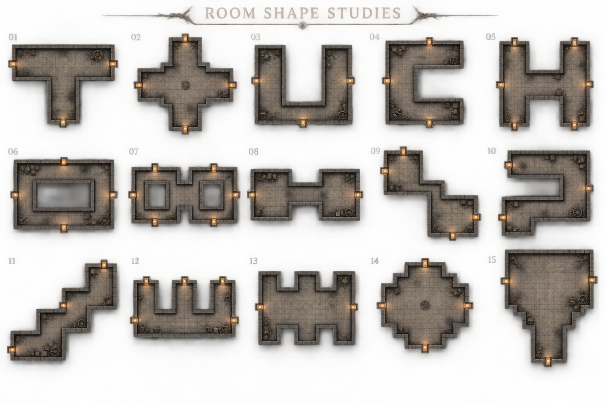
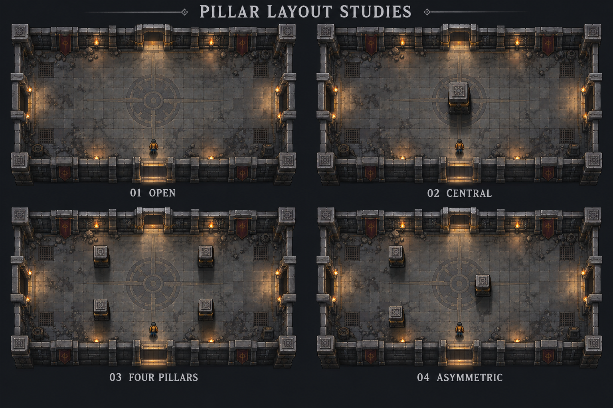
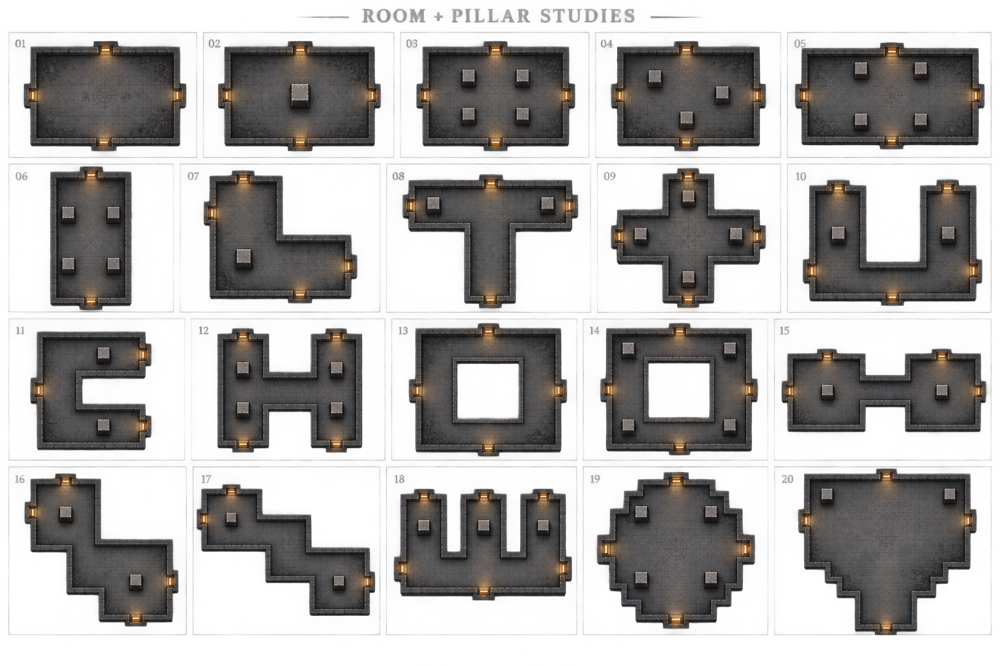
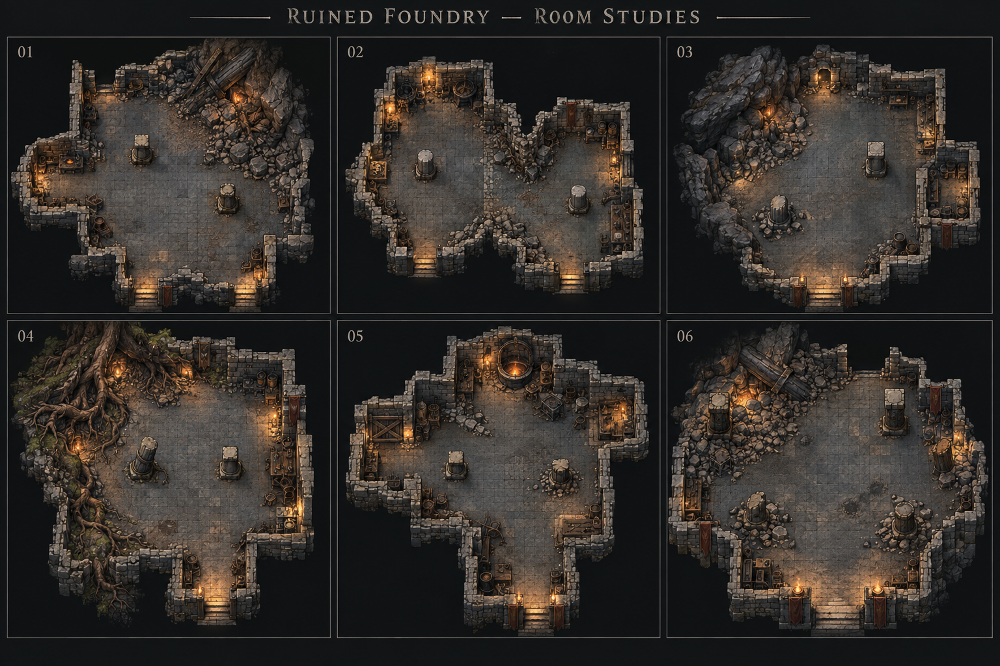

# 部屋形状15案

区分: 未採用のイメージ案。2026-09-25。ランダム階層に使う個々の部屋の外形・通り道を検討する。階層全体の接続図ではない。本編の形状生成・素材・配置は変更していない。

[計画索引](README.md) / [ステージ制作テンプレート](../art/STAGE_CREATION_TEMPLATE.md) / [実装基盤](../development/STAGE_TEMPLATES.md)

## 仕様票

- 世界観: 灰積もる旧鋳造区。石積み、煤、控えめな真鍮と暖色灯。
- 用途: 通常戦闘・探索・宝箱・ボス部屋の候補。通常・横長・縦長・L字中心の現行抽選を広げるための案。
- 視点: 俯瞰の正投影。直角主体、階段状の輪郭。斜め壁・高低差・橋は対象外。
- 尺度: 一覧は形状比較用で、ゲーム内寸法や通路幅の確定図ではない。キャラ・石目・壁厚を拡縮して部屋を合わせない。
- 扉: 図の開口は候補。実装時に隣室の接続方向と到着位置から決定する。
- 素材: 床・壁・照明は既存テーマの流用を第一候補とする。今回はゲーム素材ではなく比較ボード1枚を生成。
- 未確認: キャラ／大型敵の回避余白、全扉への到達、内周壁の面割当、射線、カメラ、家具配置、戦闘の難度。

## 形状と狙い

|番号|形|使いどころ・体験|実装時の注意|
|---|---|---|---|
|01|T字広間|正面と左右に戦線が分かれる通常戦|合流部分を十分広くする|
|02|十字広間|中央で判断し四方向へ回避する戦闘|複数方向からの同時攻撃を制御|
|03|U字広間|折返しながら探索する作業区|遠回り距離と袋小路の圧力|
|04|C字広間|遮られた射線と回り込み|対岸への壁越し攻撃を防ぐ|
|05|H字広間|二つの長い戦線と中央の横断|中央に敵が詰まらない幅|
|06|中庭を囲む環状室|時計回り・反時計回りを選ぶ|内周壁・穴・報酬配置の扱い|
|07|二重環状室|左右の周回経路を切り替える大型室|二つの内周と中央通路の到達性|
|08|左右の双広間|広場→接続部→広場でテンポを変える|接続部だけで敵を完封しない|
|09|ずれた双広間|曲がり角で次の空間が見える探索|長い射線を切りつつ通路に余白|
|10|S字広間|段階的に射線が変わる戦闘|曲がり角の見切れ・回避余白|
|11|階段状の斜行広間|直角だけで斜めへ進む印象|段差ではなく同一平面。角の接続|
|12|櫛形の三つの作業区|脇の区画を覗く探索・宝箱|袋小路で挟まれすぎない配置|
|13|壁の窪みがある広間|開けた戦場と物資・設備の居場所|窪みを小さすぎる飾り穴にしない|
|14|隅切りの大広間|角へ追い詰められにくい大型戦闘|直角の段状隅切り。斜め壁ではない|
|15|入口から広がる大広間|南入口→展開空間→広いボス戦場|到着点とボスを離す。狭い首部で戦わせない|

初期の候補は01・02・08・13・14。違いが読め、広い戦闘床を確保しやすい。06・07の内周を持つ形は壁生成・経路検証の拡張を確認してから試す。これは採用決定ではない。

## 生成物と確認範囲

内蔵image_genで15案を比較する1枚のボードを生成済み。生成画像は寸法保証のないコンセプトであり、実装用の壁配置や衝突データへ直接変換しない。原本とプロンプトは本書と同じ資料群で保存する。各案の通路と穴は上表を設計意図の正本とし、画像との差は採用前に修正する。

[生成プロンプト](room-shape-studies/prompt.txt) / [原本・ハッシュ・確認記録](room-shape-studies/manifest.json)。15個の番号と異なる輪郭を目視確認。10は完全なS字より鉤形に近い生成結果で、採用時に平面図で折返しを確定する。狭い接続部は実寸検証が必要。ユーザー採用・本編接続・通常倍率の実機確認は未実施。

## 柱配置4案（未採用・未実装）

同じ長方形の広間を使い、独立柱なし／中央1本／四隅寄り4本／非対称3本を比較。灰色の石と真鍮、同じ位置の人物で縮尺の目安を示す。柱は上面・短い側面・接地影を持つ。壁角の建築部材と室内の独立柱は区別する。

内蔵image_genで比較ボード1枚を生成。[プロンプト](room-shape-studies/pillars-prompt.txt) / [原本・ハッシュ](room-shape-studies/pillars-manifest.json)。室内柱の本数0/1/4/3と概ね共通の部屋構成を目視確認。寸法一致やゲーム内の見え方を保証する図ではない。中央柱の大きさは実装時に人物・大型敵の寸法で再調整する。

素材の不足候補は独立柱の本体。床・壁・灯りは既存テーマ流用を優先。実素材の追加生成は今回行わず、画像をそのままステージに使用しない。通常倍率での前後関係・遮蔽・回避余白・全扉の到達・ボス突進や迂回・柱裏からの一方的な攻撃は未検証。柱なしを比較基準に、4本配置と非対称配置を試す案。

## 外形×柱の20パターン（提案・未実装）

2026-09-25。前節の外形と柱配置を組み合わせた比較案。番号はこの20案ボード内の通し番号で、前の15案とは別。灰積もる旧鋳造区の床・直交壁を流用する想定。生成範囲は比較ボード1枚で、ゲーム素材や部屋データは変更しない。

|番号|外形と独立柱の設計値|主な用途・狙い|
|---|---|---|
|01|長方形・柱なし|開放戦闘の基準|
|02|長方形・中央の太柱1本|一つの遮蔽物を回る|
|03|長方形・四隅寄り4本|中央の戦闘と周辺の遮蔽|
|04|長方形・非対称3本|射線が偏る戦闘|
|05|横長・上下に2本ずつ計4本|横方向の長い中央射線|
|06|縦長・左右に2本ずつ計4本|縦方向の長い中央射線|
|07|L字・広い曲がり角に1本|曲がり角での回り込み|
|08|T字・上の左右に計2本|合流地点を開ける|
|09|十字・各腕に1本ずつ計4本|中央と四方の行き来|
|10|U字・両翼に計2本|折返し探索と遮蔽|
|11|C字・上下の腕に計2本|見えている対岸への回り込み|
|12|H字・両翼に2本ずつ計4本|左右の戦線と中央連絡路|
|13|環状・独立柱なし|中庭自体で射線を切る|
|14|環状・四隅の広場に4本|周回経路に遮蔽を足す大型室|
|15|左右の双広間・各広間1本ずつ計2本|戦闘場所を切り替える|
|16|ずれた双広間・各広間1本ずつ計2本|曲がった接続路で射線を区切る|
|17|階段状・両端の広場に計2本|中ほどを開けて斜行する|
|18|櫛形・3区画に各1本ずつ計3本|脇の作業区を探索|
|19|隅切り大広間・外周寄り4本|大型戦闘、中央の回避空間|
|20|奥へ広がるボス広間・奥の左右に計2本|入口と中央を開けたボス戦|

### 配置の共通条件

柱は壁の継ぎ目隠しではなく、室内の独立した遮蔽物。通路の首・扉・到着点へ置かない。大型敵の身体と回避距離を基準に、柱と壁の間の余白を決める。柱周囲の迂回、弾の射線、前後関係、報酬の安全な着地点は実装時に検証する。中央柱は安全地帯になりすぎる場合に敵の配置や攻撃構成を調整する。

初期実装候補は01〜06・08・15・19。環状の13・14は内周壁と到達性の扱いを確認してから追加する。ボス向け19・20は広いから成立する案であり、小さい部屋へ比例縮小しない。20案を同確率で抽選することや、全案を必ず採用することは未決定。

内蔵image_genで一覧1枚を生成。[生成プロンプト](room-shape-studies/patterns-20-prompt.txt) / [生成記録](room-shape-studies/patterns-20-manifest.json)。01〜20の番号と各案の柱本数を目視確認。開口が指定の2〜4個より多い案もあるため、扉は実装時の接続データから確定する。柱は俯瞰図で短い側面を持つ表示であり、本編での高さ・接地原点・人物との前後関係は別途確認する。採用・実装・移動テストは未実施。

## 荒廃によって形が変わった部屋6案（比較案・未実装）

ユーザー指摘: 20案はダンジョンとして外形が整いすぎて見える。直交する旧工房の骨組みを残しつつ、崩落・増築・侵食で輪郭と通れる床を非対称にする方向を比較する。前の20案の採用確定ではない。

|番号|案|輪郭を崩す原因|
|---|---|---|
|01|角が崩れた作業室|一角を瓦礫と土が大きく埋め、反対側に増築部が張り出す|
|02|壁が抜けた双作業室|大小の隣室が崩れた仕切り壁で連結する|
|03|岩盤に食い込む工房|岩の張り出しが左・奥の歩行床を侵食する|
|04|根に破られた作業区|根と土が壁を破り、自然の空洞と旧建築が混ざる|
|05|継ぎ足された鋳造区|建築時期の違う部屋がずれて連なる|
|06|半壊した炉守りの間|外周と柱が崩れ、入口は偏るが中央のボス戦空間は広い|

### 制作条件と未確認事項

生成範囲は比較ボード1枚。既存の灰色石・煤・真鍮の世界観を継続し、瓦礫・根・岩盤を外周中心に配置する。床模様の汚れだけでなく、実際に通れる床の輪郭が変わることを狙う。外周の細かな凹凸をそのまま衝突にせず、引っ掛かりの少ない輪郭と明確な歩行境界へ整理する。

本編は直交壁を中心とするため、崩れた縁・岩盤・斜めの瓦礫境界を現状の壁素材だけで再現できるとは扱わない。実装時は既存の直交壁と、崩落端・瓦礫・岩盤・根の表示部品、必要な衝突の表現を分けて設計する。必要素材の候補は崩れた壁端、低い瓦礫山、岩盤の取り付き、折れ柱と基部、根と土の縁。追加のゲーム素材生成は今回の範囲外。

中央の戦闘床・扉と到着点・柱周囲の回避余白を優先。透視・高さ・柱の接地・通路の実寸・敵の迂回・視認性・ユーザー採用・本編接続は未確認。

内蔵image_genで生成。[プロンプト](room-shape-studies/ruins-6-prompt.txt) / [原本・確認記録](room-shape-studies/ruins-6-manifest.json)。6案の輪郭と崩落・岩盤・根の差を目視確認。生成図の入口に階段状の表現が含まれるが、高低差の実装提案ではない。柱の高さ・壁の投影も本編へそのまま採用せず、既存の視点と縮尺に合わせて検証する。

後続依頼で01の方向性を[崩落した作業室の実機試作](../art/production/collapsed-workshop/README.md)として接続。画像案の全体が採用・実装された意味ではない。

## 現在の採用方針（2026-09-25）

最新のユーザー指示で瓦礫を使う案は見送り。上記の比較画像はそのまま実装する指示ではない。直交する増築・切欠き・柱・仕切りの[通常室14種を実装](../art/production/workshop-room-variants/README.md)し、ランダム探索へ接続。採用した具体形状は制作記録を正本とし、以前の20案/6案の全採用とは区別する。
