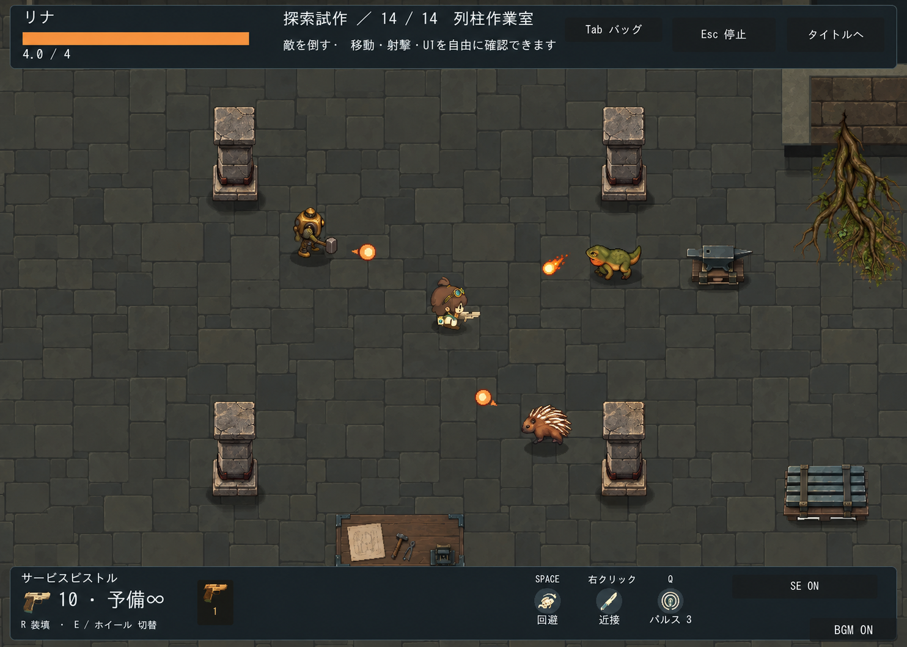
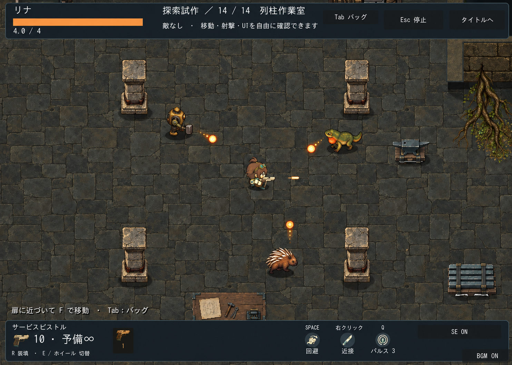
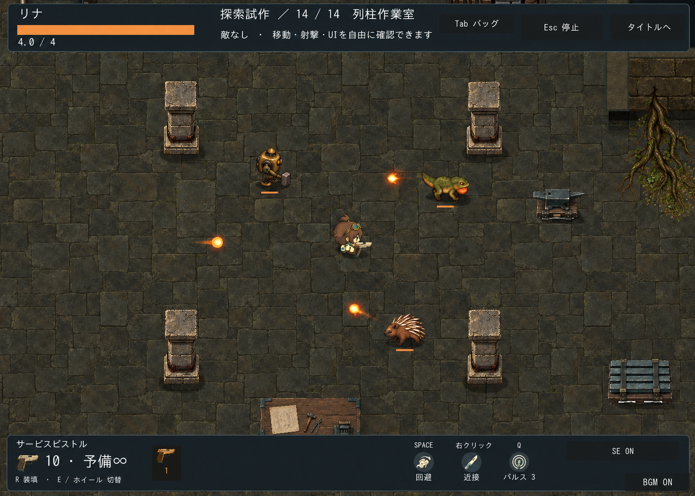

# ゲーム画面で比較する画風3案

区分: 提案・未採用。2026-09-25。キャラ、敵、背景の画風を揃える方向性を比較するカンプ。ゲーム本編と素材は変更していない。

## 比較条件

列柱室・カメラ1.2倍の[実画面](../../art/production/workshop-room-variants/v4/readability-1.2.png)を構図/HUD/主人公の参照、[既存敵の画面](../../art/production/quillback/room.png)を番機・トカゲ・棘背の参照とした。4本柱、金床、パレット、机、根を保持し、同程度のプレイ画面サイズで比較。瓦礫は使わない。これは素材の発注や生成マップの完成保証ではない。

## A：キャラに合わせて整理

床の粒状模様を大幅に抑え、大きな色面と明快な輪郭を優先。キャラと敵弾が読みやすい。柱や敵にはまだ細密さが残っており、採用時はそれらも共通のドット密度へ揃える。

## B：中間

石・金属・木の材質感を残し、陰影を整理する方針。生成結果は背景の質感が比較的強く、Aとの差は主に床に現れた。

## C：背景に合わせて陰影を増やす

既存の暗い工房の質感を優先する方向。生成結果では主人公の変化が小さく、Bとの差は控えめ。キャラまで十分に統一できた完成案とは扱わない。

## 制作と確認

内蔵image_genで3送信、各案1枚、再生成なし。[プロンプト全文](prompts.json) / [原本とハッシュ](manifest.json)。原本をそのままコピーし加工なし。構図・柱4本・既存敵3種・主人公の同一性・UI枠を目視確認。3案で敵の位置/向き、床石割り、UI文言が少し異なるため、厳密なピクセル一致比較ではない。番機/棘背付近の火球は構図の提案で、攻撃仕様の変更ではない。生成画像の日本語/UIは採用対象外。

現段階の推奨はAを出発点に、家具と敵の描き込みも整理する方向。ユーザーの採用・本編接続・動画/実戦での視認性は未確認。

## 全体リデザイン：萌え・かわいさを残す3案

ユーザーの追加方針: 添付参考のように全体の線・形・陰影を統一し、キャラクターは現代的な萌えとかわいさを残す。従来A/B/Cの床中心の調整とは別の未採用案。内蔵image_genで各1枚、計3送信。既存画像の編集ではなく文章から新規に描き起こした。[全プロンプトと原本パス](redesign-prompts.json)。

- A: 明快な輪郭とかわいらしさ。[カンプ](redesign-a.png)
- B: 暗い工房と暖色の照明、落ち着いたアニメ調。[カンプ](redesign-b.png)
- C: 柔らかな色と絵本寄りのイラスト調。[カンプ](redesign-c.png)

3案とも4本柱と敵3種を含み、人物・敵・家具・背景の描き方が揃う方向を目視確認。現行より人物と敵が大きめ、壁や家具の角度と配置も異なる。UI・敵の装備/攻撃・表示縮尺は生成上の提案で採用仕様ではない。非ドットのイラスト調への転換を含むため、採用後に通常表示サイズ、方向別アニメーション、素材分割、壁接続を改めて設計する。本編素材・コードの変更なし。ユーザー採用・実装・実戦確認は未実施。

## 現行頭身・実画面構図を基準にした改訂2案

最新指示: 頭身・短い手足・表示寸法を現行基準にし、キャラのデザイン自体は変更可能。実ゲームのカメラと家具/HUD配置を維持する。前節の大きな人物を描いた3案より、この条件を優先する。

実画面を参照して内蔵image_genで各1枚、計2枚を生成。Aは明快な色面、Bは落ち着いた陰影。人物の大きな頭と短い身体、家具4本柱・金床・パレット・机・根とHUDの大まかな配置を目視確認。画素単位の一致や関節位置の完全維持は保証しない。敵2体は画風比較用に配置。敵の装備やUI文言は採用仕様ではない。画像は原本コピー、本編未反映・ユーザー未採用。

- [A：明快な色面](proportion-locked-a.png)
- [B：落ち着いた陰影](proportion-locked-b.png)
- [生成プロンプト・原本パス](proportion-locked-prompts.json)

## ボス配置リデザインカンプ

[配置カンプ](boss-placement.png) / [生成プロンプト](boss-placement-prompt.txt)。内蔵image_genで1枚生成。原本exec-741caabd-1f91-4863-9a8c-e875badaeb12.pngを無加工コピー。参照: spinner-cannon-fire.png（配置/HUD）、foundry-spinner/body.png（本体/武装）、proportion-locked-a.png（画風/頭身）。

独楽形の炉体、煙突、白装甲、下周砲口、側面主砲、橙の炉心を維持し、粒状の質感を減らして輪郭と段階的な陰影へ整理。主人公の短い頭身とボス約3体高の関係を目視確認。位置には生成によるずれがある。過去の実戦画像を構図参照とした比較案で、現行カメラ倍率や判定の実測確認画像ではない。本編/SE/攻撃仕様は変更なし。暴走姿勢・方向別動作・素材分割・実戦視認性・ユーザー採用は未確認。

## ボスの別シルエット3案（未採用）

内蔵image_genで新規3枚、各1送信、再生成なし。[全プロンプト・原本パス](boss-alternatives-prompts.json)。圧力炉/回転砲台/機械亀を同系統の配色と俯瞰戦闘画面で比較。原本無加工コピー。

- [圧力炉](boss-pressure.png)：既存の炉体に近い丸い形。
- [回転砲台](boss-turret.png)：主砲と周囲の砲口が読める低重心の形。
- [機械亀](boss-tortoise.png)：短い脚で突進/跳躍着地を説明する形。追加の関節アニメーションが必要。

生成結果は指定よりボスが大きく、主人公頭身・画面配置・床・HUDも現行と異なる。実ゲーム同寸の確認画像ではなく形状比較として扱う。採用候補は現行サイズと構図に再調整する必要がある。本編変更なし、実装/アニメーション/ユーザー採用は未確認。
